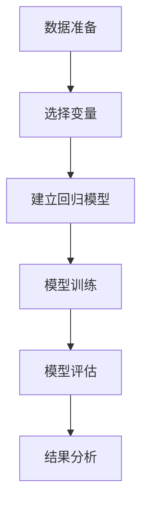
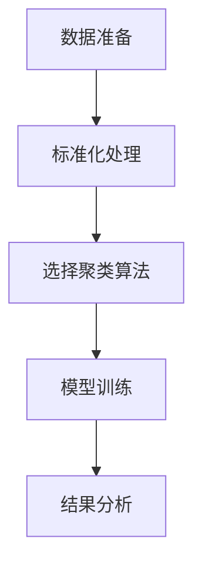
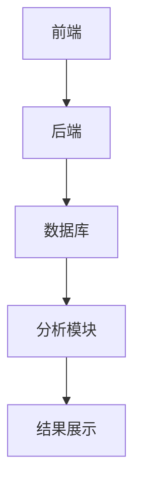
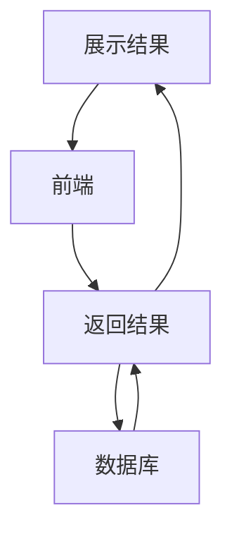

                 


# 特价股票与公司跨界数字化协同创新能力的关系研究

> 关键词：特价股票、数字化协同创新、公司治理、数学模型、系统架构

> 摘要：本文探讨了特价股票与公司数字化协同创新能力之间的关系，分析了两者的核心概念、算法原理和系统架构，并通过案例分析和最佳实践提供了深入的见解。文章旨在帮助读者理解如何通过数字化协同创新提升公司在特价股票市场中的竞争力。

---

# 第一部分: 特价股票与公司数字化协同创新能力的背景与概念

# 第1章: 特价股票与公司数字化协同创新能力的背景介绍

## 1.1 特价股票的定义与特点

### 1.1.1 特价股票的基本概念

特价股票是指在特定市场条件下，价格低于其内在价值的股票。这些股票通常被认为具有较高的投资潜力，因其价格被低估，吸引了许多投资者的关注。

### 1.1.2 特价股票的市场表现

特价股票的市场表现受多种因素影响，包括市场波动、公司基本面和宏观经济环境。投资者通常通过技术分析和基本面分析来识别和评估特价股票的投资价值。

### 1.1.3 特价股票与普通股票的区别

与普通股票相比，特价股票价格更低，波动性更大，风险也相对较高。然而，特价股票往往具有更大的上涨潜力，尤其是在市场复苏或公司基本面改善时。

## 1.2 公司数字化协同创新能力的定义

### 1.2.1 协同创新的定义

协同创新是指不同部门、团队或企业之间的合作，共同开发新产品或改进现有产品。数字化协同创新则利用数字技术来促进这种合作，提高效率和创新成果。

### 1.2.2 数字化协同创新的核心特征

数字化协同创新的核心特征包括数据驱动、实时协作、自动化流程和智能化决策支持。这些特征使得公司在创新过程中更加高效和灵活。

### 1.2.3 数字化协同创新与传统协同创新的对比

与传统协同创新相比，数字化协同创新更加依赖技术手段，能够实现跨地域、跨部门的实时协作，数据处理和分析能力更强，创新速度更快。

## 1.3 特价股票与公司数字化协同创新能力的关系背景

### 1.3.1 问题背景

在股票市场中，尤其是在特价股票领域，公司需要快速响应市场变化，提高创新能力以保持竞争力。然而，传统的协同创新模式效率低下，难以应对市场的快速变化。

### 1.3.2 问题描述

公司缺乏高效的协同创新机制，导致在面对市场波动时，无法快速调整策略，错失投资机会。同时，技术创新能力不足，限制了公司在市场中的竞争力。

### 1.3.3 问题解决的必要性

通过引入数字化协同创新，公司可以提高市场响应速度和创新能力，从而在特价股票市场中获得更大的竞争优势。

### 1.3.4 问题的边界与外延

本文的研究范围限定于公司内部的数字化协同创新对特价股票投资的影响，不涉及外部市场因素和公司外部的合作。未来研究可扩展至更广泛的市场环境。

### 1.3.5 概念结构与核心要素组成

特价股票与公司数字化协同创新能力的关系模型包括市场响应速度、技术创新能力、数据驱动决策和跨部门协作能力四个核心要素。

---

## 1.4 本章小结

本章介绍了特价股票和数字化协同创新的基本概念，分析了两者的关系背景，为后续章节的理论分析和实证研究奠定了基础。

---

# 第2章: 特价股票与公司数字化协同创新能力的核心概念与联系

## 2.1 特价股票的核心概念原理

### 2.1.1 特价股票的市场机制

特价股票的市场机制包括价格发现、供求关系和市场参与者的互动。通过分析这些机制，可以更好地理解特价股票的价格波动和投资机会。

### 2.1.2 特价股票的价格波动规律

价格波动受市场情绪、公司基本面和宏观经济因素的影响。投资者通常通过技术分析和基本面分析来预测价格走势。

### 2.1.3 特价股票与公司基本面的关系

公司基本面如盈利能力、财务状况和管理能力直接影响股价。特价股票的出现通常意味着市场对公司的负面情绪或低估了其价值。

## 2.2 数字化协同创新的核心概念原理

### 2.2.1 数字化协同创新的驱动因素

数字化协同创新的驱动因素包括技术创新、数据驱动的决策、自动化工具和跨部门协作。这些因素共同推动了公司创新能力的提升。

### 2.2.2 数字化协同创新的实现路径

实现路径包括建立数字化平台、引入数据分析工具、促进跨部门协作和培养创新文化。这些步骤有助于公司形成高效的协同创新机制。

### 2.2.3 数字化协同创新与传统协同创新的对比

数字化协同创新更加依赖技术手段，能够实现更高效的协作和创新。而传统协同创新依赖于人工协调，效率较低且难以应对复杂变化。

## 2.3 核心概念的对比分析

### 2.3.1 特价股票与公司数字化协同创新能力的对比表格

| 比较维度         | 特价股票             | 数字化协同创新能力           |
|------------------|----------------------|-----------------------------|
| 核心要素         | 价格、市场波动       | 数据分析、技术创新、协作     |
| 影响因素         | 市场情绪、公司基本面   | 技术工具、跨部门协作、数据   |
| 目标             | 投资收益             | 提高创新能力                 |

### 2.3.2 ER实体关系图架构（使用 Mermaid）

```mermaid
erd
  1. 实体：特价股票
  2. 实体：数字化协同创新
  3. 关系：影响
```

---

## 2.4 本章小结

本章通过对比分析，明确了特价股票与公司数字化协同创新能力的核心概念和内在联系，为后续的算法分析奠定了基础。

---

# 第3章: 特价股票与公司数字化协同创新能力的算法原理

## 3.1 算法原理概述

### 3.1.1 回归分析模型

回归分析模型用于分析特价股票价格与公司协同创新能力之间的关系。通过建立线性回归模型，可以量化两者之间的相关性。

### 3.1.2 聚类分析模型

聚类分析模型用于将公司按协同创新能力进行分类，帮助投资者识别具有较高创新能力的公司，从而更好地选择投资标的。

### 3.1.3 神经网络模型

神经网络模型用于预测特价股票价格走势，通过训练神经网络，可以捕捉市场中的复杂模式和非线性关系。

## 3.2 算法原理的 Mermaid 流程图

### 3.2.1 回归分析流程图



### 3.2.2 聚类分析流程图



## 3.3 算法原理的数学模型与公式

### 3.3.1 线性回归模型

$$ y = \beta_0 + \beta_1x + \epsilon $$

其中：
- \( y \) 是特价股票价格
- \( x \) 是公司协同创新能力
- \( \beta_0 \) 和 \( \beta_1 \) 是回归系数
- \( \epsilon \) 是误差项

### 3.3.2 聚类分析模型

聚类分析通过计算样本之间的距离，将公司分为不同的类别。常用的距离公式为：

$$ d(x, c) = \sqrt{\sum_{i=1}^n (x_i - c_i)^2} $$

---

## 3.4 本章小结

本章通过回归分析、聚类分析和神经网络模型，详细阐述了算法原理，为后续的实证研究提供了方法论支持。

---

# 第4章: 特价股票与公司数字化协同创新能力的系统分析

## 4.1 系统分析概述

### 4.1.1 系统功能设计

系统功能设计包括数据采集、分析处理、结果展示和决策支持。通过建立系统，公司可以实时监控特价股票市场动态，并利用协同创新能力进行投资决策。

### 4.1.2 领域模型设计

领域模型设计包括特价股票价格、公司协同创新能力、市场环境和投资策略四个模块。通过模块化设计，可以更好地理解系统各部分之间的关系。

## 4.2 系统架构设计

### 4.2.1 系统架构图



### 4.2.2 接口设计

系统接口设计包括数据接口、分析接口和用户接口。数据接口用于获取市场数据，分析接口用于处理数据，用户接口用于展示结果。

## 4.3 系统交互设计

### 4.3.1 系统交互流程图



---

## 4.4 本章小结

本章通过系统分析，设计了系统的功能模块、架构和交互流程，为系统的实现提供了指导。

---

# 第5章: 特价股票与公司数字化协同能力提升的项目实战

## 5.1 项目介绍

### 5.1.1 项目目标

项目旨在通过数字化协同创新提升公司在特价股票市场中的竞争力，实现投资收益最大化。

### 5.1.2 项目需求

项目需求包括建立数据采集系统、开发协同创新平台和优化投资策略。

## 5.2 系统核心实现

### 5.2.1 环境安装

项目基于Python 3.8及以上版本，需要安装Pandas、NumPy、Scikit-learn等库。

### 5.2.2 核心代码实现

```python
import pandas as pd
import numpy as np
from sklearn.linear_model import LinearRegression

# 数据准备
data = pd.read_csv('stock_data.csv')
X = data[['协同创新能力']]
y = data['股价']

# 建立回归模型
model = LinearRegression()
model.fit(X, y)

# 模型评估
print('回归系数:', model.coef_)
print('截距:', model.intercept_)
```

### 5.2.3 代码解读与分析

上述代码通过读取股票数据，建立线性回归模型，分析协同创新能力对股价的影响。回归系数和截距表示了两者之间的关系。

## 5.3 实际案例分析

### 5.3.1 案例背景

某公司通过引入数字化协同创新平台，提高了市场响应速度和创新能力，从而在特价股票市场中获得了更高的投资回报。

### 5.3.2 案例分析

通过分析该公司的案例，可以发现数字化协同创新对股价的积极影响。案例展示了如何通过技术创新提升公司在市场中的竞争力。

## 5.4 项目小结

本章通过项目实战，展示了如何通过数字化协同创新提升公司在特价股票市场中的竞争力，为读者提供了实际操作的参考。

---

# 第6章: 特价股票与公司数字化协同创新能力的最佳实践

## 6.1 最佳实践 tips

### 6.1.1 数据驱动决策

公司应充分利用数据进行决策，建立数据采集和分析系统，实时监控市场动态。

### 6.1.2 技术创新

引入先进的数字技术，如人工智能和大数据分析，提升公司的协同创新能力。

### 6.1.3 跨部门协作

建立跨部门协作机制，促进信息共享和资源整合，提高创新效率。

## 6.2 小结

本章总结了本文的主要内容，强调了数据驱动决策、技术创新和跨部门协作的重要性。

## 6.3 注意事项

公司在实施数字化协同创新时，需注意数据安全、技术选型和团队协作等问题。

## 6.4 拓展阅读

建议读者进一步阅读相关领域的文献，深入了解数字化协同创新和股票市场的最新研究。

---

# 作者：AI天才研究院 & 禅与计算机程序设计艺术

---

这篇文章通过系统的分析和实际案例，探讨了特价股票与公司数字化协同创新能力之间的关系，为公司在市场中提升竞争力提供了理论和实践指导。

