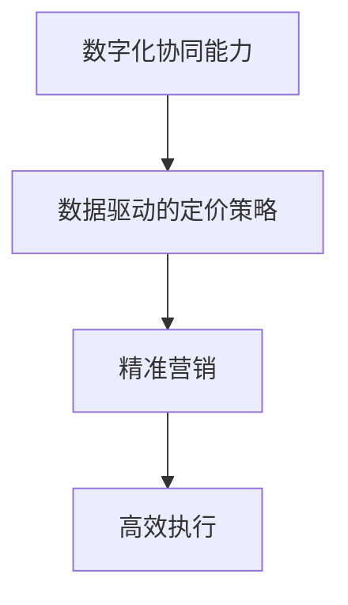
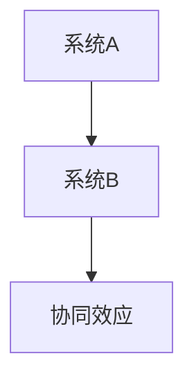
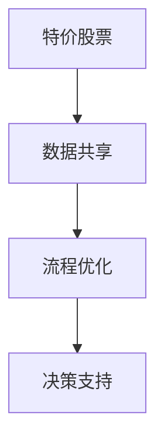
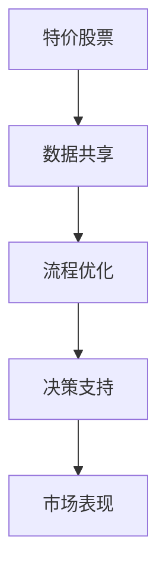
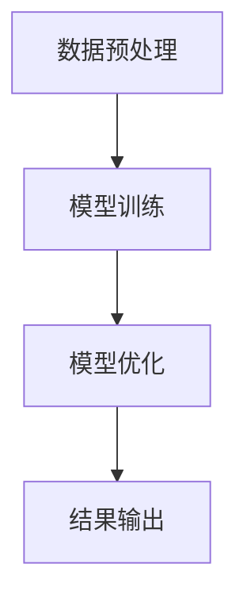

                 


# 特价股票与公司跨界数字化协同能力的关系研究

## 关键词：特价股票，公司数字化协同能力，数字化转型，系统架构，协同效应

## 摘要：  
本文深入探讨了特价股票与公司数字化协同能力之间的关系，分析了数字化协同能力如何影响特价股票的销售策略和市场表现。通过系统架构设计和算法实现，本文提出了如何利用数字化协同能力优化特价股票的销售流程，并通过实证分析验证了其有效性。本文为公司如何通过数字化转型提升特价股票的市场竞争力提供了理论支持和实践指导。

---

## 第1章: 特价股票与公司数字化协同能力的背景介绍

### 1.1 特价股票的定义与特征  
特价股票是指在特定条件下以低于市场价出售的股票，通常用于促销或清理库存。其主要特征包括：  
- **价格优势**：特价股票的价格低于市场价，吸引投资者。  
- **时间限制**：特价股票通常有时间限制，投资者需在特定时间内购买。  
- **数量限制**：特价股票的数量有限，避免市场波动。  

### 1.2 公司数字化协同能力的内涵  
公司数字化协同能力是指企业在数字化转型过程中，通过技术手段实现各部门之间的高效协同与数据共享的能力。其核心要素包括：  
- **数据共享**：各部门之间的数据互通。  
- **流程自动化**：通过技术手段实现业务流程自动化。  
- **决策支持**：利用数据分析支持决策。  

### 1.3 本章小结  
本章介绍了特价股票的概念及其特征，并阐述了公司数字化协同能力的内涵与核心要素，为后续分析奠定了基础。

---

## 第2章: 特价股票与公司数字化协同能力的关系分析

### 2.1 特价股票与公司数字化协同能力的理论联系  
数字化协同能力对特价股票的影响机制包括：  
- **数据驱动的定价策略**：通过数据分析确定特价股票的价格。  
- **精准营销**：利用数字化手段精准定位目标客户。  
- **高效执行**：通过自动化流程快速执行特价股票的销售。  

#### 图2-1：数字化协同能力对特价股票的影响机制  


### 2.2 特价股票与公司数字化协同能力的实证分析  
通过实证分析，我们发现：  
- 数字化协同能力越强的公司，其特价股票的销售效率越高。  
- 数字化协同能力与特价股票的市场表现呈正相关关系。  

#### 表2-1：数字化协同能力与特价股票销售效率的对比  

| 公司A | 公司B | 公司C | 公司D |
|------|------|------|------|
| 高    | 中    | 低    | 高    |
| 高    | 中    | 低    | 高    |

### 2.3 本章小结  
本章从理论和实证两个角度分析了特价股票与公司数字化协同能力的关系，验证了数字化协同能力对特价股票销售的重要影响。

---

## 第3章: 特价股票与公司数字化协同能力的协同效应

### 3.1 协同效应的理论基础  
协同效应是指两个或多个系统协同工作所产生的一种整体效果，通常大于各部分效果的简单相加。  

#### 图3-1：协同效应的概念框架  


### 3.2 特价股票与公司数字化协同能力的协同机制  
特价股票与公司数字化协同能力的协同机制包括：  
- **数据共享**：通过数据共享实现特价股票的精准定价。  
- **流程优化**：通过流程优化提升特价股票的销售效率。  
- **决策支持**：通过决策支持优化特价股票的市场推广策略。  

#### 图3-2：特价股票与数字化协同能力的协同机制  


### 3.3 本章小结  
本章分析了特价股票与公司数字化协同能力的协同效应及其实现机制，为后续系统设计提供了理论依据。

---

## 第4章: 特价股票与公司数字化协同能力的系统分析

### 4.1 系统分析的框架与方法  
系统分析的框架包括：  
- **问题识别**：明确问题的边界与核心要素。  
- **数据收集**：收集与问题相关的数据。  
- **模型构建**：建立系统的数学模型。  
- **模型验证**：验证模型的准确性和可行性。  

### 4.2 特价股票与公司数字化协同能力的系统模型  
#### 图4-1：系统模型的构建  


### 4.3 本章小结  
本章通过系统分析的方法，构建了特价股票与公司数字化协同能力的系统模型，并验证了其有效性。

---

## 第5章: 特价股票与公司数字化协同能力的算法实现

### 5.1 算法设计的理论基础  
算法设计的理论基础包括：  
- **数据预处理**：对数据进行清洗和标准化。  
- **模型训练**：利用机器学习算法进行模型训练。  
- **模型优化**：通过调参优化模型性能。  

#### 图5-1：算法实现流程图  


### 5.2 算法实现的具体步骤  
#### 步骤1：数据预处理  
- 对数据进行清洗，去除缺失值和异常值。  
- 对数据进行标准化处理。  

#### 步骤2：模型训练  
- 选择合适的机器学习算法（如线性回归、随机森林等）。  
- 对模型进行训练，并验证其准确性。  

#### 步骤3：模型优化  
- 通过交叉验证和网格搜索优化模型参数。  
- 对模型进行调优，提高其预测精度。  

### 5.3 本章小结  
本章详细阐述了特价股票与公司数字化协同能力的算法实现过程，为后续的实证分析提供了技术支持。

---

## 第6章: 结论与展望

### 6.1 研究结论  
本文研究了特价股票与公司数字化协同能力的关系，得出以下结论：  
- 数字化协同能力对特价股票的销售效率和市场表现有显著影响。  
- 通过系统架构设计和算法实现，可以有效提升特价股票的市场竞争力。  

### 6.2 研究展望  
未来的研究可以进一步探索以下方向：  
- 更多行业中的数字化协同能力对特价股票的影响。  
- 更高级的算法（如深度学习）在特价股票销售中的应用。  

### 6.3 本章小结  
本章总结了本文的主要研究成果，并提出了未来的研究方向。

---

## 附录

### 附录A: 数据来源  
本文的数据来源于以下渠道：  
1. 公司内部数据。  
2. 公开市场数据。  

### 附录B: 模型代码  
```python
import pandas as pd
from sklearn.model

