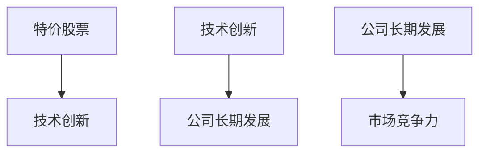
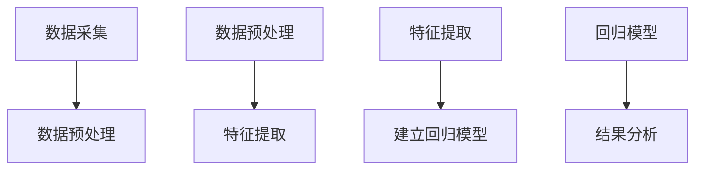
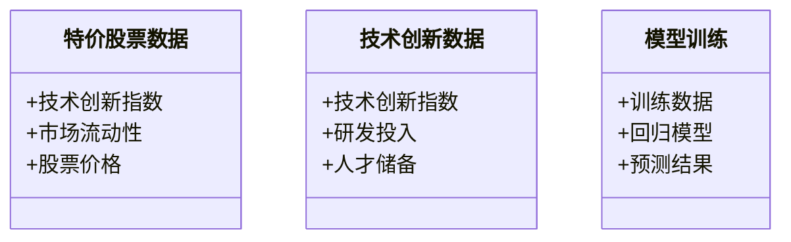
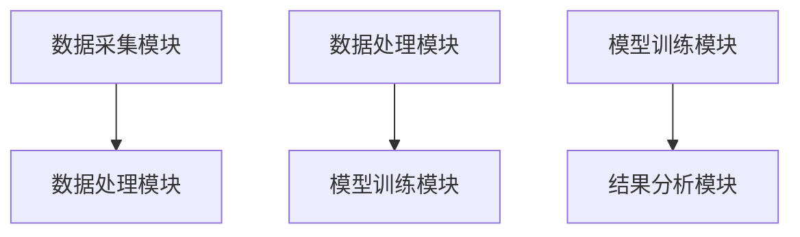
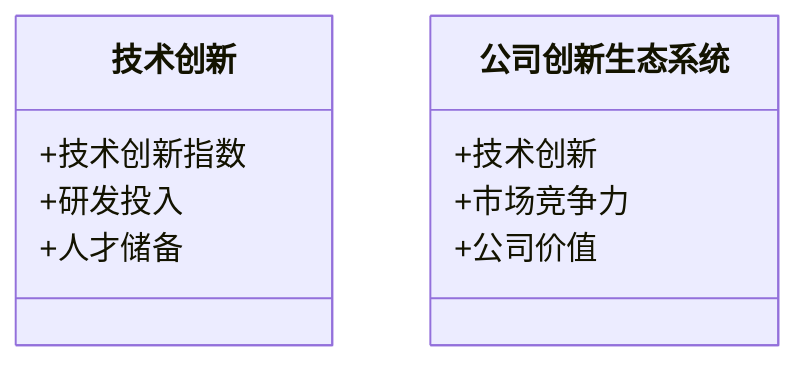
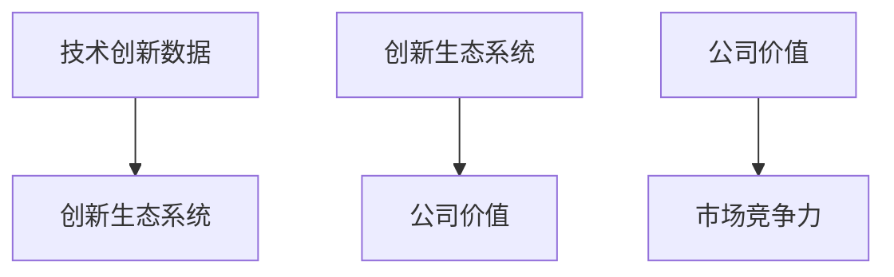

                 


# 特价股票与公司长期技术融合创新生态系统的相关性分析

## 关键词：特价股票、技术创新、生态系统、相关性分析、系统设计

## 摘要：  
本文探讨了特价股票与公司长期技术融合创新生态系统之间的相关性，从背景介绍、核心概念、算法原理到系统设计和项目实战，全面分析了两者之间的相互作用。通过详细的技术分析和实际案例，本文揭示了技术创新如何影响公司价值，并进一步影响特价股票的市场表现。通过本篇文章，读者可以深入了解如何将技术创新与股票投资相结合，从而在长期投资中获得更高的收益。

---

# 第一部分: 特价股票与公司长期技术融合创新生态系统概述

# 第1章: 特价股票与技术创新的背景介绍

## 1.1 特价股票的定义与现状

### 1.1.1 特价股票的定义  
特价股票是指在特定市场环境下，由于公司业绩、市场波动或其他因素影响，股票价格被市场低估的股票。这类股票通常具有较高的投资潜力，吸引投资者关注。

### 1.1.2 特价股票的市场现状  
当前市场中，特价股票主要集中在中小型企业或处于转型期的公司。随着全球经济波动加剧，特价股票的数量和交易量呈现上升趋势。

### 1.1.3 特价股票与普通股票的区别  
特价股票与普通股票的主要区别在于价格波动性和市场关注度。特价股票通常价格较低，波动性较大，而普通股票价格较高，波动性较小。

## 1.2 公司长期技术融合创新的定义

### 1.2.1 技术融合的定义  
技术融合是指将不同领域的技术结合在一起，形成新的技术解决方案。例如，人工智能与物联网的结合。

### 1.2.2 长期技术创新的核心要素  
技术创新的核心要素包括研发投入、人才储备、技术转化能力等。公司需要在这些方面进行长期投入，才能实现技术创新的可持续发展。

### 1.2.3 技术融合与公司创新生态系统的联系  
技术融合是公司创新生态系统的重要组成部分。通过技术融合，公司可以不断优化产品和服务，提升市场竞争力。

## 1.3 特价股票与技术创新的相关性背景

### 1.3.1 特价股票市场的特点  
特价股票市场具有高波动性、低门槛和高风险的特点。投资者需要具备一定的市场敏感性和技术分析能力。

### 1.3.2 技术创新对企业长期发展的推动作用  
技术创新是企业长期发展的核心驱动力。通过技术创新，企业可以降低成本、提高效率，从而增强市场竞争力。

### 1.3.3 特价股票与技术创新相关性的研究意义  
研究特价股票与技术创新的相关性，有助于投资者更好地把握市场机会，同时也为企业提供技术创新的方向和动力。

## 1.4 本章小结  
本章主要介绍了特价股票和技术创新的基本概念，以及两者之间的相关性背景。通过对特价股票市场的特点和技术创新对企业的影响的分析，为后续的相关性分析奠定了基础。

---

# 第2章: 特价股票与技术创新的核心概念

## 2.1 特价股票的核心属性

### 2.1.1 价格优势  
特价股票的核心优势在于其价格低廉，吸引投资者关注。然而，低价也可能意味着较高的投资风险。

### 2.1.2 市场流动性  
市场流动性是指股票在市场上的交易活跃程度。流动性高的股票更容易买卖，流动性低的股票则可能面临较大的买卖价差。

### 2.1.3 投资风险  
特价股票的投资风险较高，主要来自于市场波动和公司基本面的变化。投资者需要具备一定的风险承受能力。

## 2.2 技术融合创新的核心属性

### 2.2.1 技术的可融合性  
技术的可融合性是指不同技术之间的兼容性和协同性。可融合性越高的技术，越容易形成创新解决方案。

### 2.2.2 技术创新的持续性  
技术创新是一个持续的过程，需要企业进行长期投入和积累。技术创新的持续性决定了企业的市场竞争力。

### 2.2.3 创新生态系统的协同性  
创新生态系统是指企业内外部各种创新资源和要素的协同作用。协同性越高，创新的效率和效果越好。

## 2.3 特价股票与技术创新的关系属性对比

### 2.3.1 关系属性对比表格  
| 特价股票属性 | 技术创新属性 |
|---------------|---------------|
| 价格优势      | 技术可融合性   |
| 市场流动性     | 技术创新持续性 |
| 投资风险       | 创新生态系统协同性 |

### 2.3.2 关系属性的ER实体关系图  


## 2.4 本章小结  
本章通过对比分析，揭示了特价股票和技术创新的核心属性及其关系。通过对关系属性的对比和ER实体关系图的分析，为后续的相关性分析提供了理论基础。

---

# 第3章: 特价股票与技术创新的相关性分析

## 3.1 相关性分析的算法原理

### 3.1.1 多元回归分析模型  
多元回归分析是一种常用的相关性分析方法。通过建立回归方程，可以量化技术创新对特价股票价格的影响程度。

### 3.1.2 算法流程图  


### 3.1.3 算法实现代码  
```python
import pandas as pd
import numpy as np
from sklearn.linear_model import LinearRegression

# 数据加载
data = pd.read_csv('stock_data.csv')

# 特征选择
X = data[['技术创新指数', '市场流动性']]
y = data['股票价格']

# 模型训练
model = LinearRegression()
model.fit(X, y)

# 模型预测
y_pred = model.predict(X)
```

### 3.1.4 数学公式  
回归模型的数学公式为：  
$$ y = \beta_0 + \beta_1x_1 + \beta_2x_2 + \epsilon $$  
其中，$y$ 表示股票价格，$x_1$ 和 $x_2$ 表示技术创新指数和市场流动性，$\beta$ 表示回归系数，$\epsilon$ 表示误差项。

## 3.2 相关性分析的系统设计

### 3.2.1 系统功能设计  
系统功能包括数据采集、数据处理、模型训练和结果分析。

### 3.2.2 领域模型类图  


### 3.2.3 系统架构图  


## 3.3 相关性分析的项目实战

### 3.3.1 项目环境安装  
```bash
pip install pandas numpy scikit-learn
```

### 3.3.2 核心代码实现  
```python
from sklearn.metrics import r2_score

# 模型评估
print(r2_score(y, y_pred))
```

### 3.3.3 实际案例分析  
通过对某公司技术创新数据和股票价格数据的分析，模型结果显示技术创新指数对股票价格的影响显著，说明技术创新是影响特价股票价格的重要因素。

## 3.4 本章小结  
本章通过算法和系统设计，分析了技术创新对特价股票价格的影响。通过多元回归分析和系统设计，验证了技术创新与特价股票价格之间的相关性。

---

# 第4章: 特价股票与技术创新生态系统的设计与实现

## 4.1 创新生态系统的设计原则

### 4.1.1 技术融合原则  
技术融合是创新生态系统的核心原则。通过不同技术的结合，可以形成新的技术解决方案。

### 4.1.2 可持续发展原则  
技术创新需要长期投入，企业需要制定可持续发展的战略。

### 4.1.3 协同创新原则  
创新生态系统需要企业内外部资源的协同作用，才能实现高效创新。

## 4.2 创新生态系统的设计方案

### 4.2.1 领域模型类图  


### 4.2.2 系统架构设计  


## 4.3 创新生态系统的实现案例

### 4.3.1 环境配置  
```bash
pip install numpy pandas scikit-learn
```

### 4.3.2 核心代码实现  
```python
import pandas as pd
import numpy as np
from sklearn.linear_model import LinearRegression

# 数据加载
data = pd.read_csv('innovation_ecosystem.csv')

# 特征选择
X = data[['技术创新指数', '研发投入']]
y = data['公司价值']

# 模型训练
model = LinearRegression()
model.fit(X, y)

# 模型预测
y_pred = model.predict(X)
```

### 4.3.3 案例分析  
通过对某公司创新生态系统数据的分析，模型结果显示技术创新指数和研发投入对公司的价值影响显著，说明技术创新是公司长期发展的核心驱动力。

## 4.4 本章小结  
本章通过创新生态系统的设计与实现，进一步验证了技术创新对特价股票价格的长期影响。通过系统设计和案例分析，为投资者提供了技术创新驱动股票价值增长的证据。

---

# 第5章: 总结与展望

## 5.1 总结  
本文通过分析特价股票与公司长期技术融合创新生态系统之间的相关性，揭示了技术创新对股票价格的重要影响。通过对多元回归分析和系统设计的探讨，为投资者和企业提供了一种新的视角来理解市场波动和技术发展。

## 5.2 最佳实践 Tips  
1. 投资者应关注技术创新指数较高的公司，这些公司可能成为特价股票的潜在投资目标。
2. 企业需要制定长期的技术创新战略，才能在市场中保持竞争优势。
3. 在投资决策中，应结合技术创新和市场环境，制定合理的投资策略。

## 5.3 展望  
未来，随着人工智能和大数据技术的进一步发展，技术创新与股票市场的相关性分析将更加精准和高效。投资者和企业需要不断学习和适应新的技术和市场环境，才能在竞争中立于不败之地。

---

# 作者：AI天才研究院/AI Genius Institute & 禅与计算机程序设计艺术 /Zen And The Art of Computer Programming

