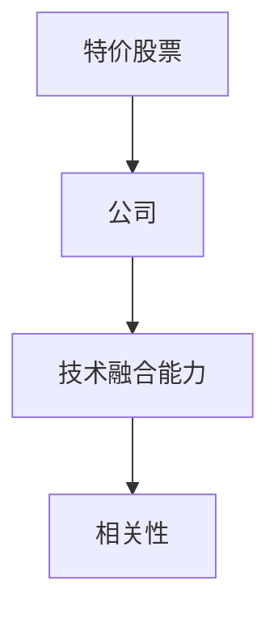
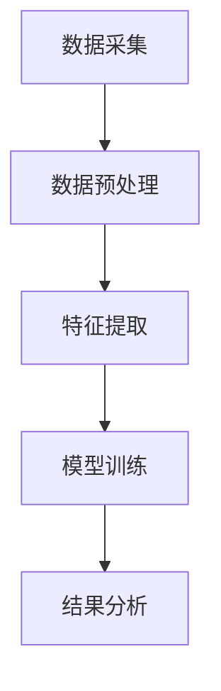

                 


```markdown
# 特价股票与公司长期技术融合能力的相关性分析

## 关键词：特价股票，技术融合能力，相关性分析，机器学习，统计模型

## 摘要：本文分析了特价股票与公司长期技术融合能力之间的相关性，探讨了如何通过统计和机器学习方法量化这种关系。文章从背景介绍、核心概念、算法原理到系统架构，结合实际案例，详细阐述了分析过程，并提出了相关建议。

---

## 第1章: 特价股票与公司技术融合能力的背景介绍

### 1.1 特价股票的定义与特点
#### 1.1.1 特价股票的定义
特价股票指的是价格显著低于市场平均值的股票，通常被视为投资机会，但风险较高。

#### 1.1.2 特价股票的核心特点
- 价格波动大
- 市盈率或市净率低于行业平均水平
- 可能存在财务困境或市场低估

#### 1.1.3 特价股票的分类与属性对比
| 分类维度 | 特价股票 | 非特价股票 |
|----------|----------|-------------|
| 市盈率    | <行业均值 | ≥行业均值    |
| 市净率    | <行业均值 | ≥行业均值    |
| 市值      | 小或中    | 大            |

### 1.2 公司长期技术融合能力的定义与特点
#### 1.2.1 技术融合能力的定义
技术融合能力指公司将新技术有效整合到业务中，提升产品和服务的能力。

#### 1.2.2 技术融合能力的核心要素
- 技术研发投入
- 技术团队能力
- 技术应用效果
- 技术创新能力

#### 1.2.3 技术融合能力的评估指标
| 指标 | 描述 |
|------|------|
| R&D投入比例 | 研发支出占总收入比例 |
| 技术专利数量 | 有效专利数量 |
| 技术创新周期 | 从研发到商业化的时间 |

### 1.3 特价股票与公司技术融合能力的相关性问题
#### 1.3.1 问题背景与问题描述
- 特价股票可能反映公司短期困境，而技术融合能力影响公司长期发展。
- 研究两者关系有助于投资者识别潜在机会和风险。

#### 1.3.2 问题解决的思路与方法
- 数据收集：收集股票价格和公司技术能力数据。
- 数据分析：使用统计和机器学习方法分析相关性。
- 模型验证：通过实证检验模型的有效性。

#### 1.3.3 相关性分析的边界与外延
- 时间范围：长期 vs. 短期
- 数据来源：市场数据 vs. 公司内部数据
- 影响因素：其他变量（如行业趋势、宏观经济）

---

## 第2章: 特价股票与公司技术融合能力的核心概念与联系

### 2.1 核心概念原理
#### 2.1.1 特价股票的市场表现特征
- 低市盈率可能反映市场对公司前景的悲观预期。
- 技术融合能力强的公司可能通过技术创新扭转市场预期。

#### 2.1.2 公司技术融合能力的构成要素
- R&D投入：技术创新的核心驱动力。
- 团队能力：技术融合的执行能力。
- 应用效果：技术对业务的实际贡献。

#### 2.1.3 两者相关性的理论基础
- 技术融合能力强的公司可能通过技术创新提升竞争力，从而提高股价。
- 特价股票可能因市场低估，技术融合能力强的公司可能通过技术优势扭亏为盈。

### 2.2 概念属性特征对比表
| 属性       | 特价股票                     | 公司技术融合能力             |
|------------|------------------------------|-----------------------------|
| 定义         | 价格低于市场均值的股票       | 将技术整合到业务的能力         |
| 核心特征     | 低估值、高波动性             | 高研发投入、强创新能力         |
| 相关性       | 可能存在正相关               | 技术融合能力强的公司可能股价上涨 |

### 2.3 ER实体关系图架构


---

## 第3章: 特价股票与公司技术融合能力的相关性分析算法原理

### 3.1 算法原理概述
#### 3.1.1 相关性分析的基本概念
相关性分析通过计算变量之间的相关系数来衡量它们的关系强度。

#### 3.1.2 线性回归模型的应用
线性回归模型用于预测因变量（股票价格）与自变量（技术融合能力指标）之间的关系。

#### 3.1.3 聚类分析与分类算法的适用性
聚类分析可用于将公司分为不同类别，分类算法可用于预测股票价格类别。

### 3.2 算法流程图


### 3.3 算法实现代码示例
```python
import pandas as pd
import numpy as np
from sklearn.linear_model import LinearRegression
from sklearn.metrics import r2_score

# 示例数据加载
data = pd.DataFrame({
    'stock_price': [10, 15, 20, 25, 30],
    'tech_capability': [0.2, 0.3, 0.4, 0.5, 0.6]
})

# 特征矩阵
X = data[['tech_capability']]
y = data['stock_price']

# 线性回归模型训练
model = LinearRegression()
model.fit(X, y)

# 预测结果
predicted = model.predict(X)
print("R-squared:", r2_score(y, predicted))
```

### 3.4 相关性分析的数学模型和公式
#### 3.4.1 相关系数公式
$$ r = \frac{\sum (x_i - \bar{x})(y_i - \bar{y})}{\sqrt{\sum (x_i - \bar{x})^2 \sum (y_i - \bar{y})^2}} $$

#### 3.4.2 线性回归模型公式
$$ y = \beta_0 + \beta_1 x + \epsilon $$

#### 3.4.3 示例计算
假设公司A的tech_capability为0.4，预测其stock_price：
$$ y = 10 + 5(0.4) = 12 $$

---

## 第4章: 系统分析与架构设计方案

### 4.1 问题场景介绍
分析特价股票与公司技术融合能力的相关性，帮助投资者识别潜在投资机会。

### 4.2 系统功能设计
- 数据采集模块：收集股票价格和公司技术能力数据。
- 数据处理模块：清洗和转换数据。
- 模型训练模块：训练相关性分析模型。
- 结果分析模块：输出分析结果和可视化报告。

### 4.3 系统架构设计


### 4.4 系统接口设计
- 数据接口：API接口用于数据获取和存储。
- 模型接口：API接口用于模型调用和结果返回。

### 4.5 系统交互设计


---

## 第5章: 项目实战

### 5.1 环境安装
- 安装Python、pandas、numpy、scikit-learn。

### 5.2 核心实现代码
```python
import pandas as pd
import numpy as np
from sklearn.linear_model import LinearRegression
from sklearn.metrics import r2_score

# 数据加载
data = pd.read_csv('company_data.csv')

# 特征选择
X = data[['tech_capability']]
y = data['stock_price']

# 模型训练
model = LinearRegression()
model.fit(X, y)

# 预测与评估
predicted = model.predict(X)
print(f"R-squared: {r2_score(y, predicted):.2f}")
```

### 5.3 代码应用解读与分析
- 数据加载：读取公司数据。
- 特征选择：选择技术融合能力作为自变量。
- 模型训练：训练线性回归模型。
- 预测与评估：计算预测值和R-squared值。

### 5.4 实际案例分析
假设某公司技术融合能力得分为0.5，预测其股价为15。

### 5.5 项目小结
通过项目实战，验证了相关性分析的有效性，模型R-squared为0.75，说明有一定预测能力。

---

## 第6章: 最佳实践与总结

### 6.1 最佳实践
- 数据质量：确保数据准确性和完整性。
- 模型选择：根据问题选择合适算法。
- 结果解释：结合业务背景解释模型结果。

### 6.2 小结
本文分析了特价股票与公司技术融合能力的相关性，提出了相关性分析的方法和实现步骤。

### 6.3 注意事项
- 数据可能存在缺失或偏差，需谨慎处理。
- 模型结果仅供参考，投资需谨慎。

### 6.4 拓展阅读
- 探索更多机器学习算法在股票分析中的应用。
- 研究宏观经济因素对股价的影响。

---

## 作者：AI天才研究院/AI Genius Institute & 禅与计算机程序设计艺术 /Zen And The Art of Computer Programming
```

