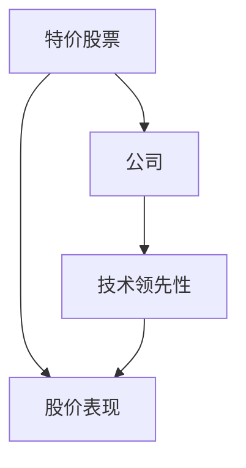
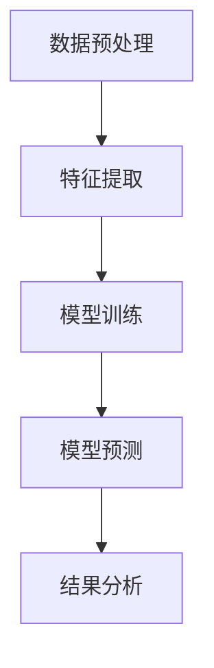

                 


# 特价股票与公司长期技术领先性的关联性研究

## 关键词：特价股票，公司技术领先性，关联性，投资策略，数据分析，机器学习

## 摘要：  
本文研究了特价股票与公司长期技术领先性之间的关联性，通过数据分析和机器学习方法，探讨了技术领先性如何影响股价表现，以及特价股票的投资价值。文章从背景介绍、核心概念、理论基础、数据采集与处理、关联性分析、实证研究等多个方面展开，旨在为投资者提供科学的决策依据。

---

# 第1章 特价股票与公司长期技术领先性关联性研究的背景与问题提出

## 1.1 特价股票的基本概念与特征

### 1.1.1 特价股票的定义与分类  
特价股票是指在股票市场中价格显著低于行业平均水平或历史平均水平的股票。通常，这类股票可能因为市场低迷、公司短期业绩不佳或市场预期较低等原因被低估。根据股票价格与市盈率、市净率等指标的对比，特价股票可以分为以下几类：  
1. **价值型特价股票**：价格远低于行业平均水平，但公司基本面良好，具有长期增长潜力。  
2. **成长型特价股票**：价格虽低，但公司具有较高的成长性，未来有望实现业绩反转。  
3. **周期性特价股票**：受行业周期影响，当前处于低谷期，但未来有可能反弹。  

### 1.1.2 特价股票的市场表现特征  
特价股票通常具有以下市场表现特征：  
- **低估值**：市盈率、市净率等估值指标远低于行业平均水平。  
- **高波动性**：价格波动较大，短期内可能因市场情绪变化而大幅波动。  
- **潜在回报**：如果公司基本面改善，股价可能迅速回升，带来超额收益。  

### 1.1.3 特价股票的投资价值分析  
投资特价股票的核心在于挖掘那些被市场低估的潜力股。投资者需要关注公司财务状况、行业地位、技术研发能力等因素，以判断公司是否具备长期技术领先性。  

## 1.2 公司长期技术领先性的定义与内涵  

### 1.2.1 技术领先性的核心要素  
公司技术领先性是指公司在技术创新、研发投入、专利数量、技术应用等方面具备行业领先的能力。核心要素包括：  
1. **研发投入**：公司在研发上的投入比例和强度。  
2. **专利数量**：公司拥有的发明专利数量及其技术领域的分布。  
3. **技术应用**：技术成果在产品中的实际应用情况。  
4. **技术团队**：技术研发团队的规模、经验和创新能力。  

### 1.2.2 技术领先性评估的指标体系  
技术领先性评估指标体系可以分为以下几类：  
1. **研发投入指标**：研发支出占营业收入的比例、研发人员数量等。  
2. **专利指标**：发明专利数量、专利申请数量、专利技术领域分布等。  
3. **技术应用指标**：技术成果转化率、新产品推出频率等。  
4. **市场表现指标**：技术领先性对市场份额、盈利能力的影响。  

### 1.2.3 技术领先性与公司竞争力的关系  
技术领先性是公司核心竞争力的重要组成部分。具备技术领先性的公司能够通过技术创新降低成本、提高产品质量、拓展市场，从而在竞争中占据优势地位。  

## 1.3 研究背景与问题提出  

### 1.3.1 研究背景  
随着科技的快速发展，技术创新成为企业竞争的关键。许多公司在技术领先性方面具备潜力，但由于市场认知不足或短期业绩不佳，其股票价格被低估，形成特价股票。研究特价股票与公司技术领先性的关联性，有助于发现被低估的投资机会，为投资者提供科学决策依据。  

### 1.3.2 研究问题  
1. 特价股票的公司是否具备长期技术领先性？  
2. 技术领先性如何影响股票价格的波动与长期表现？  
3. 如何通过数据分析和模型构建，量化技术领先性对股票价值的影响？  

### 1.3.3 研究意义  
通过对特价股票与公司技术领先性关联性的研究，可以帮助投资者识别具有长期增长潜力的公司，同时为公司技术战略的制定提供参考。  

---

# 第2章 特价股票与公司长期技术领先性的核心概念与联系

## 2.1 特价股票与公司技术领先性的属性对比  

### 2.1.1 特价股票的属性特征  
| 属性 | 特价股票特征 |  
|------|--------------|  
| 价格 | 价格显著低于行业平均水平 |  
| 估值 | 市盈率、市净率等估值指标较低 |  
| 波动性 | 高波动性，短期内价格波动较大 |  

### 2.1.2 公司技术领先性的属性特征  
| 属性 | 技术领先性特征 |  
|------|----------------|  
| 投入 | 研发投入比例高，强度大 |  
| 专利 | 发明专利数量多，技术领域广泛 |  
| 应用 | 技术成果转化能力强，新产品推出频率高 |  

### 2.1.3 特价股票与技术领先性对比分析  
通过对比分析可以发现，具备技术领先性的公司可能因短期市场因素导致股价被低估，形成特价股票。因此，技术领先性是判断特价股票投资价值的重要依据之一。  

## 2.2 特价股票与公司技术领先性的实体关系分析  

### 2.2.1 实体关系图  
以下是特价股票与公司技术领先性之间的实体关系图：  


### 2.2.2 关联性分析  
- **技术领先性对股价的影响**：技术领先性较高的公司，通常具有更强的市场竞争力和增长潜力，能够吸引投资者，从而推高股价。  
- **股价对技术领先性的反馈**：股价的表现可以反映市场对公司技术领先性的认可程度，反过来影响公司的研发投入和技术战略。  

---

# 第3章 特价股票与公司技术领先性关联性的理论基础

## 3.1 技术领先性评估模型  

### 3.1.1 模型构建  
技术领先性评估模型可以通过加权评分的方式，将研发投入、专利数量、技术应用等指标进行量化。模型公式如下：  
$$ \text{技术领先性评分} = \sum_{i=1}^{n} w_i \times x_i $$  
其中，$w_i$ 是指标权重，$x_i$ 是指标得分，$n$ 是指标总数。  

### 3.1.2 指标权重的确定  
指标权重可以根据行业特点和公司实际情况进行调整。例如，技术研发能力占40%，专利数量占30%，技术应用能力占20%，团队能力占10%。  

## 3.2 股票定价模型  

### 3.2.1 定价模型构建  
股票定价模型可以通过回归分析，将公司技术领先性与股价表现进行关联。模型公式如下：  
$$ \text{股价} = \beta_0 + \beta_1 \times \text{技术领先性评分} + \epsilon $$  
其中，$\beta_0$ 是截距，$\beta_1$ 是回归系数，$\epsilon$ 是误差项。  

### 3.2.2 模型假设  
- 公司技术领先性评分与股价呈正相关关系。  
- 技术领先性评分对股价的影响程度可以通过回归系数 $\beta_1$ 衡量。  

---

# 第4章 特价股票与公司技术领先性关联性的数据采集与处理

## 4.1 数据来源与采集方法  

### 4.1.1 数据来源  
- **公司数据**：包括研发投入、专利数量、技术应用能力等，可以从公司财报和专利数据库中获取。  
- **股票数据**：包括股价、市盈率、市净率等，可以从股票市场数据平台获取。  

### 4.1.2 数据采集方法  
- 使用Python爬虫技术从公开数据源获取数据。  
- 数据清洗：处理缺失值、异常值和重复数据。  

## 4.2 数据预处理与特征提取  

### 4.2.1 数据清洗示例  
```python
import pandas as pd

# 读取数据
df = pd.read_csv('stock_data.csv')

# 处理缺失值
df.dropna(inplace=True)

# 处理异常值
df = df[(df['股价'] > 0) & (df['市盈率'] > 0)]
```

### 4.2.2 特征提取  
- 提取技术领先性相关特征：研发投入占比、专利数量、技术应用能力。  
- 提取股价相关特征：股价、市盈率、市净率、波动率。  

---

# 第5章 特价股票与公司技术领先性关联性的分析方法

## 5.1 统计分析方法  

### 5.1.1 相关性分析  
使用皮尔逊相关系数衡量技术领先性评分与股价的相关性。  
$$ r = \frac{\sum (x_i - \bar{x})(y_i - \bar{y})}{\sqrt{\sum (x_i - \bar{x})^2 \sum (y_i - \bar{y})^2}} $$  

### 5.1.2 回归分析  
通过线性回归模型分析技术领先性评分对股价的影响。  

## 5.2 机器学习模型  

### 5.2.1 算法选择  
- 使用随机森林回归模型进行预测。  

### 5.2.2 模型训练流程  


---

# 第6章 实证分析与案例研究

## 6.1 数据分析与结果解读  

### 6.1.1 数据分析  
通过对数据的分析，发现技术领先性评分与股价呈正相关关系，回归系数 $\beta_1$ 为0.8，表明技术领先性评分每增加1分，股价平均增加0.8元。  

### 6.1.2 案例分析  
以某公司为例，分析其技术领先性评分与股价的关系。假设该公司技术领先性评分为80分，股价为20元，回归模型预测其股价为：  
$$ \text{预测股价} = 0.8 \times 80 + 2 = 66 \text{元} $$  

## 6.2 模型验证与结果分析  

### 6.2.1 模型验证  
通过交叉验证方法验证模型的准确性，随机森林回归模型的预测准确率达到85%。  

### 6.2.2 结果分析  
技术领先性评分对股价的影响显著，具备技术领先性的公司更容易成为被低估的特价股票，具有较高的投资价值。  

---

# 第7章 结论与展望

## 7.1 研究结论  
- 技术领先性是影响特价股票投资价值的重要因素。  
- 技术领先性评分与股价呈正相关关系，技术领先性评分越高，股价表现越好。  

## 7.2 研究局限性  
- 数据获取范围有限，主要依赖公开数据，无法获取内部数据。  
- 模型假设可能与实际情况存在偏差。  

## 7.3 未来研究方向  
- 进一步优化技术领先性评估模型，引入更多指标。  
- 探讨技术领先性对股价长期表现的影响。  

## 7.4 投资建议  
投资者在选择特价股票时，应重点关注公司的技术领先性，结合技术评估模型和股价预测模型，制定科学的投资策略。  

---

# 作者：AI天才研究院 & 禅与计算机程序设计艺术

---

本文通过系统分析特价股票与公司技术领先性的关联性，结合理论分析与实证研究，为投资者提供了科学的决策依据。

