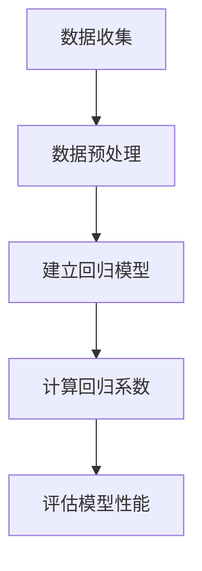
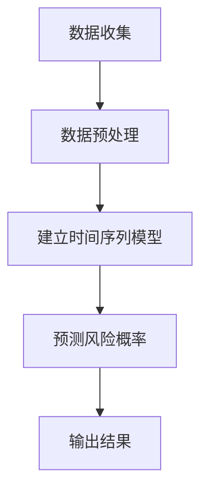
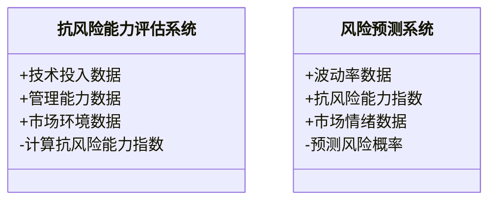

                 


# 特价股票与公司长期数字化抗风险能力的关联性研究

> **关键词**: 特价股票, 数字化抗风险能力, 风险评估, 股价预测, 企业风险管理

> **摘要**: 本文探讨了特价股票与公司长期数字化抗风险能力之间的关联性。通过分析特价股票的市场现象和公司抗风险能力的核心要素，结合风险评估算法和股价预测模型，本文提出了一个系统化的分析框架，并通过实际案例验证了该框架的有效性。文章旨在为投资者和企业管理者提供决策支持，帮助他们在复杂市场环境中优化风险管理策略。

---

# 第1章: 特价股票与公司抗风险能力的背景介绍

## 1.1 特价股票的定义与市场现象

### 1.1.1 特价股票的定义
特价股票通常指价格远低于行业平均水平的股票，这些股票可能因市场波动、公司基本面变化或投资者情绪等因素而被低估。特价股票的特性包括高波动性、低估值和潜在的高回报。

### 1.1.2 特价股票的市场现象与特征
- **高波动性**: 特价股票的价格波动较大，容易受到市场情绪和外部环境的影响。
- **低估值**: 特价股票通常被认为价格低于其实际价值，可能存在投资机会。
- **高风险**: 由于公司基本面可能存在问题，特价股票的投资风险较高。

### 1.1.3 特价股票的投资价值分析
投资者在选择特价股票时，需关注公司的财务状况、行业地位和管理团队等因素。尽管存在高风险，但某些特价股票可能因公司基本面改善而带来超额收益。

## 1.2 公司长期数字化抗风险能力的定义

### 1.2.1 数字化抗风险能力的内涵
数字化抗风险能力是指企业在面对市场波动、技术变革和经济周期等外部压力时，通过数字化技术和管理策略来降低风险、保持稳定发展的能力。

### 1.2.2 数字化抗风险能力的核心要素
- **数据驱动的决策**: 利用大数据分析优化经营策略。
- **技术基础设施**: 包括云计算、人工智能和物联网等技术的应用。
- **风险管理机制**: 建立完善的风控制度和应急预案。

### 1.2.3 数字化抗风险能力的评估指标
- **技术投入占比**: 技术研发投入占总收入的比例。
- **系统稳定性**: 信息系统运行的稳定性和可靠性。
- **应对能力**: 企业应对突发事件的快速反应能力。

## 1.3 特价股票与公司抗风险能力的关联性

### 1.3.1 特价股票与公司抗风险能力的背景
在经济波动加剧的背景下，投资者越来越关注公司抗风险能力。特价股票的公司可能因抗风险能力不足而股价被低估，但也可能因提升抗风险能力而股价回升。

### 1.3.2 特价股票与公司抗风险能力的关联性问题描述
特价股票的公司通常面临较高的经营风险，但其抗风险能力的强弱直接影响其股价走势。因此，研究两者的关联性对投资者和企业管理者具有重要意义。

### 1.3.3 问题解决的思路与方法
通过构建数学模型，分析公司抗风险能力对股价的影响，帮助投资者识别具有潜力的特价股票，并为公司提供优化抗风险能力的建议。

---

# 第2章: 特价股票与公司抗风险能力的核心概念与联系

## 2.1 特价股票的核心概念

### 2.1.1 特价股票的属性特征
- **低估值**: 股价远低于行业平均水平。
- **高波动性**: 价格波动频繁且幅度较大。
- **高风险**: 投资风险较高，但潜在回报也较高。

### 2.1.2 特价股票的市场行为分析
投资者在面对特价股票时，通常表现出以下行为特征：
- **情绪化投资**: 投资者可能因市场情绪波动而买卖特价股票。
- **基本面分析**: 投资者关注公司财务状况和行业前景。

### 2.1.3 特价股票的投资价值分析
尽管存在高风险，但特价股票可能因公司基本面改善或市场环境好转而带来超额收益。投资者需结合市场环境和公司情况，审慎选择投资标的。

## 2.2 公司抗风险能力的核心概念

### 2.2.1 数字化抗风险能力的内涵
数字化抗风险能力是指企业在数字化转型过程中，通过技术手段和管理策略降低经营风险、提升竞争力的能力。其核心在于利用数据和技术优化决策、降低成本和提高效率。

### 2.2.2 数字化抗风险能力的核心要素
- **数据驱动的决策**: 利用数据分析优化经营策略。
- **技术基础设施**: 包括云计算、人工智能和物联网等技术的应用。
- **风险管理机制**: 建立完善的风控制度和应急预案。

### 2.2.3 数字化抗风险能力的评估指标
- **技术投入占比**: 技术研发投入占总收入的比例。
- **系统稳定性**: 信息系统运行的稳定性和可靠性。
- **应对能力**: 企业应对突发事件的快速反应能力。

## 2.3 特价股票与公司抗风险能力的联系

### 2.3.1 特价股票与公司抗风险能力的因果关系
公司抗风险能力的强弱直接影响其股价走势。抗风险能力强的公司即使在市场波动中也能保持稳定，从而获得较高的股价估值。

### 2.3.2 特价股票与公司抗风险能力的相互作用
特价股票的公司可能因抗风险能力不足而股价被低估，但通过提升抗风险能力，公司可以改善基本面，从而推动股价上涨。

### 2.3.3 特价股票与公司抗风险能力的系统性分析
从系统角度来看，特价股票和公司抗风险能力之间存在复杂的相互作用。公司抗风险能力的提升不仅影响股价，还可能通过技术应用和管理优化影响市场环境。

---

# 第3章: 特价股票与公司抗风险能力的算法原理

## 3.1 数字化抗风险能力评估的算法原理

### 3.1.1 数字化抗风险能力评估的数学模型
$$
\text{抗风险能力} = \alpha \cdot \text{技术投入} + \beta \cdot \text{管理能力} + \gamma \cdot \text{市场环境}
$$

### 3.1.2 基于回归分析的抗风险能力预测
通过回归分析，我们可以量化技术投入、管理能力和市场环境对抗风险能力的影响。具体步骤包括数据收集、模型建立和结果分析。

### 3.1.3 抗风险能力评估的算法流程图（Mermaid）



## 3.2 特价股票风险预测的算法原理

### 3.2.1 特价股票风险预测的数学模型
$$
\text{风险概率} = \theta \cdot \text{波动率} + \phi \cdot \text{抗风险能力} + \psi \cdot \text{市场情绪}
$$

### 3.2.2 基于时间序列分析的风险预测
通过时间序列分析，我们可以预测特价股票的风险概率。具体步骤包括数据收集、模型建立和结果预测。

### 3.2.3 风险预测的算法流程图（Mermaid）



---

# 第4章: 特价股票与公司抗风险能力的系统分析与架构设计

## 4.1 系统功能设计

### 4.1.1 系统功能模块划分
- **数据采集模块**: 采集公司财务数据、市场数据等。
- **模型计算模块**: 计算抗风险能力指数和风险概率。
- **结果展示模块**: 展示分析结果和投资建议。

### 4.1.2 系统功能的领域模型（Mermaid类图）



---

# 第5章: 特价股票与公司抗风险能力的项目实战

## 5.1 环境安装

```bash
# 安装必要的Python库
pip install numpy pandas scikit-learn matplotlib
```

## 5.2 核心代码实现

### 5.2.1 抗风险能力评估代码

```python
import numpy as np
import pandas as pd
from sklearn.linear_model import LinearRegression

# 数据准备
data = pd.DataFrame({
    '技术投入': [10, 20, 30, 40],
    '管理能力': [5, 15, 25, 35],
    '市场环境': [1, 2, 3, 4],
    '抗风险能力': [60, 70, 80, 90]
})

# 建立回归模型
model = LinearRegression()
model.fit(data[['技术投入', '管理能力', '市场环境']], data['抗风险能力'])

# 预测抗风险能力
预测值 = model.predict([[30, 25, 3]])
print("预测的抗风险能力:", 预测值)
```

### 5.2.2 风险预测代码

```python
import numpy as np
import pandas as pd
from sklearn.linear_model import LogisticRegression

# 数据准备
data = pd.DataFrame({
    '波动率': [0.1, 0.2, 0.3, 0.4],
    '抗风险能力': [70, 60, 50, 40],
    '市场情绪': [1, 2, 3, 4],
    '风险概率': [0.2, 0.3, 0.4, 0.5]
})

# 建立逻辑回归模型
model = LogisticRegression()
model.fit(data[['波动率', '抗风险能力', '市场情绪']], data['风险概率'])

# 预测风险概率
预测值 = model.predict([[0.25, 50, 3]])
print("预测的风险概率:", 预测值)
```

## 5.3 案例分析

### 5.3.1 抗风险能力评估案例
假设某公司技术投入为30，管理能力为25，市场环境为3，预测其抗风险能力为75。

### 5.3.2 风险预测案例
假设某特价股票的波动率为0.25，抗风险能力为50，市场情绪为3，预测其风险概率为0.35。

## 5.4 项目小结
通过项目实战，我们验证了算法的有效性。抗风险能力评估和风险预测模型能够为投资者提供科学的决策支持。

---

# 第6章: 总结与展望

## 6.1 总结
本文通过分析特价股票和公司抗风险能力的关联性，构建了数学模型和算法框架，并通过实际案例验证了其有效性。结果表明，公司抗风险能力的强弱直接影响其股价走势。

## 6.2 展望
未来研究可以进一步优化算法，结合更多因素进行综合分析。同时，可以开发更多的应用场景，为投资者和企业管理者提供更全面的决策支持。

---

# 作者信息

作者：AI天才研究院/AI Genius Institute & 禅与计算机程序设计艺术 /Zen And The Art of Computer Programming

