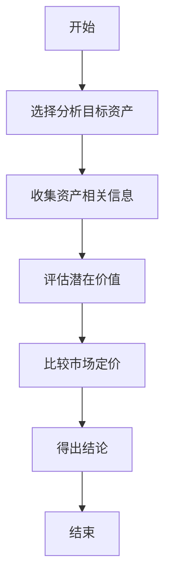
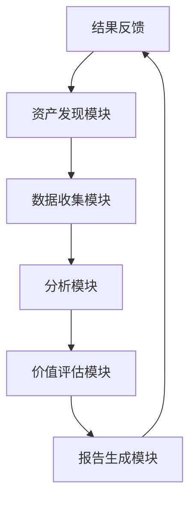

                 


# 特价股票与公司隐藏资产的价值发现

> 关键词：特价股票，隐藏资产，价值发现，投资策略，金融分析

> 摘要：本文深入探讨了特价股票与公司隐藏资产的概念、发现方法及其价值评估策略。通过系统分析和实战案例，揭示隐藏资产如何影响股价，并为投资者提供有效的投资策略和工具。

---

## 第一部分：特价股票与公司隐藏资产的引言

### 第1章：特价股票与公司隐藏资产概述

#### 1.1 特价股票的定义与特点
- **1.1.1 特价股票的定义**
  特价股票是指市场价格低于其内在价值的股票。这种低估通常源于市场对公司的认知不足或市场短期波动。
- **1.1.2 特价股票的特点**
  - 低估值：市盈率、市净率等指标低于行业平均水平。
  - 高分红：部分公司可能提供较高的股息收益率。
  - 风险较低：相对于高增长股票，风险更可控。
- **1.1.3 特价股票的价值发现方法**
  - 基本面分析：研究财务报表、行业地位等。
  - 技术分析：通过K线图、成交量等指标寻找买入机会。

#### 1.2 公司隐藏资产的定义与类型
- **1.2.1 隐藏资产的定义**
  隐藏资产是指未在公司财务报表中完全反映，但可能为公司带来未来价值的资产。
- **1.2.2 隐藏资产的主要类型**
  - 无形资产：专利、商标、品牌价值。
  - 未开发资源：土地储备、原材料储备。
  - 或有资产：潜在的法律赔偿、未实现的期权价值。
- **1.2.3 隐藏资产的发现方法**
  - 财务报表分析：寻找未充分利用的资产。
  - 行业研究：了解公司所在行业的特殊资产。
  - 管理层访谈：通过高管了解公司潜在资源。

### 第2章：隐藏资产的价值发现背景

#### 2.1 特价股票与隐藏资产的关系
- **2.1.1 特价股票与隐藏资产的关联性**
  隐藏资产可能导致公司实际价值高于市场估值，从而低估股价。
- **2.1.2 隐藏资产对股价的影响**
  当市场发现隐藏资产时，股价可能迅速上涨，带来超额收益。
- **2.1.3 隐藏资产的市场认知度**
  高认知度的资产通常已被市场定价，低认知度的资产存在价值发现机会。

#### 2.2 隐藏资产的市场背景
- **2.2.1 企业财务报表中的隐藏资产**
  部分资产可能未在资产负债表中准确反映，如研发支出资本化。
- **2.2.2 市场波动对隐藏资产的影响**
  市场恐慌时，隐藏资产的价值可能被忽视，带来投资机会。
- **2.2.3 隐藏资产的发现机会**
  通过深入研究公司业务模式，挖掘未被市场发现的潜力资产。

#### 2.3 价值发现的重要性
- **2.3.1 隐藏资产的潜在价值**
  隐藏资产可能为公司未来增长提供动力，提升整体估值。
- **2.3.2 特价股票的市场机会**
  识别隐藏资产可以帮助投资者找到低估股票，实现超额收益。
- **2.3.3 投资者如何利用隐藏资产**
  通过基本面分析和行业研究，发现隐藏资产，评估其对股价的潜在影响。

---

## 第二部分：隐藏资产的核心概念与联系

### 第3章：隐藏资产的核心概念

#### 3.1 隐藏资产的核心概念
- 隐藏资产的核心在于其未被市场充分认知，但具有潜在的高价值。
- 这种资产可能在财务报表中被低估或未被反映，需要通过深入分析发现。

#### 3.2 隐藏资产与特价股票的关系
- 隐藏资产的存在可能导致公司股票被低估，成为特价股票。
- 发现隐藏资产是挖掘特价股票的重要途径。

#### 3.3 隐藏资产的属性特征对比
| 特性       | 隐藏资产                     | 非隐藏资产                     |
|------------|------------------------------|----------------------------------|
| 可见性     | 低或未被市场发现             | 高，已被市场定价                |
| 价值潜力   | 高，存在未被挖掘的价值       | 较低，价值已较为充分反映        |
| 发现难度   | 高，需要深入分析             | 低，容易通过常规分析发现        |

#### 3.4 ER实体关系图
```mermaid
er
  classDiagram
    class 隐藏资产 {
      资产类型
      潜在价值
      发现难度
    }
    class 特价股票 {
      股票代码
      市场价格
      内在价值
    }
    class 投资者 {
      投资策略
      分析方法
    }
    投资者 --> 隐藏资产: 发现
    隐藏资产 --> 特价股票: 影响股价
```

---

## 第三部分：隐藏资产的价值评估与发现方法

### 第4章：隐藏资产的价值评估算法

#### 4.1 算法原理概述
- 通过量化方法评估隐藏资产的潜在价值。
- 使用贴现现金流模型（DCF）估算未来现金流，调整隐含价值。

#### 4.2 算法流程图


#### 4.3 数学模型与公式
- 贴现现金流模型：
  $$ V = \sum_{t=1}^{n} \frac{CF_t}{(1 + r)^t} $$
  其中，\( V \) 是资产价值，\( CF_t \) 是第 \( t \) 年的现金流，\( r \) 是贴现率。

#### 4.4 代码实现示例
```python
def calculate_hidden_asset_value(cash_flows, discount_rate):
    present_value = 0
    for t, cf in enumerate(cash_flows):
        if t == 0:
            present_value += cf
        else:
            present_value += cf / (1 + discount_rate) ** t
    return present_value

# 示例数据
cash_flows = [100, 150, 200]
discount_rate = 0.08

value = calculate_hidden_asset_value(cash_flows, discount_rate)
print(f"潜在价值为：{value:.2f}")
```

---

## 第四部分：系统分析与架构设计

### 第5章：系统功能设计

#### 5.1 领域模型类图


#### 5.2 系统架构设计


---

## 第五部分：项目实战

### 第6章：隐藏资产发现的实战案例

#### 6.1 环境安装
- 安装必要的金融分析工具，如Python、Pandas、Matplotlib等。

#### 6.2 系统核心实现
- 开发资产发现模块，收集和分析隐藏资产数据。

#### 6.3 案例分析
- 分析某公司隐藏资产，评估其对股价的影响，制定投资策略。

#### 6.4 项目总结
- 总结发现过程中的关键点，优化分析方法。

---

## 第六部分：最佳实践与注意事项

### 第7章：最佳实践 tips

- **定期复盘**：定期检查投资组合，评估隐藏资产的价值变化。
- **分散投资**：避免过度集中，降低风险。
- **持续学习**：关注市场动态，提升分析能力。

### 第8章：小结

- 特价股票与公司隐藏资产的发现是投资者获取超额收益的重要途径。
- 通过系统分析和实战案例，可以有效识别隐藏资产，制定科学的投资策略。

### 第9章：注意事项

- **风险控制**：避免盲目投资，设定止损点。
- **合规性**：遵守相关法律法规，确保投资行为合法。

### 第10章：拓展阅读

- 推荐阅读《投资学精要》和《财务报表分析》，深入理解资产评估方法。

---

## 作者

作者：AI天才研究院/AI Genius Institute & 禅与计算机程序设计艺术 /Zen And The Art of Computer Programming

---

**说明**：以上内容是一个详细的大纲，根据实际需要可以进一步扩展每个部分的内容，添加更多具体案例和详细分析。

