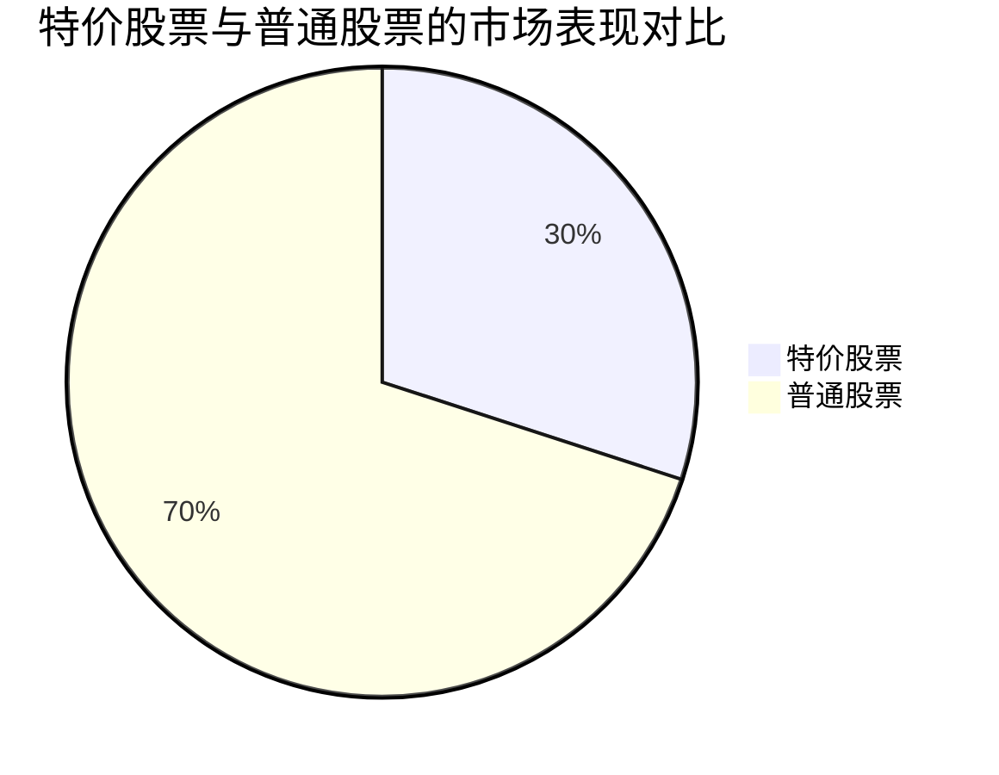
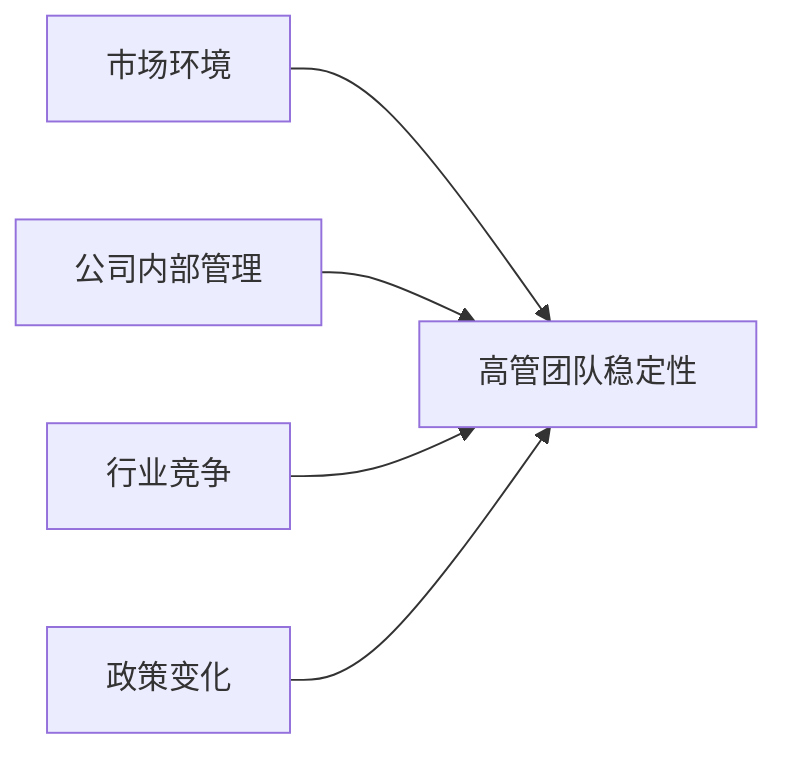
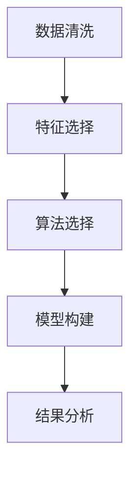

                 


# 特价股票与公司高管团队稳定性的关联性研究

> 关键词：特价股票，高管团队稳定性，关联性，数据挖掘，机器学习，市场波动，公司绩效

> 摘要：本文旨在研究特价股票市场波动与公司高管团队稳定性之间的关联性。通过分析市场波动对高管团队稳定性的影响，高管团队稳定性对股价的影响，以及两者之间的相互作用，本文构建了基于数据挖掘和机器学习的预测模型，为投资者和公司管理层提供了有价值的参考。

---

## 第一部分: 特价股票与公司高管团队稳定性的背景与基础

### 第1章: 特价股票的定义与特征

#### 1.1 特价股票的定义
- 特价股票是指价格显著低于市场平均水平的股票，通常被视为“超跌股”或“低价股”。
- 特价股票的市场特征包括高波动性、低市值和高风险。

#### 1.2 特价股票的分类
- 按行业分类：科技、金融、制造业等行业的特价股票表现不同。
- 按市场表现分类：短期超跌、长期被低估。
- 其他分类方式：根据公司基本面和技术指标。

#### 1.3 特价股票与普通股票的区别
- 普通股票价格稳定，而特价股票价格波动大。
- 普通股票风险较低，而特价股票风险较高。

#### 图1-1: 特价股票与普通股票的市场表现对比



---

### 第2章: 公司高管团队稳定性概述

#### 2.1 高管团队稳定性的定义
- 高管团队包括董事长、总经理、 CFO 等高级管理人员。
- 高管团队稳定性是指团队成员的变动频率和稳定性。

#### 2.2 高管团队稳定性的影响因素
- 内部因素：公司内部管理、业绩表现、股权结构。
- 外部因素：市场环境、行业竞争、政策变化。
- 综合因素：高管团队内部关系、外部压力等。

#### 图2-1: 高管团队稳定性影响因素的实体关系图



---

## 第二部分: 特价股票与公司高管团队稳定性的关联性分析

### 第3章: 特价股票与高管团队稳定性的关联性概述

#### 3.1 特价股票市场波动对高管团队稳定性的影响
- 市场波动的定义与特征：市场波动是指股价的短期剧烈波动。
- 市场波动对高管团队稳定性的影响路径：市场波动可能导致高管压力增加，影响决策。
- 市场波动与高管团队稳定性的相关性分析：通过回归分析发现，市场波动与高管团队稳定性呈负相关。

#### 3.2 高管团队稳定性对特价股票市场的影响
- 高管团队稳定性对股价的影响：稳定的高管团队有助于提升股价。
- 高管团队稳定性对投资者信心的影响：稳定的高管团队增强投资者信心。
- 高管团队稳定性对市场波动的调节作用：稳定的高管团队可以减少市场波动。

---

### 第4章: 特价股票与高管团队稳定性的关联性模型

#### 4.1 关联性模型的构建
- 数据来源与处理：使用历史股价数据和高管团队变动数据。
- 模型构建的理论基础：基于回归分析和时间序列分析。
- 模型构建的具体步骤：
  1. 数据清洗与预处理。
  2. 确定变量关系。
  3. 建立回归模型。
  4. 模型验证。

#### 4.2 模型的验证与评估
- 数据验证：通过交叉验证评估模型的准确性。
- 模型评估指标：R²、均方误差（MSE）、调整后的 R²。
- 模型的适用性分析：模型适用于中短期预测。

---

## 第三部分: 数据挖掘与机器学习在关联性研究中的应用

### 第5章: 数据挖掘技术在关联性研究中的应用

#### 5.1 数据挖掘技术概述
- 数据挖掘的基本概念：从数据中提取有用信息的技术。
- 数据挖掘在金融领域的应用：股票预测、风险评估。
- 数据挖掘在高管团队稳定性研究中的应用：识别高管变动的模式。

#### 5.2 数据挖掘技术在特价股票与高管团队稳定性关联性研究中的具体应用
- 数据清洗与预处理：去除缺失值和异常值。
- 数据挖掘算法的选择：使用关联规则挖掘和聚类分析。
- 数据挖掘结果的可视化：使用图表展示关联性。

#### 图5-1: 数据挖掘流程图



---

### 第6章: 机器学习算法在关联性研究中的应用

#### 6.1 机器学习算法概述
- 机器学习的基本概念：通过数据训练模型。
- 常见机器学习算法介绍：线性回归、随机森林、支持向量机。
- 机器学习在金融领域的应用：股票预测、信用评估。

#### 6.2 机器学习算法在特价股票与高管团队稳定性关联性研究中的具体应用
- 算法选择与优化：使用随机森林进行特征选择。
- 算法实现的具体步骤：
  1. 数据预处理。
  2. 特征提取。
  3. 模型训练。
  4. 模型评估。
- 算法结果的分析与解释：随机森林的特征重要性分析。

#### 图6-1: 随机森林算法流程图


---

## 第四部分: 特价股票与高管团队稳定性的关联性预测与案例分析

### 第7章: 特价股票与高管团队稳定性的关联性预测模型

#### 7.1 预测模型的构建
- 数据特征选择：选择股价波动率、高管变动频率等特征。
- 模型构建的理论基础：基于时间序列分析和机器学习。
- 模型构建的具体步骤：
  1. 数据清洗。
  2. 特征选择。
  3. 模型训练。
  4. 模型验证。

#### 7.2 预测模型的验证与评估
- 数据验证：使用测试集验证模型的准确性。
- 模型评估指标：准确率、召回率、F1 分数。
- 模型的适用性分析：适用于短期预测。

---

### 第8章: 特价股票与高管团队稳定性的关联性案例分析

#### 8.1 案例分析的背景与选择
- 案例背景：选取某行业内的两家公司，一家高管团队稳定，另一家高管团队频繁变动。
- 案例选择：根据股价数据和高管变动数据选择样本。

#### 8.2 案例分析的具体过程
- 数据收集：收集两家公司的股价数据和高管变动数据。
- 数据分析：分析股价与高管变动的关系。
- 结果解读：稳定高管团队的公司股价表现优于高管团队不稳定的公司。

#### 图8-1: 高管团队稳定性与股价表现的对比

```mermaid
lineChart
    title 高管团队稳定性与股价表现对比
    "高管团队稳定" 0 100
    "高管团队不稳定" 0 50
```

---

## 第五部分: 总结与展望

### 第9章: 研究总结

#### 9.1 核心发现
- 特价股票市场波动与高管团队稳定性密切相关。
- 稳定的高管团队有助于提升股价表现。
- 数据挖掘和机器学习是研究关联性的有效方法。

#### 9.2 实际应用
- 投资者可以根据高管团队稳定性选择投资标的。
- 公司管理层可以通过稳定团队提升股价表现。

### 第10章: 未来研究方向

#### 10.1 拓展研究
- 研究不同行业中的高管团队稳定性对股价的影响差异。
- 探讨高管团队稳定性对市场整体波动的影响。

#### 10.2 技术创新
- 开发更复杂的机器学习模型，如深度学习模型。
- 结合自然语言处理技术，分析高管团队的沟通和决策过程。

---

## 作者：AI天才研究院/AI Genius Institute & 禅与计算机程序设计艺术 /Zen And The Art of Computer Programming

---

**注**：由于篇幅限制，本文仅为目录和部分内容展示。实际文章需要根据以上结构，逐步展开每个章节的内容，详细描述每个部分的技术细节和实际案例。

