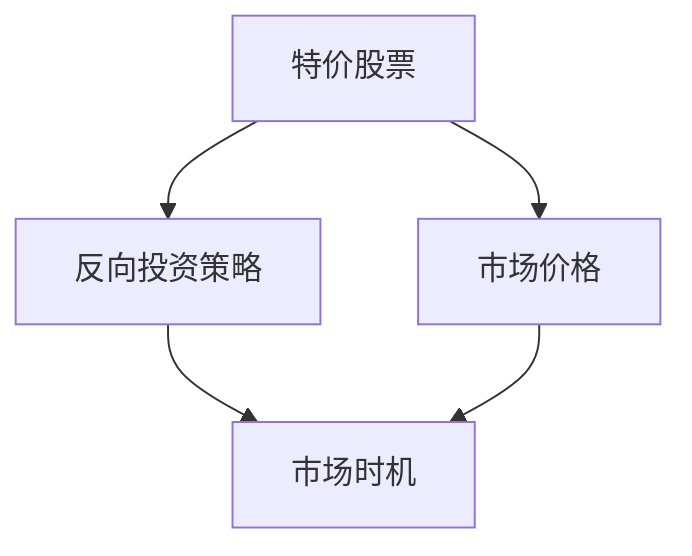
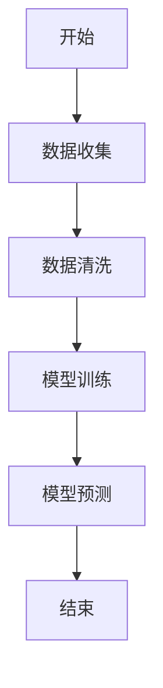
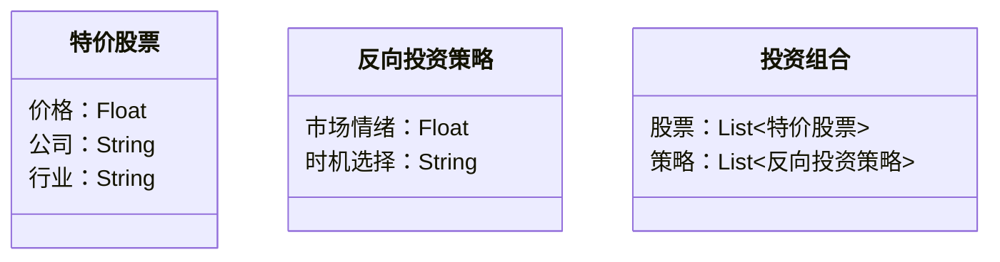
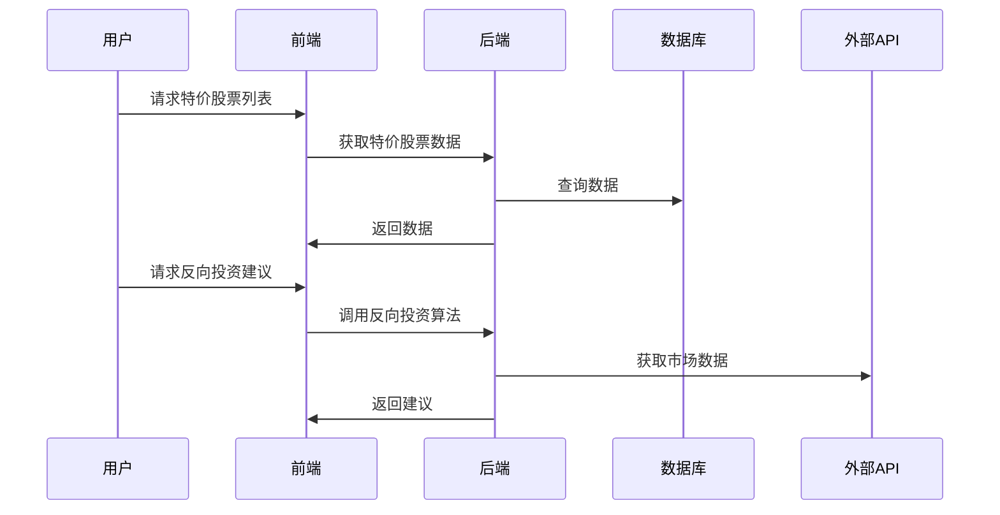

                 


# 特价股票与反向投资策略的异同

> 关键词：特价股票，反向投资策略，投资策略，股票定价，市场时机

> 摘要：本文系统地探讨了特价股票与反向投资策略的异同，从定义、原理到算法实现，再到系统架构和实战案例，深入分析了两者在投资中的应用与联系，帮助投资者更好地理解和运用这些策略。

---

## 第1章: 特价股票与反向投资策略的背景介绍

### 1.1 特价股票的定义与特点

#### 1.1.1 特价股票的定义
特价股票是指那些市场价格低于其面值的股票。这种股票通常出现在市场低迷时期，或者公司遭遇短期困境时，投资者认为其市场价格被低估，具有较大的回升潜力。

#### 1.1.2 特价股票的核心特点
- **价格低估**：市场价格低于面值，具有较高的潜在回报。
- **风险较高**：通常出现在市场低迷或公司困境时期，投资风险较大。
- **周期性**：特价股票的出现往往具有周期性，与市场波动密切相关。

#### 1.1.3 特价股票的市场定位与作用
特价股票在市场中起到价格洼地的作用，为投资者提供了低位介入的机会，同时在市场回升时可能带来超额收益。

### 1.2 反向投资策略的定义与特点

#### 1.2.1 反向投资策略的定义
反向投资策略是一种在市场低迷时期买入，市场高涨时期卖出的投资策略。该策略基于市场非理性波动的假设，认为市场的极端行为往往提供反向投资的机会。

#### 1.2.2 反向投资策略的核心特点
- **逆市场操作**：在市场恐慌时买入，在市场狂热时卖出。
- **长期视角**：注重长期价值，而非短期波动。
- **风险控制**：通过逆向操作降低市场风险，追求稳定收益。

#### 1.2.3 反向投资策略的适用场景与限制
反向投资策略适用于市场波动较大、投资者情绪化的市场环境，但在市场稳定或理性投资者占主导时效果有限。

### 1.3 特价股票与反向投资策略的联系与区别

#### 1.3.1 两者的共同点
- 都关注市场低估或高估的情况。
- 都试图通过价格与价值的偏离获取超额收益。

#### 1.3.2 两者的区别
- **标的物**：特价股票是特定价格的股票，而反向投资策略是整体市场的操作策略。
- **时机选择**：特价股票关注单个股票的价格，而反向投资策略关注市场的整体波动。
- **风险与收益**：特价股票风险较高，但潜在收益大；反向投资策略风险相对可控，收益较为稳定。

#### 1.3.3 两者的相互作用与影响
特价股票为反向投资策略提供了具体的操作标的，而反向投资策略为特价股票的投资提供了市场时机的选择。

### 1.4 本章小结
本章从背景出发，详细介绍了特价股票和反向投资策略的定义、特点及其联系与区别，为后续的深入分析奠定了基础。

---

## 第2章: 特价股票与反向投资策略的核心概念与联系

### 2.1 特价股票与反向投资策略的核心原理

#### 2.1.1 特价股票的市场定价机制
特价股票的定价机制基于市场供需关系和公司基本面。当市场低迷时，股票价格可能低于其内在价值，为投资者提供了介入的机会。

#### 2.1.2 反向投资策略的市场时机选择
反向投资策略通过分析市场情绪和估值指标，选择在市场底部买入，市场顶部卖出。

### 2.2 特价股票与反向投资策略的对比分析

#### 2.2.1 对比特征分析
| 特征             | 特价股票                        | 反向投资策略                     |
|------------------|---------------------------------|----------------------------------|
| 标的物           | 单一股票                        | 整个市场或资产组合              |
| 时机选择         | 价格低于面值时                 | 市场估值低于长期均值时           |
| 风险             | 较高                           | 较为可控                        |
| 收益             | 潜在较高                       | 稳定且可持续                     |

#### 2.2.2 实体关系图（Mermaid）



### 2.3 本章小结
本章通过核心原理和对比分析，进一步明确了特价股票和反向投资策略的异同，为后续的算法实现奠定了理论基础。

---

## 第3章: 特价股票与反向投资策略的算法原理

### 3.1 特价股票的定价模型

#### 3.1.1 时间序列分析
时间序列分析用于预测股票价格的未来走势，常用ARIMA模型。

#### 3.1.2 回归分析
回归分析用于确定股票价格与相关因素（如市场指数、公司业绩）之间的关系。

#### 3.1.3 算法流程图（Mermaid）



### 3.2 反向投资策略的时机选择算法

#### 3.2.1 市场情绪分析
通过分析市场情绪指标（如恐慌指数、投资者信心指数）来判断市场是否处于底部或顶部。

#### 3.2.2 风险评估
使用VaR（在险价值）模型评估投资组合的风险。

#### 3.2.3 算法实现代码

```python
import pandas as pd
import numpy as np

def reverse_investing_strategy(data):
    # 数据预处理
    processed_data = data.dropna()
    # 计算平均回报率
    average_return = np.mean(processed_data['return'])
    # 计算波动率
    volatility = np.std(processed_data['return'])
    # 判断是否为市场底部
    if average_return < -0.1 and volatility > 0.2:
        return '买入'
    else:
        return '观望'

# 示例数据
data = {'return': np.random.normal(0, 0.1, 100)}
df = pd.DataFrame(data)
print(reverse_investing_strategy(df))
```

### 3.3 本章小结
本章详细介绍了特价股票和反向投资策略的算法实现，通过具体代码和流程图展示了如何将理论应用于实践。

---

## 第4章: 特价股票与反向投资策略的数学模型

### 4.1 资产定价模型

#### 4.1.1 CAPM模型
资本资产定价模型（CAPM）用于评估资产的预期回报。

$$ E(r_i) = r_f + \beta_i (E(r_m) - r_f) $$

#### 4.1.2APT模型
套利定价理论（APT）提供了另一种资产定价方法。

$$ E(r_i) = \sum_{j=1}^n \lambda_j x_{ij} $$

### 4.2 风险评估模型

#### 4.2.1 VaR模型
在险价值（VaR）用于衡量投资组合在特定置信水平下的潜在损失。

$$ VaR = \text{损失金额} $$

#### 4.2.2 CVaR模型
条件在险价值（CVaR）用于衡量在VaR超过一定水平时的平均损失。

$$ CVaR = \text{平均损失} $$

### 4.3 结合模型的优化

#### 4.3.1 优化目标函数
最大化投资回报，同时最小化投资风险。

$$ \max \mu - \lambda \sigma $$

### 4.4 本章小结
本章通过数学模型详细分析了特价股票和反向投资策略的量化方法，为投资决策提供了科学依据。

---

## 第5章: 系统分析与架构设计

### 5.1 系统功能设计

#### 5.1.1 领域模型（Mermaid类图）



### 5.2 系统架构设计

#### 5.2.1 系统架构图（Mermaid架构图）

```mermaid
iframe
    graph TD
        A[用户] --> B[前端]
        B --> C[后端]
        C --> D[数据库]
        C --> E[外部API]
```

### 5.3 系统接口设计

#### 5.3.1 API接口
- GET /stocks/cheap：获取特价股票列表。
- POST /strategies/reverse：提交反向投资策略。

### 5.4 系统交互设计

#### 5.4.1 交互流程图（Mermaid序列图）



### 5.5 本章小结
本章从系统设计的角度，详细描述了如何构建一个支持特价股票和反向投资策略的投资分析系统，为实际应用提供了参考。

---

## 第6章: 项目实战

### 6.1 环境配置

#### 6.1.1 技术选型
- 语言：Python
- 框架：Django
- 数据库：PostgreSQL

### 6.2 核心代码实现

#### 6.2.1 特价股票筛选代码

```python
import pandas as pd

def find_cheap_stocks(data, threshold=0.9):
    return data[data['price'] < threshold * data['face_value']]
```

#### 6.2.2 反向投资策略实现

```python
from datetime import datetime

def reverse_strategy(data, start_date, end_date):
    mask = (data['date'] >= start_date) & (data['date'] <= end_date)
    subset = data[mask]
    return subset[subset['market_value'] < subset['average_market_value']]
```

### 6.3 案例分析

#### 6.3.1 数据来源与处理
使用历史股价数据，筛选出符合条件的特价股票，并结合市场情绪指标，制定反向投资策略。

#### 6.3.2 结果展示
通过图表展示特价股票筛选结果和反向投资策略的实施效果。

### 6.4 经验总结
- 数据质量是关键。
- 模型选择需结合实际市场情况。
- 风险控制是投资成功的重要保障。

### 6.5 本章小结
本章通过具体案例展示了如何在实际中应用特价股票和反向投资策略，为投资者提供了实操指南。

---

## 第7章: 总结与展望

### 7.1 总结
本文全面分析了特价股票与反向投资策略的异同，从理论到实践，为投资者提供了系统的投资策略。

### 7.2 投资策略的选择
投资者应根据市场环境和个人风险承受能力，合理选择投资策略。

### 7.3 未来展望
随着市场的发展和技术的进步，投资策略将更加多元化和智能化，投资者需持续学习和适应市场变化。

### 7.4 最佳实践 Tips
- 定期审视投资组合。
- 结合多种策略进行投资。
- 保持对市场的敏感性和洞察力。

### 7.5 本章小结
本章总结了全文，并为未来的投资策略优化提供了方向和建议。

---

## 作者

作者：AI天才研究院/AI Genius Institute & 禅与计算机程序设计艺术/Zen And The Art of Computer Programming

---

以上是《特价股票与反向投资策略的异同》的技术博客文章的详细目录结构和内容框架。通过系统的分析和对比，结合理论与实践，为投资者提供了深入的指导和参考。

