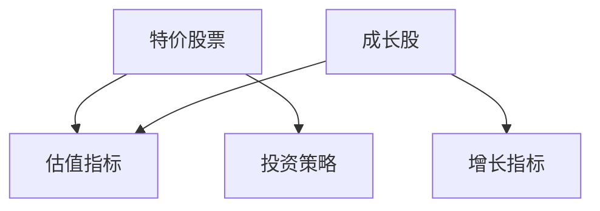
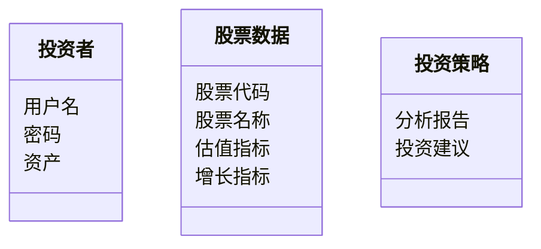
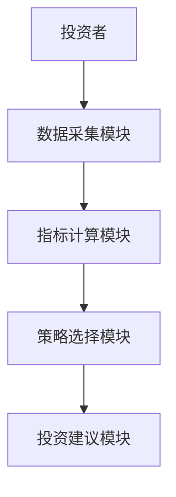

                 


# 特价股票与成长股的投资区别

> 关键词：特价股票，成长股，投资策略，风险管理，股票分析

> 摘要：本文详细探讨了特价股票与成长股之间的区别，分析了它们的核心概念、投资策略、风险管理等方面，帮助投资者更好地理解如何在不同市场环境下选择适合的投资策略。

---

# 第一章：引言

## 1.1 本书的目的与读者对象
- 本书旨在帮助投资者理解特价股票与成长股的区别，掌握各自的投资策略。
- 适合对股票投资感兴趣，尤其是关注中长期投资策略的读者。

## 1.2 特价股票与成长股的定义与重要性
- 特价股票：指价格被低估，具有长期投资价值的股票。
- 成长股：指收入和利润持续增长，具有较高成长潜力的股票。
- 两者的投资策略和风险特征不同，适用于不同的市场环境和投资目标。

## 1.3 本书的结构安排
- 本书将从背景介绍、核心概念对比、投资策略、风险管理、案例分析等方面展开，帮助读者全面理解两者区别。

---

# 第二章：特价股票与成长股的背景介绍

## 2.1 特价股票的背景与特点
### 2.1.1 特价股票的定义与核心概念
- 特价股票：市场暂时低估，但公司基本面良好，具有长期增长潜力的股票。
- 核心概念：估值低于内在价值，短期市场波动导致价格偏差。

### 2.1.2 特价股票的形成原因与市场环境
- 市场低迷、公司短期业绩不佳、行业周期性影响等因素可能导致股票价格被低估。

### 2.1.3 特价股票与成长股的初步对比
- 特价股票关注短期价格波动，成长股关注长期增长潜力。
- 特价股票适合短期投资者，成长股适合长期投资者。

## 2.2 成长股的背景与特点
### 2.2.1 成长股的定义与核心概念
- 成长股：收入和利润持续增长，具有较高成长潜力的股票。
- 核心概念：高增长、高潜力，适合长期投资者。

### 2.2.2 成长股的市场环境与增长驱动因素
- 高增长行业、创新能力强的公司、市场需求持续增长等因素驱动成长股的增长。

### 2.2.3 特价股票与成长股的初步对比
- 特价股票关注价格低估，成长股关注增长潜力。
- 特价股票适合短期投资者，成长股适合长期投资者。

---

# 第三章：特价股票与成长股的核心概念对比

## 3.1 特价股票与成长股的核心概念
### 3.1.1 特价股票的核心概念解析
- 估值指标：市盈率（P/E）、市净率（P/B）等。
- 投资策略：寻找价格低于内在价值的股票。

### 3.1.2 成长股的核心概念解析
- 增长指标：收入增长率、净利润增长率等。
- 投资策略：寻找收入和利润持续增长的公司。

## 3.2 特价股票与成长股的属性特征对比
### 3.2.1 估值指标对比（表格）
| 指标     | 特价股票 | 成长股   |
|----------|----------|----------|
| 市盈率   | 低于行业均值 | 高于行业均值 |
| 市净率   | 低于行业均值 | 高于行业均值 |
| 股息率   | 较高       | 较低      |

### 3.2.2 增长潜力对比（表格）
| 指标     | 特价股票 | 成长股   |
|----------|----------|----------|
| 收入增长率 | 较低     | 较高     |
| 净利润增长率 | 较低     | 较高     |

### 3.2.3 风险特征对比（表格）
| 指标     | 特价股票 | 成长股   |
|----------|----------|----------|
| 市场波动风险 | 较低     | 较高     |
| 业绩波动风险 | 较高     | 较低     |

## 3.3 特价股票与成长股的ER实体关系图


---

# 第四章：特价股票与成长股的投资策略

## 4.1 特价股票的投资策略
### 4.1.1 特价股票的识别方法
- 使用估值指标（如市盈率、市净率）筛选低于行业均值的股票。
- 分析公司基本面，确保公司具有长期增长潜力。

### 4.1.2 市场时机的选择与投资策略
- 在市场低迷时寻找被低估的股票。
- 分散投资，降低市场波动风险。

### 4.1.3 风险管理与投资组合优化
- 设置止损点，控制单只股票的投资比例。
- 结合成长股进行组合投资，平衡风险与收益。

## 4.2 成长股的投资策略
### 4.2.1 成长股的筛选标准
- 收入和利润持续增长，行业前景广阔。
- 公司具有创新能力和竞争优势。

### 4.2.2 长期投资与成长潜力评估
- 长期持有，等待公司成长兑现。
- 定期评估公司增长潜力，调整投资组合。

### 4.2.3 成长股投资中的风险管理
- 关注行业风险，避免集中投资单一行业。
- 定期评估公司基本面，及时调整投资策略。

---

# 第五章：特价股票与成长股的风险管理

## 5.1 特价股票的风险管理
### 5.1.1 特价股票的市场波动风险
- 市场复苏时，价格可能迅速回升，需关注市场趋势。
- 避免过度集中投资，分散风险。

### 5.1.2 业绩波动风险
- 特价股票可能因公司业绩不佳导致股价进一步下跌。
- 定期评估公司基本面，及时调整投资策略。

## 5.2 成长股的风险管理
### 5.2.1 成长股的市场波动风险
- 成长股价格波动较大，需设置止损点。
- 避免过度集中投资，分散风险。

### 5.2.2 业绩兑现风险
- 成长股可能因增长不及预期导致股价下跌。
- 定期评估公司增长潜力，及时调整投资策略。

---

# 第六章：特价股票与成长股的案例分析

## 6.1 特价股票的案例分析
### 6.1.1 案例选择与分析
- 选择一只被低估的股票，分析其估值指标和基本面。
- 结合市场环境，评估其投资价值。

### 6.1.2 投资策略与实际操作
- 在市场低迷时买入，市场复苏时卖出。
- 分散投资，降低风险。

## 6.2 成长股的案例分析
### 6.2.1 案例选择与分析
- 选择一家收入和利润持续增长的公司，分析其增长潜力。
- 结合行业前景，评估其投资价值。

### 6.2.2 投资策略与实际操作
- 长期持有，等待公司成长兑现。
- 定期评估公司基本面，及时调整投资策略。

---

# 第七章：系统分析与架构设计方案

## 7.1 投资分析系统的背景介绍
- 为了帮助投资者更好地分析特价股票和成长股，设计一个投资分析系统。

## 7.2 系统功能设计
### 7.2.1 领域模型


### 7.2.2 系统架构


## 7.3 系统接口设计
- 数据接口：与股票数据源对接，获取实时数据。
- 用户接口：提供用户友好的界面，展示分析结果。

## 7.4 系统交互设计
```mermaid
sequenceDiagram
参与者：投资者
系统：投资分析系统
投资者->系统：登录
系统->投资者：欢迎信息
投资者->系统：输入股票代码
系统->投资者：显示股票分析报告
```

---

# 第八章：项目实战

## 8.1 环境安装与配置
- 安装Python和相关库（pandas、numpy、matplotlib）。
- 获取股票数据，保存为CSV文件。

## 8.2 系统核心实现
### 8.2.1 数据预处理
```python
import pandas as pd
data = pd.read_csv('stock_data.csv')
```

### 8.2.2 指标计算
```python
def calculate_valuation(data):
    data['PE'] = data['Price'] / data['Earnings']
    data['PB'] = data['Price'] / data['Book Value']
    return data

data = calculate_valuation(data)
```

### 8.2.3 投资策略实现
```python
def investment_strategy(data, is_value=True):
    if is_value:
        data = data[data['PE'] < data['PE'].median()]
    else:
        data = data[data['Revenue Growth'] > data['Revenue Growth'].median()]
    return data

value_stocks = investment_strategy(data, is_value=True)
growth_stocks = investment_strategy(data, is_value=False)
```

## 8.3 实际案例分析与解读
- 分析一只特价股票和一只成长股，展示如何通过系统进行分析和投资决策。

## 8.4 项目小结
- 通过项目实战，读者可以掌握如何利用Python进行股票数据分析和投资策略实现。

---

# 第九章：最佳实践、小结与注意事项

## 9.1 最佳实践
### 9.1.1 分散投资
- 不要将所有资金投入到单一股票或行业，降低风险。

### 9.1.2 定期评估
- 定期评估投资组合，及时调整策略。

### 9.1.3 保持学习
- 关注市场动态和公司新闻，提升投资能力。

## 9.2 小结
- 特价股票和成长股各有优劣，投资者应根据自身目标和风险承受能力选择适合的投资策略。

## 9.3 注意事项
- 避免盲目跟风，理性投资。
- 保持对市场的敏感性，及时调整投资策略。

---

# 第十章：总结与展望

## 10.1 本书的总结
- 本文详细探讨了特价股票与成长股的区别，分析了它们的投资策略和风险管理。

## 10.2 未来的展望
- 随着市场变化，投资策略也需要不断调整。
- 未来可以通过技术手段进一步优化投资分析系统。

---

# 作者：AI天才研究院/AI Genius Institute & 禅与计算机程序设计艺术 /Zen And The Art of Computer Programming

