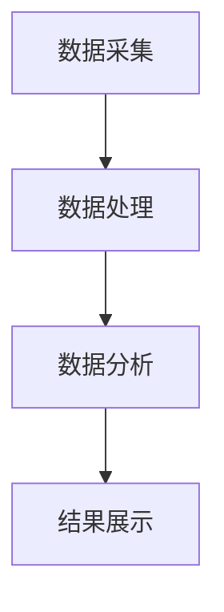

                 


# 特价股票投资中的Beta世代消费行为分析与风险管理

> 关键词：Beta世代，特价股票投资，风险管理，消费行为分析，数据分析，投资策略

> 摘要：本文通过分析Beta世代在特价股票投资中的消费行为，探讨其对投资决策的影响，并提出风险管理策略，帮助投资者在不确定市场中优化投资组合。

---

# 第一部分: 特价股票投资与Beta世代消费行为概述

## 第1章: 特价股票投资的背景与意义

### 1.1 特价股票投资的定义与特点

#### 1.1.1 特价股票的定义
特价股票通常指市盈率、市净率等估值指标低于行业平均水平的股票。这些股票可能被市场低估，具有较大的增值潜力。

#### 1.1.2 特价股票投资的核心特点
- 低估值：市盈率和市净率低于市场平均水平。
- 高分红：部分公司股息收益率较高。
- 风险较低：通常来自基本面稳定的公司。

#### 1.1.3 特价股票投资的市场定位
特价股票投资属于价值投资范畴，适合风险偏好较低的投资者。

### 1.2 Beta世代的定义与特征

#### 1.2.1 Beta世代的定义
Beta世代指的是20世纪60年代至70年代出生的人群，他们经历了经济波动，注重稳定和价值。

#### 1.2.2 Beta世代的消费行为特征
- 偏好低风险投资。
- 注重长期回报。
- 倾向于保守型投资策略。

#### 1.2.3 Beta世代与股票投资的关联性
Beta世代更倾向于选择低风险、高分红的股票，符合特价股票的特征。

### 1.3 本章小结
本章介绍了特价股票投资的基本概念和Beta世代的消费行为特征，为后续分析奠定了基础。

---

## 第2章: 特价股票投资中的Beta世代消费行为分析

### 2.1 Beta世代的消费心理与投资偏好

#### 2.1.1 Beta世代的消费心理特点
- 风险厌恶：倾向于选择稳定的投资标的。
- 价值导向：注重股票的内在价值。

#### 2.1.2 Beta世代的投资偏好分析
- 倾向于选择低市盈率、高股息率的股票。
- 对行业龙头股有偏好。

#### 2.1.3 Beta世代与股票投资的契合点
特价股票的低估值和高分红特性与Beta世代的投资偏好高度契合。

### 2.2 Beta世代消费行为对股票投资的影响

#### 2.2.1 消费行为变化对股票市场的反馈机制
- 消费行为变化会影响市场对股票的需求。
- 集中的消费行为可能导致特定股票的波动。

#### 2.2.2 Beta世代消费行为对投资策略的启示
- 优化投资组合，降低风险。
- 关注行业龙头和高分红股票。

#### 2.2.3 消费行为数据在股票投资中的应用
- 利用大数据分析消费行为，预测市场趋势。

### 2.3 本章小结
本章分析了Beta世代的消费行为对投资决策的影响，强调了行为数据在投资中的重要性。

---

# 第二部分: 特价股票投资中的风险管理策略

## 第3章: 风险管理的基本概念与框架

### 3.1 风险管理的定义与目标

#### 3.1.1 风险管理的定义
风险管理是识别、评估和控制投资风险的过程。

#### 3.1.2 风险管理的目标
- 最小化潜在损失。
- 优化投资组合的稳定性。

### 3.2 风险管理框架

#### 3.2.1 风险识别
- 分析市场波动。
- 识别个股风险。

#### 3.2.2 风险评估
- 使用数学模型评估风险。
- 考虑宏观经济因素。

#### 3.2.3 风险控制
- 分散投资。
- 设置止损点。

---

## 第4章: Beta世代投资中的风险管理

### 4.1 Beta世代的风险特征

#### 4.1.1 投资偏好与风险
- 低风险偏好可能导致过度集中投资。

#### 4.1.2 宏观经济因素
- 经济波动对Beta世代投资的影响。

### 4.2 风险识别与评估

#### 4.2.1 风险识别方法
- 使用VaR模型评估潜在损失。

#### 4.2.2 风险评估模型
- 使用CAPM模型评估个股风险。

### 4.3 风险控制策略

#### 4.3.1 投资组合分散化
- 将资金分配到不同行业和资产类别。

#### 4.3.2 定期再平衡
- 根据市场变化调整投资组合。

---

# 第三部分: 系统设计与架构

## 第5章: 系统设计与架构

### 5.1 问题场景介绍
分析Beta世代消费行为对投资的影响，构建数据分析系统。

### 5.2 系统功能设计

#### 5.2.1 数据采集模块
- 收集股票数据和消费行为数据。

#### 5.2.2 数据处理模块
- 清洗和预处理数据。

#### 5.2.3 数据分析模块
- 应用机器学习模型进行预测。

### 5.3 系统架构设计

#### 5.3.1 系统架构图


### 5.4 项目实战

#### 5.4.1 环境安装
安装Python和相关库，如Pandas和Scikit-learn。

#### 5.4.2 核心代码实现
```python
import pandas as pd
from sklearn.model_selection import train_test_split
from sklearn.linear_model import LinearRegression

# 加载数据
data = pd.read_csv('stock_data.csv')

# 数据预处理
X = data[['市盈率', '市净率']]
y = data['收益']

# 划分训练集和测试集
X_train, X_test, y_train, y_test = train_test_split(X, y, test_size=0.2)

# 建立模型
model = LinearRegression()
model.fit(X_train, y_train)

# 预测
predictions = model.predict(X_test)
```

### 5.5 本章小结
本章详细介绍了数据分析系统的构建过程，展示了如何利用技术手段优化投资决策。

---

# 作者：AI天才研究院 & 禅与计算机程序设计艺术

---

通过本文的分析，读者可以深入理解Beta世代的消费行为对投资的影响，并掌握有效的风险管理策略。希望本文能为投资者提供有价值的参考和启发。

