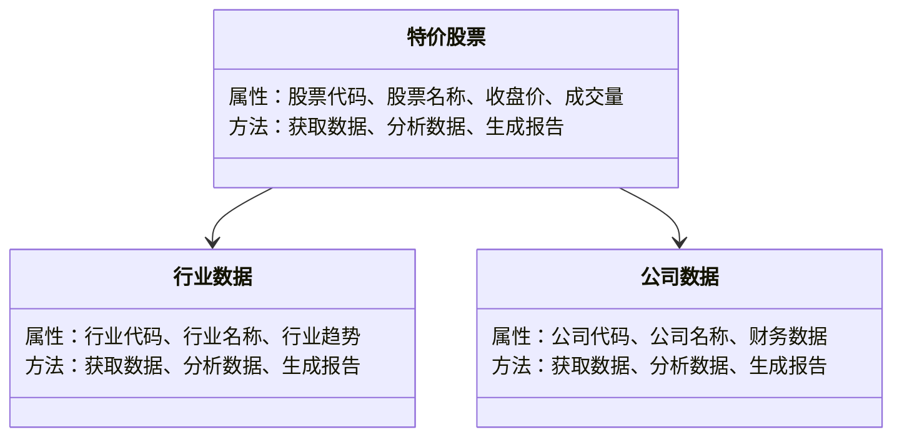
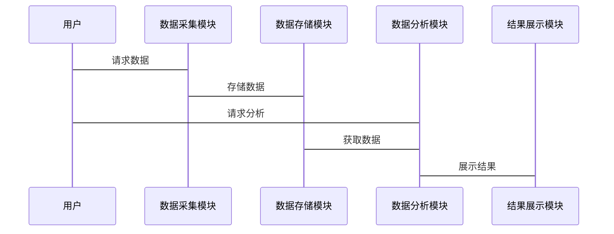

                 


# 特价股票投资中的产业互联网分析方法

> 关键词：特价股票、产业互联网、数据分析、投资策略、风险管理

> 摘要：本文深入探讨了产业互联网分析方法在特价股票投资中的应用，从背景介绍到项目实战，详细阐述了产业互联网分析方法的核心概念、算法原理、系统架构及最佳实践。通过案例分析，展示了如何利用产业互联网技术提升特价股票投资的效率和准确性。

---

# 第1章: 特价股票投资与产业互联网概述

## 1.1 特价股票的基本概念
### 1.1.1 特价股票的定义
特价股票是指价格相对较低、具有投资潜力的股票。这类股票通常属于中小型企业或处于成长期的企业，具有较高的增值空间。

### 1.1.2 特价股票的投资价值
特价股票的投资价值体现在其低估值、高成长性和潜在的高回报率。投资者可以通过分析公司基本面、行业趋势和市场环境，寻找具有投资价值的特价股票。

### 1.1.3 特价股票与普通股票的区别
- **估值**：特价股票通常估值较低，而普通股票可能已经反映市场预期。
- **风险**：特价股票风险较高，但回报潜力更大。
- **市场关注度**：特价股票可能关注度较低，而普通股票受到更多机构关注。

## 1.2 产业互联网的基本概念
### 1.2.1 产业互联网的定义
产业互联网是互联网技术与传统产业深度融合的产物，通过数字化技术改造传统产业的生产、管理、营销等环节，提升效率和竞争力。

### 1.2.2 产业互联网的核心特征
- **数据驱动**：通过数据采集、分析和应用，优化产业运营。
- **智能化**：利用人工智能和大数据技术，实现产业的智能化升级。
- **平台化**：构建开放的产业平台，促进产业链上下游的协同合作。

### 1.2.3 产业互联网与传统互联网的区别
| 特性       | 产业互联网               | 传统互联网         |
|------------|--------------------------|--------------------|
| **目标**    | 优化传统产业             | 提供信息服务       |
| **技术**    | 数据分析、人工智能       | 网络连接、信息分发 |
| **应用**    | 行业数字化、智能化       | 个人和商业服务    |

## 1.3 特价股票与产业互联网的结合
### 1.3.1 产业互联网对特价股票的影响
- **数据支持**：通过产业互联网获取企业经营数据，评估公司价值。
- **市场洞察**：利用产业互联网分析行业趋势，判断股票的投资价值。
- **风险控制**：通过实时监控和预警，降低投资风险。

### 1.3.2 特价股票投资中的产业互联网应用
- **数据采集**：从公开市场获取股票数据、行业数据和公司财务数据。
- **数据分析**：利用大数据技术分析股票走势、行业趋势和公司基本面。
- **决策支持**：基于分析结果制定投资策略，优化投资组合。

## 1.4 本章小结
本章介绍了特价股票的基本概念、投资价值及其与普通股票的区别，详细阐述了产业互联网的定义、核心特征及其与传统互联网的区别，最后探讨了产业互联网在特价股票投资中的应用和影响。

---

# 第2章: 特价股票投资的产业互联网分析方法

## 2.1 产业互联网分析方法的基本原理
### 2.1.1 数据采集与处理
- **数据来源**：股票市场数据、行业报告、公司财务报表等。
- **数据清洗**：去除噪声数据，确保数据的准确性和完整性。
- **数据存储**：使用数据库或大数据平台存储和管理数据。

### 2.1.2 数据分析与建模
- **描述性分析**：分析历史数据，识别股票价格波动规律。
- **预测性分析**：利用机器学习算法预测股票价格走势。
- **对比性分析**：比较不同股票或行业的表现，寻找投资机会。

### 2.1.3 结果可视化与决策支持
- **数据可视化**：通过图表展示数据分析结果，帮助投资者直观理解数据。
- **决策支持**：基于分析结果生成投资建议，优化投资策略。

## 2.2 产业互联网分析方法的核心要素
### 2.2.1 数据来源
- **股票市场数据**：包括开盘价、收盘价、最高价、最低价等。
- **行业数据**：包括行业趋势、政策变化、市场需求等。
- **公司数据**：包括财务报表、管理团队、公司战略等。

### 2.2.2 分析模型
- **回归分析**：用于分析股票价格与相关因素之间的关系。
- **时间序列分析**：用于预测股票价格走势。
- **机器学习模型**：包括随机森林、支持向量机等，用于分类和预测。

### 2.2.3 决策支持系统
- **系统架构**：包括数据采集、处理、分析、可视化和决策支持模块。
- **功能模块**：数据清洗、特征提取、模型训练、结果展示等。

## 2.3 产业互联网分析方法的优势
### 2.3.1 数据驱动的精准分析
- 通过大数据技术，获取海量数据，提高分析的准确性和全面性。
- 基于数据驱动的分析方法，减少人为判断的误差。

### 2.3.2 智能化决策支持
- 利用人工智能技术，构建智能决策支持系统，提高投资决策的效率和准确性。
- 通过实时监控和预警，及时发现市场风险。

### 2.3.3 实时监控与预警
- 实时监控股票价格和市场动态，及时发现异常情况。
- 基于历史数据和模型预测，提供市场预警和投资建议。

## 2.4 本章小结
本章详细介绍了产业互联网分析方法的基本原理、核心要素及其优势，为后续章节的分析和实践打下基础。

---

# 第3章: 特价股票投资中的产业互联网数据分析

## 3.1 数据采集与预处理
### 3.1.1 数据来源渠道
- **股票市场数据**：包括历史价格、成交量等。
- **行业报告**：包括行业趋势、政策变化等。
- **公司财务数据**：包括财务报表、管理团队等。

### 3.1.2 数据清洗与标准化
- **数据清洗**：去除缺失值、异常值和重复数据。
- **数据标准化**：将数据转换为统一格式，便于后续分析。

### 3.1.3 数据存储与管理
- **数据库**：使用关系型数据库存储结构化数据。
- **大数据平台**：使用Hadoop、Spark等平台存储和处理海量数据。

## 3.2 数据分析方法
### 3.2.1 描述性分析
- **数据可视化**：通过图表展示数据分布、趋势和关联关系。
- **统计分析**：计算均值、方差、相关系数等统计指标。

### 3.2.2 预测性分析
- **时间序列分析**：使用ARIMA模型预测股票价格走势。
- **机器学习模型**：使用随机森林、XGBoost等算法进行预测。

### 3.2.3 对比性分析
- **行业对比**：比较不同行业股票的表现，寻找投资机会。
- **公司对比**：比较同一行业内的不同公司，选择具有竞争优势的公司。

## 3.3 数据可视化与解读
### 3.3.1 数据可视化工具
- **Matplotlib**：用于生成各种图表。
- **Plotly**：用于交互式数据可视化。
- **Tableau**：用于生成动态数据仪表盘。

### 3.3.2 数据图表的解读
- **K线图**：展示股票价格的波动情况。
- **散点图**：展示数据之间的关联关系。
- **热力图**：展示数据的分布情况。

### 3.3.3 数据驱动的决策支持
- **投资建议**：基于数据分析结果，生成投资建议。
- **风险预警**：通过实时监控，及时发现市场风险。

## 3.4 本章小结
本章详细介绍了特价股票投资中的数据采集与预处理方法，分析方法和数据可视化技术，为后续的项目实战奠定基础。

---

# 第4章: 产业互联网分析方法在特价股票投资中的应用

## 4.1 产业链分析
### 4.1.1 产业链的定义与分析方法
- **产业链**：从上游供应商到下游消费者的整个价值链。
- **分析方法**：通过分析产业链各环节的竞争力，评估公司的市场地位。

### 4.1.2 产业链对特价股票的影响
- **上游供应商**：原材料价格波动对公司的成本影响。
- **下游需求**：市场需求变化对公司的销售影响。
- **行业竞争**：行业内竞争格局对公司的盈利能力影响。

### 4.1.3 产业链分析的步骤与工具
- **步骤**：数据采集、数据分析、结果解读。
- **工具**：Excel、Tableau、Python等。

## 4.2 竞争对手分析
### 4.2.1 竞争对手分析的定义
- **竞争对手分析**：通过分析竞争对手的市场策略、产品特点、财务状况等，评估公司在行业中的竞争优势。

### 4.2.2 竞争对手分析的方法
- **SWOT分析**：评估公司的优势、劣势、机会和威胁。
- **市场份额分析**：分析公司在市场中的占有率及竞争对手的市场份额。

### 4.2.3 竞争对手分析的工具
- **Excel**：用于数据整理和分析。
- **Python**：用于数据清洗和建模。
- **Tableau**：用于数据可视化。

## 4.3 市场趋势预测
### 4.3.1 市场趋势预测的定义
- **市场趋势预测**：通过分析历史数据和市场动态，预测未来市场走势。

### 4.3.2 市场趋势预测的方法
- **时间序列分析**：使用ARIMA模型预测市场走势。
- **机器学习模型**：使用随机森林、XGBoost等算法进行预测。

### 4.3.3 市场趋势预测的工具
- **Python**：用于数据清洗、建模和预测。
- **TensorFlow**：用于深度学习模型的训练。
- **Tableau**：用于结果的可视化展示。

## 4.4 本章小结
本章详细介绍了产业互联网分析方法在特价股票投资中的应用，包括产业链分析、竞争对手分析和市场趋势预测，为投资者提供了科学的决策支持。

---

# 第5章: 特价股票投资中的产业互联网系统架构设计

## 5.1 项目介绍
### 5.1.1 项目背景
- **背景**：随着互联网技术的发展，产业互联网在股票投资中的应用越来越广泛。
- **目标**：构建一个基于产业互联网的股票投资分析系统，帮助投资者进行精准的投资决策。

## 5.2 系统功能设计
### 5.2.1 领域模型


### 5.2.2 系统架构


### 5.2.3 系统接口设计
- **数据接口**：提供API接口，供外部系统调用数据。
- **用户接口**：提供友好的用户界面，方便用户操作。
- **结果接口**：提供分析结果的输出接口，供其他系统调用。

### 5.2.4 系统交互


## 5.3 本章小结
本章详细介绍了特价股票投资中的产业互联网系统架构设计，包括领域模型、系统架构、接口设计和系统交互，为后续的项目实战奠定基础。

---

# 第6章: 特价股票投资中的产业互联网项目实战

## 6.1 环境安装
### 6.1.1 系统需求
- **操作系统**：Windows、Linux或MacOS。
- **Python版本**：Python 3.6及以上。
- **工具安装**：安装Python、Jupyter Notebook、Pandas、Matplotlib、Scikit-learn等。

### 6.1.2 数据源获取
- **股票数据**：从Yahoo Finance获取历史数据。
- **行业数据**：从公开报告和数据库获取行业趋势数据。
- **公司数据**：从公司财报和新闻中获取公司基本面数据。

## 6.2 系统核心实现
### 6.2.1 数据清洗与处理
```python
import pandas as pd

# 读取数据
data = pd.read_csv('stock_data.csv')

# 删除缺失值
data.dropna(inplace=True)

# 去除重复数据
data.drop_duplicates(inplace=True)

# 标准化数据
data['收盘价'] = data['收盘价'].astype(float)
```

### 6.2.2 数据分析与建模
```python
from sklearn.ensemble import RandomForestRegressor
import numpy as np

# 特征选择
features = ['开盘价', '收盘价', '最高价', '最低价', '成交量']
target = '收盘价'

# 训练模型
model = RandomForestRegressor()
model.fit(data[features], data[target])

# 预测结果
predicted_price = model.predict(new_data[features])
```

### 6.2.3 结果可视化
```python
import matplotlib.pyplot as plt

plt.figure(figsize=(10,6))
plt.plot(data['日期'], data['收盘价'], label='实际价格')
plt.plot(data['日期'], model.predict(data[features]), label='预测价格')
plt.xlabel('日期')
plt.ylabel('价格')
plt.legend()
plt.show()
```

## 6.3 实际案例分析
### 6.3.1 案例背景
- **公司名称**：某科技公司
- **股票代码**：XXX
- **行业**：科技行业

### 6.3.2 数据分析
```python
import pandas as pd
import matplotlib.pyplot as plt

# 数据获取
data = pd.read_csv('xxx.csv')

# 数据清洗
data.dropna(inplace=True)

# 数据分析
print(data.describe())
data.hist(bins=10)
plt.show()
```

### 6.3.3 投资建议
- **短期投资**：建议投资者短期内关注公司的技术创新和市场需求。
- **长期投资**：建议投资者长期关注公司的财务状况和行业趋势。

## 6.4 本章小结
本章通过实际案例分析，展示了产业互联网分析方法在特价股票投资中的应用，包括环境安装、系统实现、结果可视化和投资建议。

---

# 第7章: 产业互联网分析方法的进阶与扩展

## 7.1 算法优化与扩展
### 7.1.1 算法优化
- **超参数调优**：通过网格搜索优化模型性能。
- **集成学习**：通过集成学习提高模型的准确性和稳定性。

### 7.1.2 深度学习应用
- **神经网络模型**：使用LSTM进行时间序列预测。
- **深度学习框架**：使用TensorFlow、Keras等框架进行模型训练。

## 7.2 风险管理与控制
### 7.2.1 风险管理策略
- **分散投资**：通过分散投资降低风险。
- **止损策略**：设定止损点，避免亏损过大。

### 7.2.2 风险预警系统
- **实时监控**：通过实时监控股票价格和市场动态，及时发现风险。
- **预警机制**：基于模型预测结果，提供风险预警和投资建议。

## 7.3 案例分析与总结
### 7.3.1 案例分析
- **案例背景**：某公司股票的投资分析。
- **分析过程**：数据采集、清洗、建模、预测和可视化。
- **结果解读**：基于分析结果制定投资策略。

### 7.3.2 总结与反思
- **总结**：产业互联网分析方法在特价股票投资中的优势和局限性。
- **反思**：如何进一步优化分析方法，提高投资决策的准确性和效率。

## 7.4 本章小结
本章通过算法优化、风险管理、案例分析和总结，进一步探讨了产业互联网分析方法在特价股票投资中的进阶应用和未来发展方向。

---

# 作者信息

作者：AI天才研究院/AI Genius Institute & 禅与计算机程序设计艺术/Zen And The Art of Computer Programming

---

以上是《特价股票投资中的产业互联网分析方法》的技术博客文章的完整目录和内容框架。

