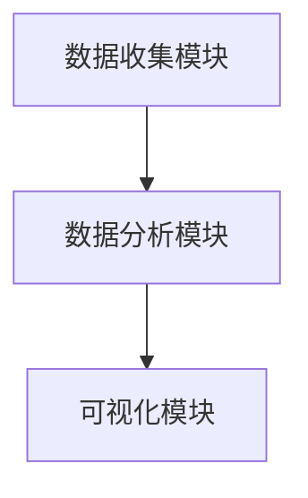
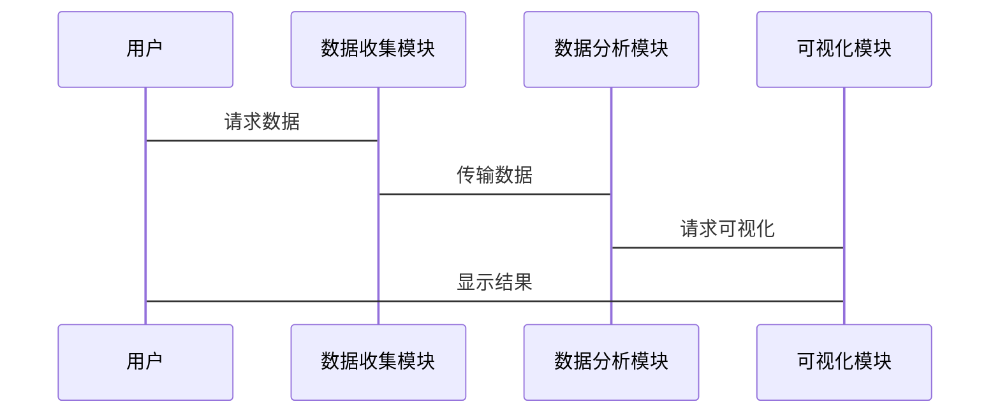

                 


# 特价股票投资中的产业链分析方法

> 关键词：特价股票投资、产业链分析、股票投资策略、产业链结构、股票分析方法

> 摘要：本文将详细介绍特价股票投资中的产业链分析方法，从背景介绍、核心概念、算法原理、系统分析与架构设计、项目实战到最佳实践，深入剖析产业链分析在特价股票投资中的应用，为投资者提供科学的分析框架和实用的工具。

---

## 第一部分: 特价股票投资中的产业链分析方法概述

### 第1章: 特价股票投资与产业链分析的背景

#### 1.1 特价股票投资的基本概念

##### 1.1.1 什么是特价股票
特价股票通常指在特定市场条件下价格被低估的股票，这些股票可能因为市场波动、公司短期困境或其他因素而被市场忽视，但具有长期增值潜力。特价股票的核心特征是价格与内在价值的不匹配，为投资者提供了套利机会。

##### 1.1.2 特价股票的市场特点
- **价格波动性**：特价股票的价格往往波动较大，既有上涨的潜力，也有下跌的风险。
- **市场关注度低**：这些股票通常不在主流投资者的关注范围内，因此信息不对称的机会较多。
- **低估值**：特价股票的市场价格往往低于其内在价值，为长期投资者提供了安全边际。

##### 1.1.3 特价股票投资的潜在收益与风险
- **潜在收益**：通过挖掘市场低估的股票，投资者可以在市场重新评估时获得超额收益。
- **风险**：包括市场波动风险、公司基本面恶化风险以及信息不对称带来的选股难度。

#### 1.2 产业链分析的基本概念

##### 1.2.1 产业链的定义与分类
产业链是指一系列相关的生产、分配和消费环节的集合，可以分为上游、中游和下游。上游通常指原材料供应，中游是加工和制造，下游是销售和消费。

##### 1.2.2 产业链分析的重要性
- **行业结构分析**：帮助投资者理解行业的竞争格局和关键环节。
- **风险分散**：通过分析产业链上下游的关系，投资者可以更好地分散风险。
- **投资机会发现**：产业链分析能够发现行业中的优势企业，从而为投资决策提供依据。

#### 1.3 特价股票与产业链分析的结合

##### 1.3.1 特价股票投资中的产业链视角
通过分析产业链的结构，投资者可以发现那些在产业链中占据关键位置，但市场价格被低估的公司。

##### 1.3.2 产业链分析对特价股票投资的指导意义
- **识别行业周期**：了解行业的周期性变化，帮助投资者判断特价股票的潜在价值。
- **评估企业竞争力**：通过分析产业链中的位置，评估企业的竞争优势和劣势。
- **发现投资机会**：在产业链中寻找那些被市场忽视但具有成长潜力的企业。

#### 1.4 本章小结
- 特价股票投资的核心是寻找价格被低估的股票。
- 产业链分析为投资者提供了行业结构和企业竞争力的视角。
- 两者的结合能够帮助投资者更好地发现投资机会，降低投资风险。

---

## 第二部分: 特价股票产业链分析的核心概念与联系

### 第2章: 特价股票产业链分析的核心要素

#### 2.1 产业链分析的核心要素

##### 2.1.1 产业链的上游、中游和下游
- **上游**：原材料供应商，如钢铁厂、化工厂等。
- **中游**：制造企业，如汽车厂、电子设备厂等。
- **下游**：销售和消费终端，如零售店、消费者等。

##### 2.1.2 产业链的关键环节与节点
- **关键环节**：产业链中对最终产品价值贡献最大的环节。
- **节点企业**：在关键环节中占据重要地位的企业。

##### 2.1.3 产业链的竞争力分析
- **成本优势**：企业是否在产业链中具有成本优势。
- **技术壁垒**：企业是否拥有独特的技术或专利。
- **市场占有率**：企业在行业中的市场地位。

#### 2.2 特价股票产业链的结构与特点

##### 2.2.1 特价股票产业链的典型结构
- **上游原材料企业**：如钢铁厂、煤炭厂等，通常属于周期性行业，市场价格波动较大。
- **中游制造企业**：如汽车厂、电子设备厂等，受上游成本和下游需求的双重影响。
- **下游销售企业**：如零售店、经销商等，受终端需求影响较大。

##### 2.2.2 特价股票产业链的上下游关系
- **协同效应**：上游和中游、中游和下游之间的协同合作。
- **价格传导机制**：上游原材料价格的波动会传导到中游和下游。

##### 2.2.3 特价股票产业链的核心竞争力
- **成本控制能力**：企业能否在产业链中有效控制成本。
- **技术创新能力**：企业能否通过技术创新提升竞争力。
- **市场响应能力**：企业能否快速适应市场需求变化。

#### 2.3 产业链分析与股票投资的关系

##### 2.3.1 产业链分析对股票投资的指导作用
- **行业定位**：通过分析产业链，投资者可以更好地理解行业的定位和竞争格局。
- **投资决策**：产业链分析能够帮助投资者识别行业中的优势企业和风险点。
- **风险控制**：通过分析产业链的上下游关系，投资者可以更好地分散投资风险。

##### 2.3.2 产业链分析在股票投资中的应用案例
- **案例1**：假设某上游原材料企业因原材料价格下降而被市场低估，投资者可以通过产业链分析发现其潜在价值。
- **案例2**：某中游制造企业在行业内具有较高的市场占有率和技术优势，但因市场波动被低估，投资者可以通过产业链分析发现其投资价值。

##### 2.3.3 产业链分析的局限性与注意事项
- **信息不对称**：产业链分析依赖于公开信息，可能存在信息不对称的问题。
- **市场假设**：分析结果基于假设市场有效性的前提，实际市场中可能存在无效的情况。
- **动态变化**：产业链结构可能会因市场环境的变化而发生调整，投资者需要持续关注。

#### 2.4 本章小结
- 特价股票产业链分析的核心要素包括上游、中游和下游的关键环节。
- 产业链分析能够帮助投资者识别行业中的优势企业，发现投资机会。
- 产业链分析的局限性需要注意，投资者需要结合其他分析方法进行综合判断。

---

## 第三部分: 特价股票产业链分析的系统架构与算法

### 第3章: 特价股票产业链分析的算法原理

#### 3.1 产业链分析的算法

##### 3.1.1 层次分析法（AHP）
- **定义**：层次分析法是一种将复杂决策问题分解为多个因素，并通过比较判断来确定各因素权重的方法。
- **步骤**：
  1. 建立层次结构。
  2. 构造比较矩阵。
  3. 计算权重。
  4. 进行一致性检验。
- **应用场景**：用于评估企业竞争力时，可以将企业分为多个维度（如成本、技术、市场占有率等），并使用层次分析法计算各维度的权重。

##### 3.1.2 网络分析法（NA）
- **定义**：网络分析法是通过分析网络的结构和节点之间的关系，评估节点的重要性的方法。
- **步骤**：
  1. 构建网络图。
  2. 计算节点的度数和中心性。
  3. 确定关键节点。
- **应用场景**：用于分析产业链中的关键环节和节点企业。

##### 3.1.3 其他算法
- **支持向量机（SVM）**：用于分类问题，可以将股票分为高价和低价两类。
- **随机森林**：用于特征选择和分类，可以识别影响股票价格的关键因素。

#### 3.2 算法实现

##### 3.2.1 层次分析法的Python实现

```python
import numpy as np

def calculate_weights(matrix):
    # 计算特征向量
    n = len(matrix)
    weight = np.mean(matrix, axis=0)
    # 归一化权重
    weight = weight / np.sum(weight)
    return weight

# 示例比较矩阵
matrix = np.array([[1, 3, 2],
                    [1/3, 1, 2],
                    [1/2, 1/2, 1]])

weights = calculate_weights(matrix)
print("权重为:", weights)
```

##### 3.2.2 网络分析法的Python实现

```python
import networkx as nx

# 创建网络图
G = nx.Graph()
G.add_edges_from([('A', 'B'), ('B', 'C'), ('A', 'C')])

# 计算节点的度数
degree = nx.degree(G)
print("度数:", degree)

# 计算中心性
centrality = nx.betweenness_centrality(G)
print("中心性:", centrality)
```

---

### 第4章: 特价股票产业链分析的系统架构设计

#### 4.1 项目介绍
- **项目目标**：通过分析产业链的结构，识别特价股票中的投资机会。
- **项目范围**：涵盖上游、中游和下游的产业链分析。

#### 4.2 系统功能设计

##### 4.2.1 数据收集模块
- **功能**：收集产业链相关数据，包括企业信息、市场价格、财务数据等。
- **工具**：使用爬虫技术从公开数据源获取数据。

##### 4.2.2 数据分析模块
- **功能**：使用层次分析法和网络分析法对数据进行分析，评估企业的竞争力。
- **工具**：使用Python的scikit-learn和networkx库。

##### 4.2.3 可视化模块
- **功能**：将分析结果可视化，包括网络图、层次结构图等。
- **工具**：使用Matplotlib和Plotly进行可视化。

#### 4.3 系统架构设计

##### 4.3.1 系统架构图


#### 4.4 系统接口设计
- **数据接口**：与数据源进行交互，获取企业数据。
- **用户接口**：提供用户友好的界面，展示分析结果。

#### 4.5 系统交互流程



---

## 第五部分: 项目实战与最佳实践

### 第5章: 项目实战

#### 5.1 环境安装
- **Python**：安装Anaconda或Miniconda。
- **依赖库**：安装numpy、pandas、networkx、scikit-learn、matplotlib。

#### 5.2 核心代码实现

##### 5.2.1 层次分析法实现

```python
import numpy as np

def calculate_weights(matrix):
    n = len(matrix)
    weight = np.mean(matrix, axis=0)
    weight = weight / np.sum(weight)
    return weight

matrix = np.array([[1, 3, 2],
                    [1/3, 1, 2],
                    [1/2, 1/2, 1]])

weights = calculate_weights(matrix)
print("权重为:", weights)
```

##### 5.2.2 网络分析法实现

```python
import networkx as nx

G = nx.Graph()
G.add_edges_from([('A', 'B'), ('B', 'C'), ('A', 'C')])

degree = nx.degree(G)
centrality = nx.betweenness_centrality(G)

print("度数:", degree)
print("中心性:", centrality)
```

#### 5.3 代码应用解读与分析
- **层次分析法**：通过比较矩阵计算各因素的权重，帮助投资者识别影响股票价格的关键因素。
- **网络分析法**：通过分析网络结构，识别产业链中的关键环节和节点企业。

#### 5.4 实际案例分析
- **案例分析**：假设某上游原材料企业因原材料价格下降而被市场低估，投资者可以通过层次分析法和网络分析法发现其潜在价值。

#### 5.5 项目小结
- 项目实现了产业链分析的核心算法。
- 通过实际案例分析，验证了算法的有效性。

---

## 第六部分: 最佳实践与总结

### 第6章: 最佳实践

#### 6.1 小结
- 产业链分析为特价股票投资提供了科学的分析框架。
- 投资者可以通过层次分析法和网络分析法发现投资机会。

#### 6.2 注意事项
- **数据质量**：确保数据来源可靠。
- **模型局限性**：注意模型的假设和局限性。
- **持续监控**：市场环境不断变化，需要持续监控产业链的变化。

#### 6.3 拓展阅读
- **推荐书籍**：《投资学基础》、《供应链管理》
- **推荐网站**：东方财富网、同花顺财经

---

## 作者：AI天才研究院/AI Genius Institute & 禅与计算机程序设计艺术 /Zen And The Art of Computer Programming

