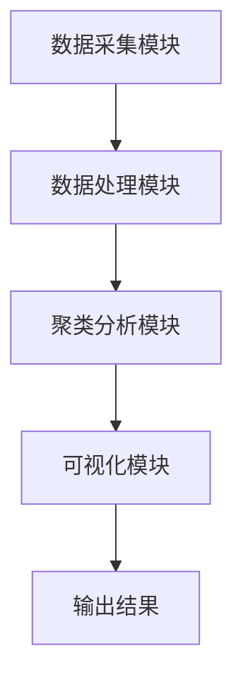

                 


# 特价股票投资中的产业集群分析方法

> 关键词：特价股票投资、产业集群分析、聚类算法、系统架构、数据可视化

> 摘要：本文详细探讨了在特价股票投资中，如何通过产业集群分析方法来优化投资决策。文章首先介绍了特价股票投资和产业集群的基本概念，接着分析了产业集群的构成要素及其对投资的影响。随后，详细阐述了基于聚类算法的产业集群分析方法，并通过系统架构设计和实际案例分析，展示了如何将这些理论应用于实际投资中。最后，总结了产业集群分析在投资中的应用价值，并提出了进一步研究的方向。

---

## 第一章：特价股票投资与产业集群分析的背景

### 1.1 特价股票投资的定义与特点

#### 1.1.1 特价股票的定义
特价股票是指在特定市场环境下，价格低于其内在价值的股票。这类股票通常被市场低估，具有较大的增长潜力。投资者通过分析公司的基本面、行业地位和市场趋势，寻找具有投资价值的特价股票。

#### 1.1.2 特价股票投资的市场特征
- **低估值**：市场价格低于内在价值。
- **高潜力**：公司具有增长潜力，未来可能有较高的回报。
- **风险与机会并存**：特价股票往往伴随着较高的市场波动和不确定性。

#### 1.1.3 特价股票投资的策略与目标
- **价值投资**：寻找被市场低估的公司。
- **成长投资**：关注具有增长潜力的公司。
- **短期套利**：利用市场波动进行短期获利。

### 1.2 产业集群的定义与特点

#### 1.2.1 产业集群的定义
产业集群是指在地理上相对集中、生产同类或相关产品的企业群体。产业集群通常具有较强的互补性和协同效应，能够降低生产成本，提高效率。

#### 1.2.2 产业集群的核心特征
- **地理集中**：企业集中在特定区域。
- **产业关联**：企业之间存在上下游关系或协同效应。
- **竞争优势**：集群通常具有成本优势或技术创新能力。

#### 1.2.3 产业集群与经济发展的关系
- **促进区域经济发展**：产业集群通过专业化分工和协同效应，推动区域经济增长。
- **提高企业竞争力**：集群内的企业能够共享资源，降低生产成本，提高效率。
- **推动技术创新**：集群内的企业更容易获得技术合作和创新资源。

### 1.3 特价股票投资中的产业集群分析意义

#### 1.3.1 产业集群对投资决策的影响
- **行业集中度**：产业集群能够反映行业集中度，帮助投资者判断行业竞争格局。
- **区域经济影响**：产业集群的地理分布能够帮助投资者判断区域经济的潜力。
- **企业协同效应**：产业集群内的企业之间可能存在协同效应，增强企业的竞争力。

#### 1.3.2 产业集群分析在投资中的应用价值
- **发现投资机会**：通过分析产业集群，投资者可以发现具有增长潜力的行业或企业。
- **降低投资风险**：产业集群的分析能够帮助投资者识别行业风险，避免投资过于分散。
- **提高投资效率**：通过产业集群分析，投资者可以更高效地筛选投资标的。

#### 1.3.3 产业集群分析的边界与外延
- **边界**：产业集群分析的边界在于企业的地理分布和产业关联程度。
- **外延**：产业集群分析的外延包括企业间的协同效应、区域经济发展和技术创新能力。

---

## 第二章：产业集群分析的核心概念与联系

### 2.1 核心概念原理

#### 2.1.1 产业集群的构成要素
- **地理位置**：企业的地理分布。
- **产业关联**：企业之间的上下游关系。
- **企业规模**：企业的规模和市场份额。
- **竞争优势**：企业的核心竞争力和技术创新能力。

#### 2.1.2 产业集群的形成机制
- **规模经济**：企业通过集中生产降低成本。
- **协同效应**：企业之间通过合作提高效率。
- **网络效应**：产业集群形成的网络效应能够吸引更多的企业加入。

#### 2.1.3 产业集群的生命周期
- **形成阶段**：产业集群的初步形成。
- **成长阶段**：产业集群逐步扩大，企业数量增加。
- **成熟阶段**：产业集群达到稳定，企业间竞争加剧。
- **衰退阶段**：产业集群因市场变化或竞争压力逐渐衰退。

### 2.2 核心概念属性特征对比表

| 特性        | 特价股票投资         | 产业集群分析         |
|-------------|--------------------|---------------------|
| 定义        | 价格低于内在价值的股票 | 地理集中且产业关联的企业群体 |
| 核心目标    | 获取超额收益         | 提高区域经济竞争力   |
| 分析方法    | 基本面分析、技术分析 | 聚类分析、网络分析   |
| 应用价值    | 发现投资机会         | 优化资源配置、降低风险 |

### 2.3 ER实体关系图架构

```mermaid
erDiagram
    actor 投资者 {
        <field> string 姓名
        <field> integer 账户余额
    }
    actor 企业 {
        <field> string 名称
        <field> string 所属行业
    }
    actor 区域 {
        <field> string 名称
        <field> string 经济指标
    }
    cluster 产业集群 {
        <field> string 名称
        <field> integer 企业数量
    }
    relation 属于 {
        投资者 --> 产业集群 : 投资
        企业 --> 产业集群 : 所属
        区域 --> 产业集群 : 分布
    }
```

---

## 第三章：产业集群分析的算法原理

### 3.1 聚类分析算法

#### 3.1.1 K-means算法

K-means算法是一种常用的聚类算法，适用于将数据划分为K个簇的情况。

**步骤如下：**
1. **初始化**：随机选择K个簇中心。
2. **分配**：将每个数据点分配到最近的簇中心。
3. **更新**：计算每个簇的新的中心。
4. **收敛**：重复分配和更新步骤，直到簇中心不再变化。

**Python实现示例：**

```python
from sklearn.cluster import KMeans

# 初始化模型
kmeans = KMeans(n_clusters=3, random_state=0)

# 训练模型
clusters = kmeans.fit_predict(X)
```

**数学公式：**
- 距离公式：$$d(x_i, c_j) = \sqrt{\sum_{k=1}^{n}(x_{i,k} - c_{j,k})^2}$$
- 目标函数：$$J = \sum_{i=1}^{n} \sum_{j=1}^{K} d(x_i, c_j)^2$$

#### 3.1.2 层次聚类算法

层次聚类是一种基于层次结构的聚类方法，适用于数据的层次化划分。

**步骤如下：**
1. **初始化**：将每个数据点视为一个簇。
2. **合并**：根据相似度计算，逐步合并最相似的簇。
3. **构建树状结构**：形成层次化的簇结构。

**Python实现示例：**

```python
from scipy.cluster.hierarchy import linkage, dendrogram

# 初始化模型
Z = linkage(X, 'ward')

# 绘制树状图
dendrogram(Z)
plt.show()
```

---

## 第四章：产业集群分析的系统架构设计

### 4.1 问题场景介绍

产业集群分析系统旨在通过数据采集、处理和分析，帮助投资者识别具有投资价值的产业集群。

### 4.2 系统功能设计

#### 4.2.1 数据采集模块
- 采集股票数据、企业信息和区域经济指标。
- 数据源包括股票市场数据和企业财报。

#### 4.2.2 数据处理模块
- 数据清洗：处理缺失值和异常值。
- 特征提取：提取企业规模、行业地位等特征。

#### 4.2.3 聚类分析模块
- 应用K-means或层次聚类算法，识别产业集群。
- 输出产业集群的分布和企业数量。

#### 4.2.4 可视化模块
- 绘制产业集群分布图。
- 可视化企业间的关联关系。

### 4.3 系统架构设计



---

## 第五章：产业集群分析的项目实战

### 5.1 项目环境安装

- **Python版本**：Python 3.8及以上。
- **依赖库安装**：`pip install numpy pandas scikit-learn matplotlib`

### 5.2 核心代码实现

```python
import pandas as pd
from sklearn.cluster import KMeans
import matplotlib.pyplot as plt

# 数据加载
data = pd.read_csv('clusters_data.csv')

# 特征选择
X = data[['企业数量', '区域GDP', '行业集中度']]

# K-means聚类
kmeans = KMeans(n_clusters=4, random_state=0)
clusters = kmeans.fit_predict(X)

# 可视化
plt.scatter(data['企业数量'], data['区域GDP'], c=clusters, cmap='viridis')
plt.xlabel('企业数量')
plt.ylabel('区域GDP')
plt.show()
```

### 5.3 案例分析与解读

- **数据来源**：某区域内的企业数据。
- **分析结果**：识别出4个产业集群。
- **投资建议**：重点关注高潜力的产业集群。

---

## 第六章：总结与展望

### 6.1 总结

产业集群分析方法为特价股票投资提供了新的视角，帮助投资者发现具有增长潜力的行业和企业。通过聚类分析和系统设计，投资者能够更高效地进行投资决策。

### 6.2 展望

未来的研究可以进一步探索产业集群的动态变化，结合实时数据和机器学习算法，提升分析的准确性和及时性。

---

作者：AI天才研究院 & 禅与计算机程序设计艺术

