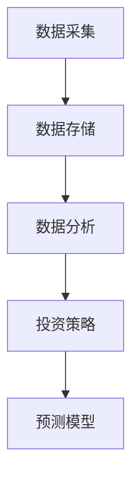
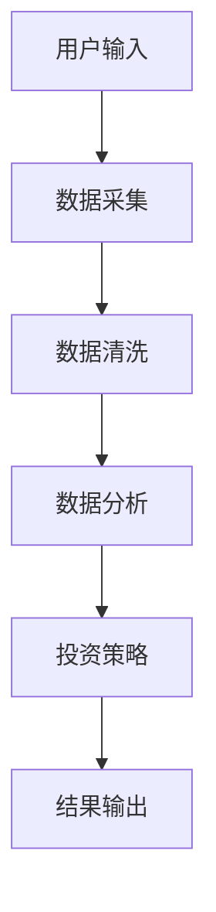

                 

# 特价股票投资中的人口结构数字代际转移趋势考量

> 关键词：特价股票、人口结构、数字代际转移、投资趋势、大数据分析

> 摘要：本文深入探讨了人口结构变化和数字代际转移趋势对特价股票投资的影响。通过分析不同年龄段的投资行为和消费习惯，结合大数据和数学模型，提出了基于人口结构变化的股票投资策略。文章还详细介绍了系统架构设计和项目实现，为投资者提供了实践指导。

---

## 第1章: 背景介绍

### 1.1 人口结构与股票投资的关系

#### 1.1.1 人口结构的定义与分类

人口结构是指一个国家或地区内不同年龄段人口的分布情况。通常将人口分为以下几类：

- **年轻人口**：20岁以下，消费能力较低，投资意识较弱。
- **中年人口**：20-50岁，消费能力强，投资意识高。
- **老年人口**：50岁以上，消费能力下降，注重稳健投资。

#### 1.1.2 人口结构对经济和投资的影响

人口结构的变化直接影响经济发展的潜力和方向。例如：

- **年轻人口比例高**：经济活力强，消费和投资需求旺盛。
- **中年人口比例高**：注重资产保值，倾向于投资股票、基金等。
- **老年人口比例高**：注重风险控制，偏好低风险投资。

#### 1.1.3 数字代际转移趋势的背景

随着互联网和数字化技术的普及，不同年龄段的人口在信息获取和投资行为上呈现出显著差异。数字代际转移趋势指的是年轻一代通过数字化工具影响中老年一代的投资行为。

---

## 第2章: 人口结构对股票投资的核心影响

### 2.1 不同年龄段的消费与投资行为

#### 2.1.1 年轻人群体的投资偏好

- 年轻人更倾向于高风险高回报的投资方式，如科技股、创业板股票。
- 受数字化影响，年轻人更依赖互联网进行投资决策。

#### 2.1.2 中年人群体的投资行为

- 中年人注重资产保值，倾向于投资蓝筹股、红利股。
- 更关注宏观经济指标和公司基本面。

#### 2.1.3 老龄人群体的投资特点

- 老年人更倾向于低风险投资，如国债、银行理财产品。
- 受数字代际转移影响，部分老年人开始尝试互联网投资工具。

### 2.2 数字代际转移趋势对投资的影响

#### 2.2.1 数字化时代的投资行为变化

- 投资者更依赖数据分析和互联网工具。
- 数字技术降低了投资门槛，吸引更多年轻人参与。

#### 2.2.2 代际差异对投资策略的影响

- 年轻人更注重技术驱动的行业，如人工智能、区块链。
- 中老年人更注重传统行业，如金融、能源。

#### 2.2.3 数字技术对股票市场的推动作用

- 数字技术提高了市场的流动性。
- 互联网金融平台降低了投资门槛。

---

## 第3章: 人口结构变化的数学模型与分析

### 3.1 人口结构变化的数学模型

#### 3.1.1 人口结构指数的构建

定义人口结构指数（PSI）为：

$$ PSI = \sum_{i=1}^{n} w_i \cdot p_i $$

其中，$w_i$ 是第 $i$ 个年龄段的权重，$p_i$ 是第 $i$ 个年龄段的人口比例。

#### 3.1.2 人口结构变化的时间序列分析

通过ARIMA模型预测人口结构变化趋势：

$$ ARIMA(p, d, q) $$

其中，$p$ 是自回归阶数，$d$ 是差分阶数，$q$ 是移动平均阶数。

#### 3.1.3 人口结构与股票市场的相关性分析

计算人口结构指数与股票指数的相关系数：

$$ r = \frac{\sum (x_i - \bar{x})(y_i - \bar{y})}{\sqrt{\sum (x_i - \bar{x})^2 \sum (y_i - \bar{y})^2}} $$

---

## 第4章: 基于大数据的人口结构分析

### 4.1 数据采集与处理

#### 4.1.1 数据来源与采集方法

- 数据来源：政府统计年鉴、股票交易所数据、互联网投资平台数据。
- 数据采集：使用爬虫技术从互联网获取投资行为数据。

#### 4.1.2 数据清洗与预处理

- 去重、填充缺失值、异常值处理。

#### 4.1.3 数据存储与管理

- 使用数据库（如MySQL）存储结构化数据，使用Hadoop存储海量数据。

### 4.2 数据分析与挖掘

#### 4.2.1 数据可视化分析

- 使用Matplotlib和Seaborn进行人口结构可视化。

#### 4.2.2 人口结构特征提取

- 使用PCA提取主要人口结构特征。

#### 4.2.3 代际转移趋势的预测模型

- 使用LSTM进行时间序列预测：

$$ LSTM(t) = \sigma(g \cdot \text{遗忘门} + h \cdot \text{输入门}) $$

---

## 第5章: 代际投资行为分析

### 5.1 不同代际群体的投资行为特征

#### 5.1.1 年轻一代的投资行为

- 偏好高增长行业，如科技、互联网。
- 更依赖数字化工具进行投资决策。

#### 5.1.2 中年一代的投资行为

- 偏好稳定行业，如金融、能源。
- 更关注宏观经济指标。

#### 5.1.3 老年一代的投资行为

- 偏好低风险投资，如债券、银行理财。
- 受数字代际转移影响，开始尝试互联网投资工具。

### 5.2 代际转移对股票市场的影响

#### 5.2.1 代际转移对市场流动性的影响

- 数字代际转移增加了市场的流动性。

#### 5.2.2 代际转移对市场结构的影响

- 年轻一代推动科技股上涨，中老年人推动蓝筹股上涨。

#### 5.2.3 代际转移对市场波动性的影响

- 数字化工具的应用降低了市场的波动性。

---

## 第6章: 系统架构与技术实现

### 6.1 系统架构设计

#### 6.1.1 系统功能模块划分

- 数据采集模块
- 数据分析模块
- 投资策略模块
- 预测模型模块

#### 6.1.2 系统架构图

#### 6.1.3 系统数据流图

### 6.2 算法实现

#### 6.2.1 数据预处理算法

- 使用Python的Pandas库进行数据清洗。

#### 6.2.2 人口结构分析算法

- 使用Python的Scikit-learn库进行特征提取。

#### 6.2.3 代际转移趋势预测算法

- 使用Keras库进行LSTM模型训练。

---

## 第7章: 项目实战与案例分析

### 7.1 环境搭建与数据采集

#### 7.1.1 开发环境配置

- 安装Python、Jupyter Notebook、Pandas、Matplotlib。

#### 7.1.2 数据源选择与采集

- 使用爬虫技术从互联网获取投资行为数据。

#### 7.1.3 数据预处理与存储

- 使用MySQL数据库存储数据。

### 7.2 系统核心实现

#### 7.2.1 数据分析模块实现

- 使用Matplotlib绘制人口结构图。

#### 7.2.2 投资策略模块实现

- 编写Python脚本进行投资策略模拟。

#### 7.2.3 预测模型实现

- 使用Keras训练LSTM模型。

### 7.3 案例分析与结果解读

#### 7.3.1 案例背景与数据来源

- 以中国A股市场为例，分析不同年龄段投资者对科技股的影响。

#### 7.3.2 数据分析与结果展示

- 使用可视化工具展示人口结构与股票价格的相关性。

#### 7.3.3 投资策略优化

- 根据人口结构变化调整投资组合。

---

## 第8章: 总结与展望

### 8.1 总结

本文通过分析人口结构变化和数字代际转移趋势，提出了基于大数据的特价股票投资策略。通过数学模型和系统实现，为投资者提供了实践指导。

### 8.2 展望

未来，随着技术的发展，人口结构变化对投资的影响将更加显著。建议投资者密切关注人口结构变化，灵活调整投资策略。

---

## 作者信息

作者：AI天才研究院/AI Genius Institute & 禅与计算机程序设计艺术 /Zen And The Art of Computer Programming

---

以上是完整的技术博客文章结构，涵盖了从背景介绍到系统实现的各个方面。

