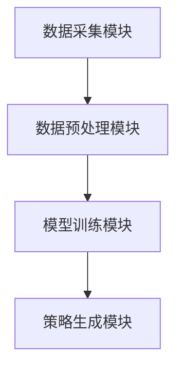

                 


# 特价股票投资中的人工智能应用

## 关键词：人工智能、股票投资、机器学习、深度学习、LSTM网络、投资策略、风险管理

## 摘要：本文深入探讨了人工智能在特价股票投资中的应用，从背景、核心概念、算法原理到系统架构和实战案例，全面分析了如何利用AI技术提升股票投资的效率和准确性。通过详细讲解线性回归、LSTM网络等算法，结合系统架构设计和项目实战，为读者提供了从理论到实践的完整指南。

---

## 第一部分：特价股票投资中的AI应用背景与基础

### 第1章：特价股票投资概述

#### 1.1 特价股票的定义与特点

##### 1.1.1 特价股票的定义
特价股票指的是价格相对较低的股票，通常具有较高的增长潜力。这类股票可能被市场低估，适合长期投资者。

##### 1.1.2 特价股票的核心特点
- 价格低廉：通常属于小盘股或中盘股。
- 高增长潜力：公司可能处于成长阶段，未来有较大的发展空间。
- 低估值：市盈率、市净率等指标低于行业平均水平。

##### 1.1.3 特价股票的投资价值分析
投资者可以通过分析公司的基本面、行业前景和市场趋势来判断特价股票的投资价值。

#### 1.2 股票投资的基本原理

##### 1.2.1 股票市场的基本运作机制
股票市场是企业融资和投资者投资的场所，股票价格受供需关系、市场情绪和宏观经济因素的影响。

##### 1.2.2 股票价格波动的影响因素
- 宏观经济因素：GDP增长率、利率、通货膨胀等。
- 公司基本面：盈利能力、财务状况、管理团队等。
- 市场情绪：投资者情绪、市场信心等。

##### 1.2.3 投资者行为与市场情绪分析
投资者的行为受到情绪影响，可能导致市场的波动。情绪分析可以帮助投资者预测市场的短期走势。

#### 1.3 人工智能在股票投资中的应用背景

##### 1.3.1 传统股票投资方法的局限性
传统方法依赖于经验判断，难以处理大量数据，且容易受主观因素影响。

##### 1.3.2 人工智能技术的快速发展
AI技术的进步使得处理大量数据和复杂模式成为可能，为股票投资提供了新的工具。

##### 1.3.3 人工智能在股票投资中的潜在优势
- 数据处理能力强：AI能够分析海量数据，发现潜在规律。
- 自动化交易：AI可以实时分析市场数据，执行快速交易。
- 风险管理：AI可以帮助投资者识别和规避风险。

---

### 第2章：人工智能技术基础

#### 2.1 人工智能的核心概念

##### 2.1.1 人工智能的定义与特点
人工智能是指计算机系统模拟人类智能的能力，包括学习、推理和自我改进。

##### 2.1.2 机器学习的基本原理
机器学习是AI的核心技术，通过数据训练模型，使其能够做出预测或决策。

##### 2.1.3 深度学习与神经网络简介
深度学习是机器学习的分支，利用多层神经网络处理复杂数据，如图像和文本。

#### 2.2 常见的人工智能算法

##### 2.2.1 线性回归
线性回归用于预测连续型变量，如股票价格。其数学模型为：
$$ y = \beta_0 + \beta_1 x + \epsilon $$
其中，$x$ 是自变量，$y$ 是因变量，$\epsilon$ 是误差项。

##### 2.2.2 支持向量机
支持向量机用于分类和回归问题，适用于高维数据。

##### 2.2.3 随机森林
随机森林是一种基于决策树的集成学习方法，具有高准确性和鲁棒性。

##### 2.2.4 LSTM 网络
LSTM（长短期记忆网络）适用于时间序列数据，能够捕捉长期依赖关系。

#### 2.3 人工智能在股票投资中的应用领域

##### 2.3.1 股票价格预测
AI模型可以分析历史数据，预测未来股票价格走势。

##### 2.3.2 投资组合优化
AI技术可以帮助投资者构建最优的投资组合，最大化收益并最小化风险。

##### 2.3.3 风险管理与市场情绪分析
AI可以实时监控市场情绪，帮助投资者做出及时决策。

---

### 第3章：特价股票投资中的AI应用核心概念

#### 3.1 数据驱动的股票分析

##### 3.1.1 数据收集与处理
股票数据包括开盘价、收盘价、最高价、最低价、成交量等。

##### 3.1.2 数据特征提取
提取有用的特征，如移动平均线、相对强弱指数（RSI）等。

##### 3.1.3 数据预处理与标准化
对数据进行清洗、去噪和标准化处理，确保模型输入的一致性。

#### 3.2 AI模型在股票预测中的应用

##### 3.2.1 时间序列预测模型
时间序列模型如ARIMA和LSTM适用于股票价格预测。

##### 3.2.2 分类与回归模型
分类模型用于预测股票涨跌方向，回归模型用于预测具体价格。

##### 3.2.3 聚类分析在股票市场中的应用
聚类分析可以识别市场中的相似股票，帮助投资者进行组合优化。

#### 3.3 特价股票投资的AI策略设计

##### 3.3.1 策略目标与约束条件
策略目标包括最大化收益、最小化风险等。

##### 3.3.2 策略实现的关键步骤
- 数据收集与预处理
- 模型训练与优化
- 策略回测与评估

##### 3.3.3 策略优化与调整
根据回测结果调整参数，优化策略表现。

---

### 第4章：AI算法在股票投资中的数学模型与实现

#### 4.1 线性回归模型

##### 4.1.1 线性回归的基本原理
线性回归通过最小化预测值与实际值之间的误差平方和来找到最佳拟合直线。

##### 4.1.2 普通最小二乘法的数学公式
最小二乘法的目标函数为：
$$ \text{最小化} \sum_{i=1}^{n} (y_i - (\beta_0 + \beta_1 x_i))^2 $$

##### 4.1.3 线性回归模型的实现步骤
1. 数据收集与预处理
2. 模型训练
3. 模型评估与优化

#### 4.2 LSTM 网络模型

##### 4.2.1 LSTM 的基本结构
LSTM 包含输入门、遗忘门和输出门，用于控制信息的流动。

##### 4.2.2 LSTM 的遗忘门、输入门与输出门
- 遗忘门：决定哪些信息需要遗忘。
- 输入门：决定哪些新信息需要存储。
- 输出门：决定哪些信息需要输出。

##### 4.2.3 LSTM 在时间序列预测中的应用
LSTM 能够捕捉时间序列中的长期依赖关系，适用于股票价格预测。

#### 4.3 随机森林模型

##### 4.3.1 随机森林的基本原理
随机森林通过生成多个决策树并进行投票或平均，提高模型的准确性和鲁棒性。

##### 4.3.2 随机森林的特征重要性分析
特征重要性分析帮助识别对预测结果影响最大的特征。

##### 4.3.3 随机森林在股票预测中的应用
随机森林适用于多特征的股票分类和回归问题。

---

## 第5章：系统架构与项目实战

### 5.1 项目背景与目标
本项目旨在利用人工智能技术构建一个特价股票投资系统，实现股票价格预测和投资组合优化。

### 5.2 系统架构设计

#### 5.2.1 系统功能模块
- 数据采集模块：收集股票数据。
- 数据预处理模块：清洗和标准化数据。
- 模型训练模块：训练AI模型。
- 策略生成模块：生成投资策略。

#### 5.2.2 系统架构图


### 5.3 项目实现

#### 5.3.1 环境安装
需要安装Python、TensorFlow、Pandas等库。

#### 5.3.2 核心实现代码
```python
import numpy as np
import pandas as pd
from sklearn.linear_model import LinearRegression
from keras.models import Sequential
from keras.layers import LSTM, Dense

# 数据加载与预处理
data = pd.read_csv('stock_data.csv')
X = data.iloc[:, :-1].values
y = data.iloc[:, -1].values

# 模型训练
model = Sequential()
model.add(LSTM(64, input_shape=(X.shape[1], 1)))
model.add(Dense(1))
model.compile(loss='mean_squared_error', optimizer='adam')
model.fit(X, y, epochs=100, batch_size=32)
```

#### 5.3.3 结果分析与优化
分析模型的预测结果，调整参数和模型结构，优化预测精度。

---

## 第6章：最佳实践与总结

### 6.1 小结
人工智能为特价股票投资提供了强大的工具，能够提高投资效率和准确性。

### 6.2 注意事项
- 数据质量：确保数据准确无误。
- 模型选择：根据实际需求选择合适的模型。
- 风险管理：控制投资风险，避免过度依赖AI模型。

### 6.3 未来趋势
AI技术将更加深入地应用于股票投资，如强化学习和自适应算法的应用。

### 6.4 拓展阅读
推荐阅读《机器学习实战》和《深度学习入门》等书籍，进一步提升AI技术应用能力。

---

## 作者：AI天才研究院 & 禅与计算机程序设计艺术

---

以上是《特价股票投资中的人工智能应用》的详细目录结构，涵盖了从理论到实践的各个方面，帮助读者全面理解人工智能在特价股票投资中的应用。

