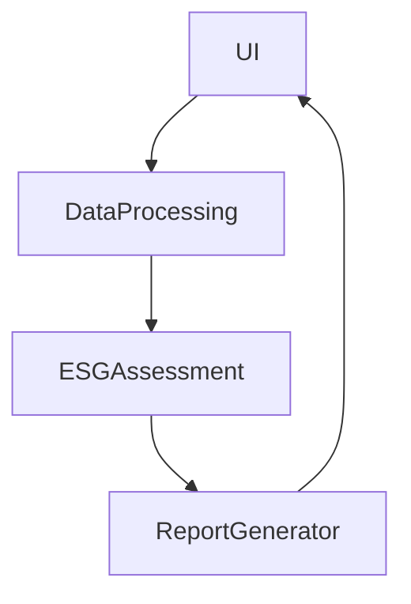

                 


# 特价股票投资中的企业元宇宙伦理与社会责任量化评估

> 关键词：特价股票、企业元宇宙、伦理评估、社会责任量化、投资分析

> 摘要：本文探讨在企业元宇宙背景下，特价股票投资中的伦理与社会责任量化评估。通过分析核心概念、设计评估模型、构建系统架构，结合实际案例，提出量化方法，为投资者提供伦理决策支持。

---

## 第一部分：背景与概念

### 第一章：特价股票投资概述

#### 1.1 特价股票的基本概念

- **1.1.1 特价股票的定义**
  特价股票指市场价格低于其内在价值的股票，通常被视为被低估的投资机会。识别这些股票需要分析公司基本面，如盈利能力、成长潜力和财务健康状况。

- **1.1.2 特价股票的分类与特点**
  - 按行业：科技、金融、制造业等。
  - 按市值：大盘股、中盘股、小盘股。
  - 特点：价格波动大，风险较高，但潜在回报丰厚。

- **1.1.3 特价股票投资的历史与发展**
  股票投资历史悠久，格雷厄姆的“价值投资”理论奠定了基础，强调寻找市场价格低于内在价值的股票。

#### 1.2 特价股票投资的现状与趋势

- **1.2.1 当前市场中的特价股票特点**
  - 数字化转型推动：科技股成为主要关注对象。
  - 市场波动加剧：全球经济不确定性增加特价股出现频率。

- **1.2.2 投资者行为分析**
  - 机构投资者与个人投资者行为差异。
  - 技术分析与基本面分析的结合。

- **1.2.3 未来发展趋势预测**
  - 数字化工具广泛应用。
  - 可持续投资兴起，伦理因素影响越来越大。

### 第二章：企业元宇宙概述

#### 2.1 企业元宇宙的基本概念

- **2.1.1 元宇宙的定义与特征**
  元宇宙是虚拟与现实结合的数字空间，具有持续性、可访问性、互操作性、去中心化和经济系统等特征。

- **2.1.2 企业元宇宙的应用场景**
  - 虚拟会议、产品展示、虚拟办公室。
  - 数字身份认证、虚拟资产交易。
  - 数据安全与隐私保护。

- **2.1.3 企业元宇宙的技术基础**
  包括区块链、虚拟现实、增强现实、人工智能和5G通信等技术。

#### 2.2 企业元宇宙与社会责任

- **2.2.1 元宇宙中的企业责任**
  - 数据隐私保护。
  - 数字身份管理。
  - 内容审核与责任承担。

- **2.2.2 伦理问题的出现**
  - 数字鸿沟扩大化。
  - 虚拟世界中的暴力与欺诈。
  - 用户数据滥用风险。

- **2.2.3 社会责任的量化评估**
  企业需量化其在元宇宙中的社会责任表现，作为投资决策的重要依据。

### 第三章：伦理与社会责任的量化评估

#### 3.1 伦理与社会责任的重要性

- **3.1.1 伦理在投资中的作用**
  投资决策应考虑企业的伦理表现，避免投资于有争议的行业或企业。

- **3.1.2 社会责任的定义与影响**
  社会责任包括环境、社会和治理（ESG）因素，影响企业长期价值。

- **3.1.3 量化评估的意义**
  量化评估为投资者提供客观标准，便于比较和决策。

---

## 第二部分：核心概念与模型

### 第四章：核心概念与联系

#### 4.1 核心概念定义

- **特价股票**：市场价格低于内在价值的股票。
- **企业元宇宙**：企业在虚拟空间中的存在与应用。
- **伦理与社会责任**：企业在经营中的道德责任与社会影响。

#### 4.2 核心概念对比表

| 特性       | 特价股票       | 企业元宇宙       | 伦理与社会责任 |
|------------|----------------|------------------|----------------|
| 定义       | 股票价格被低估  | 虚拟空间的企业存在 | 企业道德责任     |
| 技术基础   | 金融分析技术   | 虚拟现实、区块链  | 伦理评估模型     |
| 影响因素   | 市场供需、公司基本面 | 技术实现、用户行为 | 政策法规、社会舆论 |
| 应用领域   | 投资、金融     | 虚拟会议、产品展示 | 投资决策、企业治理 |

#### 4.3 ER实体关系图

```mermaid
erd
  股票
    id: int
    name: varchar
    price: float
  属于
    stock_id: int
    company_id: int
  企业
    id: int
    name: varchar
    industry: varchar
  伦理评估
    stock_id: int
    company_id: int
    score: int
```

---

### 第五章：量化评估模型

#### 5.1 算法原理

使用层次分析法（AHP）进行量化评估。步骤如下：

1. 确定评估指标，包括环境、社会、治理（ESG）三个维度。
2. 构建指标权重矩阵，计算各指标的权重。
3. 对企业进行评分，得到每个指标的得分。
4. 综合权重与得分，计算总评分。

#### 5.2 数学模型

- **层次分析法公式**：
  $$ A = \frac{1}{n}\sum_{i=1}^{n} (w_i \cdot s_i) $$
  其中，\( A \) 是综合评分，\( w_i \) 是第 \( i \) 个指标的权重，\( s_i \) 是第 \( i \) 个指标的得分。

#### 5.3 代码实现

```python
import numpy as np

def ahp Assessment(criteria_weights, scores):
    # 计算综合得分
    weighted_scores = criteria_weights * scores
    total = np.sum(weighted_scores, axis=0)
    normalized = total / np.sum(criteria_weights)
    return normalized

# 示例
criteria_weights = np.array([0.5, 0.3, 0.2])  # 环境、社会、治理权重
scores = np.array([0.8, 0.7, 0.9])  # 各指标得分
assessment = ahp Assessment(criteria_weights, scores)
print("综合评估得分:", assessment)
```

#### 5.4 评估步骤

1. **收集数据**：获取企业的ESG数据。
2. **确定权重**：基于行业标准或专家意见确定指标权重。
3. **计算得分**：为每个指标打分。
4. **综合评估**：计算综合得分，评估企业责任。

---

## 第三部分：系统设计与实现

### 第六章：系统架构设计

#### 6.1 功能模块设计

- 用户界面模块：展示股票信息和评估结果。
- 数据处理模块：收集和处理企业数据。
- 评估计算模块：执行量化评估。
- 报告生成模块：输出评估报告。

#### 6.2 系统架构图



#### 6.3 接口设计

- 输入接口：接收股票代码和企业数据。
- 输出接口：提供评估结果和报告。

#### 6.4 交互流程

1. 用户输入股票代码。
2. 系统获取企业数据。
3. 数据处理模块清洗数据。
4. 评估模块计算得分。
5. 报告生成模块输出结果。

---

## 第四部分：项目实战与案例分析

### 第七章：项目实战与案例分析

#### 7.1 项目环境配置

- Python 3.8+
- Numpy、Pandas、Matplotlib库。

#### 7.2 核心代码实现

```python
import numpy as np
import pandas as pd
import matplotlib.pyplot as plt

def load_data(filename):
    # 加载数据
    df = pd.read_csv(filename)
    return df

def calculate_score(df, criteria_weights):
    # 计算综合得分
    scores = df[['环境', '社会', '治理']].values
    total = np.sum(criteria_weights * scores, axis=1)
    normalized = total / np.sum(criteria_weights)
    return normalized

# 示例
data = load_data('esg_data.csv')
weights = np.array([0.5, 0.3, 0.2])
scores = calculate_score(data, weights)
data['综合得分'] = scores
data.to_csv('评估结果.csv', index=False)
```

#### 7.3 案例分析

以某科技公司为例，分析其在元宇宙中的社会责任表现，计算综合得分，评估投资价值。

#### 7.4 结果解读

综合得分高的企业更具投资价值，同时需关注其在元宇宙中的伦理表现。

---

## 第五部分：总结与展望

### 第八章：总结与展望

#### 8.1 总结

- **背景介绍**：特价股票与企业元宇宙的结合，为企业社会责任评估提供了新视角。
- **核心概念**：明确特价股票、元宇宙和伦理评估的定义与联系。
- **算法模型**：层次分析法有效量化企业责任。
- **系统设计**：构建了完整的评估系统，提供投资决策支持。

#### 8.2 最佳实践

- **伦理因素**：在投资决策中优先考虑企业责任。
- **持续学习**：关注元宇宙技术发展，及时调整评估模型。

#### 8.3 小结

本文通过理论与实践结合，为投资者提供了一套量化评估方法，帮助做出更明智的投资决策。

#### 8.4 注意事项

- 数据准确性：确保输入数据的准确性。
- 模型适用性：根据不同企业调整权重。
- 技术更新：及时更新评估模型，适应市场变化。

#### 8.5 拓展阅读

推荐阅读《价值投资入门》和《区块链与元宇宙》，深入了解相关理论与技术。

---

## 作者：AI天才研究院（AI Genius Institute） & 禅与计算机程序设计艺术（Zen And The Art of Computer Programming）

---

这篇文章系统地探讨了特价股票投资中的企业元宇宙伦理与社会责任量化评估，通过理论分析、模型构建和案例研究，为投资者提供了实用的决策支持工具。

