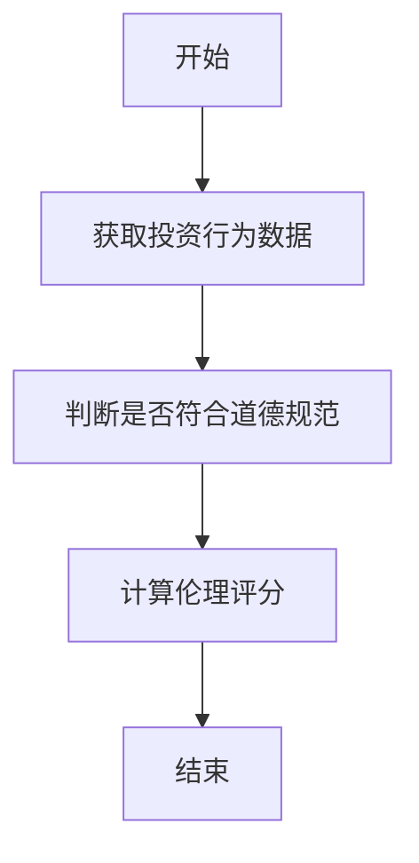
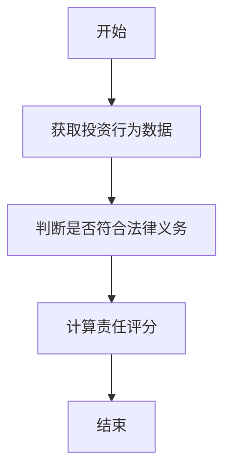
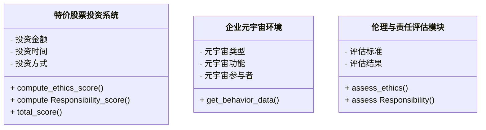
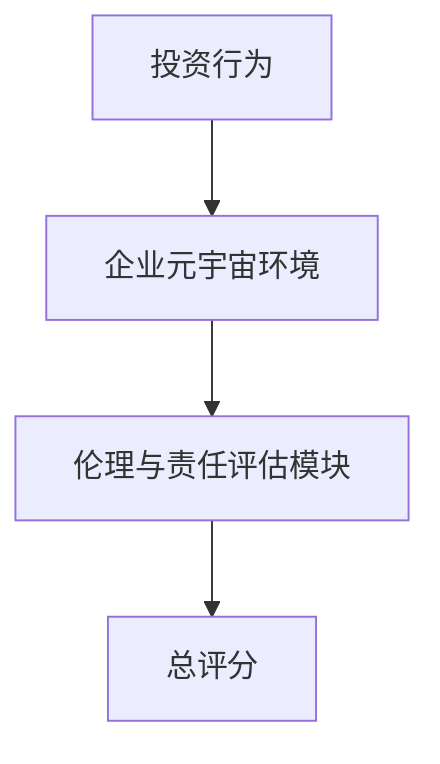
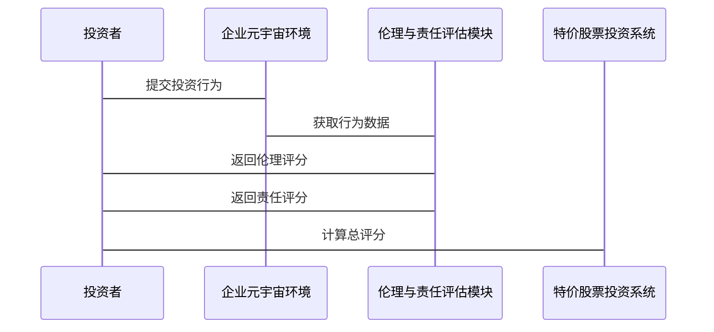

                 


# 特价股票投资中的企业元宇宙伦理与责任评估因素考量

> 关键词：特价股票投资，企业元宇宙，伦理与责任评估，算法模型，系统架构

> 摘要：本文深入探讨了特价股票投资中涉及的企业元宇宙的伦理与责任评估因素。首先介绍了特价股票投资和企业元宇宙的基本概念，然后分析了伦理与责任评估的核心要素，提出了基于伦理和责任的评估模型，并通过算法和系统架构详细阐述了其实现过程。最后，通过实际案例分析和项目实战，总结了最佳实践和注意事项。

---

## 第一部分: 特价股票投资与企业元宇宙的背景介绍

### 第1章: 特价股票投资的背景与概念

#### 1.1 特价股票投资的定义与特点

特价股票投资是指以低于市场价购买股票的行为，通常出现在公司内部员工持股计划、大股东减持或市场短期波动等情况下。其特点包括高风险、高回报、短期性以及对市场敏感性。

#### 1.2 企业元宇宙的概念与特点

企业元宇宙指的是企业在虚拟空间中构建的数字化工作环境，包括虚拟办公室、虚拟会议空间、虚拟协作平台等。其特点包括沉浸式体验、实时互动性、数据驱动性和高度定制化。

#### 1.3 特价股票投资与企业元宇宙的联系

特价股票投资与企业元宇宙的联系主要体现在以下几个方面：
- 企业元宇宙为特价股票投资提供了新的场景和工具。
- 元宇宙中的虚拟资产可能成为特价股票投资的新标的。
- 元宇宙中的数据隐私和行为规范对投资决策有重要影响。

#### 1.4 本章小结

本章通过定义和特点的对比，初步分析了特价股票投资与企业元宇宙的联系，为后续的伦理与责任评估奠定了基础。

---

## 第二部分: 特价股票投资中的企业元宇宙伦理与责任评估的核心概念

### 第2章: 伦理与责任评估的基本概念

#### 2.1 伦理与责任评估的定义

伦理评估是指对行为的道德性进行判断，责任评估是指对行为的法律和义务性进行评估。两者共同构成了对行为的全面评价体系。

#### 2.2 伦理与责任评估的核心要素

| 评估维度 | 伦理评估 | 责任评估 |
|----------|----------|----------|
| 评估对象 | 个体行为 | 组织行为 |
| 评估标准 | 道德规范 | 法律法规 |
| 评估方法 | 定性分析 | 定量分析 |

#### 2.3 ER实体关系图

```mermaid
erd
  entity 特价股票投资 {
    key: 投资ID
    fields: 投资金额, 投资时间, 投资方式
  }
  entity 企业元宇宙 {
    key: 元宇宙ID
    fields: 元宇宙类型, 元宇宙功能, 元宇宙参与者
  }
  entity 伦理与责任评估 {
    key: 评估ID
    fields: 评估标准, 评估结果
  }
  relationship 特价股票投资 -->> 企业元宇宙: 投资场景
  relationship 企业元宇宙 -->> 伦理与责任评估: 评估依据
  relationship 特价股票投资 -->> 伦理与责任评估: 投资决策
```

---

## 第三部分: 特价股票投资中的企业元宇宙伦理与责任评估的算法原理

### 第3章: 基于伦理和责任的评估模型

#### 3.1 评估模型的核心算法

评估模型基于伦理和责任的加权评分，公式如下：

$$ \text{总评分} = \alpha \times \text{伦理评分} + \beta \times \text{责任评分} $$

其中，$\alpha$ 和 $\beta$ 分别为伦理和责任评分的权重系数。

#### 3.2 伦理评分算法流程



#### 3.3 责任评分算法流程



#### 3.4 数学公式与代码实现

以下是评估模型的Python代码实现：

```python
def compute_ethics_score(actions):
    # 伦理评分计算
    ethics_score = 0
    for action in actions:
        if action['ethical']:
            ethics_score += 1
    return ethics_score

def compute Responsibility_score(actions):
    # 责任评分计算
    responsibility_score = 0
    for action in actions:
        if action['compliant']:
            responsibility_score += 1
    return responsibility_score

def total_score(ethics_score, responsibility_score, alpha=0.6, beta=0.4):
    # 总评分计算
    return alpha * ethics_score + beta * responsibility_score
```

---

## 第四部分: 特价股票投资中的企业元宇宙伦理与责任评估的系统架构设计

### 第4章: 系统架构设计方案

#### 4.1 问题场景介绍

企业在元宇宙中进行特价股票投资时，需要确保投资行为符合伦理和法律要求，避免数据滥用和隐私泄露。

#### 4.2 系统功能设计



#### 4.3 系统架构图



#### 4.4 系统接口设计

以下是系统接口的定义：

```python
interface EthicsAssessment:
    def assess_ethics(actions):
        pass

interface ResponsibilityAssessment:
    def assess Responsibility(actions):
        pass
```

#### 4.5 系统交互序列图



---

## 第五部分: 特价股票投资中的企业元宇宙伦理与责任评估的项目实战

### 第5章: 项目实战

#### 5.1 环境安装

需要安装以下工具和库：
- Python 3.8+
- Mermaid CLI
- Plotly
- Pandas

#### 5.2 核心代码实现

以下是评估模型的核心代码：

```python
import pandas as pd
from sklearn.metrics import accuracy_score

class EthicsAssessor:
    def __init__(self, actions):
        self.actions = actions

    def assess_ethics(self):
        return sum(1 for action in self.actions if action['ethical'])

class ResponsibilityAssessor:
    def __init__(self, actions):
        self.actions = actions

    def assess Responsibility(self):
        return sum(1 for action in self.actions if action['compliant'])

def main():
    actions = [
        {'ethical': True, 'compliant': True},
        {'ethical': False, 'compliant': False},
        {'ethical': True, 'compliant': False},
        {'ethical': False, 'compliant': True}
    ]
    ethics_assessor = EthicsAssessor(actions)
    responsibility_assessor = ResponsibilityAssessor(actions)
    ethics_score = ethics_assessor.assess_ethics()
    responsibility_score = responsibility_assessor.assess Responsibility()
    total = 0.6 * ethics_score + 0.4 * responsibility_score
    print(f"伦理评分: {ethics_score}")
    print(f"责任评分: {responsibility_score}")
    print(f"总评分: {total}")

if __name__ == "__main__":
    main()
```

#### 5.3 案例分析与解读

假设某公司在元宇宙中进行特价股票投资，投资行为涉及100笔交易，其中80笔符合伦理标准，70笔符合法律义务。计算总评分为：

$$ \text{总评分} = 0.6 \times 80 + 0.4 \times 70 = 48 + 28 = 76 $$

---

## 第六部分: 特价股票投资中的企业元宇宙伦理与责任评估的最佳实践

### 第6章: 小结与注意事项

#### 6.1 小结

本文通过理论分析和实践案例，详细探讨了特价股票投资中的企业元宇宙伦理与责任评估问题，提出了基于伦理和责任的评估模型，并给出了系统的实现方案。

#### 6.2 注意事项

- 在实际应用中，需确保数据的准确性和完整性。
- 定期更新评估模型，以适应市场和法规的变化。
- 加强数据隐私保护，防止信息泄露。

#### 6.3 拓展阅读

- 《企业元宇宙与数字伦理》
- 《投资行为的法律与伦理规范》

---

## 作者：AI天才研究院/AI Genius Institute & 禅与计算机程序设计艺术 /Zen And The Art of Computer Programming

