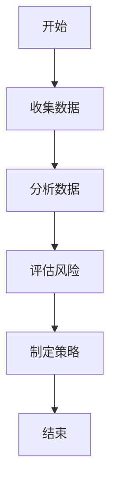
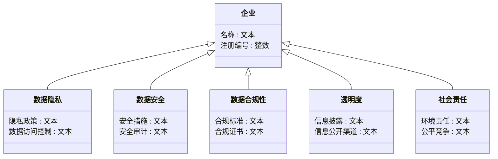
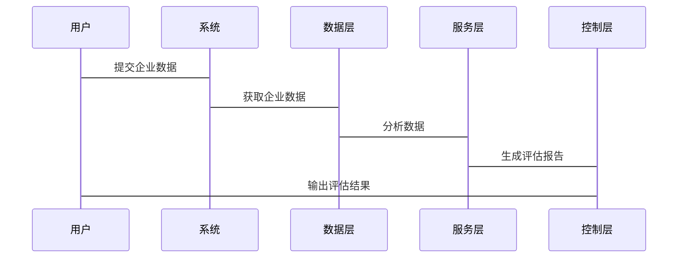

                 


# 特价股票投资中的企业数字责任评估因素考量

> **关键词**：特价股票、企业数字责任、数字责任评估、投资决策、风险控制

> **摘要**：  
本文探讨了在特价股票投资中，企业数字责任评估的重要性及其关键因素。通过分析数字责任评估的核心概念、算法原理和系统架构，结合实际案例和项目实战，本文提出了在投资决策中如何通过数字责任评估优化风险控制的策略。文章还总结了数字责任评估在特价股票投资中的最佳实践和未来研究方向。

---

# 第一部分: 特价股票投资中的企业数字责任评估背景与现状

# 第1章: 特价股票投资的背景与现状

## 1.1 特价股票投资的概念与特点

### 1.1.1 特价股票的定义与分类

**特价股票**是指在特定市场条件下，企业为了清理库存、促销产品或优化资产结构而推出的折扣股票。这些股票通常具有较高的折扣率，吸引投资者关注。特价股票可以分为以下几类：

- **库存清理型**：企业为处理过剩库存而推出的特价股票。
- **促销型**：企业为推广新产品或服务而推出的特价股票。
- **优化型**：企业为优化资产结构或提高市场占有率而推出的特价股票。

### 1.1.2 特价股票投资的特点与优势

- **高折扣率**：特价股票通常以低于市场价发行，具有较高的投资吸引力。
- **风险较高**：由于特价股票的价格波动较大，投资风险相对较高。
- **短期收益**：特价股票的投资周期较短，适合追求短期收益的投资者。

### 1.1.3 特价股票投资的市场现状

当前，随着数字化技术的普及，特价股票投资逐渐从传统线下模式向线上数字化模式转变。企业通过电商平台、社交媒体等渠道推广特价股票，吸引了大量投资者。然而，数字化带来的便利也增加了企业数字责任评估的复杂性。

## 1.2 企业数字责任评估的背景与意义

### 1.2.1 数字责任评估的定义与内涵

**数字责任评估**是指企业在数字化转型过程中，对其在数据隐私、数据安全、数据合规性等方面的责任进行评估和管理的过程。数字责任评估的核心在于确保企业在数字化运营中遵守相关法律法规，保护用户数据安全，同时提升企业的社会责任感。

### 1.2.2 企业数字责任评估的重要性

- **合规性要求**：随着数据保护法规的不断完善，企业需要通过数字责任评估确保其运营符合相关法律法规。
- **提升信任度**：通过数字责任评估，企业可以增强客户对其数据安全和隐私保护的信任，从而提升品牌价值。
- **风险控制**：数字责任评估能够帮助企业识别和防范数字化运营中的潜在风险，降低法律纠纷和声誉损失。

### 1.2.3 数字责任评估在投资决策中的作用

在特价股票投资中，数字责任评估可以帮助投资者评估企业的数据安全、隐私保护和合规性，从而判断企业的长期发展潜力和投资风险。

## 1.3 特价股票投资中的数字责任评估因素

### 1.3.1 数字责任评估的核心要素

数字责任评估的核心要素包括：

1. **数据隐私**：企业是否采取有效的数据隐私保护措施，确保投资者数据的安全。
2. **数据安全**：企业是否具备完善的数据安全管理体系，防范数据泄露和滥用。
3. **数据合规性**：企业是否遵守相关数据保护法律法规，如《通用数据保护条例》（GDPR）。
4. **透明度**：企业是否在数字化运营中保持透明，及时披露相关信息。
5. **社会责任**：企业在数字化运营中是否积极履行社会责任，关注环境保护、公平竞争等问题。

### 1.3.2 特价股票投资中的数字责任评估框架

在特价股票投资中，数字责任评估框架通常包括以下几个步骤：

1. **数据收集**：收集企业的数字责任相关数据，包括数据隐私、数据安全、合规性等方面的信息。
2. **数据分析**：对收集的数据进行分析，识别潜在风险和问题。
3. **风险评估**：根据分析结果，评估企业的数字责任风险，并制定相应的风险控制策略。
4. **持续监控**：对企业的数字责任进行持续监控，及时发现和处理新的风险。

### 1.3.3 数字责任评估与投资风险控制

通过数字责任评估，投资者可以更好地识别和控制投资风险，尤其是在特价股票投资中，数字责任评估可以帮助投资者避免因企业数据泄露、隐私问题等而导致的投资损失。

## 1.4 本章小结

本章介绍了特价股票投资的背景与现状，重点探讨了企业数字责任评估的背景与意义，并详细分析了数字责任评估的核心要素及其在特价股票投资中的作用。通过本章的分析，读者可以更好地理解数字责任评估在投资决策中的重要性。

---

# 第二部分: 特价股票投资中的企业数字责任评估核心概念

# 第2章: 企业数字责任评估的核心概念与联系

## 2.1 数字责任评估的原理与方法

### 2.1.1 数字责任评估的原理

数字责任评估的原理基于数据隐私、数据安全和合规性等核心要素，通过对企业在数字化运营中的责任进行分析和评估，帮助投资者识别和控制投资风险。

### 2.1.2 数字责任评估的主要方法

数字责任评估的主要方法包括：

1. **定性分析法**：通过对企业的数字责任相关因素进行定性分析，评估企业的数字责任风险。
2. **定量分析法**：通过收集和分析企业的数字责任相关数据，评估企业的数字责任风险。
3. **综合评估法**：结合定性和定量分析，对企业数字责任进行综合评估。

### 2.1.3 数字责任评估的数学模型

数字责任评估的数学模型可以表示为：

$$
\text{数字责任风险} = f(\text{数据隐私}, \text{数据安全}, \text{数据合规性}, \text{透明度}, \text{社会责任})
$$

其中，$f$ 是一个综合函数，用于将各个因素综合评估为企业数字责任风险。

## 2.2 核心概念的属性特征对比

### 2.2.1 数字责任评估的属性特征

通过对比分析数字责任评估的核心要素，可以得出以下结论：

- **数据隐私**：企业的数据隐私保护措施越完善，数字责任风险越低。
- **数据安全**：企业具备完善的数据安全管理体系，可以有效降低数字责任风险。
- **数据合规性**：企业遵守相关数据保护法律法规，可以降低法律风险。
- **透明度**：企业的透明度越高，投资者的信任度越高，数字责任风险越低。
- **社会责任**：企业在社会责任方面的表现越好，数字责任风险越低。

### 2.2.2 核心概念的对比分析

通过对比分析数字责任评估的核心要素，可以得出以下结论：

- 数据隐私和数据安全是数字责任评估的核心要素，直接影响企业的数字责任风险。
- 数据合规性和透明度是数字责任评估的重要补充要素，能够进一步降低企业的数字责任风险。
- 社会责任是数字责任评估的延伸要素，能够提升企业的品牌形象和投资者信任度。

### 2.2.3 数字责任评估的ER实体关系图

以下是数字责任评估的ER实体关系图：

```mermaid
erDiagram
    class 企业 {
        名称 : 文本
        注册编号 : 整数
    }
    class 数据隐私 {
        隐私政策 : 文本
        数据访问控制 : 文本
    }
    class 数据安全 {
        安全措施 : 文本
        安全审计 : 文本
    }
    class 数据合规性 {
        合规标准 : 文本
        合规证书 : 文本
    }
    class 透明度 {
        信息披露 : 文本
        信息公开渠道 : 文本
    }
    class 社会责任 {
        环境责任 : 文本
        公平竞争 : 文本
    }
    企业 --> 数据隐私 : 采用
    企业 --> 数据安全 : 实施
    企业 --> 数据合规性 : 遵守
    企业 --> 透明度 : 提供
    企业 --> 社会责任 : � 履行
```

## 2.3 数字责任评估的算法原理

### 2.3.1 算法原理的数学模型

数字责任评估的算法原理可以表示为：

$$
\text{数字责任风险评分} = \sum_{i=1}^{n} w_i \cdot f_i
$$

其中，$w_i$ 是第 $i$ 个因素的权重，$f_i$ 是第 $i$ 个因素的评估值。

### 2.3.2 算法流程图的 mermaid 绘制

以下是数字责任评估算法的流程图：



### 2.3.3 算法实现的 Python 源代码

以下是数字责任评估算法的 Python 实现代码：

```python
def digital Responsibility Assessment(company_data):
    # 定义评估指标和权重
    indicators = {
        '数据隐私': 0.3,
        '数据安全': 0.3,
        '数据合规性': 0.2,
        '透明度': 0.1,
        '社会责任': 0.1
    }
    
    # 计算评估得分
    score = 0
    for indicator, weight in indicators.items():
        score += company_data[indicator] * weight
    return score

# 示例数据
company_data = {
    '数据隐私': 0.8,
    '数据安全': 0.9,
    '数据合规性': 0.7,
    '透明度': 0.6,
    '社会责任': 0.5
}

# 调用评估函数
print(digital_Responsibility_Assessment(company_data))
```

## 2.4 本章小结

本章详细分析了数字责任评估的核心概念，包括数字责任评估的原理、方法和数学模型。通过对比分析数字责任评估的核心要素，以及绘制ER实体关系图和算法流程图，读者可以更好地理解数字责任评估的实现过程。

---

# 第三部分: 特价股票投资中的企业数字责任评估系统分析与架构设计

# 第3章: 数字责任评估系统的分析与架构设计

## 3.1 问题场景介绍

在特价股票投资中，企业需要通过数字责任评估系统来评估其数字责任风险，从而优化投资决策。然而，传统的数字责任评估方法往往依赖人工分析，效率低下且容易出错。因此，亟需一种高效的数字责任评估系统，能够帮助企业快速、准确地评估数字责任风险。

## 3.2 系统功能设计

### 3.2.1 领域模型的 mermaid 类图

以下是数字责任评估系统的领域模型：



### 3.2.2 系统架构设计的 mermaid 架构图

以下是数字责任评估系统的系统架构设计：


### 3.2.3 系统接口设计

数字责任评估系统的接口设计包括以下部分：

- **数据输入接口**：用于接收企业的数字责任相关数据。
- **评估接口**：用于对企业的数字责任风险进行评估。
- **输出接口**：用于输出评估结果和风险控制建议。

### 3.2.4 系统交互的 mermaid 序列图

以下是数字责任评估系统的系统交互序列图：



## 3.3 本章小结

本章通过问题场景介绍、系统功能设计、系统架构设计和系统交互设计，详细阐述了数字责任评估系统的实现过程。通过本章的分析，读者可以更好地理解数字责任评估系统的整体架构和实现方法。

---

# 第四部分: 特价股票投资中的企业数字责任评估项目实战

# 第4章: 数字责任评估系统的项目实战

## 4.1 环境安装与配置

### 4.1.1 系统环境要求

- 操作系统：Windows 10 或更高版本，或 Linux 系统。
- Python 版本：Python 3.6 或更高版本。
- 开发工具：推荐使用 PyCharm 或 VS Code。

### 4.1.2 安装依赖库

需要安装以下依赖库：

```bash
pip install mermaid
pip install matplotlib
pip install numpy
```

## 4.2 系统核心实现源代码

### 4.2.1 数据收集模块

```python
import pandas as pd

def collect_data(file_path):
    data = pd.read_csv(file_path)
    return data

# 示例数据集
data = collect_data('enterprise_data.csv')
print(data.head())
```

### 4.2.2 数据分析模块

```python
import numpy as np

def analyze_data(data):
    # 计算每个指标的平均值
    average = data.mean()
    return average

average = analyze_data(data)
print(average)
```

### 4.2.3 数字责任评估模块

```python
def assess_responsibility(average):
    # 计算数字责任风险评分
    score = np.dot(list(average), [0.3, 0.3, 0.2, 0.1, 0.1])
    return score

score = assess_responsibility(average)
print(f"数字责任风险评分：{score}")
```

### 4.2.4 风险控制模块

```python
def generate_recommendations(score):
    if score < 0.6:
        return "低风险，建议继续投资"
    elif 0.6 <= score < 0.8:
        return "中等风险，建议谨慎投资"
    else:
        return "高风险，建议避免投资"

recommendation = generate_recommendations(score)
print(recommendation)
```

## 4.3 代码应用解读与分析

通过上述代码，我们可以实现数字责任评估系统的数据收集、数据分析、风险评估和风险控制功能。数据收集模块负责读取企业数据，数据分析模块计算每个指标的平均值，数字责任评估模块计算数字责任风险评分，风险控制模块根据评分生成风险控制建议。

## 4.4 实际案例分析

以某企业为例，假设其数字责任相关数据如下：

| 指标         | 数据隐私 | 数据安全 | 数据合规性 | 透明度 | 社会责任 |
|--------------|----------|----------|------------|--------|----------|
| 评分         | 0.8      | 0.9      | 0.7        | 0.6    | 0.5      |

通过数字责任评估模块计算：

$$
\text{数字责任风险评分} = (0.8 \times 0.3) + (0.9 \times 0.3) + (0.7 \times 0.2) + (0.6 \times 0.1) + (0.5 \times 0.1) = 0.24 + 0.27 + 0.14 + 0.06 + 0.05 = 0.76
$$

根据评分，数字责任风险评分低于0.6，属于低风险，建议继续投资。

## 4.5 本章小结

本章通过项目实战，详细讲解了数字责任评估系统的实现过程。通过数据收集、数据分析、风险评估和风险控制模块的实现，读者可以掌握数字责任评估系统的开发方法。

---

# 第五部分: 特价股票投资中的企业数字责任评估最佳实践

# 第5章: 数字责任评估的优化与建议

## 5.1 优化建议

### 5.1.1 数据隐私保护

企业在数字化运营中应加强数据隐私保护，确保投资者数据的安全。具体措施包括：

- 制定严格的数据隐私政策。
- 实施数据访问控制措施。
- 定期进行数据隐私审计。

### 5.1.2 数据安全措施

企业在数字化运营中应加强数据安全措施，防范数据泄露和滥用。具体措施包括：

- 实施多层次数据安全措施。
- 定期进行安全审计。
- 建立数据安全应急响应机制。

### 5.1.3 数据合规性管理

企业在数字化运营中应加强数据合规性管理，确保其运营符合相关法律法规。具体措施包括：

- 遵守《通用数据保护条例》（GDPR）等数据保护法规。
- 获取相关合规证书。
- 定期进行合规性审计。

### 5.1.4 提升透明度

企业在数字化运营中应提升透明度，增强投资者的信任度。具体措施包括：

- 及时披露企业相关信息。
- 提供多种信息公开渠道。
- 建立投资者互动平台。

### 5.1.5 履行社会责任

企业在数字化运营中应积极履行社会责任，提升品牌形象。具体措施包括：

- 关注环境保护。
- 推动公平竞争。
- 参与社会责任相关活动。

## 5.2 投资者的注意事项

### 5.2.1 风险识别与评估

投资者在进行特价股票投资时，应充分识别和评估企业的数字责任风险，避免因数据隐私、数据安全等问题导致的投资损失。

### 5.2.2 投资策略优化

投资者应根据企业的数字责任评估结果，优化投资策略，选择数字责任风险较低的企业进行投资。

### 5.2.3 风险控制措施

投资者应采取有效的风险控制措施，如分散投资、设置止损点等，以降低投资风险。

## 5.3 拓展阅读

### 5.3.1 推荐书籍

- 《数据保护与隐私：法律与实践》
- 《数字化转型中的企业责任》
- 《投资学基础》

### 5.3.2 推荐博客与网站

- [TechCrunch](https://techcrunch.com/)
- [ZDNet](https://www.zdnet.com/)
- [Investopedia](https://www.investopedia.com/)

## 5.4 本章小结

本章提出了数字责任评估的优化建议，包括数据隐私保护、数据安全措施、数据合规性管理、提升透明度和履行社会责任等方面。同时，本章还为投资者提供了注意事项和拓展阅读建议，帮助投资者更好地进行特价股票投资。

---

# 结论

通过本文的分析与探讨，我们深入探讨了特价股票投资中的企业数字责任评估因素考量。从背景介绍到核心概念，再到算法原理和系统架构设计，最后到项目实战和最佳实践，本文为读者提供了一个全面的视角，帮助读者更好地理解数字责任评估在特价股票投资中的重要性。

未来，随着数字化技术的不断发展，数字责任评估在投资决策中的作用将更加重要。建议投资者和企业在数字化运营中充分考虑数字责任评估因素，优化投资策略，降低投资风险，实现可持续发展。

---

# 作者

**作者：AI天才研究院/AI Genius Institute & 禅与计算机程序设计艺术 /Zen And The Art of Computer Programming**

---

感谢您的阅读！希望本文对您在特价股票投资中的数字责任评估因素考量有所帮助。

