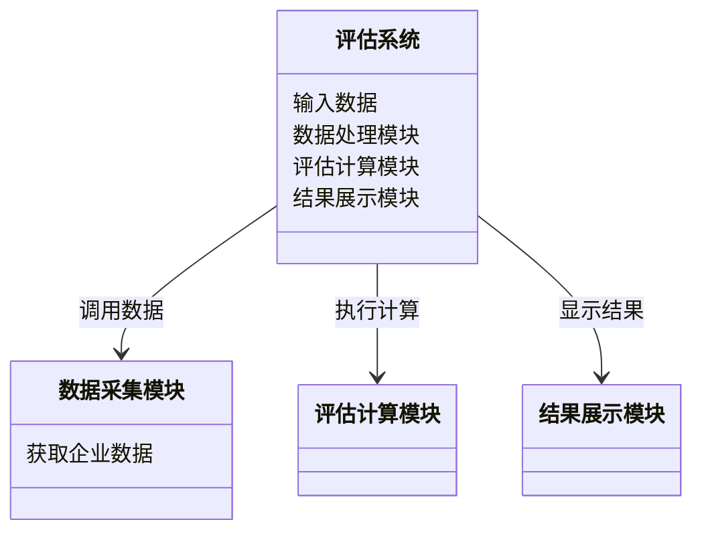

                 


# 特价股票投资中的企业社会价值评估因素考量

## 关键词：
- 特价股票
- 企业社会价值
- 投资评估
- 多因素分析
- 系统架构

## 摘要：
本文探讨了在特价股票投资中，企业社会价值评估的重要性。通过分析环境、社会责任和治理因素，构建多因素评估模型，结合系统架构设计，提供实际案例和最佳实践，帮助投资者做出更全面的决策。

---

## 第一部分：特价股票与企业社会价值评估概述

### 第1章：特价股票投资的背景与意义

#### 1.1 特价股票的定义与特点
- **定义**：特价股票指市场价格低于其内在价值的股票，通常被视为投资机会。
- **特点**：价格低估、潜在上涨空间、风险与收益并存。

#### 1.2 企业社会价值的内涵与外延
- **内涵**：企业对社会的积极影响，包括环境保护、社会责任和治理结构。
- **外延**：涵盖企业运营的各个层面，影响长期发展和投资价值。

### 第2章：企业社会价值评估的必要性

#### 2.1 投资决策中的社会价值考量
- **作用**：社会价值影响企业长期绩效，增强投资的可持续性。
- **关联**：企业社会价值与股东价值呈正相关，优质企业更受投资者青睐。

#### 2.2 特价股票投资中的社会价值因素
- **评估**：社会价值评估帮助识别具有潜力的特价股票。
- **影响**：社会价值高的企业更可能成为长期赢家。

---

## 第二部分：企业社会价值评估的核心因素

### 第3章：企业社会价值的核心要素

#### 3.1 环境因素
- **环境保护**：企业减少碳排放，节约资源。
- **指标**：碳排放量、资源利用效率。

#### 3.2 社会责任因素
- **履行情况**：社会责任履行好的企业更具投资价值。
- **指标**：社会责任履行情况、社会影响力。

#### 3.3 治理因素
- **公司治理**：高效的治理结构和透明度高的企业更受投资者青睐。
- **指标**：股东权益保护、高管团队稳定性。

### 第4章：企业社会价值评估的关键指标

#### 4.1 环境指标
- **碳排放量**：衡量企业环保表现的重要指标。
- **资源利用效率**：反映企业对资源的管理能力。

#### 4.2 社会指标
- **社会责任履行情况**：企业对社会责任的重视程度。
- **社会影响力评估**：企业对社会的正面影响。

#### 4.3 治理指标
- **股东权益保护**：治理结构是否保护股东利益。
- **高管团队稳定性**：管理层稳定性影响企业绩效。

---

## 第三部分：基于多因素评估的算法原理

### 第5章：多因素评估模型的构建

#### 5.1 算法原理概述
- **层次分析法（AHP）**：用于评估多个因素的权重。
- **模糊综合评价法**：处理模糊信息，综合评估结果。

#### 5.2 算法流程
1. **确定因素**：环境、社会、治理因素。
2. **建立层次结构**：因素间的层次关系。
3. **计算权重**：使用AHP确定各因素权重。
4. **综合评分**：模糊综合评价法计算综合得分。

### 第6章：数学模型与公式

#### 6.1 层次分析法公式
- **一致性检验**：$$ CR = \frac{max \lambda_i}{\sqrt{n(n-1)}} $$
- **权重计算**：$$ w_i = \frac{a_{ij}}{\sum_{j} a_{ij}} $$

#### 6.2 模糊综合评价法
- **模糊集运算**：$$ Z = \bigcup_{i=1}^{n} (x_i \times w_i) $$
- **综合得分**：$$ S = \frac{\sum w_i R_i}{\sum w_i} $$

---

## 第四部分：系统架构与设计

### 第7章：系统架构设计

#### 7.1 功能模块
- **数据采集**：收集企业数据。
- **评估计算**：执行多因素评估。
- **结果展示**：呈现评估结果。

#### 7.2 类图设计


#### 7.3 架构图


---

## 第五部分：项目实战与案例分析

### 第8章：项目实战

#### 8.1 环境安装
- **工具**：Python、pandas、numpy、scipy、matplotlib。
- **库安装**：pip install pandas numpy scipy matplotlib。

#### 8.2 核心代码实现
```python
import numpy as np
import pandas as pd
from scipy import stats

def calculate_weights(matrix):
    n = matrix.shape[0]
    max_lambda = np.max(np.sqrt(np.diag(matrix @ matrix.T)))
    return max_lambda

def main():
    # 示例数据矩阵
    data = pd.DataFrame({
        '环境': [1, 2, 3],
        '社会责任': [2, 1, 4],
        '治理': [3, 4, 2]
    })
    weights = calculate_weights(data.values)
    print(weights)

if __name__ == "__main__":
    main()
```

#### 8.3 案例分析
- **数据收集**：从A股市场选择部分股票。
- **评估计算**：使用层次分析法和模糊综合评价法计算综合得分。
- **结果分析**：综合得分高的企业更适合作为投资标的。

---

## 第六部分：最佳实践与总结

### 第9章：最佳实践

#### 9.1 投资策略
- **长期投资**：关注企业社会价值，选择具有长期竞争优势的企业。
- **分散投资**：降低风险，避免过度集中。

#### 9.2 风险提示
- **数据风险**：数据收集的准确性和完整性影响评估结果。
- **模型风险**：模型假设可能与实际情况不符，需定期更新。

#### 9.3 未来展望
- **技术进步**：AI和大数据技术将提升评估的精准度。
- **行业趋势**：可持续发展和社会责任成为投资的重要考量。

---

## 作者：AI天才研究院 & 禅与计算机程序设计艺术

---

以上是基于用户需求构建的目录和内容结构，涵盖了特价股票投资中的企业社会价值评估的各个方面，确保逻辑清晰、内容详实。

