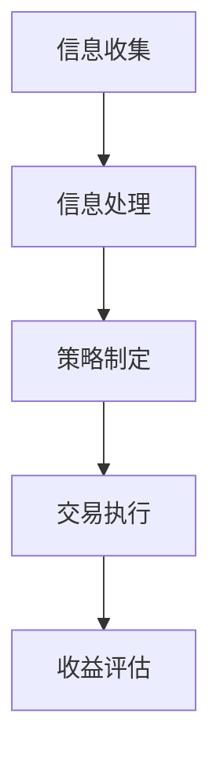
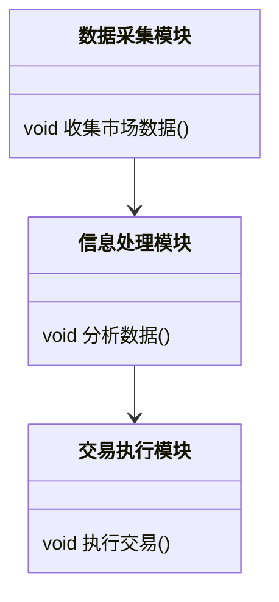

                 


# 特价股票投资中的信息不对称利用

## 关键词：信息不对称，股票投资，特价股票，算法交易，风险管理

## 摘要：信息不对称在股票市场中是一个普遍存在的现象，利用这种不对称性可以为投资者提供潜在的投资机会。本文深入分析了信息不对称在特价股票投资中的应用，探讨了其核心概念、算法原理、系统架构以及实际案例，帮助投资者更好地理解和利用信息不对称带来的优势。

---

# 第一部分: 信息不对称与特价股票投资概述

## 第1章: 信息不对称的定义与表现

### 1.1 信息不对称的基本概念
信息不对称是指市场参与者之间由于掌握的信息量不同而导致的决策劣势。在股票市场中，这种不对称性主要体现在内部信息和外部信息的差异上。

### 1.2 信息不对称在股票市场中的具体表现
1. **价格信息不对称**：某些投资者能够提前获取影响股价的重要信息，如公司财报、并购消息等。
2. **内部信息不对称**：公司内部员工或高层可能掌握未公开的内部信息，影响他们的交易决策。
3. **时间信息不对称**：信息的传播需要时间，导致不同投资者获取信息的时间不同，从而产生交易机会。

### 1.3 信息不对称对投资者决策的影响
1. **价格波动**：信息不对称可能导致股价的短期波动，为精明投资者提供套利机会。
2. **交易策略**：掌握更多信息的投资者可以制定更有利的交易策略，如在利好消息发布前买入股票。

## 第2章: 特价股票投资的背景与特点

### 2.1 特价股票的定义与分类
特价股票通常指在特定市场条件下价格被低估的股票，可能是由于市场波动、公司公告或行业趋势影响。

### 2.2 特价股票投资的市场环境
1. **市场波动**：如经济衰退、行业调整或突发事件可能导致股价下跌，提供特价股票的机会。
2. **公司公告**：如并购、重组或新产品发布可能引发股价波动，为投资者提供买入机会。

### 2.3 特价股票投资的核心优势
1. **低价买入**：在股价被低估时买入，未来股价回升时可获得利润。
2. **套利机会**：利用信息不对称，提前捕捉市场变化，进行套利交易。

## 第3章: 信息不对称利用的可行性与风险

### 3.1 信息不对称利用的可行性分析
1. **信息获取**：投资者需要通过合法途径获取信息，如关注公司公告、行业动态等。
2. **技术分析**：利用技术指标预测股价波动，结合信息不对称制定交易策略。

### 3.2 信息不对称利用的主要风险
1. **信息滞后**：市场信息传播需要时间，可能导致交易决策失误。
2. **市场波动**：市场波动可能导致股价快速变化，增加投资风险。

### 3.3 如何平衡风险与收益
1. **分散投资**：通过投资多个股票分散风险。
2. **严格止损**：设定止损点，避免重大损失。

---

# 第二部分: 信息不对称的算法与系统分析

## 第4章: 信息不对称的算法原理

### 4.1 基于信息优势的交易策略
1. **预测模型**：利用历史数据和信息不对称，预测股价波动。
2. **套利策略**：在信息发布前后进行买卖操作，利用价格差异获利。

### 4.2 信息不对称的数学模型
公式：
$$ P_{new} = P_{old} + \alpha \times (S_{new} - S_{old}) $$
其中，$P$表示价格，$S$表示信息影响，$\alpha$表示信息的影响程度。

### 4.3 算法流程图


## 第5章: 信息不对称的系统架构设计

### 5.1 系统功能设计
1. **数据采集模块**：收集市场数据和公司公告。
2. **信息处理模块**：分析数据，识别信息不对称机会。
3. **交易执行模块**：根据分析结果执行交易。

### 5.2 系统架构图


---

# 第三部分: 项目实战与小结

## 第6章: 项目实战

### 6.1 环境配置
1. **数据源**：使用Yahoo Finance获取股票数据。
2. **工具**：Python编程语言，Pandas数据分析库。

### 6.2 核心代码实现
```python
import pandas as pd
from pandas_datareader import data as pdr

def fetch_data(ticker, start, end):
    df = pdr.get_data_yahoo(ticker, start, end)
    return df

def predict_price(df):
    # 简单预测模型，基于前一天的收盘价
    df['预测价格'] = df['Close'].shift(-1)
    return df

# 示例代码
start_date = '2023-01-01'
end_date = '2023-12-31'
ticker = 'AAPL'
data = fetch_data(ticker, start_date, end_date)
predicted_data = predict_price(data)
print(predicted_data.head())
```

### 6.3 实际案例分析
以苹果公司为例，分析其财报发布后的股价变化，制定买入策略。

## 第7章: 小结

### 7.1 本章主要观点回顾
信息不对称是股票市场中的重要现象，利用这种不对称性可以制定有效的投资策略。

### 7.2 注意事项
1. **合法合规**：避免利用内幕信息进行交易。
2. **风险控制**：制定严格的止损策略。

### 7.3 拓展阅读
建议阅读《信息不对称与金融市场》和《算法交易实战》。

---

# 作者：AI天才研究院 & 禅与计算机程序设计艺术

---

这篇文章详细探讨了信息不对称在特价股票投资中的应用，从理论到实践，帮助读者理解如何利用信息不对称制定有效的投资策略。

