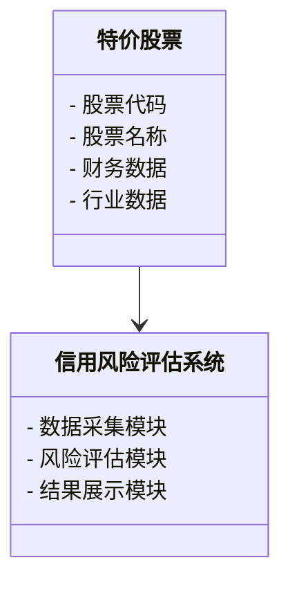
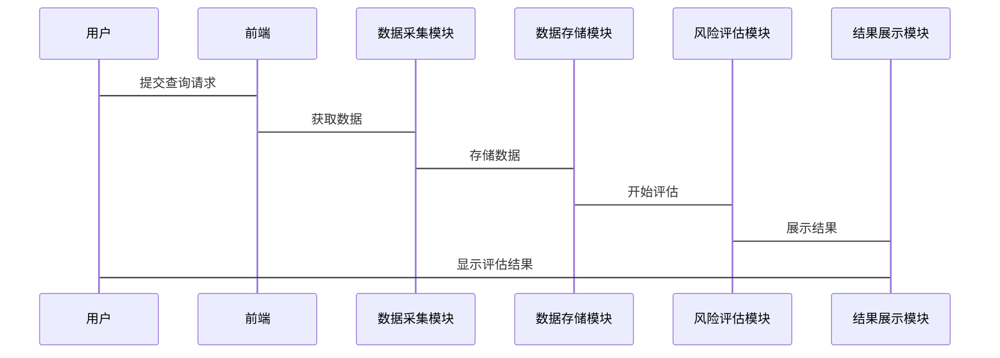

                 


# 特价股票投资中的信用风险评估方法

> 关键词：信用风险评估、特价股票、风险评估模型、逻辑回归、XGBoost、Python实现

> 摘要：本文详细探讨了在特价股票投资中如何进行信用风险评估。首先介绍了信用风险评估的基本概念和特价股票的特点，然后分析了信用风险评估的核心要素和理论基础。接着，深入讲解了基于逻辑回归和XGBoost的信用风险评估算法的原理和实现方法，最后通过实际案例展示了如何在Python中实现这些算法，并对结果进行了详细解读。本文还提供了一些实用的建议和最佳实践，帮助投资者更好地进行信用风险控制。

---

# 第1章: 信用风险评估的基本概念

## 1.1 信用风险的定义与特征

### 1.1.1 信用风险的基本定义
信用风险是指由于债务人或交易对手方未能履行其合同义务，导致债权人或投资者遭受损失的风险。在股票投资中，信用风险通常与上市公司的财务状况、经营能力和市场环境密切相关。

### 1.1.2 信用风险的特征分析
信用风险具有以下特征：
- **隐蔽性**：信用风险往往在企业财务状况恶化时才显现，具有一定的滞后性。
- **波动性**：受宏观经济环境、行业周期和企业自身经营状况的影响，信用风险具有较强的波动性。
- **传染性**：信用风险可能通过供应链或金融市场传导，影响其他相关资产或机构。

### 1.1.3 信用风险与金融市场的关系
信用风险是金融市场的重要组成部分，其存在使得投资者在选择投资标的时需要更加谨慎。有效的信用风险评估可以帮助投资者规避潜在损失，同时也有助于市场的稳定运行。

---

## 1.2 特价股票的定义与特点

### 1.2.1 特价股票的定义
特价股票通常指市盈率（P/E ratio）、市净率（P/B ratio）等估值指标显著低于市场平均水平的股票。这些股票往往被认为具有较高的投资价值，但同时也可能伴随着较高的风险。

### 1.2.2 特价股票的市场特征
- **低估值**：特价股票的估值指标通常低于行业平均水平，具有较高的安全边际。
- **高波动性**：由于市场对低估值股票的关注度较低，这类股票的流动性可能较差，价格波动较大。
- **潜在收益**：如果公司基本面改善，特价股票可能迎来较大的反弹空间。

### 1.2.3 特价股票投资的风险与收益分析
尽管特价股票可能提供较高的收益潜力，但其信用风险也不容忽视。投资者在选择特价股票时，需要综合考虑公司的财务状况、行业前景和市场环境。

---

## 1.3 信用风险评估的必要性

### 1.3.1 特价股票投资中的信用风险来源
- **公司财务状况**：公司盈利能力下降、负债过高、现金流不足等都可能增加信用风险。
- **行业风险**：行业景气度下降或政策变化可能影响公司的经营状况。
- **市场环境**：宏观经济波动、市场流动性变化等也可能对信用风险产生影响。

### 1.3.2 信用风险对投资决策的影响
信用风险直接影响股票的价值和投资回报。投资者如果未能有效识别和控制信用风险，可能导致投资损失。

### 1.3.3 信用风险评估的必要性与重要性
在特价股票投资中，信用风险评估是保障投资安全的重要环节。通过科学的信用风险评估，投资者可以更好地识别优质标的，避免因公司基本面问题导致的损失。

---

## 1.4 本章小结
本章介绍了信用风险的基本概念和特价股票的特点，分析了信用风险的来源及其对投资决策的影响。信用风险评估在特价股票投资中具有重要意义，是投资者必须重视的环节。

---

# 第2章: 信用风险评估的核心概念与联系

## 2.1 信用风险评估的核心要素

### 2.1.1 债务人信用状况的评估维度
债务人信用状况的评估可以从以下几个维度入手：
- **财务指标**：包括资产负债率、净利润率、现金流等。
- **经营能力**：包括市场份额、产品竞争力、管理团队等。
- **外部环境**：包括行业政策、宏观经济环境等。

### 2.1.2 财务指标在信用风险评估中的作用
财务指标是信用风险评估的重要依据。例如，资产负债率过高可能表明公司财务杠杆过高，存在较大的偿债压力。

### 2.1.3 市场环境对信用风险的影响
市场环境的变化可能影响公司的经营状况和信用评级。例如，经济下行周期中，行业景气度下降可能增加公司的信用风险。

---

## 2.2 信用风险评估的理论基础

### 2.2.1 基础信用评分模型
基础信用评分模型是信用风险评估的理论基础之一。常见的模型包括Z-score模型和Altman's five-factor model。

### 2.2.2 现代信用风险评估的理论发展
现代信用风险评估结合了统计学、机器学习和金融学的理论，形成了多种复杂的模型和方法。

### 2.2.3 信用风险与资产定价的关系
信用风险是资产定价的重要组成部分。在股票定价中，信用风险通过影响公司的信用评级和市场风险溢价来体现。

---

## 2.3 信用风险评估的核心流程

### 2.3.1 数据收集与 preprocessing
信用风险评估的第一步是数据收集与 preprocessing。需要收集公司的财务数据、行业数据和市场数据，并进行清洗和标准化处理。

### 2.3.2 风险评估模型的选择与构建
根据数据特征和业务需求，选择合适的信用风险评估模型。例如，逻辑回归适用于二分类问题，而XGBoost适合处理非线性关系。

### 2.3.3 结果分析与风险控制
对模型的输出结果进行分析，并根据分析结果制定风险控制策略。例如，设定风险阈值，对高风险标的进行规避或分散投资。

---

## 2.4 本章小结
本章详细介绍了信用风险评估的核心要素、理论基础和核心流程。信用风险评估需要结合财务指标、经营能力和外部环境等多方面因素，通过科学的模型和方法进行综合评估。

---

# 第3章: 信用风险评估的算法原理与数学模型

## 3.1 信用风险评估的主要算法

### 3.1.1 逻辑回归模型
逻辑回归是一种常用的二分类算法，适合用于信用风险评估中的违约概率预测。

### 3.1.2 支持向量机（SVM）
支持向量机适用于小样本数据的分类问题，但在信用风险评估中的应用相对较少。

### 3.1.3 随机森林与梯度提升树
随机森林和梯度提升树是基于树的集成算法，适合处理高维数据和非线性关系。

### 3.1.4 神经网络与深度学习模型
神经网络和深度学习模型在处理复杂数据关系方面具有优势，但在信用风险评估中的应用较为复杂。

---

## 3.2 基于逻辑回归的信用风险评估模型

### 3.2.1 逻辑回归模型的数学公式
$$ P(Y=1|x) = \frac{e^{\beta_0 + \beta_1x_1 + \dots + \beta_kx_k}}{1 + e^{\beta_0 + \beta_1x_1 + \dots + \beta_kx_k}} $$
其中，$P(Y=1|x)$表示在特征$x$下违约的概率，$\beta$为模型参数。

### 3.2.2 模型的实现步骤
1. 数据清洗与特征选择。
2. 数据分割为训练集和测试集。
3. 模型训练与参数优化。
4. 模型评估与结果分析。

### 3.2.3 模型的优缺点分析
- 优点：逻辑清晰，易于解释。
- 缺点：假设变量之间是线性关系，可能无法捕捉复杂的非线性关系。

---

## 3.3 基于XGBoost的信用风险评估模型

### 3.3.1 XGBoost算法的原理
XGBoost是一种基于树的集成算法，通过优化决策树的结构和参数，提升模型的性能。

### 3.3.2 XGBoost模型的数学公式
$$ y = \sum_{i=1}^k \theta_i t_i $$
其中，$\theta_i$为树的权重，$t_i$为树的结构。

### 3.3.3 模型的实现步骤与优化技巧
1. 数据预处理与特征工程。
2. 模型训练与参数调优。
3. 模型评估与结果分析。

### 3.3.4 模型的优缺点分析
- 优点：性能优异，适合处理复杂数据关系。
- 缺点：计算复杂度较高，需要较多的计算资源。

---

## 3.4 模型比较与选择策略

### 3.4.1 不同算法的性能对比
- 逻辑回归：适合中小样本数据，易于解释。
- XGBoost：适合大数据和复杂关系，性能优异。

### 3.4.2 模型选择的依据与标准
- 数据规模和复杂度。
- 模型的可解释性和计算资源。

### 3.4.3 实际应用中的注意事项
- 数据预处理是模型性能的关键。
- 模型调优需要结合业务需求。

---

## 3.5 本章小结
本章详细讲解了逻辑回归和XGBoost在信用风险评估中的应用，分析了不同算法的优缺点和适用场景。在实际应用中，需要根据具体情况选择合适的模型。

---

# 第4章: 信用风险评估的系统分析与架构设计

## 4.1 问题场景介绍
在特价股票投资中，信用风险评估系统需要能够快速、准确地评估上市公司的信用风险，帮助投资者做出明智的投资决策。

---

## 4.2 项目介绍

---

## 4.3 系统功能设计

### 4.3.1 领域模型mermaid类图


### 4.3.2 系统架构设计mermaid架构图


### 4.3.3 系统交互mermaid序列图


---

## 4.4 本章小结
本章通过系统分析和架构设计，展示了信用风险评估系统的核心功能和交互流程。系统设计需要结合业务需求和技术实现，确保功能的高效和可靠。

---

# 第5章: 信用风险评估的项目实战

## 5.1 环境安装与配置

---

## 5.2 核心实现源代码

### 5.2.1 数据预处理代码
```python
import pandas as pd
import numpy as np

# 加载数据
df = pd.read_csv('stock_data.csv')

# 数据清洗
df.dropna(inplace=True)
df = pd.get_dummies(df)
```

### 5.2.2 模型训练代码
```python
from xgboost import XGBClassifier
from sklearn.model_selection import train_test_split
from sklearn.metrics import accuracy_score

# 划分数据集
X_train, X_test, y_train, y_test = train_test_split(df.drop('target', axis=1), df['target'], test_size=0.2, random_state=42)

# 训练模型
model = XGBClassifier()
model.fit(X_train, y_train)

# 模型评估
y_pred = model.predict(X_test)
print("Accuracy:", accuracy_score(y_test, y_pred))
```

---

## 5.3 实际案例分析与详细解读
假设我们选择了一家低市盈率的公司进行分析，通过模型评估其信用风险，并制定相应的投资策略。

---

## 5.4 项目小结
本章通过实际案例展示了信用风险评估系统的实现过程，包括数据预处理、模型训练和结果分析。通过代码实现，读者可以更好地理解信用风险评估的流程和方法。

---

# 第6章: 最佳实践与注意事项

## 6.1 最佳实践 tips
- 数据预处理是模型性能的关键。
- 模型调优需要结合业务需求。
- 结果分析需要结合市场环境。

## 6.2 小结
信用风险评估是特价股票投资的重要环节，投资者需要结合多种方法和工具，制定科学的投资策略。

## 6.3 注意事项
- 数据质量影响模型性能。
- 模型具有局限性，需结合人工判断。
- 风险控制是投资成功的关键。

## 6.4 拓展阅读
- 推荐阅读《信用风险评估与管理》。
- 关注最新的信用风险评估算法和技术。

---

# 作者：AI天才研究院/AI Genius Institute & 禅与计算机程序设计艺术 /Zen And The Art of Computer Programming

---

以上是完整的文章大纲和部分内容展示，您可以根据需要进一步扩展和补充每个部分的具体内容。

