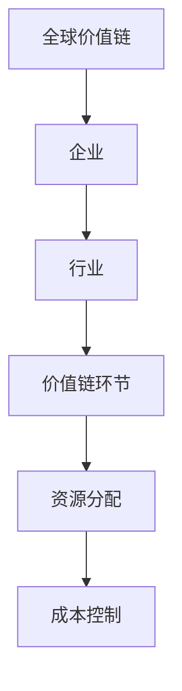
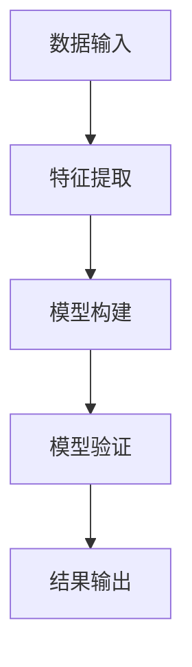
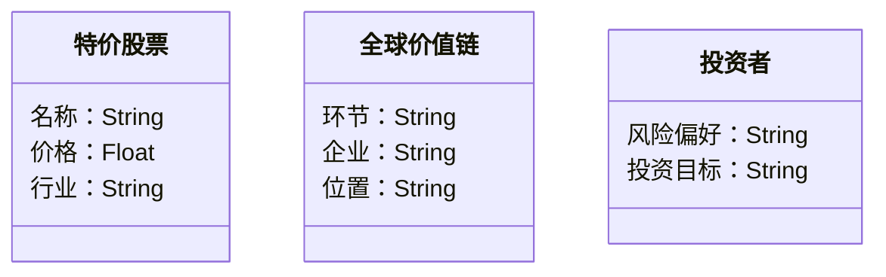
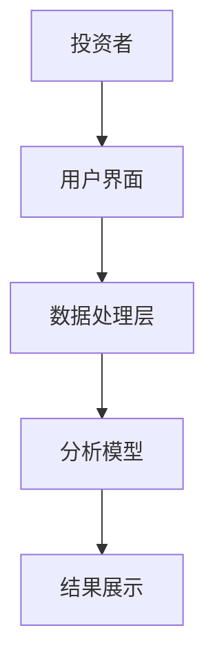
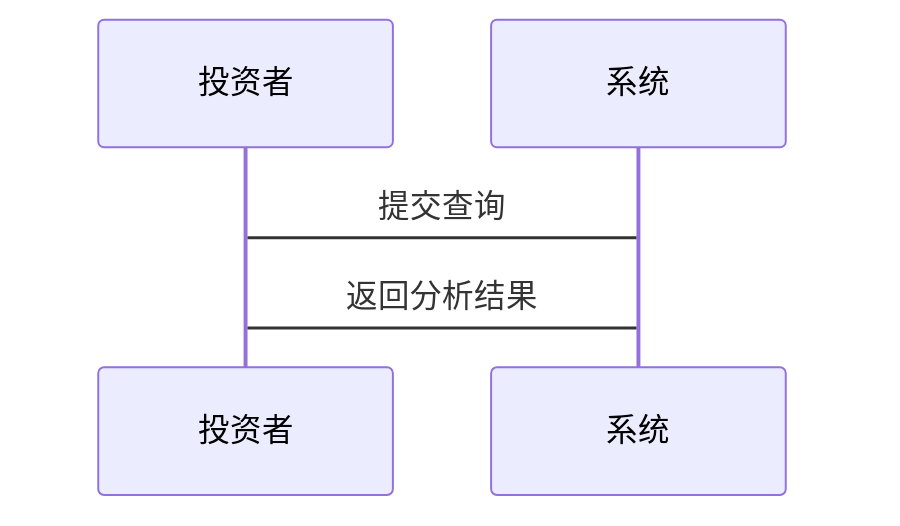

                 


# 特价股票投资中的全球价值链分析方法

> 关键词：全球价值链，特价股票，股票投资，价值分析，投资策略

> 摘要：本文系统地介绍了如何在全球价值链的视角下，分析和选择具有投资价值的特价股票。通过分析全球价值链的核心要素、构建分析模型、设计系统架构，并结合实际案例进行实战分析，本文为投资者提供了一套基于全球价值链的特价股票投资方法。本文还探讨了该方法的实际应用和注意事项，为投资者提供了有价值的参考。

---

# 第一部分: 特价股票与全球价值链分析概述

## 第1章: 特价股票与全球价值链分析的背景

### 1.1 特价股票的基本概念

#### 1.1.1 特价股票的定义与特点
特价股票通常指价格相对较低的股票，具有较高的增长潜力。其特点包括：
- 价格低廉，适合小额投资者。
- 市场流动性相对较低，波动性较大。
- 具备较高的成长潜力，可能来自新兴行业或周期性底部的公司。

#### 1.1.2 特价股票的投资价值
- 低价优势：适合投资者在市场低迷时布局。
- 增长潜力：部分特价股票可能来自快速发展的行业。
- 价值回归：某些特价股票可能因市场低估而具备反弹空间。

#### 1.1.3 全球价值链的基本概念
全球价值链是指跨国公司在全球范围内进行生产、分配和销售的链条。其核心在于通过全球分工和协作，实现资源优化配置和成本最小化。

### 1.2 全球价值链分析方法的背景

#### 1.2.1 全球化与价值链分工
全球化促进了跨国公司的兴起，企业通过在全球范围内分配生产环节，降低成本并提高效率。

#### 1.2.2 全球价值链分析的必要性
- 帮助投资者识别行业和公司的竞争优势。
- 通过分析价值链的上下游关系，发现投资机会。
- 量化公司在全球价值链中的地位和贡献。

#### 1.2.3 特价股票与全球价值链的关联
- 特价股票可能来自价值链中的关键环节。
- 全球价值链的波动会影响特价股票的市场表现。
- 通过全球价值链分析，投资者可以发现被低估的特价股票。

### 1.3 本书的研究目标与框架

#### 1.3.1 研究目标
- 探讨全球价值链对特价股票投资的指导作用。
- 构建基于全球价值链的股票分析模型。
- 提供实际的投资策略和方法。

#### 1.3.2 研究框架
- 数据收集与处理。
- 模型构建与验证。
- 实证分析与案例研究。
- 投资策略与风险控制。

---

## 第2章: 全球价值链分析的核心概念与联系

### 2.1 全球价值链的构成要素

#### 2.1.1 价值链的主体构成
- 企业：包括跨国公司和本地企业。
- 供应链：包括原材料供应商、制造商和分销商。
- 消费者：包括个人和机构投资者。

#### 2.1.2 价值链的流程环节
- 生产：制造环节。
- 分配：物流和分销环节。
- 销售：市场推广和销售环节。

#### 2.1.3 价值链的驱动因素
- 技术创新：推动价值链升级。
- 成本控制：影响企业竞争力。
- 市场需求：决定价值链的走向。

### 2.2 特价股票在全球价值链中的位置

#### 2.2.1 特价股票的行业分布
- 制造业：如电子、汽车等行业。
- 信息技术：如软件开发、互联网企业。
- 服务业：如金融、教育等行业。

#### 2.2.2 特价股票在全球价值链中的角色
- 作为价值链中的上游供应商。
- 作为价值链中的下游分销商。
- 作为价值链中的关键节点企业。

#### 2.2.3 特价股票与全球价值链的关系
- 全球价值链的波动会影响特价股票的市场表现。
- 特价股票可能在全球价值链中占据重要位置，但被市场低估。

### 2.3 全球价值链分析方法的核心要素

#### 2.3.1 数据来源与处理
- 数据来源：全球行业数据、公司财务报表、市场研究报告。
- 数据处理：清洗、整合、标准化。

#### 2.3.2 分析模型与工具
- 数据分析工具：Python、R、Excel。
- 模型构建：回归分析、因子分析、聚类分析。

#### 2.3.3 结果解读与应用
- 通过分析价值链中的位置，判断股票的投资价值。
- 结合市场趋势，制定投资策略。

### 2.4 核心概念对比表

| 对比维度 | 全球价值链 | 特价股票 |
|----------|------------|----------|
| 定义     | 生产、分配的全球链条 | 价格低廉的股票 |
| 关联性   | 企业竞争力的体现 | 投资者的关注点 |
| 作用     | 提高效率、降低成本 | 潜在的投资回报 |

### 2.5 实体关系图


---

## 第3章: 全球价值链分析的算法原理

### 3.1 数据预处理与特征提取

#### 3.1.1 数据清洗
- 去除缺失值。
- 处理异常值。

#### 3.1.2 特征选择
- 选择影响股票价值的关键指标，如市盈率、市净率、ROE等。

#### 3.1.3 数据标准化
- 使用归一化方法，将数据转化为统一的尺度。

### 3.2 基于全球价值链的股票评价模型

#### 3.2.1 数据输入
- 全球行业数据。
- 公司财务数据。
- 市场研究报告。

#### 3.2.2 特征提取
- 提取反映公司在全球价值链中的地位的特征。
- 包括市场份额、利润率、供应链稳定性等。

#### 3.2.3 模型构建
- 使用多元回归模型，预测股票的价值。
- 模型公式：
  $$ y = \beta_0 + \beta_1 x_1 + \beta_2 x_2 + \epsilon $$
  其中，$y$为股票价值，$x_i$为特征变量。

#### 3.2.4 模型验证
- 使用交叉验证方法，评估模型的准确性和稳定性。
- 计算R²值，评估模型的拟合优度。

### 3.3 算法流程图


---

## 第4章: 数学模型与公式解析

### 4.1 多元回归模型
$$ y = \beta_0 + \beta_1 x_1 + \beta_2 x_2 + \epsilon $$
其中：
- $y$：股票价值。
- $x_1$，$x_2$：影响股票价值的特征变量。
- $\beta_0$，$\beta_1$，$\beta_2$：回归系数。
- $\epsilon$：误差项。

### 4.2 模型评价指标
- R²：模型拟合优度。
- Adjusted R²：调整后的R²，考虑模型复杂度。
- P值：回归系数的显著性。

### 4.3 示例分析
假设我们有以下数据：
| 公司 | 收入（x1） | 利润率（x2） | 股票价值（y） |
|------|------------|--------------|---------------|
| A    | 100       | 20%          | 50            |
| B    | 80        | 25%          | 60            |

通过回归分析，我们得到：
$$ y = 30 + 0.5x1 + 2x2 $$
预测公司C的股票价值：
- 收入（x1）= 90
- 利润率（x2）= 22%
$$ y = 30 + 0.5 \times 90 + 2 \times 22 = 30 + 45 + 44 = 119 $$

---

## 第5章: 系统分析与架构设计

### 5.1 系统功能设计

#### 5.1.1 领域模型


#### 5.1.2 系统架构


#### 5.1.3 接口设计
- 输入接口：接受投资者的查询请求。
- 输出接口：返回分析结果和投资建议。

### 5.2 系统交互设计

#### 5.2.1 交互流程


---

## 第6章: 项目实战与案例分析

### 6.1 环境安装与配置

#### 6.1.1 安装Python
```bash
pip install numpy pandas scikit-learn
```

### 6.2 核心代码实现

#### 6.2.1 数据加载与处理
```python
import pandas as pd
import numpy as np
from sklearn.linear_model import LinearRegression

# 加载数据
data = pd.read_csv('stock_data.csv')

# 特征选择
X = data[['收入', '利润率']]
y = data['股票价值']

# 模型训练
model = LinearRegression()
model.fit(X, y)

# 预测结果
预测值 = model.predict(X)
```

#### 6.2.2 模型评估
```python
from sklearn.metrics import r2_score

r2 = r2_score(y, 预测值)
print(f"R²值为：{r2}")
```

### 6.3 案例分析与解读

#### 6.3.1 案例背景
假设我们有某公司的全球价值链数据，包括收入、利润率和股票价值。

#### 6.3.2 数据分析
- 训练模型，预测股票价值。
- 分析模型结果，制定投资策略。

#### 6.3.3 投资策略
- 选择具有较高预测价值的特价股票。
- 结合市场趋势，制定买入和卖出策略。

---

## 第7章: 总结与最佳实践

### 7.1 总结

#### 7.1.1 核心观点回顾
- 全球价值链分析是选择特价股票的重要方法。
- 数据分析和模型构建是关键步骤。
- 投资者需结合市场趋势和企业基本面进行决策。

#### 7.1.2 研究局限性
- 数据来源和质量影响分析结果。
- 模型假设可能与实际市场不符。

### 7.2 最佳实践

#### 7.2.1 投资策略
- 定期更新数据，重新评估模型。
- 结合技术分析和基本面分析。

#### 7.2.2 风险提示
- 市场波动可能导致模型失效。
- 特价股票可能存在较高的风险。

#### 7.2.3 未来研究方向
- 开发更复杂的分析模型。
- 结合人工智能技术，提高分析效率。

### 7.3 作者寄语

#### 7.3.1 结语
投资需谨慎，分析需深入。通过全球价值链分析，投资者可以更好地识别特价股票的投资价值，制定科学的投资策略。

#### 7.3.2 联系方式
如需进一步交流或合作，请联系作者。

---

作者：AI天才研究院/AI Genius Institute & 禅与计算机程序设计艺术/Zen And The Art of Computer Programming

