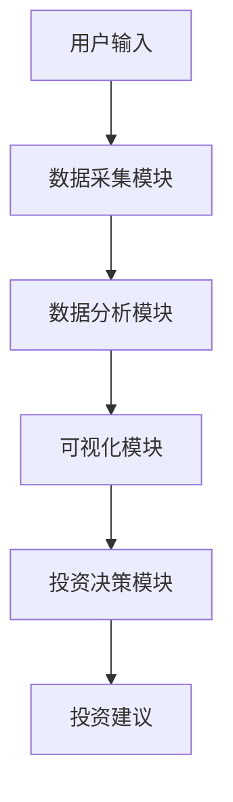

                 


# 特价股票投资中的全球创新指数与专利分析方法

## 关键词：特价股票投资，全球创新指数，专利分析，投资决策，技术创新评估

## 摘要：本文探讨如何在特价股票投资中利用全球创新指数和专利分析方法来评估公司的创新能力，进而优化投资决策。通过分析专利数据和创新指数，投资者可以更准确地识别具有潜力的创新型企业，降低投资风险，提高投资回报。

---

## 目录大纲：

1. [背景介绍](#背景介绍)
2. [核心概念与联系](#核心概念与联系)
   - 2.1 专利分析的基本原理
   - 2.2 全球创新指数的构建
3. [算法原理](#算法原理)
   - 3.1 专利分析的算法流程
   - 3.2 全球创新指数的数学模型
4. [数学模型](#数学模型)
   - 4.1 创新指数计算公式
   - 4.2 专利质量评估模型
5. [系统架构设计](#系统架构设计)
   - 5.1 系统功能模块
   - 5.2 数据流图
6. [项目实战](#项目实战)
   - 6.1 环境配置
   - 6.2 核心代码实现
7. [最佳实践与小结](#最佳实践与小结)

---

## 背景介绍

### 2.1 专利分析的基本原理

**背景介绍**

专利是技术创新的重要体现，通过分析专利数据，可以评估一家公司的技术创新能力。本文将介绍如何利用专利分析方法来辅助特价股票投资决策。

**问题背景**

在股票投资中，技术创新能力是影响公司价值的重要因素。然而，如何量化技术创新能力并应用于投资决策是一个挑战。

**问题描述**

本文旨在通过专利分析方法，量化公司的技术创新能力，并将其与股票投资相结合，寻找具有潜力的创新型企业。

**问题解决**

通过专利数据分析，识别具有高创新潜力的公司，从而优化投资组合。

**边界与外延**

本文仅关注专利分析方法在股票投资中的应用，不涉及其他因素如财务指标。

**概念结构与核心要素**

- 专利数据：包括专利数量、技术领域、申请人等。
- 创新能力：通过专利数据评估公司的创新能力。

---

## 核心概念与联系

### 2.1 专利分析的基本原理

#### 2.1.1 专利分析的核心概念

- **专利分类**：根据技术领域对专利进行分类，识别公司主要的技术方向。
- **专利质量评估**：通过专利的引用次数、权利要求复杂度等指标评估专利质量。

#### 2.1.2 专利分析的步骤与流程

1. 数据收集：获取公司专利数据。
2. 数据清洗：处理无效或重复的专利数据。
3. 数据分析：统计专利数量、技术领域分布。
4. 数据可视化：使用图表展示分析结果。

#### 2.1.3 专利分析的工具与方法

- **工具**：使用Python的pandas和matplotlib库进行数据处理和可视化。
- **方法**：采用文本挖掘技术分析专利描述，识别技术关键词。

#### 2.1.4 专利分析的局限性

- 数据获取难度：专利数据分散且不完全公开。
- 数据处理复杂性：需要清洗和预处理大量数据。

---

### 2.2 全球创新指数的构建

#### 2.2.1 创新指数的基本概念

- **创新指数**：衡量一个地区或国家创新能力的综合指标。
- **构成指标**：包括研发投入、专利数量、创新产出等。

#### 2.2.2 创新指数的计算方法

- **加权平均法**：根据各指标的重要性赋予不同的权重，计算综合指数。
- **层次分析法**：通过专家评分确定各指标权重，构建综合评价模型。

#### 2.2.3 创新指数的局限性

- 数据偏差：不同国家或地区的数据收集标准不同，可能导致偏差。
- 动态变化：创新指数需要定期更新，以反映最新的创新活动。

---

## 算法原理

### 3.1 专利分析的算法流程

#### 3.1.1 算法步骤

1. 数据收集：获取目标公司的专利数据。
2. 数据清洗：去除无效或重复的数据。
3. 数据分析：统计专利数量、技术领域分布。
4. 数据可视化：生成图表展示分析结果。

#### 3.1.2 算法实现

- 使用Python的pandas库进行数据处理。
- 使用matplotlib库进行数据可视化。

#### 3.1.3 算法代码示例

```python
import pandas as pd
import matplotlib.pyplot as plt

# 数据加载
patent_data = pd.read_csv('patent.csv')

# 数据清洗
patent_data.drop_duplicates(subset='patent_id', inplace=True)

# 数据分析
technology_counts = patent_data['technology'].value_counts()

# 数据可视化
technology_counts.plot(kind='bar', figsize=(10,6))
plt.title('Technology Distribution')
plt.xlabel('Technology')
plt.ylabel('Count')
plt.show()
```

---

### 3.2 全球创新指数的数学模型

#### 3.2.1 指标权重的确定

- 使用层次分析法（AHP）确定各指标的权重。

#### 3.2.2 综合评价模型

- 综合指数 = Σ（权重_i × 指标_i）

#### 3.2.3 模型实现

- 通过专家评分确定指标权重。
- 使用加权平均法计算综合指数。

---

## 数学模型

### 4.1 创新指数计算公式

$$ 创新指数 = \sum_{i=1}^{n} w_i \times x_i $$

其中，\( w_i \) 是第i个指标的权重，\( x_i \) 是第i个指标的得分。

### 4.2 专利质量评估模型

$$ 专利质量 = a \times 引用次数 + b \times 权利要求复杂度 $$

其中，\( a \) 和 \( b \) 是根据经验确定的系数。

---

## 系统架构设计

### 5.1 系统功能模块

- **数据采集模块**：从专利数据库中获取数据。
- **数据分析模块**：处理和分析专利数据。
- **可视化模块**：生成图表展示分析结果。
- **投资决策模块**：根据分析结果生成投资建议。

### 5.2 数据流图



---

## 项目实战

### 6.1 环境配置

- **Python版本**：Python 3.8+
- **依赖库**：pandas、numpy、matplotlib、scikit-learn

### 6.2 核心代码实现

```python
import pandas as pd
import numpy as np
import matplotlib.pyplot as plt
from sklearn.preprocessing import MinMaxScaler

# 数据加载
patent_data = pd.read_csv('patent.csv')

# 数据清洗
patent_data.dropna(inplace=True)

# 数据转换
scaler = MinMaxScaler()
scaled_data = scaler.fit_transform(patent_data[['patent_count', 'technology_diversity']])

# 模型训练
from sklearn.cluster import KMeans
kmeans = KMeans(n_clusters=3, random_state=42)
clusters = kmeans.fit_predict(scaled_data)

# 可视化
plt.figure(figsize=(10, 6))
plt.scatter(patent_data['technology_diversity'], patent_data['patent_count'], c=clusters, cmap='viridis')
plt.xlabel('Technology Diversity')
plt.ylabel('Patent Count')
plt.title('Cluster Analysis')
plt.show()
```

---

## 最佳实践与小结

### 7.1 投资策略建议

- 定期更新专利数据和创新指数。
- 结合其他财务指标进行综合评估。

### 7.2 注意事项

- 数据的准确性和及时性。
- 模型的局限性和适用性。

### 7.3 拓展阅读

- 《专利分析方法与应用》
- 《创新指数评估与经济分析》

---

## 作者：AI天才研究院 & 禅与计算机程序设计艺术

---

以上是《特价股票投资中的全球创新指数与专利分析方法》的详细目录和部分章节内容。如需进一步补充或修改，请随时告知！

