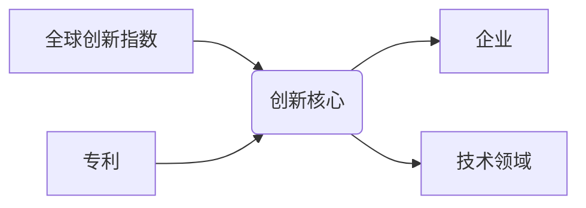
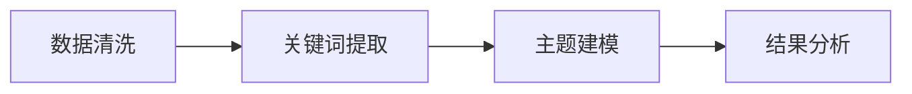
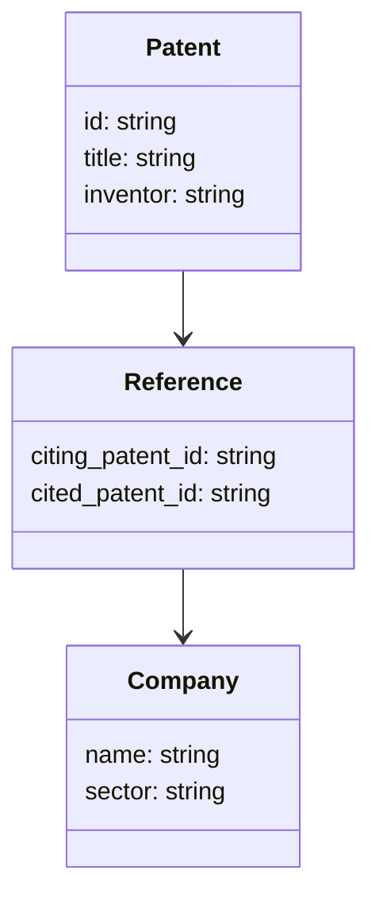
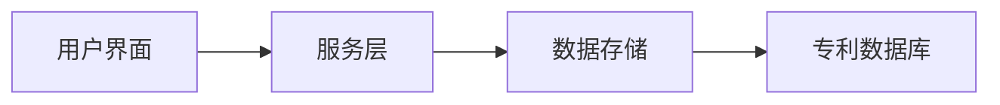
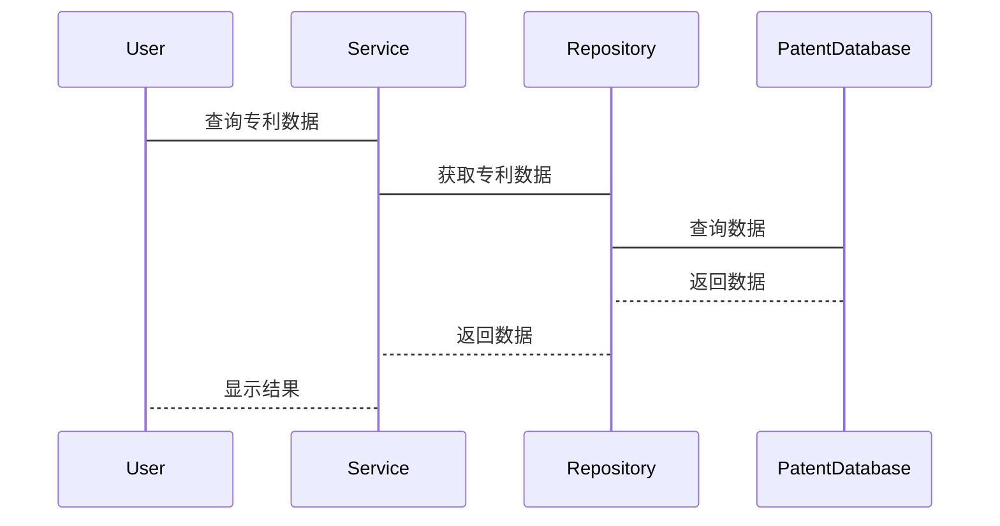

                 


# 特价股票投资中的全球创新指数与专利引用网络分析方法

> **关键词**：特价股票投资、全球创新指数、专利引用网络、网络分析算法、文本挖掘、股票投资策略

> **摘要**：  
本文探讨了如何利用全球创新指数与专利引用网络分析方法优化特价股票投资策略。通过分析专利引用网络的结构特征，结合全球创新指数的多维度评估，为投资者提供更精准的决策支持。文章详细介绍了专利引用网络分析的基本原理、算法实现及系统架构设计，并通过实战案例展示了如何利用这些方法识别高潜力股票。

---

## 第1章: 特价股票投资与全球创新指数概述

### 1.1 特价股票投资的背景与意义

#### 1.1.1 特价股票投资的定义与特点  
特价股票投资是指以低于市场价买入股票，通过长期持有或短期交易获利的投资策略。其核心在于挖掘被市场低估的优质股票，尤其是在技术创新驱动下的企业。

#### 1.1.2 全球创新指数的概念与作用  
全球创新指数（Global Innovation Index，GII）是衡量一个国家或地区创新能力的综合性指标，涵盖创新投入、创新产出等多个维度。GII能够反映一个地区的科技研发能力、知识产权保护水平等，对股票投资具有重要参考价值。

#### 1.1.3 专利引用网络分析方法的引入  
专利引用网络分析是一种通过研究专利之间的引用关系，评估技术创新影响力的方法。通过分析专利网络的结构特征，可以识别出技术创新的核心领域和关键企业，为股票投资提供数据支持。

### 1.2 全球创新指数的构成与影响

#### 1.2.1 全球创新指数的定义  
全球创新指数由多个指标构成，包括研发支出占GDP的比例、专利申请数量、科技论文发表数量等。这些指标共同反映了国家或地区的创新能力。

#### 1.2.2 全球创新指数对股票投资的影响  
技术创新能力强的地区，往往孕育更多具有核心竞争力的企业。通过分析GII，投资者可以筛选出技术创新能力强、具有长期增长潜力的企业。

#### 1.2.3 专利引用网络对股票投资的补充作用  
专利引用网络分析能够揭示技术创新的动态关系，帮助投资者识别技术创新的核心领域和关键企业，弥补GII指标的局限性。

### 1.3 专利引用网络分析的基本原理

#### 1.3.1 专利引用网络的定义  
专利引用网络是指将专利视为网络节点，通过专利之间的引用关系构建的网络结构。

#### 1.3.2 专利引用网络的构建方法  
通过爬取专利数据库中的专利数据，提取专利之间的引用关系，构建网络图。

#### 1.3.3 专利引用网络分析在股票投资中的应用  
通过分析专利网络的节点度数、中心性等特征，识别技术创新的核心企业和领域，评估企业的创新潜力。

### 1.4 本章小结  
本章介绍了特价股票投资的基本概念、全球创新指数的构成与作用，以及专利引用网络分析的基本原理。通过GII和专利网络分析的结合，为投资者提供了新的视角。

---

## 第2章: 全球创新指数与专利引用网络的核心概念

### 2.1 全球创新指数的核心要素

#### 2.1.1 创新投入  
创新投入包括研发支出、研发人员数量等，反映一个地区的创新能力基础。

#### 2.1.2 创新产出  
创新产出包括专利申请数量、科技论文数量等，反映一个地区的创新能力成果。

#### 2.1.3 创新环境  
创新环境包括政策支持、知识产权保护水平等，影响技术创新的可持续性。

### 2.2 专利引用网络的属性特征对比

#### 2.2.1 专利引用网络的节点属性  
节点属性包括专利的发明人、申请日期、技术领域等。

#### 2.2.2 专利引用网络的边属性  
边属性包括引用关系的方向性、引用强度等。

#### 2.2.3 专利引用网络的网络属性  
网络属性包括网络密度、平均路径长度、社区划分等。

### 2.3 全球创新指数与专利引用网络的ER实体关系图

#### 图2-1: 全球创新指数与专利引用网络的实体关系图  


---

## 第3章: 专利引用网络分析的算法原理

### 3.1 网络分析算法

#### 图3-1: 专利引用网络分析算法流程图  


#### 3.1.1 算法实现的Python代码示例  
```python
import networkx as nx

def build_patent_network(patents, references):
    G = nx.DiGraph()
    for ref in references:
        G.add_edge(ref['cited_patent_id'], ref['citing_patent_id'])
    return G
```

### 3.2 文本挖掘算法

#### 图3-2: 专利文本挖掘算法流程图  


#### 3.2.1 算法实现的Python代码示例  
```python
from sklearn.feature_extraction.text import TfidfVectorizer

def extract_keywords(texts):
    vectorizer = TfidfVectorizer()
    X = vectorizer.fit_transform(texts)
    keywords = vectorizer.get_feature_names_out()
    return keywords
```

### 3.3 算法原理的数学模型与公式

#### 3.3.1 网络中心性计算公式  
$$ \text{中心性} = \frac{\sum_{j} a_{ij}}{\sum_{j} a_{ij}} $$  

#### 3.3.2 文本挖掘中的TF-IDF计算公式  
$$ \text{TF-IDF} = \text{TF} \times \log\left( \frac{N}{DF} \right) $$  

---

## 第4章: 系统分析与架构设计

### 4.1 问题场景介绍  
通过构建专利引用网络分析系统，帮助投资者识别技术创新能力强的企业。

### 4.2 系统功能设计

#### 图4-1: 领域模型类图  


### 4.3 系统架构设计

#### 图4-2: 系统架构图  


### 4.4 系统接口设计  
定义REST接口，实现专利数据的查询和分析功能。

### 4.5 系统交互流程图  


---

## 第5章: 项目实战

### 5.1 环境安装  
安装Python、networkx、numpy、sklearn等工具。

### 5.2 核心代码实现

#### 5.2.1 数据预处理代码  
```python
import requests
import json

def fetch_patents(api_key, query):
    headers = {'Authorization': f'Bearer {api_key}'}
    response = requests.get(f'https://api.example.com/patents?query={query}', headers=headers)
    return json.loads(response.text)
```

#### 5.2.2 网络构建与分析代码  
```python
from networkx import nx

def analyze_patent_network(patents, references):
    G = nx.DiGraph()
    for ref in references:
        G.add_edge(ref['cited_patent_id'], ref['citing_patent_id'])
    # 计算节点度数
    degrees = {node: G.degree[node] for node in G.nodes()}
    return degrees
```

### 5.3 实际案例分析  
通过分析某领域的专利网络，识别出创新核心企业，并评估其投资价值。

### 5.4 项目总结  
总结项目成果，分析存在的问题，并提出改进建议。

---

## 第6章: 最佳实践与小结

### 6.1 小结  
本文通过全球创新指数与专利引用网络分析，为特价股票投资提供了新的方法论。

### 6.2 注意事项  
投资者应结合多维度数据进行综合分析，避免单一指标的局限性。

### 6.3 拓展阅读  
推荐阅读相关领域的学术论文和实践报告，深入理解技术创新与股票投资的关系。

---

**作者：AI天才研究院/AI Genius Institute & 禅与计算机程序设计艺术 /Zen And The Art of Computer Programming**

