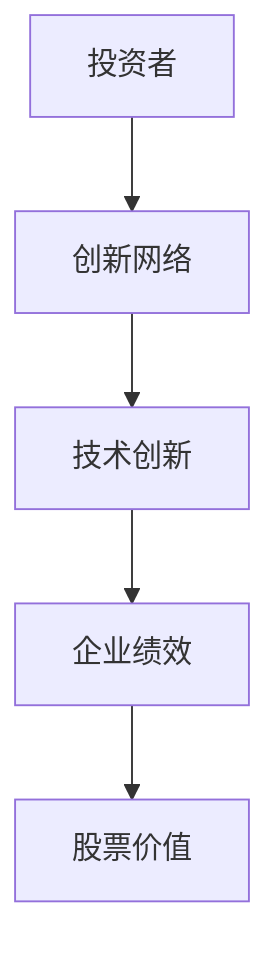
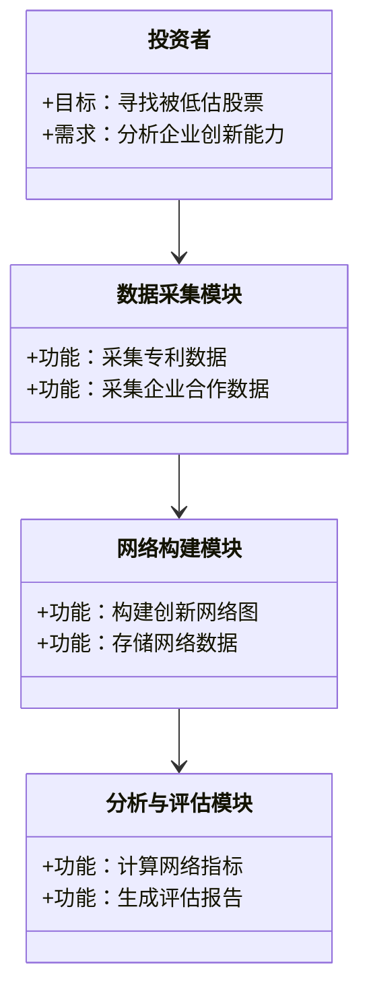

                 


# 特价股票投资中的全球创新网络分析方法

## 关键词：特价股票、创新网络、网络分析、股票投资、技术分析、创新评估、数据挖掘

## 摘要：  
本文探讨了如何利用全球创新网络分析方法指导特价股票投资。通过分析技术创新、企业绩效与股票价值之间的关系，提出了基于网络分析的股票投资策略。文章结合理论与实践，详细阐述了创新网络分析的核心概念、算法原理及系统架构，并通过具体案例展示了如何利用该方法识别潜在投资机会，为投资者提供科学依据。

---

## 第一部分：背景与概念

### 第1章：特价股票投资与全球创新网络分析的背景

#### 1.1 特价股票投资的基本概念  
- **定义与特点**：特价股票是指市场价格低于其内在价值的股票，通常被视为被市场低估的投资机会。  
- **市场背景**：在经济波动或市场调整期间，许多优质股票可能因市场情绪或短期因素被低估，为投资者提供了低价买入的良机。  
- **核心目标与策略**：通过挖掘被市场忽视的潜力股，利用价值投资策略实现超额收益。

#### 1.2 全球创新网络的基本概念  
- **创新网络的定义**：创新网络是指由企业、研究机构、政府等多方主体构成的知识创造与共享网络。  
- **构成要素**：包括技术创新、知识流动、合作关系、知识产权保护等。  
- **发展趋势**：全球化背景下，创新网络呈现跨国化、专业化、网络化特征。

#### 1.3 特价股票投资与全球创新网络的关联性  
- **创新网络对股票价值的影响**：技术创新能力强的企业往往具有更高的市场竞争力和增长潜力，能够为股东创造更多价值。  
- **网络分析在股票投资中的应用价值**：通过分析创新网络的结构和动态，识别具有竞争优势的企业，为投资决策提供依据。

---

### 第2章：全球创新网络分析的核心概念与联系

#### 2.1 创新网络分析的核心原理  
- **节点与关系**：节点代表创新主体（企业、研究机构等），关系代表创新合作或知识流动。  
- **网络结构特征**：包括中心性（Degree、Betweenness）、聚类性（Clustering）等指标。  
- **动态演化机制**：创新网络通过合作、知识共享等方式不断演化和优化。

#### 2.2 全球创新网络分析的关键指标  
- **网络密度与连接强度**：反映网络中创新主体之间的连接程度。  
- **网络中心性与关键节点识别**：识别网络中的核心企业或机构。  
- **网络模块化与社区划分**：将创新网络划分为不同的创新社区，分析各社区的特征。

#### 2.3 创新网络与股票投资的实体关系图  



---

## 第二部分：算法与系统架构

### 第3章：全球创新网络分析的算法原理

#### 3.1 数据采集与预处理  
- **数据来源**：包括专利数据库、学术论文、企业合作数据等。  
- **数据清洗**：去除噪声数据，标准化处理。  
- **数据存储**：构建结构化的数据库，便于后续分析。

#### 3.2 网络构建与分析  
- **网络构建算法**：基于数据构建图模型，如使用边连接表示合作关系。  
- **网络分析**：计算节点度数、中心性等指标，识别关键节点和社区。

#### 3.3 关键算法实现  
- **网络中心性计算**：使用度数、中间性等算法。  
- **网络社区检测**：使用Louvain算法或K-means算法。  
- **网络演化分析**：通过时间序列分析技术，观察网络的变化趋势。

---

### 第4章：系统分析与架构设计方案

#### 4.1 问题场景介绍  
- **问题痛点**：传统股票分析方法依赖财务指标，难以全面评估企业的创新能力和市场竞争力。  
- **创新点**：引入全球创新网络分析方法，从知识流动和合作网络的角度评估企业价值。

#### 4.2 系统功能设计  
- **数据采集模块**：负责采集专利数据、企业合作数据等。  
- **网络构建模块**：构建创新网络图模型。  
- **分析与评估模块**：计算网络指标，评估企业创新能力和市场竞争力。

#### 4.3 系统架构设计  



---

## 第三部分：项目实战

### 第5章：基于全球创新网络的特价股票投资分析

#### 5.1 项目介绍  
- **项目目标**：利用全球创新网络分析方法，筛选具有潜在投资价值的特价股票。  
- **数据来源**：以某行业的专利数据和企业合作数据为例。

#### 5.2 核心实现  

```python
import networkx as nx
from sklearn.metrics import pairwise_distances

# 示例代码：计算节点度数
def calculate_degree centrality(graph):
    degree = nx.degree_centrality(graph)
    return degree

# 示例代码：构建网络
graph = nx.Graph()
graph.add_edges_from([("A", "B"), ("B", "C"), ("C", "D")])
degree = calculate_degree centrality(graph)
print(degree)
```

#### 5.3 案例分析  
- **数据处理**：以某行业为例，展示如何清洗和处理数据。  
- **网络分析**：识别关键企业，并分析其在网络中的地位。  
- **投资决策**：基于网络分析结果，筛选出具有竞争优势的特价股票。

---

## 第四部分：最佳实践与小结

### 第6章：全球创新网络分析方法的总结与展望

#### 6.1 最佳实践  
- **数据质量**：确保数据的完整性和准确性。  
- **模型调优**：根据实际需求调整网络分析参数。  
- **持续学习**：关注全球创新网络的动态变化，及时更新分析方法。

#### 6.2 小结  
全球创新网络分析方法为特价股票投资提供了新的视角和工具，通过分析技术创新和企业绩效的关系，投资者可以更精准地识别潜在投资机会。

#### 6.3 注意事项  
- 避免过度依赖单一指标，结合多种方法进行分析。  
- 注意市场波动对网络结构的影响，及时调整投资策略。

#### 6.4 拓展阅读  
- 推荐阅读《网络科学导论》、《创新管理》等书籍，深入理解创新网络的理论与应用。

---

## 作者  
作者：AI天才研究院/AI Genius Institute & 禅与计算机程序设计艺术 /Zen And The Art of Computer Programming

