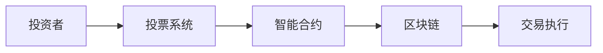

                 


# 特价股票投资中的分布式自治组织(DAO)决策方法

## 关键词：分布式自治组织（DAO）、股票投资、智能合约、区块链、决策算法

## 摘要：本文探讨了分布式自治组织（DAO）在特价股票投资中的应用，分析了其决策方法的核心原理、算法实现、系统架构以及实际案例，旨在为投资者提供一种去中心化、透明高效的投资决策方案。

---

## 第一部分：分布式自治组织（DAO）在特价股票投资中的背景与概述

### 第1章：DAO与特价股票投资的背景

#### 1.1 特价股票投资的背景与现状
- 特价股票：定义为价格低于市场价值的股票，通常具有较高的增长潜力。
- 投资者面临的问题：信息不对称、决策风险高、交易成本高等。

#### 1.2 分布式自治组织（DAO）的定义与特点
- DAO：基于区块链技术的去中心化组织，通过智能合约自动执行决策。
- 特点：透明性、去中心化、自治性、抗审查性。

#### 1.3 特价股票投资中引入DAO的必要性
- 提高决策透明度和参与度。
- 降低中间机构的成本和风险。
- 实现去中心化的投资决策和管理。

### 第2章：DAO在股票投资中的核心概念

#### 2.1 DAO决策的核心机制
- 智能合约：自动执行决策规则的脚本。
- 分布式投票：成员通过投票共同决定投资策略。

#### 2.2 特价股票投资中的DAO决策优势
- 集体决策：避免个体决策的主观性和片面性。
- 透明记录：所有决策过程可追溯，增强信任。
- 自动执行：减少人为干预，提高效率。

## 第二部分：DAO决策方法的算法与数学模型

### 第3章：分布式投票算法

#### 3.1 分布式投票算法的基本原理
- 每个节点独立计算投票结果。
- 通过共识机制达成一致。

#### 3.2 智能合约中的投票实现
- 投票触发条件：如股票价格波动触发投票。
- 投票结果处理：通过智能合约执行相应操作。

#### 3.3 算法实现示例
```python
def distributed_vote(participants, threshold):
    votes = sum(participant.vote for participant in participants)
    if votes >= threshold:
        return "execute"
    else:
        return "abort"
```

### 第4章：共识算法在DAO中的应用

#### 4.1 共识算法的分类与选择
- PoW（工作量证明）：安全性高，但效率较低。
- PoS（权益证明）：效率高，但安全性依赖于质押资产。

#### 4.2 选择共识算法的影响因素
- 网络规模：节点数量多，选择效率高的算法。
- 安全需求：高安全性的场景选择PoW。

## 第三部分：系统架构与实现

### 第5章：DAO决策系统的架构设计

#### 5.1 系统功能模块
- 用户管理：身份验证与权限管理。
- 投票系统：发起投票、统计结果。
- 智能合约：执行决策指令。

#### 5.2 系统架构图


### 第6章：智能合约与区块链实现

#### 6.1 智能合约的编写与部署
- 使用Solidity编写智能合约，部署在以太坊网络上。

#### 6.2 智能合约的执行流程
- 投票通过后，智能合约自动触发交易执行。

## 第四部分：项目实战与案例分析

### 第7章：环境搭建与代码实现

#### 7.1 环境搭建
- 安装以太坊钱包（如Metamask）和Solidity编译器。

#### 7.2 核心代码实现
```solidity
contract StockInvestment {
    function vote(uint price) public returns (bool) {
        if (price < targetPrice) {
            return true;
        }
        return false;
    }
}
```

### 第8章：案例分析与结果解读

#### 8.1 实际案例：假设目标股价为10美元
- 投票结果：超过60%的投票同意购买。
- 智能合约执行：自动购买股票，记录交易在区块链上。

## 第五部分：总结与展望

### 第9章：总结

#### 9.1 本文的主要内容
- DAO在特价股票投资中的应用。
- 分布式投票和共识算法的实现。
- 系统架构与智能合约的设计。

#### 9.2 本文的创新点
- 提出了一种基于DAO的股票投资决策方法。
- 结合智能合约和区块链技术实现去中心化决策。

### 第10章：展望

#### 10.1 未来研究方向
- 提高DAO决策的效率和安全性。
- 探索更多区块链技术在金融领域的应用。

#### 10.2 对投资者的建议
- 了解DAO的运作机制。
- 关注相关技术的发展和应用。

---

## 作者：AI天才研究院/AI Genius Institute & 禅与计算机程序设计艺术 /Zen And The Art of Computer Programming

---

以上内容是对《特价股票投资中的分布式自治组织(DAO)决策方法》的技术博客文章的详细思考和结构化输出。

