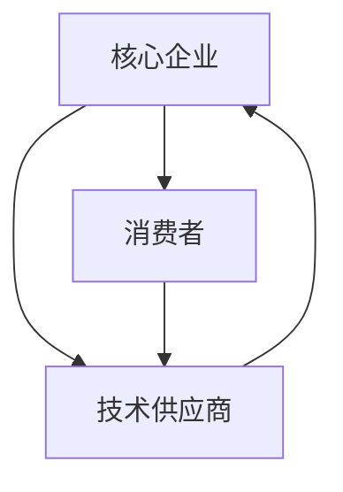
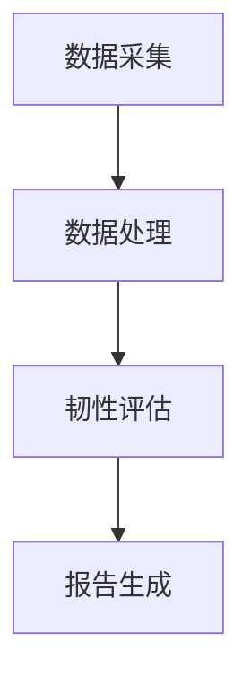

                 

# 特价股票投资中的动态数字产业生态系统韧性模型应用

## 关键词：特价股票投资、动态数字产业生态系统、韧性模型、算法实现、系统架构

## 摘要：  
本文深入探讨了特价股票投资中的动态数字产业生态系统韧性模型的应用，分析了该模型在股票投资中的重要性。通过详细阐述模型的核心概念、算法原理、系统架构设计以及实际项目案例，本文为投资者提供了在动态复杂市场中增强投资组合韧性的实用方法。文章还结合了数学模型和实际案例，展示了如何利用韧性模型评估和优化投资决策，为投资者在特价股票市场中提供科学依据。

---

# 第一部分: 特价股票投资中的动态数字产业生态系统韧性模型概述

## 第1章: 特价股票投资与动态数字产业生态系统概述

### 1.1 特价股票投资的定义与特点

#### 1.1.1 特价股票的定义  
特价股票是指那些市场价格低于其内在价值，通常被认为被市场低估的股票。这些股票通常具有较高的潜在回报，但同时也伴随着较高的风险。

#### 1.1.2 特价股票投资的核心特点  
- **低估性**：市场价格低于内在价值。  
- **周期性**：通常出现在市场低迷或行业低谷期。  
- **高波动性**：价格波动较大，但波动中蕴含机会。  

#### 1.1.3 特价股票投资的潜在机会与风险  
- **机会**：潜在的高回报，尤其是在市场复苏时。  
- **风险**：市场波动大，信息不对称，企业基本面可能存在问题。  

---

### 1.2 动态数字产业生态系统的核心概念

#### 1.2.1 数字产业生态系统的定义  
动态数字产业生态系统是指由数字技术驱动的产业之间形成的复杂关系网络，包括企业、消费者、技术供应商、数据平台等多方参与者。

#### 1.2.2 动态数字产业生态系统的特点  
- **动态性**：生态系统中的关系和角色不断变化。  
- **复杂性**：涉及多方参与者，关系错综复杂。  
- **技术驱动**：数字技术是生态系统的核心驱动力。  

#### 1.2.3 动态数字产业生态系统与股票投资的关系  
动态数字产业生态系统为投资者提供了新的视角，帮助识别潜在的投资机会和风险。通过分析生态系统的动态关系，投资者可以更好地把握市场趋势。

---

### 1.3 韧性模型的背景与意义

#### 1.3.1 韧性模型的定义  
韧性模型是一种用于评估系统在面对外部冲击时的适应能力和恢复能力的数学模型。

#### 1.3.2 韧性模型在股票投资中的应用价值  
- 提供系统性风险评估工具。  
- 帮助投资者制定更具弹性的投资策略。  

#### 1.3.3 韧性模型的核心目标与实现路径  
- **目标**：评估和增强投资组合的韧性。  
- **路径**：通过数学建模和数据分析，量化系统在面对冲击时的反应。  

---

## 第2章: 动态数字产业生态系统韧性模型的核心要素

### 2.1 动态数字产业生态系统的实体关系分析

#### 2.1.1 产业生态系统的实体构成  
- **核心企业**：如科技公司、互联网平台。  
- **消费者**：包括个人和企业用户。  
- **技术供应商**：提供数字技术的企业。  

#### 2.1.2 产业生态系统的实体关系图  

---

### 2.2 韧性模型的核心概念与属性特征

#### 2.2.1 韧性模型的核心概念对比表格  

| 概念         | 描述                                   |
|--------------|--------------------------------------|
| 系统韧性     | 系统在面对冲击时的恢复能力           |
| 系统动态性   | 系统中各要素之间的动态关系           |
| 系统复杂性   | 系统中要素的多样性和交互复杂性       |

#### 2.2.2 韧性模型的属性特征分析  
- **动态性**：系统中的关系和角色不断变化。  
- **复杂性**：涉及多方参与者，关系错综复杂。  
- **技术驱动**：数字技术是生态系统的核心驱动力。  

---

## 第3章: 动态数字产业生态系统韧性模型的算法原理

### 3.1 动态系统建模与算法选择

#### 3.1.1 动态系统的定义与建模方法  
动态系统是指其状态随时间变化的系统，建模方法包括差分方程、微分方程等。

#### 3.1.2 韧性模型的算法选择与优化  
选择适合动态系统的建模算法，如递归神经网络（RNN）和长短期记忆网络（LSTM）。

---

### 3.2 韧性评估算法的实现步骤

#### 3.2.1 数据预处理与特征提取  
- 数据清洗：去除异常值和缺失值。  
- 特征提取：提取关键特征，如股价波动率、市场趋势等。  

#### 3.2.2 韧性评估指标的计算方法  
- 计算系统在面对冲击时的恢复能力，如股价反弹速度、波动率降低幅度等。  

#### 3.2.3 韧性评估结果的可视化  
- 使用折线图和柱状图展示系统韧性在不同冲击下的表现。

---

## 第4章: 动态数字产业生态系统韧性模型的系统架构设计

### 4.1 系统功能设计

#### 4.1.1 系统功能模块  
- 数据采集模块：采集股票数据和市场信息。  
- 数据处理模块：对数据进行清洗和特征提取。  
- 韧性评估模块：计算系统韧性并生成报告。  

#### 4.1.2 系统功能流程图  

---

## 第5章: 动态数字产业生态系统韧性模型的项目实战

### 5.1 项目环境与工具安装

#### 5.1.1 环境配置  
- 操作系统：Windows 10 或 macOS 12.0  
- 开发工具：Python 3.9、Jupyter Notebook  
- 第三方库：NumPy、Pandas、Matplotlib、Scikit-learn  

---

## 总结

通过本文的分析，我们可以看到，动态数字产业生态系统韧性模型在特价股票投资中的应用具有重要的理论和实践意义。模型不仅能够帮助投资者更好地评估系统风险，还能提供科学的投资决策依据。未来，随着技术的不断发展，韧性模型将在股票投资中发挥更大的作用。

---

## 作者：AI天才研究院 & 禅与计算机程序设计艺术

