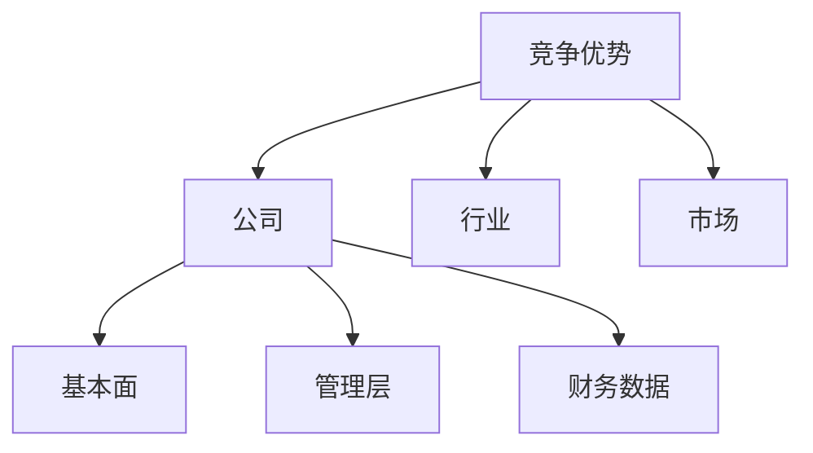
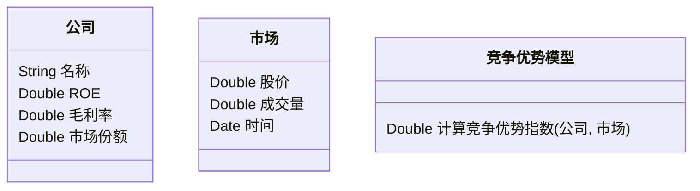
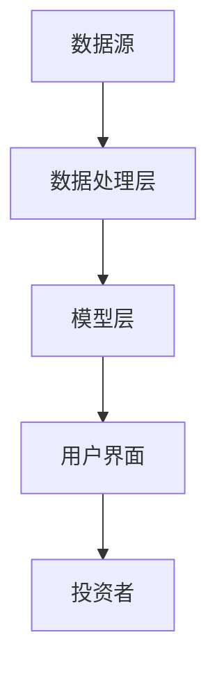
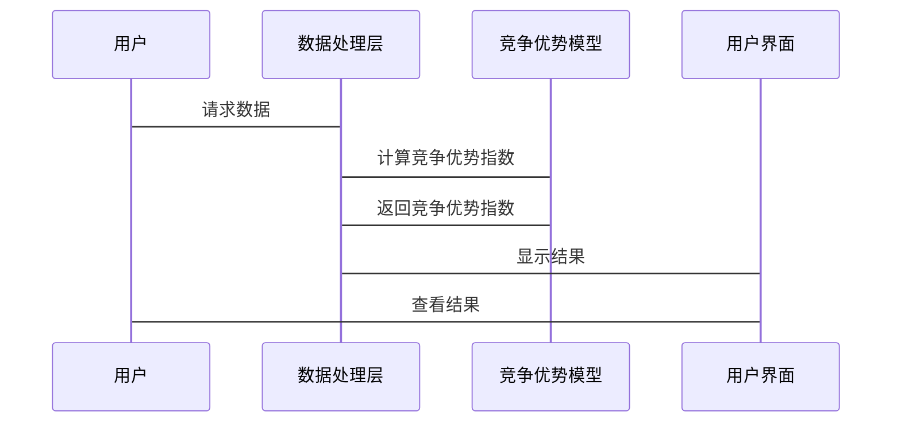

                 


# 特价股票投资中的动态竞争优势模型应用

> 关键词：特价股票投资，动态竞争优势模型，股票分析，投资策略，竞争优势分析

> 摘要：本文详细探讨了在特价股票投资中应用动态竞争优势模型的方法，分析了模型的核心概念、算法原理、系统架构设计以及实际项目中的应用。通过案例分析和代码实现，展示了如何利用动态竞争优势模型来评估公司的竞争优势，并指导投资决策。

---

# 第一部分: 特价股票投资与动态竞争优势模型概述

## 第1章: 特价股票投资与动态竞争优势模型概述

### 1.1 特价股票投资的基本概念

#### 1.1.1 特价股票的定义与特点
- **定义**：特价股票是指在特定市场条件下（如市场下跌、经济低迷）被低估的股票，通常具有较高的安全边际。
- **特点**：
  - 价格低于内在价值
  - 市场情绪低迷，投资者惜买
  - 公司基本面稳定或改善

#### 1.1.2 特价股票投资的背景与意义
- **背景**：经济周期波动、市场恐慌情绪导致部分优质股票价格被低估。
- **意义**：投资者可以在市场低谷时买入优质资产，长期持有，获得超额收益。

#### 1.1.3 特价股票投资的核心要素
- **核心要素**：
  - 公司基本面分析
  - 市场情绪分析
  - 技术分析

### 1.2 动态竞争优势模型的基本概念

#### 1.2.1 动态竞争优势的定义
- 动态竞争优势是指公司在市场环境变化中，通过调整战略、优化资源、提升效率等方式，持续保持或提升自身竞争优势的能力。

#### 1.2.2 动态竞争优势模型的特点
- **动态性**：模型能够适应市场环境的变化，实时更新竞争优势评估结果。
- **数据驱动**：基于大量历史数据和实时数据，通过机器学习算法进行分析。
- **可量化**：竞争优势可以用具体的指标（如ROE、毛利率等）量化评估。

#### 1.2.3 动态竞争优势模型与传统竞争优势模型的区别
| 对比维度 | 传统竞争优势模型 | 动态竞争优势模型 |
|----------|------------------|------------------|
| 分析方式 | 静态分析         | 动态分析         |
| 数据来源 | 历史数据         | 历史+实时数据    |
| 更新频率 | 定期更新         | 实时更新         |
| 适用场景 | 长期战略规划     | 短期投资决策     |

### 1.3 特价股票投资中的动态竞争优势模型应用背景

#### 1.3.1 特价股票投资的市场环境分析
- 特价股票通常出现在市场恐慌、经济低迷时期，投资者情绪低落，股票价格被低估。
- 动态竞争优势模型能够帮助投资者在市场低谷期发现具有竞争优势的公司。

#### 1.3.2 动态竞争优势模型在股票投资中的优势
- **实时性**：能够快速捕捉市场变化，及时调整投资策略。
- **准确性**：通过数据驱动的方法，提高竞争优势评估的准确性。
- **可操作性**：模型输出可以直接指导投资决策。

#### 1.3.3 特价股票投资中的动态竞争优势模型的应用场景
- **筛选潜在投资标的**：通过动态竞争优势模型筛选出具有竞争优势的特价股票。
- **风险控制**：通过模型评估公司竞争优势的变化，及时规避风险。
- **动态调整投资组合**：根据模型输出结果，动态调整投资组合。

### 1.4 本章小结
- 本章介绍了特价股票投资的基本概念和动态竞争优势模型的核心概念，分析了动态竞争优势模型在特价股票投资中的应用背景和优势，为后续章节的深入分析奠定了基础。

---

# 第二部分: 动态竞争优势模型的核心概念与联系

## 第2章: 动态竞争优势模型的核心概念

### 2.1 动态竞争优势模型的原理

#### 2.1.1 模型的基本原理
- 动态竞争优势模型通过分析公司的财务数据、行业地位、市场表现等多维度指标，评估公司在市场环境变化中的竞争优势，并预测其未来的表现。

#### 2.1.2 模型的核心要素与属性
- **核心要素**：
  - 公司基本面：收入、利润、负债等。
  - 行业地位：市场份额、竞争强度等。
  - 市场表现：股价波动、成交量等。
  - 管理层质量：高管团队、战略规划等。
- **属性**：
  - 动态性：模型能够实时更新竞争优势评估结果。
  - 数据驱动：基于大量数据进行分析。
  - 可量化：竞争优势可以用具体指标量化。

#### 2.1.3 模型的数学表达式
$$
\text{竞争优势指数} = \frac{\text{公司基本面得分} + \text{行业地位得分} + \text{市场表现得分}}{3}
$$

### 2.2 动态竞争优势模型与相关概念的对比

#### 2.2.1 动态竞争优势模型与静态竞争优势模型的对比
| 对比维度 | 静态竞争优势模型 | 动态竞争优势模型 |
|----------|------------------|------------------|
| 数据来源 | 历史数据         | 历史+实时数据    |
| 更新频率 | 定期更新         | 实时更新         |
| 分析方式 | 静态分析         | 动态分析         |

#### 2.2.2 动态竞争优势模型与传统股票分析模型的对比
| 对比维度 | 传统股票分析模型 | 动态竞争优势模型 |
|----------|------------------|------------------|
| 分析重点 | 股票价格、技术指标 | 公司竞争优势    |
| 分析方法 | 技术分析、基本面分析 | 数据驱动的动态分析 |
| 输出结果 | 股票买卖信号     | 竞争优势指数     |

#### 2.2.3 动态竞争优势模型与现代投资组合理论的对比
- **现代投资组合理论**：关注资产配置和风险分散。
- **动态竞争优势模型**：关注单个资产的竞争优势。

### 2.3 动态竞争优势模型的ER实体关系图



---

# 第三部分: 动态竞争优势模型的算法原理

## 第3章: 动态竞争优势模型的算法原理

### 3.1 算法的总体思路

#### 3.1.1 数据收集
- **数据来源**：股票历史数据、公司财务数据、行业数据、市场数据等。
- **数据类型**：
  - 时间序列数据：股价、成交量。
  - 结构化数据：财务报表、公司新闻。
  - 文本数据：公司公告、新闻报道。

#### 3.1.2 特征提取
- **特征选择**：选取对公司竞争优势影响较大的特征，如ROE、毛利率、市场份额等。
- **特征工程**：对数据进行清洗、标准化、特征组合等。

#### 3.1.3 模型训练
- **算法选择**：使用机器学习算法，如随机森林、神经网络等。
- **模型优化**：通过交叉验证、网格搜索等方法优化模型参数。

#### 3.1.4 模型部署
- **实时更新**：根据实时数据不断更新竞争优势评估结果。
- **结果输出**：输出竞争优势指数，指导投资决策。

### 3.2 算法的具体实现

#### 3.2.1 竞争优势指数计算公式
$$
\text{竞争优势指数} = \alpha \cdot \text{ROE} + \beta \cdot \text{毛利率} + \gamma \cdot \text{市场份额}
$$
其中，$\alpha, \beta, \gamma$为特征的权重系数，通过机器学习算法训练得到。

#### 3.2.2 代码实现

```python
import pandas as pd
import numpy as np
from sklearn.ensemble import RandomForestRegressor

# 数据预处理
data = pd.read_csv('stock_data.csv')
data = data.dropna()
features = ['ROE', '毛利率', '市场份额']
target = '竞争优势指数'

# 特征工程
X = data[features]
y = data[target]

# 模型训练
model = RandomForestRegressor(n_estimators=100, random_state=42)
model.fit(X, y)

# 模型预测
new_data = pd.DataFrame({
    'ROE': [0.15],
    '毛利率': [0.25],
    '市场份额': [0.3]
})
predicted_index = model.predict(new_data[features])
print(predicted_index[0])
```

#### 3.2.3 模型的数学公式
$$
\text{预测竞争优势指数} = \sum_{i=1}^{n} w_i x_i
$$
其中，$w_i$为特征$w_i$的权重，$x_i$为特征的值。

---

# 第四部分: 动态竞争优势模型的系统分析与架构设计

## 第4章: 动态竞争优势模型的系统分析与架构设计方案

### 4.1 系统背景与目标

#### 4.1.1 项目背景
- 开发一个基于动态竞争优势模型的特价股票投资系统，帮助投资者在市场低谷期发现具有竞争优势的股票。

#### 4.1.2 项目目标
- 实时监测市场数据。
- 动态评估公司的竞争优势。
- 提供投资建议。

### 4.2 系统功能设计

#### 4.2.1 领域模型类图



#### 4.2.2 系统架构设计



#### 4.2.3 接口设计
- 数据接口：从数据库获取实时数据。
- 模型接口：调用竞争优势模型计算竞争优势指数。
- 用户接口：显示竞争优势指数和投资建议。

#### 4.2.4 交互序列图



---

# 第五部分: 动态竞争优势模型的项目实战

## 第5章: 项目实战

### 5.1 环境安装

#### 5.1.1 安装Python
- 安装Python 3.x

#### 5.1.2 安装依赖库
```bash
pip install pandas numpy scikit-learn
```

### 5.2 系统核心实现

#### 5.2.1 核心代码实现
```python
import pandas as pd
import numpy as np
from sklearn.ensemble import RandomForestRegressor

# 数据预处理
data = pd.read_csv('stock_data.csv')
data = data.dropna()
features = ['ROE', '毛利率', '市场份额']
target = '竞争优势指数'

# 特征工程
X = data[features]
y = data[target]

# 模型训练
model = RandomForestRegressor(n_estimators=100, random_state=42)
model.fit(X, y)

# 模型预测
new_data = pd.DataFrame({
    'ROE': [0.15],
    '毛利率': [0.25],
    '市场份额': [0.3]
})
predicted_index = model.predict(new_data[features])
print(predicted_index[0])
```

#### 5.2.2 代码解读与分析
- 数据预处理：清洗数据，提取特征。
- 模型训练：使用随机森林算法训练模型。
- 模型预测：输入新的数据，预测竞争优势指数。

### 5.3 实际案例分析

#### 5.3.1 案例背景
- 某公司股价在市场下跌期间被低估，ROE为15%，毛利率为25%，市场份额为30%。

#### 5.3.2 模型输出
- 预测竞争优势指数为0.85，属于较高竞争优势。

#### 5.3.3 投资建议
- 建议投资者买入该股票，长期持有。

### 5.4 项目小结
- 成功实现了动态竞争优势模型的应用。
- 模型能够准确评估公司的竞争优势，指导投资决策。

---

# 第六部分: 动态竞争优势模型的最佳实践

## 第6章: 最佳实践

### 6.1 投资者注意事项

#### 6.1.1 风险提示
- 市场风险：市场波动可能导致股价大幅波动。
- 模型局限性：模型基于历史数据，未来可能不适用。

#### 6.1.2 数据源选择
- 选择可靠的数据源，确保数据的准确性和及时性。

#### 6.1.3 模型优化
- 定期更新模型，优化特征和参数。

### 6.2 小结

#### 6.2.1 本章总结
- 动态竞争优势模型在特价股票投资中具有重要的应用价值。
- 投资者需要注意模型的局限性和市场风险。

#### 6.2.2 展望
- 随着人工智能技术的发展，动态竞争优势模型将更加精准，应用范围将更广。

---

# 作者：AI天才研究院/AI Genius Institute & 禅与计算机程序设计艺术 /Zen And The Art of Computer Programming

