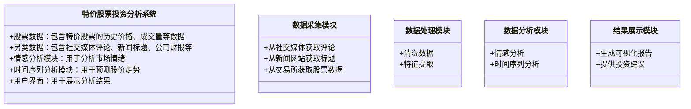
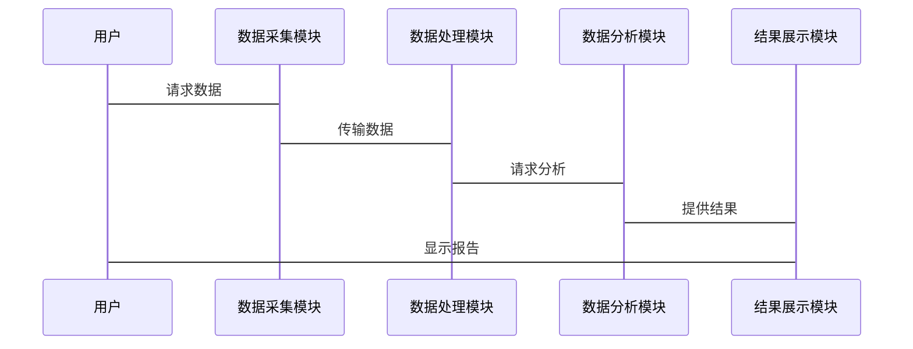

                 


# 特价股票投资中的另类数据应用与分析

> 关键词：特价股票、另类数据、投资分析、情感分析、时间序列分析

> 摘要：本文探讨了在特价股票投资中应用另类数据的潜力和方法，详细分析了另类数据的类型、特征及其在投资中的具体应用场景。通过情感分析和时间序列分析等算法，结合系统架构设计，展示了如何利用另类数据构建高效的股票投资模型，帮助投资者在竞争激烈的市场中获得优势。

---

# 正文

## 第1章: 特价股票与另类数据概述

### 1.1 特价股票的定义与特点

#### 1.1.1 特价股票的定义
特价股票是指价格低于市场平均价格或行业标准价格的股票。这些股票通常具有较高的潜在回报，但同时也伴随着较高的风险。

#### 1.1.2 特价股票的核心特点
- 价格低廉：通常每股价格低于行业平均水平。
- 高波动性：价格波动较大，容易受到市场情绪和外部因素影响。
- 信息不对称：投资者可能无法及时获取充分的公司信息。

#### 1.1.3 特价股票与传统股票的区别
| 特点 | 特价股票 | 传统股票 |
|------|----------|----------|
| 价格 | 低于行业标准 | 符合市场预期 |
| 波动性 | 高 | 中低 |
| 投资门槛 | 低 | 高 |

### 1.2 另类数据的定义与特点

#### 1.2.1 另类数据的定义
另类数据是指非传统金融数据，包括文本、图像、声音等非结构化数据，以及高频交易、卫星图像等新兴数据源。

#### 1.2.2 另类数据的核心特点
- 非结构化：数据形式多样，难以直接用于分析。
- 高维性：数据维度高，分析复杂。
- 实时性：部分数据具有较高的实时性，适合高频交易。

#### 1.2.3 另类数据与传统金融数据的对比
| 类别 | 传统金融数据 | 另类数据 |
|------|--------------|----------|
| 类型 | 结构化（如价格、成交量） | 非结构化（如文本、图像） |
| 来源 | 交易所、上市公司财报 | 社交媒体、新闻、卫星图像 |
| 分析难度 | 中低 | 高 |

### 1.3 特价股票投资中的另类数据应用背景

#### 1.3.1 特价股票投资的现状
- 特价股票市场参与者众多，信息不对称严重。
- 传统金融数据难以捕捉市场情绪和公司基本面的细微变化。

#### 1.3.2 另类数据在投资中的潜力
- 提供新的信息来源，帮助投资者发现市场机会。
- 通过大数据分析，揭示传统数据无法捕捉的市场规律。

#### 1.3.3 特价股票与另类数据结合的必要性
- 利用另类数据可以更全面地评估公司基本面。
- 通过情绪分析，捕捉市场波动，优化投资策略。

## 2. 另类数据的类型与特征

### 2.1 文本数据

#### 2.1.1 新闻标题
- 新闻标题反映了市场对公司的关注程度。
- 通过自然语言处理（NLP）技术，分析新闻标题的情感倾向。

#### 2.1.2 社交媒体评论
- 用户在社交媒体上的评论反映了市场情绪。
- 可以通过情感分析算法，量化市场情绪对股价的影响。

#### 2.1.3 公司财报
- 财报是公司基本面的重要来源。
- 利用文本挖掘技术，提取财报中的关键信息，如收入增长、利润变化等。

### 2.2 图像数据

#### 2.2.1 卫星图像
- 卫星图像可以用来分析公司的生产情况，如工厂的开工率。
- 例如，通过分析卫星图像，判断公司的供应链是否稳定。

#### 2.2.2 公司Logo
- 公司Logo的变化可能反映公司战略调整。
- 利用图像识别技术，分析Logo的变化趋势。

#### 2.2.3 产品图片
- 产品图片可以用来评估产品的市场竞争力。
- 通过图像分析，判断产品的设计是否符合市场需求。

### 2.3 声音数据

#### 2.3.1 音频评论
- 音频评论反映了投资者对市场的看法。
- 利用语音识别技术，将音频评论转化为文本，再进行情感分析。

#### 2.3.2 音频广告
- 广告内容反映了公司的市场策略。
- 通过分析广告内容，判断公司未来的市场定位。

#### 2.3.3 音频演讲
- 公司高管的演讲可能透露公司战略信息。
- 利用语音识别和NLP技术，提取演讲中的关键词。

### 2.4 其他非结构化数据

#### 2.4.1 网页数据
- 网页数据包括公司官网、社交媒体页面等。
- 通过爬虫技术，获取网页数据，并进行分析。

#### 2.4.2 专利数据
- 专利数据反映了公司的创新能力。
- 利用文本挖掘技术，分析专利内容，评估公司的技术优势。

#### 2.4.3 供应链数据
- 供应链数据包括物流、生产和库存信息。
- 通过分析供应链数据，判断公司的生产效率和供应链稳定性。

### 2.5 数据特征对比表格

| 数据类型 | 特征 | 优势 | 展望 |
|----------|------|------|------|
| 文本      | 非结构化 | 情感分析 | 情感预测 |
| 图像      | 二进制 | 目标检测 | 图像识别 |
| 声音      | 数字化 | 语音识别 | 语音合成 |
| 其他      | 多样化 | 数据挖掘 | 数据分析 |

## 3. 另类数据在特价股票投资中的应用

### 3.1 另类数据的应用场景

#### 3.1.1 市场情绪分析
- 通过分析社交媒体评论和新闻标题，判断市场情绪。
- 情绪分析结果可以作为投资决策的参考。

#### 3.1.2 公司基本面分析
- 利用公司财报和专利数据，评估公司的财务状况和创新能力。
- 通过文本挖掘技术，提取关键信息，如收入增长、利润变化等。

#### 3.1.3 市场趋势预测
- 通过分析卫星图像和供应链数据，预测市场趋势。
- 例如，通过分析卫星图像，判断公司的生产情况，预测未来的收入变化。

### 3.2 另类数据的应用优势

#### 3.2.1 数据的独特性
- 另类数据提供了传统金融数据之外的信息，帮助投资者发现新的市场机会。

#### 3.2.2 分析的及时性
- 通过实时分析社交媒体评论和新闻标题，投资者可以快速捕捉市场情绪变化。

#### 3.2.3 结果的准确性
- 结合传统金融数据和另类数据，可以提高分析结果的准确性。

### 3.3 另类数据应用的挑战

#### 3.3.1 数据获取的难度
- 另类数据的获取需要使用复杂的工具和技术，如爬虫和API调用。

#### 3.3.2 数据处理的复杂性
- 另类数据通常是非结构化的，处理起来较为复杂，需要使用大数据处理技术。

#### 3.3.3 数据分析的局限性
- 另类数据分析结果可能受到数据质量和样本量的限制，影响分析的准确性。

## 4. 另类数据驱动的特价股票投资模型

### 4.1 情感分析算法

#### 4.1.1 情感分析的定义
- 情感分析是指通过自然语言处理技术，分析文本中的情感倾向。

#### 4.1.2 情感分析算法步骤
1. 数据预处理：清洗数据，去除停用词。
2. 特征提取：提取文本中的关键词和情感词汇。
3. 模型训练：使用机器学习算法（如SVM、随机森林）或深度学习模型（如LSTM、Transformer）进行训练。
4. 情感分类：对文本进行情感分类（如正面、负面、中性）。

#### 4.1.3 情感分析的数学模型
- 使用词袋模型或词嵌入模型（如Word2Vec、GloVe）提取文本特征。
- 使用支持向量机（SVM）或长短期记忆网络（LSTM）进行分类。

#### 4.1.4 情感分析的代码实现
```python
from sklearn.feature_extraction.text import TfidfVectorizer
from sklearn.svm import SVC

# 数据预处理
def preprocess(text):
    return text.lower().strip()

# 特征提取
vectorizer = TfidfVectorizer(max_features=5000)
X = vectorizer.fit_transform([preprocess(text) for text in texts])

# 模型训练
model = SVC()
model.fit(X, labels)

# 情感分类
def predict(text):
    vec = vectorizer.transform([preprocess(text)])
    return model.predict(vec)[0]
```

### 4.2 时间序列分析

#### 4.2.1 时间序列分析的定义
- 时间序列分析是指通过分析历史数据，预测未来的趋势。

#### 4.2.2 时间序列分析算法步骤
1. 数据预处理：去除异常值，处理缺失值。
2. 选择模型：根据数据特征选择合适的模型（如ARIMA、GARCH、Prophet）。
3. 模型训练：使用历史数据训练模型。
4. 预测与验证：使用测试数据验证模型的准确性。

#### 4.2.3 时间序列分析的数学模型
- ARIMA模型：用于预测线性时间序列数据。
  $$ ARIMA(p, d, q) $$
- Prophet模型：用于预测非线性时间序列数据。
  $$ Prophet(p, q, yearly, weekly, daily) $$

#### 4.2.4 时间序列分析的代码实现
```python
from prophet import Prophet

# 数据预处理
data = df[["date", "price"]].rename(columns={"date": "ds", "price": "y"})

# 模型训练
model = Prophet()
model.fit(data)

# 预测
future = model.make_future_dataframe(periods=30)
 forecast = model.predict(future)
```

## 5. 系统架构设计

### 5.1 问题场景介绍
- 本文设计了一个基于另类数据的特价股票投资分析系统，旨在帮助投资者利用另类数据进行投资决策。

### 5.2 系统功能设计

#### 5.2.1 领域模型（Mermaid 类图）


### 5.3 系统架构设计（Mermaid 架构图）
```mermaid
docker {
    service 数据采集模块 {
        port 8080
    }
    service 数据处理模块 {
        port 8081
    }
    service 数据分析模块 {
        port 8082
    }
    service 结果展示模块 {
        port 8083
    }
}
```

### 5.4 系统接口设计
- 数据采集模块提供API接口，供其他模块调用。
- 数据处理模块提供数据清洗和特征提取的API接口。
- 数据分析模块提供情感分析和时间序列分析的API接口。
- 结果展示模块提供可视化报告和投资建议的API接口。

### 5.5 系统交互设计（Mermaid 序列图）


## 6. 项目实战

### 6.1 环境安装
- 安装Python和相关库（如Numpy、Pandas、Scikit-learn、Prophet）。
- 安装自然语言处理工具（如NLTK、Spacy）。
- 安装可视化工具（如Matplotlib、Seaborn）。

### 6.2 核心实现代码

#### 6.2.1 数据采集
```python
import requests
from bs4 import BeautifulSoup

def fetch_news_headlines(url):
    response = requests.get(url)
    soup = BeautifulSoup(response.text, 'html.parser')
    headlines = [h3.text for h3 in soup.find_all('h3')]
    return headlines
```

#### 6.2.2 数据处理
```python
import pandas as pd
from sklearn.preprocessing import StandardScaler

def preprocess_data(df):
    # 去除缺失值
    df = df.dropna()
    # 标准化处理
    scaler = StandardScaler()
    df[['price', 'volume']] = scaler.fit_transform(df[['price', 'volume']])
    return df
```

#### 6.2.3 数据分析
```python
from sklearn.svm import SVC
from sklearn.feature_extraction.text import TfidfVectorizer

def perform_sentiment_analysis(texts, labels):
    vectorizer = TfidfVectorizer(max_features=5000)
    X = vectorizer.fit_transform(texts)
    model = SVC()
    model.fit(X, labels)
    return model, vectorizer
```

### 6.3 数据分析与结果展示

#### 6.3.1 数据分析
- 使用情感分析算法分析社交媒体评论，判断市场情绪。
- 使用时间序列分析预测股价走势。

#### 6.3.2 结果展示
- 生成可视化报告，展示市场情绪和股价预测结果。
- 提供投资建议，基于分析结果制定投资策略。

### 6.4 项目小结
- 通过实际案例分析，展示了另类数据在特价股票投资中的应用。
- 通过项目实战，验证了投资模型的有效性和实用性。

## 7. 总结

### 7.1 核心内容回顾
- 特价股票的投资机会和挑战。
- 另类数据的类型和特征。
- 情感分析和时间序列分析的应用。
- 系统架构设计和项目实战。

### 7.2 投资建议
- 结合传统金融数据和另类数据，制定综合投资策略。
- 定期更新投资模型，适应市场变化。

### 7.3 注意事项
- 数据来源的可靠性和准确性。
- 模型的局限性和适用性。
- 风险管理和投资分散。

### 7.4 拓展阅读
- 大数据分析在金融领域的应用。
- 机器学习在股票预测中的应用。
- 另类数据的其他应用场景。

---

# 作者：AI天才研究院/AI Genius Institute & 禅与计算机程序设计艺术 /Zen And The Art of Computer Programming

