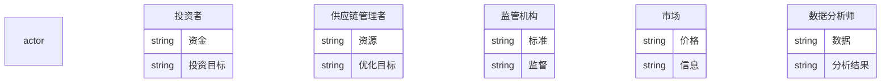
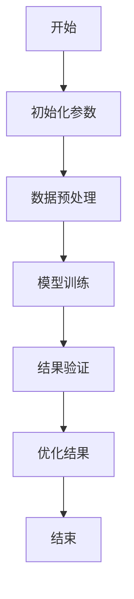
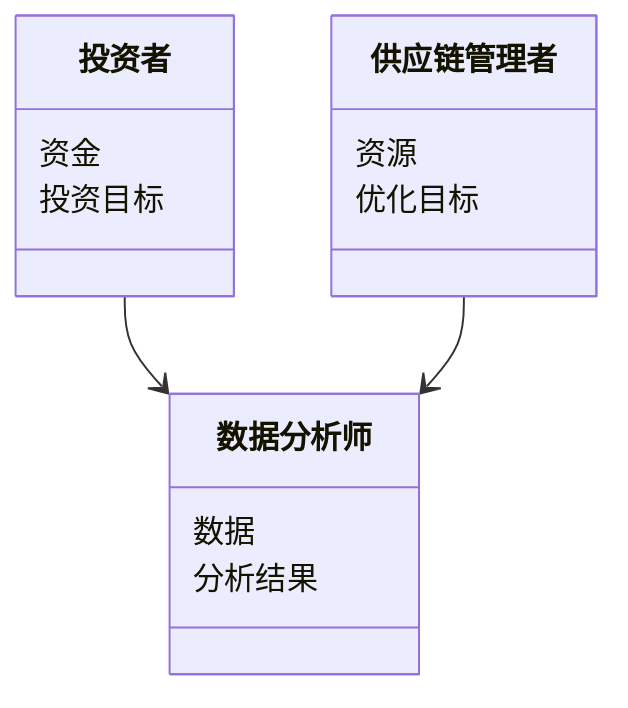
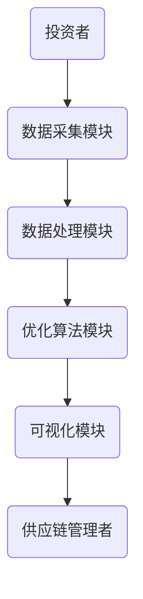
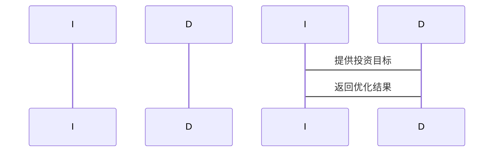

                 


# 特价股票投资中的可持续供应链管理整合方法

> 关键词：特价股票投资，可持续供应链管理，整合方法，算法优化，系统架构

> 摘要：本文探讨了在特价股票投资中整合可持续供应链管理的方法，通过分析核心概念、算法原理和系统架构，展示了如何通过优化模型和系统设计实现投资决策与供应链可持续性的有效结合。

---

## 第一部分：特价股票投资与可持续供应链管理整合背景

### 第1章：特价股票投资与可持续供应链管理概述

#### 1.1 特价股票投资的定义与特点

- **1.1.1 特价股票投资的定义**  
  特价股票投资是指以低于市场价购买股票，寻找被低估的投资机会。投资者通过分析公司基本面、市场趋势和技术指标，寻找具有长期增长潜力的股票。

- **1.1.2 特价股票投资的核心特点**  
  - 低估值：股票价格远低于其内在价值。  
  - 高潜力：公司具备良好的成长性，未来有望实现股价回升。  
  - 风险控制：通过分散投资和严格筛选降低风险。

- **1.1.3 特价股票投资的市场现状与趋势**  
  随着市场波动加剧，投资者 increasingly seek undervalued opportunities. 可持续投资理念的兴起也推动了对环保和社会责任企业的关注。

#### 1.2 可持续供应链管理的定义与特点

- **1.2.1 可持续供应链管理的定义**  
  可持续供应链管理是指在供应链的全生命周期中，注重环境保护、社会责任和经济效益的平衡，确保资源的高效利用和可持续性。

- **1.2.2 可持续供应链管理的核心要素**  
  - 环境因素：减少碳排放、资源浪费和污染。  
  - 社会因素：保障劳工权益、支持公平贸易。  
  - 经济因素：优化成本、提高效率和增强竞争力。

- **1.2.3 可持续供应链管理的现状与挑战**  
  当前，企业逐渐意识到可持续供应链管理的重要性，但实现过程中面临技术、成本和协调等多方面的挑战。

#### 1.3 特价股票投资与可持续供应链管理的整合背景

- **1.3.1 整合的必要性与重要性**  
  整合两者有助于在投资决策中考虑供应链的可持续性，降低投资风险，提升长期收益。

- **1.3.2 整合的潜在价值与应用场景**  
  - 通过分析企业的供应链透明度和可持续性，筛选出更具投资价值的企业。  
  - 在供应链优化中考虑环保和社会责任因素，降低企业运营风险。  

- **1.3.3 整合面临的挑战与机遇**  
  挑战包括数据获取难度、模型复杂性和市场认知度；机遇则在于市场对可持续投资的高需求和政策支持。

---

### 第2章：整合方法的核心概念与联系

#### 2.1 整合方法的核心概念

- **2.1.1 特价股票投资的供应链视角**  
  从供应链的角度分析企业的生产效率、成本控制和风险管理能力，评估其投资价值。

- **2.1.2 可持续供应链管理的优化目标**  
  优化供应链的透明度、效率和可持续性，降低环境和社会风险。

- **2.1.3 整合方法的系统性特征**  
  将投资决策与供应链管理相结合，形成一个闭环系统，实现经济效益与可持续发展的双赢。

#### 2.2 核心概念的对比分析

| **特性**             | **特价股票投资**                     | **可持续供应链管理**                   |
|----------------------|-------------------------------------|---------------------------------------|
| **核心目标**         | 最大化投资收益                      | 最小化环境和社会风险，提升供应链效率   |
| **关注点**           | 股价波动、公司基本面                 | 资源利用、生产过程、社会责任           |
| **决策依据**         | 财务数据、市场趋势                   | 环保指标、社会责任、成本优化           |
| **优化方向**         | 投资组合优化                        | 供应链透明化、可持续性提升             |

- **2.2.3 实体关系图与流程图**  
  通过ER图展示各实体之间的关系，帮助理解整合方法的系统架构。



---

## 第二部分：整合方法的算法原理

### 第3章：整合方法的算法实现

#### 3.1 整合方法的数学模型

- **模型构建**  
  通过混合整数线性规划模型优化供应链中的投资决策，综合考虑成本、收益和可持续性。

- **数学表达**  
  目标函数：最大化投资收益，同时最小化环境影响。  
  约束条件：包括投资预算、供应链透明度和时间限制。

$$ \text{最大化} \quad \sum_{i} (r_i - c_i) \times x_i $$
$$ \text{约束} \quad \sum_{i} c_i \times x_i \leq B $$
$$ x_i \in \{0,1\} $$

其中，\( r_i \) 是第 \( i \) 项投资的收益，\( c_i \) 是成本，\( x_i \) 是决策变量（0或1）。

- **代码实现**  
  使用Python和PuLP库实现模型优化。

```python
from pulp import *

# 初始化问题
model = LpProblem("供应链投资优化", LpMaximize)

# 定义变量
x = {}
for i in range(n):
    x[i] = LpVariable(f"x{i}", 0, 1, "Binary")

# 定义目标函数
model.objective = lpSum((r[i] - c[i]) * x[i] for i in range(n))

# 定义约束
model.addConstraint(lpSum(c[i] * x[i] for i in range(n)) <= B)

# 解决问题
model.solve()

# 输出结果
for i in range(n):
    print(f"投资{i}：{x[i].value()}")
```

#### 3.2 算法实现的流程图



---

## 第三部分：系统分析与架构设计

### 第4章：系统分析与架构设计方案

#### 4.1 系统功能设计

- **功能模块**  
  - 数据采集：收集企业供应链数据、市场信息。  
  - 模型优化：实现投资决策优化算法。  
  - 可视化分析：展示投资结果和供应链优化效果。

- **领域模型**  
  使用类图展示系统的主要组件及其关系。



#### 4.2 系统架构设计

- **架构图**  
  展示系统的主要组件及其交互关系。



#### 4.3 接口设计与交互流程

- **接口设计**  
  - 数据接口：与供应链数据源对接。  
  - 用户接口：提供投资决策和供应链优化的可视化界面。

- **交互流程图**  
  展示用户与系统之间的交互过程。



---

## 第四部分：项目实战

### 第5章：项目实战

#### 5.1 环境安装

- **安装Python和必要的库**  
  - 安装Python 3.8及以上版本。  
  - 使用pip安装PuLP、numpy和pandas。

#### 5.2 核心代码实现

```python
import pandas as pd
from pulp import *

# 读取数据
data = pd.read_csv("data.csv")

# 初始化问题
model = LpProblem("供应链投资优化", LpMaximize)

# 定义变量
x = {i: LpVariable(f"x{i}", 0, 1, "Binary") for i in range(len(data))}

# 定义目标函数
model.objective = lpSum((data['return'][i] - data['cost'][i]) * x[i] for i in range(len(data)))

# 定义约束
model.addConstraint(lpSum(data['cost'][i] * x[i] for i in range(len(data))) <= budget)

# 解决问题
model.solve()

# 输出结果
for i in range(len(data)):
    print(f"投资{i}：{x[i].value()}")
```

#### 5.3 案例分析与解读

- **案例分析**  
  以某企业为例，分析其供应链的可持续性和投资价值，展示模型的应用效果。

- **结果解读**  
  解释优化结果，说明如何通过整合方法实现投资收益与供应链可持续性的双赢。

#### 5.4 项目小结

- 总结项目实现的关键点，强调方法的有效性和可扩展性。

---

## 第五部分：总结与展望

### 第6章：总结与展望

#### 6.1 总结

- 回顾文章的主要内容，强调整合方法的核心价值。

#### 6.2 展望

- 展望未来的研究方向，包括更复杂模型、更大规模数据的应用，以及更多领域的扩展。

---

## 作者

作者：AI天才研究院/AI Genius Institute & 禅与计算机程序设计艺术 /Zen And The Art of Computer Programming

