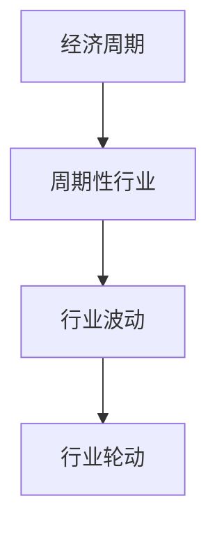
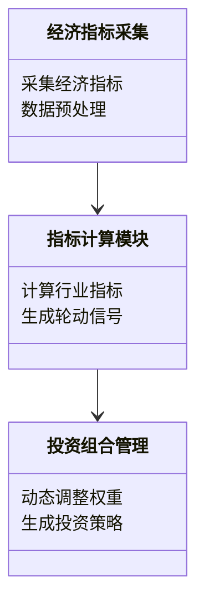

                 


# 特价股票投资中的周期性行业轮动策略研究

> 关键词：特价股票、周期性行业、行业轮动、投资策略、经济周期

> 摘要：本文研究了特价股票投资中的周期性行业轮动策略，通过分析周期性行业的特性、经济周期的影响以及行业轮动的原理，提出了基于经济指标和市场情绪的行业轮动算法，并通过数学模型和实际案例验证了策略的有效性。文章还详细探讨了系统架构设计、项目实现及最佳实践，为投资者提供了科学的指导。

---

## 第一部分：背景介绍

### 第1章：周期性行业的基本概念

#### 1.1 周期性行业的定义与分类
- 周期性行业的定义
- 周期性行业的分类（如制造业、科技行业、能源行业）
- 周期性行业的波动特性

#### 1.2 特价股票投资的背景与意义
- 特价股票的定义
- 特价股票投资的优势与风险
- 特价股票与周期性行业的结合

#### 1.3 周期性行业轮动策略的背景
- 行业轮动的概念
- 周期性行业轮动的必要性
- 周期性行业轮动的策略框架

---

## 第二部分：核心概念与联系

### 第2章：周期性行业的核心概念

#### 2.1 周期性行业的核心要素
- 经济周期的定义与影响
- 周期性行业的波动周期
- 周期性行业的关键指标（如市盈率、市净率）

#### 2.2 周期性行业与经济周期的关系
- 经济周期对周期性行业的影响
- 周期性行业的领先与滞后效应
- 经济周期与行业轮动的关联

#### 2.3 周期性行业的属性对比
- 行业属性对比表格
- 周期性行业ER实体关系图


---

## 第三部分：算法原理讲解

### 第3章：周期性行业轮动策略的算法原理

#### 3.1 行业轮动策略的核心算法
- 基于经济指标的轮动算法
- 基于市场情绪的轮动算法
- 基于技术指标的轮动算法

#### 3.2 行业轮动算法的实现步骤
- 数据采集与预处理
- 指标计算与筛选
- 行业轮动的信号生成
- 投资组合的动态调整

#### 3.3 算法的数学模型与公式
- 行业轮动的数学模型
- 动态调整权重的公式
$$w_{i,t} = \frac{score_i}{\sum_{j} score_j}$$

---

## 第四部分：数学模型与系统架构

### 第4章：数学模型与系统架构设计

#### 4.1 数学模型的详细分析
- 周期性行业的波动模型
- 经济周期的预测模型
- 行业轮动的优化模型

#### 4.2 系统架构设计
- 问题场景介绍
- 系统功能设计（领域模型Mermaid类图）


#### 4.3 系统接口设计
- 数据接口的设计
- 策略接口的设计
- 风险控制接口的设计

---

## 第五部分：项目实战

### 第5章：项目实现与案例分析

#### 5.1 项目环境的安装与配置
- Python环境的安装
- 数据采集工具的安装
- 第三方库的安装（如pandas、numpy）

#### 5.2 核心代码实现
- 经济指标采集的代码
- 行业指标计算的代码
- 投资组合管理的代码
```python
import pandas as pd
import numpy as np

# 示例代码：计算行业轮动信号
def calculate_signals(data, window=12):
    # 计算市盈率
    pe = data['price'] / data['eps']
    # 计算动量指标
    momentum = data['price'].rolling(window).mean()
    # 生成信号
    signals = (pe < pe.rolling(window).quantile(0.2)) & (momentum > momentum.rolling(window).quantile(0.8))
    return signals
```

#### 5.3 实际案例分析
- 案例背景介绍
- 数据来源与处理
- 策略实现与结果分析
- 策略的有效性评估

---

## 第六部分：最佳实践与总结

### 第6章：最佳实践与注意事项

#### 6.1 投资策略的注意事项
- 风险管理的重要性
- 策略的灵活性调整
- 数据来源的可靠性

#### 6.2 投资策略的优化与改进
- 策略的参数优化
- 策略的组合优化
- 策略的长期有效性测试

#### 6.3 小结与展望
- 本文的核心内容总结
- 未来研究的方向
- 对投资者的建议

---

## 作者信息

作者：AI天才研究院/AI Genius Institute & 禅与计算机程序设计艺术/Zen And The Art of Computer Programming

---

本文通过系统化的分析与实践，深入探讨了特价股票投资中的周期性行业轮动策略，为投资者提供了理论支持与实践指导。

