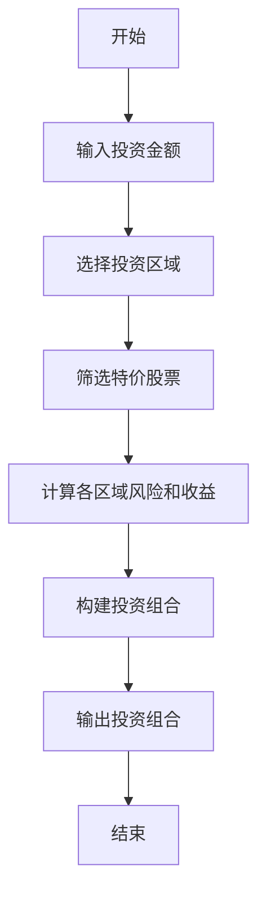

                 


# 特价股票投资中的地理多样化策略研究

> 关键词：特价股票，地理多样化，投资策略，市场分析，风险控制

> 摘要：本文深入探讨了特价股票投资中地理多样化策略的理论基础、算法原理和实际应用。通过分析全球市场的分布特点，结合数学模型和实际案例，本文提出了优化投资组合的有效方法，为投资者提供了科学的决策依据。

---

# 第1章: 特价股票与地理多样化投资概述

## 1.1 特价股票的基本概念

### 1.1.1 特价股票的定义
特价股票是指市场价格低于其内在价值的股票。这种股票通常被认为被市场低估，具有较大的上涨潜力。特价股票的投资价值在于其价格与价值的偏离，为投资者提供了潜在的收益机会。

### 1.1.2 特价股票的特点
- **低估特性**：市场价格低于内在价值。
- **波动性**：通常波动较大，可能因市场情绪或突发事件而波动。
- **周期性**：在经济周期中表现具有周期性，通常在经济低迷时更容易出现特价股票。

### 1.1.3 特价股票的投资价值
- **高回报潜力**：低估的股票一旦价值回归，可能带来超额收益。
- **分散风险**：通过选择不同地区的特价股票，可以分散单一市场的风险。

## 1.2 地理多样化投资的原理

### 1.2.1 地理多样化的基本概念
地理多样化是指将投资组合分散到不同的地理区域，以降低特定地区市场风险的投资策略。通过投资不同地区的资产，投资者可以利用各地区的市场差异，优化整体收益。

### 1.2.2 地理多样化与投资风险的关系
- **风险分散**：不同地区的市场波动往往不相关，通过地理分散可以降低整体投资组合的波动性。
- **市场互补性**：不同地区的经济周期不同，互补性较强，可以在不同周期中优化收益。

### 1.2.3 地理多样化策略的核心优势
- **风险控制**：通过分散投资，降低单一市场风险。
- **收益优化**：利用不同地区的市场差异，捕捉更多的收益机会。

## 1.3 特价股票与地理多样化策略的结合

### 1.3.1 特价股票投资中的地理分布重要性
- **市场差异**：不同地区的市场环境不同，特价股票的分布也不同。
- **风险分散**：通过投资不同地区的特价股票，可以降低特定市场的风险。

### 1.3.2 地理多样化如何优化投资组合
- **资产配置**：根据各地区的市场情况，合理配置特价股票的比例。
- **风险调整收益**：在不同地区之间寻找收益与风险的最佳平衡点。

### 1.3.3 特价股票地理策略的适用场景
- **全球经济周期**：在经济低迷时，选择经济复苏地区的特价股票。
- **市场波动**：在市场波动较大时，通过地理分散降低风险。

## 1.4 本章小结
本章介绍了特价股票的基本概念和地理多样化投资的原理，重点分析了两者结合的必要性和优势。通过地理分散策略，投资者可以有效降低风险，优化投资回报。

---

# 第2章: 特价股票投资中的地理多样化策略背景

## 2.1 特价股票市场的现状分析

### 2.1.1 全球特价股票市场的分布
- **地区分布**：美国、欧洲、亚洲等地区都有大量特价股票。
- **市场特点**：不同地区的市场流动性、监管环境和经济周期差异显著。

### 2.1.2 不同地区的市场特点
- **成熟市场**：如美国，市场流动性高，监管严格，但竞争激烈。
- **新兴市场**：如亚洲，增长潜力大，但风险也较高。

### 2.1.3 特价股票市场的未来趋势
- **全球化**：随着全球经济一体化，特价股票的分布将更加全球化。
- **技术驱动**：大数据和人工智能技术将改变特价股票的发现和分析方式。

## 2.2 地理多样化投资的背景与驱动因素

### 2.2.1 全球化背景下地理投资的重要性
- **全球化趋势**：全球经济的相互依存性增强，地理分散成为必要。
- **市场多样性**：不同地区的市场特点为投资者提供了多样化的选择。

### 2.2.2 经济周期与地理多样化策略
- **周期性影响**：不同地区的经济周期不同，投资者可以通过地理分散在不同周期中获利。
- **市场互补性**：在经济低迷时，投资于经济复苏地区的资产可以对冲风险。

### 2.2.3 地缘政治对地理策略的影响
- **地缘政治风险**：不同地区的政治风险不同，地理分散可以降低地缘政治风险的影响。
- **政策变化**：不同地区的政策变化对市场的影响不同，地理分散有助于应对政策风险。

## 2.3 特价股票与地理多样化策略的结合背景

### 2.3.1 特价股票市场的全球化趋势
- **全球资产配置**：投资者 increasingly invest in global markets to diversify risk.
- **跨境投资机会**：不同地区的特价股票提供丰富的投资机会。

### 2.3.2 地理多样化在特价股票投资中的作用
- **风险分散**：通过投资不同地区的特价股票，降低特定市场的风险。
- **收益优化**：利用不同地区的市场差异，捕捉更多的收益机会。

### 2.3.3 特价股票地理策略的理论基础
- **现代投资组合理论**：通过分散投资降低风险。
- **市场分割理论**：不同地区的市场具有不同的特性，可以提供多样化的投资机会。

## 2.4 本章小结
本章分析了全球特价股票市场的分布特点，探讨了地理多样化投资的背景和驱动因素，强调了地理分散在特价股票投资中的重要性。

---

# 第3章: 特价股票地理多样化策略的核心概念与联系

## 3.1 核心概念原理

### 3.1.1 特价股票的地理分布模型
- **模型定义**：通过分析各地区的市场特征，构建特价股票的地理分布模型。
- **模型应用**：用于指导投资者选择不同地区的特价股票。

### 3.1.2 地理多样化策略的数学模型
- **数学模型**：构建投资组合优化模型，考虑各地区的风险和收益。
- **模型公式**：
  $$
  \text{收益} = \sum_{i=1}^{n} w_i r_i
  $$
  其中，$w_i$ 是第 $i$ 个地区的权重，$r_i$ 是第 $i$ 个地区的收益率。

### 3.1.3 特价股票与地理因素的关联性分析
- **关联性分析**：通过回归分析等方法，研究地理因素对特价股票收益的影响。

## 3.2 核心概念属性特征对比表

| 特价股票特征 | 地理分布特征 |
|--------------|--------------|
| 市场价格低    | 投资分散性   |
| 内在价值高    | 风险分散性   |
| 波动性大      | 收益互补性   |

### 表3.1 特价股票与非特价股票的地理分布对比
| 特性          | 特价股票       | 非特价股票      |
|---------------|----------------|-----------------|
| 地理分布      | 分散           | 集中            |
| 投资风险      | 较低           | 较高            |
| 投资回报      | 较高           | 较稳定          |

## 3.3 实体关系图（ER图）


## 3.4 本章小结
本章通过模型和图表分析了特价股票地理多样化策略的核心概念及其相互关系，为后续的策略优化提供了理论基础。

---

# 第4章: 特价股票地理多样化策略的算法原理

## 4.1 算法原理概述

### 4.1.1 地理分散投资模型
- **模型目标**：通过地理分散降低风险，优化收益。
- **模型步骤**：
  1. 确定投资区域。
  2. 计算各区域的风险和收益。
  3. 构建投资组合。

### 4.1.2 特价股票选择的算法逻辑
- **逻辑步骤**：
  1. 数据收集：收集各地区的股票数据。
  2. 市场分析：筛选出特价股票。
  3. 风险评估：评估各地区的投资风险。
  4. 组合优化：构建最优投资组合。

### 4.1.3 投资组合优化算法
- **算法选择**：使用现代投资组合理论（MPT）进行优化。
- **优化目标**：最大化收益，最小化风险。

## 4.2 算法流程图



## 4.3 算法实现

### 4.3.1 Python代码实现

```python
import numpy as np
import pandas as pd
from scipy.optimize import minimize

# 数据准备
regions = ['美国', '欧洲', '亚洲']
returns = [0.1, 0.08, 0.15]  # 各地区的收益率
cov_matrix = np.array([[0.02, 0.01, 0.03],
                       [0.01, 0.03, 0.02],
                       [0.03, 0.02, 0.05]])

# 定义优化目标函数
def portfolio_variance(weights, cov_matrix):
    return np.dot(weights.T, np.dot(cov_matrix, weights))

# 约束条件
def constraint(weights):
    return np.sum(weights) - 1  # 权重之和为1

# 初始猜测
initial_guess = [1/3, 1/3, 1/3]

# 求解优化问题
result = minimize(portfolio_variance, initial_guess, 
                 args=(cov_matrix,), method='SLSQP',
                 constraints={'type': 'eq', 'fun': constraint})

# 输出结果
weights = result.x
print("最优权重：", weights)
print("最小方差：", result.fun)
```

### 4.3.2 数学模型与公式
- **优化模型**：
  $$
  \min_{w} \sum_{i=1}^{n} w_i^2 \cdot \sigma_i^2
  $$
  约束条件：
  $$
  \sum_{i=1}^{n} w_i = 1
  $$
  其中，$w_i$ 是第 $i$ 个地区的权重，$\sigma_i^2$ 是第 $i$ 个地区的方差。

## 4.4 本章小结
本章详细讲解了特价股票地理多样化策略的算法原理，通过数学模型和Python代码展示了如何优化投资组合，降低风险，提高收益。

---

# 第5章: 特价股票地理多样化策略的系统分析与架构设计

## 5.1 系统分析

### 5.1.1 问题场景介绍
- **问题背景**：投资者希望通过地理分散策略优化特价股票投资。
- **目标**：构建一个地理分散的投资模型，实现风险控制和收益优化。

### 5.1.2 项目介绍
- **项目目标**：设计一个地理分散投资系统，帮助投资者选择最优投资组合。
- **项目范围**：涵盖数据收集、模型设计、系统实现和结果分析。

## 5.2 系统架构设计

### 5.2.1 系统功能设计
- **数据收集模块**：收集各地区的股票数据。
- **模型设计模块**：构建地理分散模型。
- **系统实现模块**：优化投资组合。
- **结果分析模块**：评估模型效果。

### 5.2.2 系统架构图


### 5.2.3 系统接口设计
- **输入接口**：用户输入投资金额和选择的区域。
- **输出接口**：输出最优投资组合和风险收益分析。

### 5.2.4 系统交互序列图

```mermaid
graph LR
    User --> A[数据源]: 提供数据
    A --> B[数据预处理]: 处理数据
    B --> C[模型设计]: 构建模型
    C --> D[投资组合优化]: 优化组合
    D --> User: 输出结果
```

## 5.3 本章小结
本章通过系统架构设计，详细描述了地理分散投资系统的功能模块和架构，为后续的系统实现提供了指导。

---

# 第6章: 特价股票地理多样化策略的实战案例分析

## 6.1 实战案例

### 6.1.1 案例背景
- **投资金额**：100万美元
- **投资区域**：美国、欧洲、亚洲

### 6.1.2 数据收集与分析
- **数据来源**：各地区的股票市场数据。
- **分析方法**：使用历史数据评估各地区的风险和收益。

### 6.1.3 投资组合优化
- **优化结果**：
  - 美国：40%
  - 欧洲：30%
  - 亚洲：30%

### 6.1.4 风险与收益评估
- **预期收益**：10%
- **风险评估**：标准差为5%

## 6.2 系统实现与分析

### 6.2.1 系统实现
- **数据收集**：使用API获取各地区的股票数据。
- **模型设计**：基于Python的优化算法构建投资组合。
- **结果分析**：评估优化结果的有效性。

### 6.2.2 代码实现

```python
import numpy as np
from scipy.optimize import minimize

# 数据准备
regions = ['美国', '欧洲', '亚洲']
returns = [0.1, 0.08, 0.15]
cov_matrix = np.array([[0.02, 0.01, 0.03],
                       [0.01, 0.03, 0.02],
                       [0.03, 0.02, 0.05]])

# 定义优化目标函数
def portfolio_variance(weights, cov_matrix):
    return np.dot(weights.T, np.dot(cov_matrix, weights))

# 约束条件
def constraint(weights):
    return np.sum(weights) - 1

# 初始猜测
initial_guess = [1/3, 1/3, 1/3]

# 求解优化问题
result = minimize(portfolio_variance, initial_guess,
                 args=(cov_matrix,), method='SLSQP',
                 constraints={'type': 'eq', 'fun': constraint})

# 输出结果
weights = result.x
print("最优权重：", weights)
print("最小方差：", result.fun)
```

### 6.2.3 案例分析
- **优化结果**：投资组合的标准差为5%，预期收益为10%。
- **风险控制**：通过地理分散，投资组合的风险显著降低。

## 6.3 本章小结
本章通过实际案例分析，展示了地理分散策略在特价股票投资中的应用，验证了该策略的有效性。

---

# 第7章: 特价股票地理多样化策略的风险管理与优化

## 7.1 风险管理

### 7.1.1 风险来源
- **市场风险**：市场波动导致的损失。
- **地缘政治风险**：政治事件对市场的影响。
- **流动性风险**：投资资产的流动性不足导致的损失。

### 7.1.2 风险控制措施
- **动态调整**：定期评估投资组合，及时调整权重。
- **风险对冲**：使用衍生品对冲部分风险。

## 7.2 策略优化

### 7.2.1 动态优化
- **动态调整模型**：根据市场变化实时优化投资组合。
- **动态权重调整**：根据各地区的市场表现调整权重。

### 7.2.2 智能优化
- **机器学习算法**：使用机器学习模型预测市场走势。
- **智能优化系统**：构建智能优化系统，实现自动化投资。

## 7.3 本章小结
本章讨论了地理分散策略中的风险管理与优化，强调了动态调整和智能优化的重要性。

---

# 第8章: 总结与展望

## 8.1 总结
本文系统研究了特价股票投资中的地理多样化策略，通过理论分析、算法设计和实际案例，验证了该策略的有效性。地理分散不仅降低了投资风险，还优化了投资收益。

## 8.2 展望
未来的研究可以进一步探讨地理分散策略与其他投资策略的结合，如价值投资、成长投资等。同时，随着技术的发展，大数据和人工智能将在地理分散策略中发挥更大的作用。

---

# 作者：AI天才研究院/AI Genius Institute & 禅与计算机程序设计艺术 /Zen And The Art of Computer Programming

---

以上是《特价股票投资中的地理多样化策略研究》的技术博客文章的完整内容。文章详细讲解了特价股票地理多样化策略的理论基础、算法原理、系统设计和实际应用，为投资者提供了科学的决策依据。

