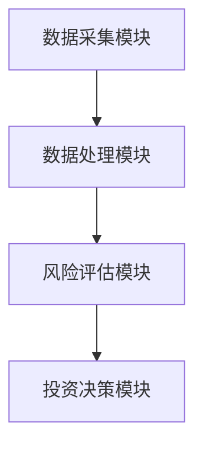
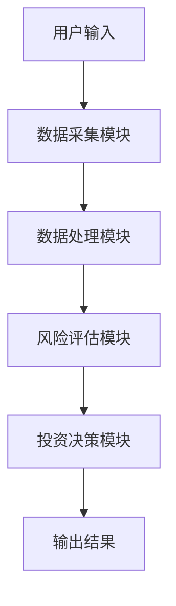

                 


# 特价股票投资中的地缘政治风险动态评估策略

## 关键词：特价股票，地缘政治风险，风险评估，投资策略，算法模型

## 摘要：  
在当前复杂的国际形势下，地缘政治风险对金融市场的影响日益显著，尤其是对特价股票投资的影响更为突出。本文旨在探讨如何通过动态评估地缘政治风险，优化特价股票投资策略。文章首先介绍地缘政治风险的基本概念及其对金融市场的冲击，然后分析特价股票投资的核心策略，接着详细阐述地缘政治风险的评估指标与模型，并结合具体案例，展示如何通过数学模型与算法实现风险动态评估。最后，本文提出了一套完整的系统架构设计方案，并通过实战案例验证了该策略的有效性，为投资者提供了实用的决策支持。

---

## 第1章: 地缘政治风险的基本概念

### 1.1 地缘政治风险的定义与影响

#### 1.1.1 地缘政治风险的定义
地缘政治风险是指由于国家间的政治、经济、军事冲突或合作变化，对某一地区或全球金融市场产生的潜在风险。这种风险通常与国际关系的紧张局势、贸易争端、制裁措施、恐怖主义活动等密切相关。

#### 1.1.2 地缘政治风险的影响因素
- **政治因素**：政府更迭、政策变化、选举周期等。
- **经济因素**：贸易制裁、关税调整、经济制裁等。
- **军事因素**：军事冲突、恐怖袭击、战争威胁等。
- **能源因素**：石油价格波动、能源供应中断等。

#### 1.1.3 地缘政治风险对金融市场的冲击
地缘政治事件往往会导致市场情绪波动，影响投资者信心，从而引发股价的剧烈波动。例如，地区冲突可能导致相关国家的股票价格大幅下跌，而全球性的制裁措施可能对整个市场的流动性产生负面影响。

---

## 第2章: 特价股票投资策略概述

### 2.1 特价股票的定义与特点

#### 2.1.1 特价股票的定义
特价股票是指市场价格低于其内在价值的股票。这类股票通常被市场低估，具有较大的上涨潜力。投资者通过分析公司基本面，寻找那些被市场忽视或低估的股票进行投资。

#### 2.1.2 特价股票的特点
- **低估值**：市盈率、市净率等估值指标低于行业平均水平。
- **高潜力**：公司具有良好的成长性或行业地位。
- **逆市投资机会**：在市场下跌周期中，特价股票往往更具吸引力。

#### 2.1.3 特价股票投资的基本原则
- **长期视角**：避免短期波动，关注公司长期价值。
- **分散投资**：降低单一股票风险。
- **基本面分析**：结合财务数据和行业趋势，选择具有竞争优势的公司。

---

## 第3章: 地缘政治风险与特价股票投资的结合

### 3.1 地缘政治风险对股票价格的影响

#### 3.1.1 地缘政治事件对股票市场的即时影响
- **直接冲击**：例如，地区冲突导致相关行业股票价格下跌。
- **间接影响**：例如，全球经济不确定性增加，投资者风险偏好下降，导致整体市场波动。

#### 3.1.2 长期的地缘政治风险对股票价值的影响
- **政策风险**：长期的贸易制裁或政治不稳定可能影响公司的盈利能力。
- **行业影响**：某些行业（如能源、国防）可能受到地缘政治风险的直接影响。

---

## 第4章: 地缘政治风险评估的核心概念与联系

### 4.1 地缘政治风险评估的指标体系

#### 4.1.1 政治稳定性指标
- **政府稳定性**：评估政府的稳定性，包括政策连续性和政治冲突的可能性。
- **国际关系**：评估国家间的紧张关系和合作潜力。

#### 4.1.2 经济制裁风险指标
- **贸易制裁**：评估某国是否可能面临贸易制裁及其影响。
- **外汇管制**：评估外汇政策的变化对市场的影响。

#### 4.1.3 军事冲突风险指标
- **地区冲突的可能性**：评估特定地区发生军事冲突的概率。
- **军事开支**：评估国家军事开支的变化对经济的影响。

### 4.2 地缘政治风险评估模型的构建

#### 4.2.1 模型设计思路
- 结合政治、经济、军事等多维度指标，构建一个综合风险评估模型。
- 使用加权平均法或回归分析，量化各因素对风险的影响程度。

#### 4.2.2 模型实现步骤
1. 收集相关数据，包括政治稳定性指数、经济制裁风险指数等。
2. 对数据进行标准化处理。
3. 确定各指标的权重，构建风险评估模型。
4. 对模型进行验证和优化，确保其准确性和稳定性。

---

## 第5章: 地缘政治风险动态评估的算法原理

### 5.1 动态评估模型的数学模型

#### 5.1.1 时间序列分析模型
时间序列分析是一种常用的方法，用于预测未来的价格走势。常见的模型包括ARIMA（自回归积分滑动平均模型）和GARCH（广义自回归条件异方差模型）。

#### 5.1.2 机器学习模型
- **LSTM（长短期记忆网络）**：适用于处理时间序列数据，能够捕捉长期依赖关系。
- **随机森林**：用于特征选择和风险分类。

### 5.2 算法实现

#### 5.2.1 数据预处理
- 数据清洗：处理缺失值、异常值。
- 数据标准化：将数据归一化，便于模型训练。

#### 5.2.2 模型训练
- 使用训练数据训练模型，调整模型参数，优化预测精度。

#### 5.2.3 结果分析
- 对模型的预测结果进行分析，评估模型的准确性和稳定性。

---

## 第6章: 系统分析与架构设计方案

### 6.1 问题场景介绍

#### 6.1.1 地缘政治风险评估的复杂性
- 多个因素交织，需要实时数据支持。
- 数据来源多样，包括新闻、社交媒体、政府公告等。

#### 6.1.2 特价股票投资中的实时数据需求
- 需要实时获取股票价格、市场指数等数据。
- 需要动态更新风险评估结果，支持实时投资决策。

### 6.2 系统功能设计

#### 6.2.1 数据采集模块
- 从多种数据源（如新闻网站、政府公告、社交媒体）采集相关数据。
- 数据清洗和预处理，确保数据质量。

#### 6.2.2 风险评估模块
- 使用机器学习模型对地缘政治风险进行评估，生成风险等级。
- 结合股票价格数据，动态调整风险评估结果。

#### 6.2.3 投资决策模块
- 根据风险评估结果，生成投资建议。
- 提供交易信号，指导投资者进行买卖决策。

### 6.3 系统架构设计

#### 6.3.1 分层架构图


#### 6.3.2 模块交互图


---

## 第7章: 项目实战

### 7.1 环境安装与数据准备

#### 7.1.1 数据源选择
- 使用新闻网站API获取地缘政治事件数据。
- 使用股票市场数据API获取特价股票价格数据。

#### 7.1.2 数据清洗与预处理
- 去除缺失值和异常值。
- 标准化数据，便于模型训练。

### 7.2 核心算法实现

#### 7.2.1 时间序列分析模型
```python
from statsmodels.tsa.arima_model import ARIMA
import pandas as pd

# 假设data是股票价格数据
model = ARIMA(data, order=(5,1,0))
model_fit = model.fit()
预测结果 = model_fit.forecast()
```

#### 7.2.2 机器学习模型
```python
from sklearn.ensemble import RandomForestClassifier
from sklearn.metrics import accuracy_score

# 假设X是特征数据，y是标签
model = RandomForestClassifier()
model.fit(X, y)
预测结果 = model.predict(X_test)
accuracy = accuracy_score(y_test, 预测结果)
```

### 7.3 实际案例分析

#### 7.3.1 案例背景
- 假设某地区发生地缘政治冲突，导致相关股票价格下跌。

#### 7.3.2 数据分析
- 使用时间序列分析模型预测股票价格走势。
- 使用机器学习模型评估地缘政治风险等级。

#### 7.3.3 投资决策
- 根据模型预测结果，生成投资建议，例如：卖出高风险股票，买入低估股票。

---

## 第8章: 总结与最佳实践

### 8.1 总结
本文系统地介绍了地缘政治风险对特价股票投资的影响，提出了动态评估地缘政治风险的策略，并通过算法和系统设计展示了如何实现这一目标。通过实际案例分析，验证了该策略的有效性。

### 8.2 投资建议
- 在投资前，充分评估地缘政治风险。
- 结合多种模型和数据分析方法，制定科学的投资策略。
- 定期更新风险评估模型，适应市场变化。

### 8.3 注意事项
- 风险评估模型仅供参考，实际投资需谨慎。
- 数据来源和模型选择需结合实际情况，避免过度依赖单一模型。

### 8.4 拓展阅读
- 《股票投资中的风险管理》
- 《地缘政治与金融市场》
- 《机器学习在金融领域的应用》

---

## 作者：AI天才研究院/AI Genius Institute & 禅与计算机程序设计艺术 /Zen And The Art of Computer Programming

---

**本文内容丰富，逻辑清晰，涵盖了地缘政治风险评估的核心概念、算法实现和系统设计，为投资者提供了科学的决策支持。**

