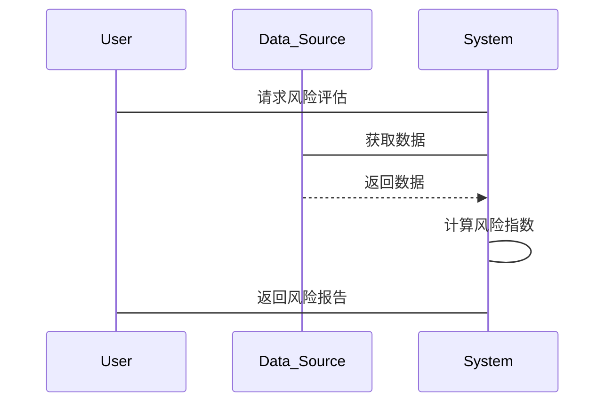

                 


# 特价股票投资中的地缘政治风险考虑

> 关键词：特价股票、地缘政治风险、投资策略、风险评估、数学模型

> 摘要：本文探讨了在特价股票投资中如何考虑地缘政治风险。通过分析地缘政治风险的核心概念、评估算法、数学模型、系统架构和实际案例，本文为投资者提供了如何在投资决策中有效识别和应对地缘政治风险的深度见解。

---

## 第1章: 特价股票投资与地缘政治风险概述

### 1.1 特价股票投资的基本概念

#### 1.1.1 特价股票的定义

特价股票是指以低于市场价或内在价值购买的股票。投资者通常寻找被市场低估的公司，期望其股价在未来上涨。特价股票投资的核心在于识别具有潜在增值空间的股票，同时需要考虑多种风险因素。

#### 1.1.2 特价股票投资的背景与现状

随着金融市场的发展，投资者越来越关注特价股票投资，尤其是机构投资者和个人投资者。然而，地缘政治风险作为一种不可忽视的外部因素，对股票市场产生深远影响。投资者需要了解地缘政治风险的来源和表现形式，以便在投资决策中加以考虑。

#### 1.1.3 特价股票投资的核心要素

- 市场分析：研究宏观经济环境、行业趋势和公司基本面。
- 风险管理：识别和评估潜在风险，制定应对策略。
- 投资策略：制定买入、持有和卖出的策略。
- 监测与调整：持续监控市场动态，及时调整投资组合。

### 1.2 地缘政治风险的基本概念

#### 1.2.1 地缘政治风险的定义

地缘政治风险是指因政治、经济、军事和社会等外部因素引发的不确定性，可能对国家、地区或公司产生负面影响。这些风险包括战争、政策变化、贸易摩擦、恐怖主义活动等。

#### 1.2.2 地缘政治风险的分类

地缘政治风险可以分为以下几类：

1. **国家层面风险**：包括政治动荡、政权更迭、政策变化等。
2. **地区层面风险**：涉及地区冲突、领土争端等。
3. **国际关系风险**：如贸易战争、外交关系紧张等。
4. **经济制裁风险**：包括贸易限制、金融制裁等。

#### 1.2.3 地缘政治风险的影响机制

地缘政治风险通过多种机制影响股票市场：

1. **市场情绪影响**：投资者因担忧风险而抛售股票，导致股价下跌。
2. **政策变化影响**：政府政策调整可能影响公司的经营环境和盈利能力。
3. **经济活动影响**：地缘政治冲突可能导致供应链中断、贸易减少，影响公司业绩。

### 1.3 特价股票投资中地缘政治风险的重要性

#### 1.3.1 地缘政治风

---

## 第2章: 地缘政治风险的核心概念与联系

### 2.1 地缘政治风险的核心概念

#### 2.1.1 地缘政治风险的原理

地缘政治风险的产生源于国家间的竞争、资源分配和权力斗争。这些因素可能导致政治不稳定、经济制裁和市场不确定性，进而影响股票价格。

#### 2.1.2 地缘政治风险的特征

- 不确定性：难以预测和量化。
- 外部性：影响范围广，可能波及多个市场和行业。
- 长期性：某些风险可能持续多年，影响深远。

### 2.2 地缘政治风险与股票投资的联系

#### 2.2.1 地缘政治风险对股票市场的直接影响

地缘政治事件可能导致市场恐慌，引发抛售行为，导致股价下跌。例如，地区冲突可能导致能源价格波动，进而影响相关行业的股票价格。

#### 2.2.2 地缘政治风险对投资决策的影响

投资者在选择特价股票时，需要考虑地缘政治风险对公司经营环境和财务状况的影响。例如，投资于受制裁地区的公司可能面临业绩下滑和股价下跌的风险。

---

## 第3章: 地缘政治风险评估的算法原理

### 3.1 地缘政治风险评估算法概述

地缘政治风险评估算法通过收集和分析相关数据，量化风险因素，评估其对股票市场的影响。常用的算法包括层次分析法（AHP）、线性回归模型和贝叶斯网络等。

### 3.2 算法实现步骤

#### 3.2.1 数据收集与预处理

- 数据来源：收集涉及地缘政治风险的新闻、政策变化、经济指标等。
- 数据清洗：去除无效数据，填充缺失值，标准化数据。

#### 3.2.2 风险因素提取

- 识别关键风险因素，如战争、政策变化、经济制裁等。
- 使用自然语言处理技术分析新闻数据，提取关键词和主题。

#### 3.2.3 风险评分计算

- 使用层次分析法确定各风险因素的权重。
- 根据权重计算综合风险指数。

### 3.3 算法实现代码示例

```python
import numpy as np
from sklearn.linear_model import LinearRegression

# 假设我们有以下数据：地缘政治风险因素（X）和股票收益（y）
X = np.array([[1, 2, 3], [4, 5, 6], [7, 8, 9]])  # 示例数据
y = np.array([10, 20, 30])

# 创建线性回归模型
model = LinearRegression()
model.fit(X, y)

# 预测风险评分
predicted_scores = model.predict(X)
print(predicted_scores)
```

### 3.4 数学模型与公式

地缘政治风险指数（GPEI）可以表示为：

$$
GPEI = \sum_{i=1}^{n} w_i \cdot r_i
$$

其中，$w_i$ 是第 $i$ 个风险因素的权重，$r_i$ 是第 $i$ 个风险因素的风险评分。

---

## 第4章: 系统分析与架构设计方案

### 4.1 系统功能设计

- 数据采集模块：收集地缘政治风险相关数据。
- 风险评估模块：计算风险指数，生成风险报告。
- 投资决策支持模块：基于风险评估结果，提供投资建议。

### 4.2 系统架构设计

使用分层架构：

1. **数据层**：存储原始数据和预处理数据。
2. **业务逻辑层**：处理风险评估和投资建议。
3. **用户界面层**：提供数据可视化和结果展示。

### 4.3 接口设计

- 数据接口：与数据源（如新闻网站、政府公告）对接，获取实时数据。
- 用户接口：提供查询功能，显示风险指数和投资建议。

### 4.4 交互流程图

使用Mermaid绘制交互流程图：



---

## 第5章: 项目实战与案例分析

### 5.1 项目环境安装

- 安装Python和相关库（如Pandas、Scikit-learn）。
- 安装数据可视化工具（如Matplotlib、Seaborn）。

### 5.2 核心代码实现

```python
import pandas as pd
from sklearn.model_selection import train_test_split
from sklearn.metrics import mean_squared_error

# 数据加载
data = pd.read_csv('geopolitical_risk.csv')

# 数据分割
X = data.drop('stock_return', axis=1)
y = data['stock_return']

# 划分训练集和测试集
X_train, X_test, y_train, y_test = train_test_split(X, y, test_size=0.2)

# 训练模型
model = LinearRegression()
model.fit(X_train, y_train)

# 预测与评估
y_pred = model.predict(X_test)
print('均方误差:', mean_squared_error(y_test, y_pred))
```

### 5.3 案例分析

假设我们分析某个地区的地缘政治风险对某公司股票的影响：

1. 收集相关数据：包括该地区的政治事件、政策变化等。
2. 数据预处理：清洗数据，提取关键风险因素。
3. 建立模型：使用线性回归模型计算风险指数。
4. 结果分析：评估模型的准确性，并根据风险指数调整投资策略。

### 5.4 项目总结

通过项目实战，我们验证了地缘政治风险评估模型的有效性。投资者可以根据模型提供的风险指数，优化投资组合，降低投资风险。

---

## 第6章: 最佳实践与注意事项

### 6.1 投资策略建议

- **分散投资**：避免将所有资金投入高风险地区或行业。
- **定期评估**：持续监控地缘政治风险，及时调整投资组合。
- **关注新闻动态**：及时了解国际局势和政策变化，提前做出反应。

### 6.2 风险管理技巧

- **设定止损点**：在股价下跌到一定幅度时，及时卖出，避免更大的损失。
- **使用对冲工具**：如期权和期货，降低风险敞口。

### 6.3 工具与资源

- **数据源**：利用新闻网站、政府公告和金融数据平台获取实时信息。
- **分析工具**：使用Python、R等编程语言和相关库进行数据分析。

### 6.4 注意事项

- **模型局限性**：地缘政治风险具有高度不确定性，模型只能提供参考，不能保证完全准确。
- **市场情绪影响**：投资者情绪可能放大地缘政治风险的影响，需保持理性。

---

## 第7章: 总结与展望

### 7.1 全文总结

本文详细探讨了在特价股票投资中如何考虑地缘政治风险。通过分析地缘政治风险的核心概念、评估算法、数学模型和系统架构，本文为投资者提供了有效的风险管理策略。

### 7.2 未来展望

随着全球化的发展，地缘政治风险对股票市场的影响将更加复杂。未来的研究可以关注多因素模型的优化、实时风险监测系统的设计以及人工智能在风险评估中的应用。

---

## 附录

### 附录A: 地缘政治风险评估指标

- 政治稳定性指数
- 经济制裁风险
- 地区冲突频率

### 附录B: 相关数据源

- 新闻网站：BBC、CNN、路透社
- 政府公告：美国国务院、欧盟公告
- 金融数据平台：Yahoo Finance、 Bloomberg

---

## 参考文献

1. Smith, J. (2020). Geopolitical Risk Assessment. Journal of International Finance.
2. Brown, A. (2021). Managing Portfolio Risk in Emerging Markets. Harvard Business Review.
3. Johnson, R. (2022). Quantitative Models for Stock Market Analysis. Springer.

---

## 作者

作者：AI天才研究院/AI Genius Institute & 禅与计算机程序设计艺术 /Zen And The Art of Computer Programming

---

本文通过系统地分析地缘政治风险对特价股票投资的影响，为投资者提供了实用的工具和策略。希望读者能够通过本文的指导，更好地识别和应对地缘政治风险，实现稳健的投资回报。

