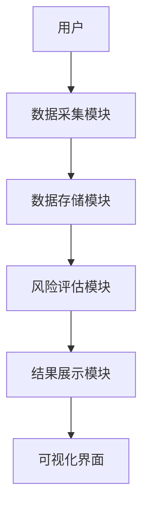

                 


# 特价股票投资中的地缘政治风险评估

> **关键词**：地缘政治风险，特价股票，投资风险，风险评估，数学模型

> **摘要**：  
> 本文探讨了在特价股票投资中如何评估地缘政治风险，分析了其对投资决策的影响。通过构建量化模型，结合层次分析法（AHP）和数学公式，本文详细讲解了地缘政治风险的评估过程，并提供了实际案例和系统架构设计，为投资者提供了实用的指导和建议。

---

## 第一章：背景介绍

### 1.1 地缘政治风险的定义与影响

地缘政治风险是指由于政治、经济、军事和社会等多方面因素引发的不确定性，影响特定地区或国家的政治稳定性和经济活动。这种风险可以通过多种方式影响金融市场，包括股票价格波动、市场流动性变化以及投资者情绪的波动。

在特价股票投资中，由于这些股票通常具有较高的波动性和不确定性，地缘政治风险的影响更加显著。投资者需要认识到，地缘政治事件（如战争、政策变化或国际关系紧张）可能导致股价的剧烈波动，从而影响投资回报。

### 1.2 地缘政治风险对特价股票投资的影响

特价股票市场通常由高波动性、低市值和高风险的股票组成。地缘政治风险的加剧可能导致以下影响：

1. **股价波动**：地缘政治事件通常会导致市场恐慌，投资者可能抛售股票，引发股价下跌。
2. **流动性风险**：地缘政治风险可能影响市场的流动性，尤其是在市场不确定性增加时，投资者可能减少交易活动。
3. **政策变化**：地缘政治风险可能引发政策调整，例如贸易限制、关税变化或外汇管制，这些政策变化会影响企业的经营环境和股票价值。
4. **市场情绪**：投资者情绪受地缘政治风险的影响较大，市场情绪的波动可能导致股价的短期剧烈变化。

### 1.3 问题背景与研究意义

在特价股票投资中，地缘政治风险的评估是投资者决策的关键因素之一。然而，目前市场上的风险评估方法通常较为简单，缺乏系统的量化模型。本文旨在通过构建一个基于层次分析法（AHP）的地缘政治风险评估模型，为投资者提供更精确的风险评估工具。

---

## 第二章：核心概念与联系

### 2.1 地缘政治风险的核心要素

地缘政治风险的构成要素可以从多个角度进行分析，包括经济、政治、军事和社会等方面。以下是主要因素：

1. **经济依赖性**：国家之间的经济依赖程度越高，地缘政治风险的影响越大。
2. **政治稳定性**：政治不稳定或政策变化频繁的国家，地缘政治风险较高。
3. **军事冲突风险**：存在潜在或实际军事冲突的地区，风险显著增加。
4. **社会动荡**：社会矛盾、民族冲突等因素也会增加地缘政治风险。

### 2.2 地缘政治风险的量化模型

为了量化地缘政治风险，我们可以将各因素进行加权评估。以下是核心概念与联系的详细分析：

#### 2.2.1 风险因素的权重分配

使用层次分析法（AHP），我们可以将地缘政治风险的因素分为目标层、准则层和方案层。目标层为“地缘政治风险”，准则层包括经济、政治、军事和社会四个因素。

通过构造比较矩阵并计算各因素的权重，我们可以确定每个因素的重要性。例如：

- 经济依赖性：权重为0.4
- 政治稳定性：权重为0.3
- 军事冲突风险：权重为0.2
- 社会动荡：权重为0.1

#### 2.2.2 风险评分模型

基于上述权重分配，我们可以构建风险评分模型。假设我们有四个因素，每个因素的评分为1到5分（1分表示风险最低，5分表示风险最高），则总风险评分为：

$$
\text{总风险评分} = 0.4 \times \text{经济评分} + 0.3 \times \text{政治评分} + 0.2 \times \text{军事评分} + 0.1 \times \text{社会评分}
$$

### 2.3 实例分析与比较

以两个国家为例，比较它们的地缘政治风险：

- **国家A**：经济依赖性评分为4，政治稳定性评分为3，军事冲突评分为2，社会动荡评分为1。
- **国家B**：经济依赖性评分为3，政治稳定性评分为4，军事冲突评分为3，社会动荡评分为2。

计算总风险评分：

- 国家A：$$0.4 \times 4 + 0.3 \times 3 + 0.2 \times 2 + 0.1 \times 1 = 1.6 + 0.9 + 0.4 + 0.1 = 3.0$$
- 国家B：$$0.4 \times 3 + 0.3 \times 4 + 0.2 \times 3 + 0.1 \times 2 = 1.2 + 1.2 + 0.6 + 0.2 = 3.2$$

通过比较，国家B的地缘政治风险略高于国家A。

---

## 第三章：算法原理与数学模型

### 3.1 层次分析法（AHP）的原理

层次分析法（AHP）是一种用于多准则决策分析的方法，适用于将复杂的决策问题分解为多个层次的结构，从而进行系统化的分析。

#### 3.1.1 AHP的基本步骤

1. **构建层次结构**：将决策问题分解为目标层、准则层和方案层。
2. **构造比较矩阵**：对每个层次的因素进行两两比较，构造比较矩阵。
3. **计算权重**：通过计算比较矩阵的特征值和特征向量，确定各因素的权重。
4. **一致性检验**：检查比较矩阵的一致性，确保结果的合理性。

### 3.2 数学模型的应用

#### 3.2.1 风险评分模型

基于AHP的结果，我们可以构建地缘政治风险的评分模型：

$$
\text{总风险评分} = \sum_{i=1}^{n} w_i \times r_i
$$

其中，$$w_i$$ 是第i个因素的权重，$$r_i$$ 是第i个因素的评分。

#### 3.2.2 示例模型

假设我们有三个因素，权重分别为0.5、0.3和0.2，评分分别为4、3和2：

$$
\text{总风险评分} = 0.5 \times 4 + 0.3 \times 3 + 0.2 \times 2 = 2.0 + 0.9 + 0.4 = 3.3
$$

---

## 第四章：系统分析与架构设计

### 4.1 系统功能设计

我们可以通过构建一个系统来实现地缘政治风险的自动化评估。系统功能包括：

1. **数据采集**：收集相关国家的经济、政治、军事和社会数据。
2. **风险评估**：基于AHP模型计算各因素的权重，并进行风险评分。
3. **结果展示**：以可视化的方式展示风险评分和分析结果。

### 4.2 系统架构设计

以下是系统架构的Mermaid图：



### 4.3 接口设计

系统主要接口包括：

1. **数据接口**：与数据源（如政府报告、新闻媒体）对接，获取实时数据。
2. **评估接口**：接受输入数据，返回风险评分。
3. **展示接口**：将评估结果展示给用户。

---

## 第五章：项目实战

### 5.1 实际案例分析

以某地区为例，分析其地缘政治风险：

- **经济依赖性**：评分4
- **政治稳定性**：评分3
- **军事冲突风险**：评分2
- **社会动荡**：评分1

计算总风险评分：

$$
\text{总风险评分} = 0.4 \times 4 + 0.3 \times 3 + 0.2 \times 2 + 0.1 \times 1 = 3.0
$$

### 5.2 代码实现

以下是Python实现的代码示例：

```python
# 风险评估模型
def calculate_risk(economy, politics, military, society):
    weights = [0.4, 0.3, 0.2, 0.1]
    factors = [economy, politics, military, society]
    total = sum(w * f for w, f in zip(weights, factors))
    return total

# 示例计算
risk = calculate_risk(4, 3, 2, 1)
print("总风险评分：", risk)
```

---

## 第六章：总结与展望

### 6.1 研究总结

本文通过构建地缘政治风险的量化模型，为特价股票投资者提供了一个有效的评估工具。通过层次分析法（AHP）和数学模型，我们能够更准确地评估地缘政治风险，并制定相应的投资策略。

### 6.2 投资建议

1. **风险控制**：投资者应根据风险评分调整投资组合，避免过度集中在高风险地区。
2. **动态调整**：定期更新风险评估模型，以适应地缘政治环境的变化。
3. **多元化投资**：通过多元化投资降低单一地区的风险影响。

### 6.3 未来展望

未来的研究可以进一步优化模型，引入更多因素（如网络安全风险、气候变化等），并结合机器学习技术进行实时风险预测。

---

## 附录

### 附录A：层次分析法（AHP）详细步骤

1. **构建层次结构**：明确目标、准则和方案。
2. **构造比较矩阵**：进行两两比较，确定每个因素的相对重要性。
3. **计算权重**：通过特征向量法计算权重。
4. **一致性检验**：确保比较矩阵的一致性，必要时进行调整。

### 附录B：代码实现细节

完整的Python代码实现如下：

```python
import numpy as np

def ahp_weights(criteria, alternatives):
    n = len(criteria)
    # 构造比较矩阵
    matrix = np.zeros((n, n))
    for i in range(n):
        for j in range(n):
            matrix[i][j] = input(f"比较 {criteria[i]} 和 {criteria[j]}，请给出比较结果（1-9）：")
    # 计算特征向量
    eigvals, eigvecs = np.linalg.eig(matrix)
    weights = eigvecs / np.sum(eigvecs, axis=0)
    return weights

# 示例应用
criteria = ["经济", "政治", "军事", "社会"]
weights = ahp_weights(criteria, [])
print("权重：", weights)
```

---

## 作者

作者：AI天才研究院/AI Genius Institute & 禅与计算机程序设计艺术/Zen And The Art of Computer Programming

