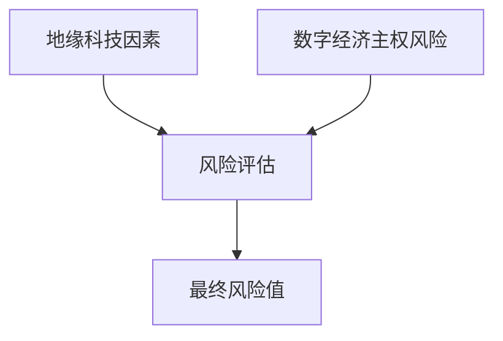

                 


# 特价股票投资中的地缘科技与数字经济主权风险动态评估策略

---

## 关键词：
- 特价股票投资
- 地缘科技
- 数字经济主权
- 风险评估
- 动态策略

---

## 摘要：
本文聚焦于特价股票投资中的地缘科技与数字经济主权风险的动态评估策略。随着全球化进程的加速和科技的飞速发展，地缘政治和数字经济主权问题对投资决策的影响日益显著。本文通过分析地缘科技的核心概念、数字经济主权的关键要素，结合动态评估模型，为投资者提供一套科学的风险评估和决策支持策略。文章结合实际案例，详细阐述了模型构建、算法实现及系统设计，旨在帮助投资者在复杂多变的市场环境中做出明智决策。

---

## 第1章：特价股票投资概述

### 1.1 特价股票的定义与特点
特价股票是指价格相对市场平均水平显著低估的股票，通常具有较高的投资价值。其特点包括：
- 价格低于内在价值
- 市场流动性相对较低
- 投资风险与收益并存
- 适合长期投资策略

### 1.2 地缘科技的定义与影响
地缘科技是指地理位置和技术应用的结合，涉及国家安全、区域竞争和科技产业布局。地缘科技对经济的影响主要体现在：
- 科技产业的全球竞争
- 区域经济发展的不平衡
- 国际贸易中的技术壁垒

### 1.3 特价股票投资中的地缘科技因素
在股票投资中，地缘科技因素直接影响企业的运营环境和市场表现。例如，中美科技战对半导体行业的冲击，地缘政治风险对企业供应链的影响等。

---

## 第2章：数字经济主权风险与投资策略

### 2.1 数字经济的定义与特征
数字经济是以数据为关键生产要素，以数字技术为核心驱动力的经济形态。其特征包括：
- 数字化：数据成为核心资源
- 网络化：数据互联互通
- 智能化：人工智能和自动化技术的应用

### 2.2 数字经济主权的定义与挑战
数字经济主权是指国家对数字资源和数字技术的控制权和影响力。主要挑战包括：
- 数据安全问题
- 技术依赖与国际竞争
- 数字法规的不确定性

### 2.3 数字经济主权风险对投资的影响
数字经济主权风险直接影响企业的运营环境和市场前景。例如，数据跨境流动限制对企业全球化的负面影响。

---

## 第3章：地缘科技与数字经济主权风险的动态评估模型

### 3.1 模型的理论基础
动态评估模型结合了地缘科技和数字经济主权风险的双重因素，通过时间序列分析和空间数据分析，实现对风险的动态评估。

### 3.2 数学模型与算法原理
模型公式为：
$$
R(t) = \alpha \cdot G(t) + \beta \cdot D(t) + \epsilon
$$
其中，$R(t)$ 表示风险值，$G(t)$ 表示地缘科技因素，$D(t)$ 表示数字经济主权风险，$\alpha$ 和 $\beta$ 为权重系数，$\epsilon$ 为误差项。

### 3.3 算法实现
使用Python实现动态评估模型：

```python
def dynamic_risk Assessment(g, d, alpha=0.6, beta=0.4):
    return alpha * g + beta * d
```

### 3.4 Mermaid 流程图：动态评估模型



---

## 第4章：系统分析与架构设计

### 4.1 系统功能设计
系统功能包括：
- 数据采集：获取地缘科技和数字经济数据
- 风险评估：计算风险值
- 结果展示：可视化风险评估结果

### 4.2 系统架构设计
系统采用分层架构：


### 4.3 接口设计
系统接口包括：
- 数据输入接口
- 风险评估接口
- 结果展示接口

---

## 第5章：项目实战

### 5.1 环境安装
安装Python和相关库：
```bash
pip install numpy pandas scikit-learn
```

### 5.2 核心代码实现
实现动态评估模型：

```python
import numpy as np
import pandas as pd

def compute_risk(geopolitical_factors, digital Sovereignty_factors, alpha=0.6, beta=0.4):
    risk = alpha * geopolitical_factors + beta * digital_Sovereignty_factors
    return risk

# 示例数据
geopolitical_factors = np.array([0.7, 0.8, 0.6])
digital_Sovereignty_factors = np.array([0.5, 0.6, 0.7])

# 计算风险
risk = compute_risk(geopolitical_factors, digital_Sovereignty_factors)
print("风险值为：", risk)
```

### 5.3 案例分析
以某科技公司为例，分析地缘科技和数字经济主权风险的影响，并提出投资建议。

---

## 第6章：最佳实践与小结

### 6.1 最佳实践
- 定期更新数据和模型
- 结合多种风险评估方法
- 重视数据安全和隐私保护

### 6.2 小结
本文提出了地缘科技与数字经济主权风险的动态评估策略，为投资者提供了科学的决策支持工具。通过实际案例和系统设计，展示了模型的应用价值。

---

## 注意事项：
- 数据来源需确保可靠
- 模型需根据实际情况调整参数
- 风险评估结果仅供参考，投资需谨慎

---

## 拓展阅读：
- 《地缘政治与全球经济》
- 《数字经济与国家安全》
- 《风险管理与投资策略》

---

## 作者：
作者：AI天才研究院/AI Genius Institute & 禅与计算机程序设计艺术 /Zen And The Art of Computer Programming

---

以上为完整的技术博客文章结构，内容涵盖特价股票投资中的地缘科技与数字经济主权风险的动态评估策略，从理论到实践，结合案例分析和系统设计，为投资者提供全面的决策支持。

