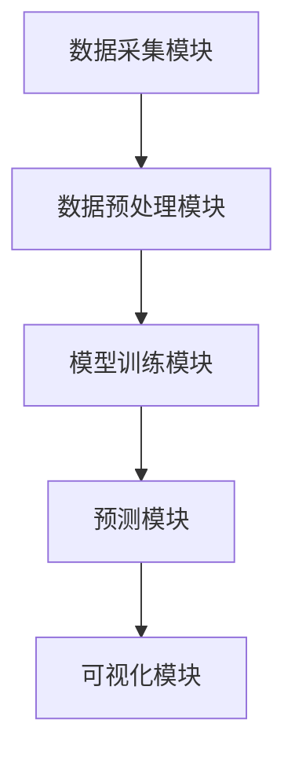

                 


# 特价股票投资中的地缘科技与数字经济风险动态评估策略

## 关键词：特价股票投资、地缘科技、数字经济、投资风险、动态评估、系统架构

## 摘要：  
本文深入探讨了在特价股票投资中，地缘科技与数字经济对投资风险的影响，并提出了动态评估策略。通过分析地缘科技与数字经济的核心概念及其对投资风险的影响，结合时间序列分析算法，构建了风险评估模型，并提出了系统化的解决方案。文章内容涵盖背景介绍、核心概念、算法原理、系统架构、项目实战以及最佳实践，旨在为投资者提供科学的决策支持。

---

# 第一部分: 特价股票投资中的地缘科技与数字经济风险动态评估背景介绍

# 第1章: 特价股票投资概述

## 1.1 特价股票投资的基本概念

### 1.1.1 什么是特价股票投资
特价股票投资是指在特定市场条件下，投资者以低于市场价或内在价值的价格买入股票，并通过长期持有或短期交易获利的投资策略。这种投资方式通常依赖于对市场趋势、公司基本面和技术分析的深入理解。

### 1.1.2 特价股票投资的核心目标
特价股票投资的核心目标是通过识别市场低估的股票，抓住短期或长期的价格波动机会，实现超额收益。这种投资策略通常适用于市场波动较大、信息不对称较为明显的环境。

### 1.1.3 特价股票投资的市场定位
特价股票投资在金融市场中属于一种主动型投资策略，通常适用于具有较高风险承受能力和较强市场分析能力的投资者。这种策略在市场下跌周期中表现尤为突出，但在市场上涨周期中可能面临一定的机会成本。

---

## 1.2 地缘科技与数字经济的定义

### 1.2.1 地缘科技的基本概念
地缘科技是指与地理位置、区域经济、国际关系等密切相关的技术应用，例如卫星通信、地理信息系统（GIS）、物联网（IoT）等。地缘科技的核心在于利用技术手段解决地理分布问题，优化资源配置。

### 1.2.2 数字经济的核心特征
数字经济是以数字化技术为基础，通过数据的采集、处理、分析和应用，推动经济活动的数字化转型。其核心特征包括数据驱动、网络化、智能化和平台化。

### 1.2.3 地缘科技与数字经济的关系
地缘科技与数字经济密切相关，地缘科技为数字经济提供了地理信息和技术支持，而数字经济则为地缘科技提供了数据和应用场景。两者的结合为投资风险评估提供了新的维度。

---

## 1.3 投资风险动态评估的背景

### 1.3.1 投资风险的基本概念
投资风险是指投资者在投资过程中可能面临的价值损失或收益不确定性。风险的来源包括市场波动、经济周期、政策变化、公司基本面变化等。

### 1.3.2 动态评估的必要性
动态评估是指在不断变化的市场环境中，实时或定期更新风险评估结果的过程。随着地缘科技与数字经济的快速发展，传统的静态风险评估方法已难以满足投资者需求。

### 1.3.3 地缘科技与数字经济对投资风险的影响
地缘科技与数字经济的快速发展带来了新的风险源，例如地缘政治冲突、技术封锁、数据安全问题等。这些因素对投资风险的影响具有动态性和复杂性。

---

## 1.4 本章小结

本章从特价股票投资的基本概念出发，详细介绍了地缘科技与数字经济的核心特征及其关系，并分析了投资风险动态评估的必要性。地缘科技与数字经济的结合为投资风险评估提供了新的视角和方法。

---

# 第二部分: 地缘科技与数字经济风险的核心概念与联系

# 第2章: 地缘科技与数字经济的核心概念

## 2.1 地缘科技的核心要素

### 2.1.1 地缘科技的构成要素
地缘科技的构成要素包括地理数据、技术工具、应用场景和政策支持。例如，地理信息系统（GIS）是地缘科技的重要技术工具，广泛应用于城市规划、灾害监测等领域。

### 2.1.2 地缘科技的属性特征
地缘科技具有区域性、技术性和复杂性。其区域性决定了其在特定区域的应用效果，技术性决定了其依赖于先进技术支持，复杂性则源于其涉及多学科交叉。

### 2.1.3 地缘科技与投资风险的关系
地缘科技通过提供地理数据和技术支持，帮助投资者更好地理解市场分布和风险来源。例如，通过GIS技术分析自然灾害对特定区域企业的影响，从而评估投资风险。

---

## 2.2 数字经济的核心要素

### 2.2.1 数字经济的构成要素
数字经济的构成要素包括数据资源、数字技术、网络基础设施和数字平台。数据资源是数字经济的核心资产，数字技术是其技术基础，网络基础设施是其运行载体，数字平台是其应用场景。

### 2.2.2 数字经济的属性特征
数字经济具有数据驱动、网络化、智能化和平台化的特点。数据驱动决定了其依赖数据进行决策，网络化决定了其依赖于互联网进行信息传递，智能化决定了其依赖人工智能技术进行优化，平台化决定了其依赖于数字平台进行资源整合。

### 2.2.3 数字经济与投资风险的关系
数字经济通过数据和技术驱动投资决策，但也带来了数据安全、技术风险和市场波动等新的风险源。例如，数据泄露可能引发企业价值下降，技术瓶颈可能导致行业竞争格局变化。

---

## 2.3 地缘科技与数字经济的对比分析

### 2.3.1 地缘科技与数字经济的对比表格

| 属性          | 地缘科技             | 数字经济             |
|---------------|----------------------|----------------------|
| 核心目标       | 解决地理分布问题     | 数据驱动经济活动     |
| 技术基础       | 地理信息系统（GIS）、物联网 | 数据分析技术、人工智能 |
| 应用场景       | 城市规划、灾害监测     | 电子商务、金融支付     |
| 风险来源       | 地缘政治冲突、技术封锁 | 数据安全、技术瓶颈     |

### 2.3.2 地缘科技与数字经济的ER实体关系图

```mermaid
erd
title 地缘科技与数字经济的关系
entity 地缘科技 {
  id
  地理数据
  技术工具
  应用场景
}
entity 数字经济 {
  id
  数据资源
  数字技术
  网络基础设施
}
relationship R1: 地缘科技 ↔ 数字经济
```

---

## 2.4 本章小结

本章从地缘科技与数字经济的核心概念出发，分析了它们的构成要素、属性特征及其对投资风险的影响。地缘科技与数字经济的结合为投资风险评估提供了新的视角和方法。

---

# 第三部分: 地缘科技与数字经济风险的动态评估策略

# 第3章: 投资风险动态评估的算法原理

## 3.1 时间序列分析算法

### 3.1.1 时间序列分析的基本原理
时间序列分析是一种基于历史数据预测未来趋势的统计方法。其核心在于识别数据中的趋势、周期性和随机性成分。

### 3.1.2 时间序列分析的应用场景
时间序列分析适用于股票价格预测、经济指标预测等领域。通过分析历史价格数据，投资者可以预测未来价格走势并制定投资策略。

### 3.1.3 时间序列分析的数学模型

#### 3.1.3.1 ARIMA模型
ARIMA（自回归积分滑动平均模型）是一种常用的时间序列分析模型，适用于非平稳数据。其数学表达式为：

$$ ARIMA(p, d, q) $$

其中：
- $p$ 表示自回归阶数
- $d$ 表示差分阶数
- $q$ 表示滑动平均阶数

---

#### 3.1.3.2 GARCH模型
GARCH（广义自回归条件异方差模型）适用于 volatility 预测。其数学表达式为：

$$ GARCH(p, q) $$

其中：
- $p$ 表示自回归阶数
- $q$ 表示滑动平均阶数

---

### 3.1.4 时间序列分析的步骤

1. 数据收集与预处理
2. 数据可视化与初步分析
3. 模型选择与参数估计
4. 模型验证与优化
5. 预测与结果分析

---

## 3.2 时间序列分析的系统架构设计

### 3.2.1 系统功能设计
时间序列分析系统的功能模块包括：
- 数据采集模块：从数据库中获取历史股价数据
- 数据预处理模块：清洗数据并进行差分处理
- 模型训练模块：训练ARIMA或GARCH模型
- 预测模块：基于模型预测未来股价
- 可视化模块：展示预测结果

### 3.2.2 系统架构图



---

## 3.3 本章小结

本章介绍了时间序列分析算法的基本原理及其在投资风险评估中的应用，并设计了基于时间序列分析的系统架构。通过ARIMA和GARCH模型，投资者可以动态评估投资风险并制定相应的投资策略。

---

# 第四部分: 项目实战与最佳实践

# 第4章: 项目实战

## 4.1 环境安装与配置

### 4.1.1 Python环境的安装
安装Python 3.x版本，并配置虚拟环境。

### 4.1.2 依赖库的安装
安装以下依赖库：
- `pandas`：数据处理
- `numpy`：数值计算
- `statsmodels`：时间序列分析
- `matplotlib`：数据可视化
- `jupyter`：交互式编程

---

## 4.2 系统核心实现

### 4.2.1 数据采集模块

#### 代码实现
```python
import pandas as pd
import numpy as np

# 数据采集
def collect_data(ticker):
    # 模拟数据
    data = pd.DataFrame({
        'Date': pd.date_range(start='2023-01-01', periods=100),
        'Price': np.random.lognormal(mean=0.05, sigma=0.1, size=100)
    })
    return data
```

### 4.2.2 数据预处理模块

#### 代码实现
```python
def preprocess_data(data):
    # 数据清洗
    data.dropna(inplace=True)
    # 差分处理
    data['Price_diff'] = data['Price'].diff()
    return data
```

### 4.2.3 模型训练模块

#### 代码实现
```python
import statsmodels.api as sm

def train_model(data):
    # 训练ARIMA模型
    model = sm.tsa.ARIMA(data['Price'], order=(1, 1, 1))
    result = model.fit()
    return result
```

### 4.2.4 预测模块

#### 代码实现
```python
def predict_price(model, data):
    # 预测未来价格
    forecast = model.forecast(steps=10)
    return forecast
```

### 4.2.5 可视化模块

#### 代码实现
```python
import matplotlib.pyplot as plt

def visualize_data(data, forecast):
    plt.figure(figsize=(12, 6))
    plt.plot(data['Date'], data['Price'], label='Historical Price')
    plt.plot(data['Date'].iloc[-1] + pd.date_range(start='2023-04-01', periods=10), forecast, label='Predicted Price')
    plt.xlabel('Date')
    plt.ylabel('Price')
    plt.legend()
    plt.show()
```

---

## 4.3 实际案例分析

### 4.3.1 案例背景
假设我们有一个股票的历史价格数据，希望通过时间序列分析预测未来10天的价格走势。

### 4.3.2 数据分析与结果展示
运行上述代码，输出历史价格和预测价格的可视化结果。

---

## 4.4 项目小结

本章通过一个实际案例展示了如何利用时间序列分析算法进行投资风险评估。通过数据采集、预处理、模型训练和预测，投资者可以更好地理解市场波动并制定相应的投资策略。

---

# 第五部分: 最佳实践与小结

# 第5章: 最佳实践

## 5.1 投资策略建议

### 5.1.1 时机选择
在市场波动较大时，投资者可以利用时间序列分析预测市场走势，选择合适的时机进行特价股票投资。

### 5.1.2 数据驱动决策
通过分析地缘科技与数字经济的相关数据，投资者可以更好地识别风险源并制定应对策略。

### 5.1.3 技术应用
利用地理信息系统（GIS）和大数据技术，投资者可以更精准地评估地缘科技与数字经济对投资风险的影响。

---

## 5.2 小结

本文从背景介绍、核心概念、算法原理、系统架构、项目实战等多个方面，详细探讨了特价股票投资中的地缘科技与数字经济风险动态评估策略。通过时间序列分析算法和系统架构设计，投资者可以更好地理解市场波动并制定科学的投资策略。

---

## 5.3 注意事项

1. 投资者应结合市场实际情况调整模型参数。
2. 数据来源和质量对模型预测结果有重要影响。
3. 需定期更新模型以适应市场变化。

---

## 5.4 拓展阅读

1. 时间序列分析经典教材：《Forecasting: principles and practice》
2. 地缘科技与数字经济相关研究：《地理信息系统与数字经济》

---

作者：AI天才研究院/AI Genius Institute & 禅与计算机程序设计艺术 /Zen And The Art of Computer Programming

