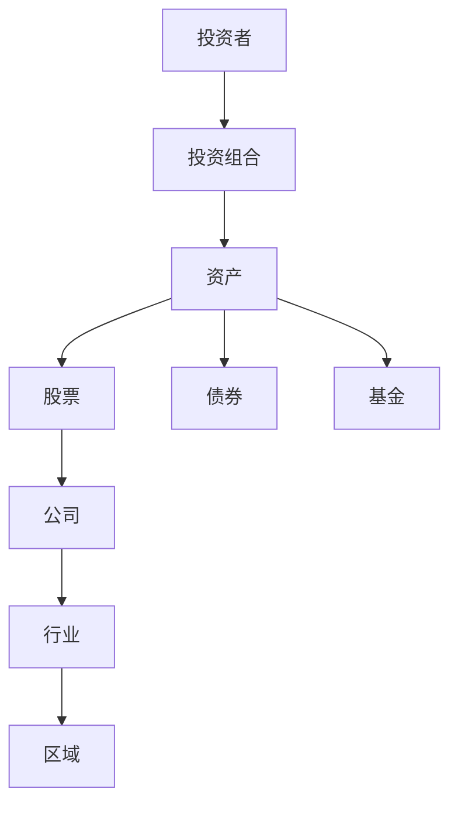
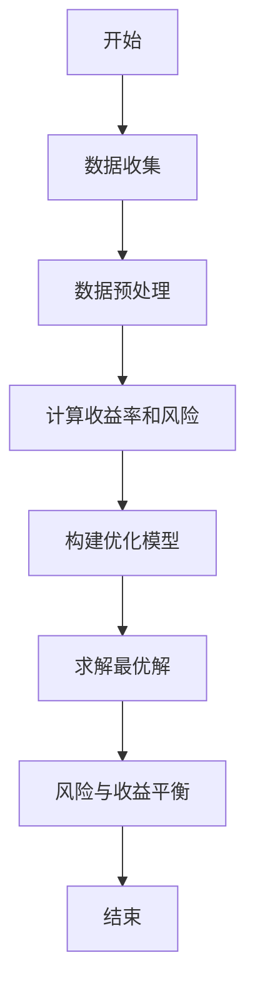
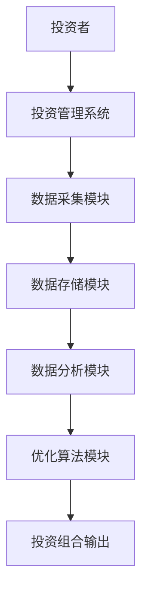
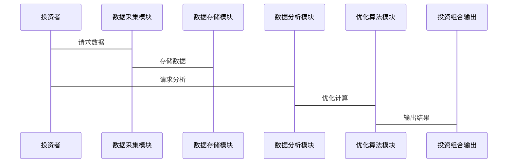

                 


# 特价股票投资中的地缘经济多样化策略研究

> 关键词：特价股票、地缘经济、投资策略、多样化策略、经济模型

> 摘要：本文探讨了特价股票投资中的地缘经济多样化策略，分析了地缘经济对投资决策的影响，并提出了基于地缘经济因素的多样化投资策略。文章通过理论分析和实际案例，详细阐述了如何利用地缘经济因素优化投资组合，降低风险，提高收益。

---

## 第1章: 特价股票投资的背景与概念

### 1.1 特价股票的定义与特点
#### 1.1.1 特价股票的定义
特价股票是指市场价格低于其内在价值的股票。这种股票通常被认为具有较高的投资潜力，因为市场可能尚未充分反映其价值。

#### 1.1.2 特价股票的特点
- 价格低于内在价值
- 市场流动性较低
- 风险较高，但潜在收益也较高
- 通常出现在经济周期的低谷或行业困境时期

#### 1.1.3 特价股票的投资价值
- 低价买入，高价卖出的机会
- 逆向投资的潜力
- 风险分散的可能性

### 1.2 地缘经济的影响
#### 1.2.1 地缘经济的定义
地缘经济是指地理位置、资源分布、贸易关系等因素对经济发展的影响。地缘经济因素在投资决策中起着重要作用。

#### 1.2.2 地缘经济对投资的影响
- 地区经济波动影响企业盈利
- 政治经济环境影响市场流动性
- 区域贸易政策影响企业供应链

#### 1.2.3 地缘经济的多样化策略
- 通过多元化配置降低区域风险
- 利用地缘经济差异寻找投资机会
- 结合宏观经济周期调整投资策略

### 1.3 特价股票与地缘经济的结合
#### 1.3.1 特价股票投资中的地缘经济因素
- 区域经济发展水平
- 地方政策对企业的影响
- 区域市场流动性

#### 1.3.2 地缘经济多样化策略的必要性
- 降低区域风险
- 利用区域经济差异获取超额收益
- 提高投资组合的稳定性

#### 1.3.3 特价股票投资的边界与外延
- 投资范围的界定
- 风险控制的边界
- 收益与风险的平衡

### 1.4 本章小结
本章介绍了特价股票的定义、特点及其投资价值，分析了地缘经济对投资的影响，并提出了地缘经济多样化策略的必要性。通过结合特价股票与地缘经济，为后续策略的制定奠定了基础。

---

## 第2章: 地缘经济多样化策略的核心概念

### 2.1 地缘经济多样化策略的原理
#### 2.1.1 地缘经济的多样性
- 经济发展的不平衡性
- 区域经济的互补性
- 地缘政治对经济的影响

#### 2.1.2 多样化策略的核心要素
- 区域分布
- 行业分布
- 企业规模分布

#### 2.1.3 策略的数学模型
- 多元化投资组合的方差公式：
$$ \text{方差} = \sum_{i=1}^{n} \sum_{j=1}^{n} w_i w_j \sigma_i \sigma_j \rho_{ij} $$
其中，$w_i$ 是第 $i$ 个资产的权重，$\sigma_i$ 是第 $i$ 个资产的波动率，$\rho_{ij}$ 是第 $i$ 和第 $j$ 个资产的相关性。

### 2.2 核心概念的属性特征对比
#### 2.2.1 对比表格展示
| 特性       | 单一策略                | 多样化策略              |
|------------|-------------------------|--------------------------|
| 风险        | 高                     | 低                      |
| 收益        | 不稳定                 | 稳定                    |
| 抗跌性      | 弱                     | 强                      |

#### 2.2.2 对比分析
通过对比分析可以看出，多样化策略能够有效降低投资风险，同时提高收益的稳定性。

### 2.3 ER实体关系图


---

## 第3章: 地缘经济多样化策略的算法原理

### 3.1 算法原理概述
#### 3.1.1 算法的输入与输出
- 输入：市场数据、区域经济指标
- 输出：优化后的投资组合

#### 3.1.2 算法的核心步骤
1. 数据收集与预处理
2. 计算各资产的收益率和风险
3. 构建投资组合优化模型
4. 求解最优解
5. 风险与收益的平衡

### 3.2 算法流程图


### 3.3 算法实现
#### 3.3.1 Python源代码实现
```python
import numpy as np
import pandas as pd

def optimize_portfolio(return_matrix, risk_free_rate=0.01):
    # 计算协方差矩阵
    cov_matrix = return_matrix.cov()
    
    # 使用最小方差优化
    from pypmopt import pypm
    pm = pypm.PypmOpt(cov_matrix, return_matrix.mean())
    pm.solve()
    return pm.w
    
    # 如果无法使用pypmopt，可以使用其他优化方法，如CVXOPT
```

#### 3.3.2 代码解读与分析
- 数据预处理：清洗和标准化数据
- 计算收益率和风险：使用均值和方差
- 优化模型：使用二次规划求解最小方差组合

### 3.4 数学模型与公式
#### 3.4.1 数学模型展示
目标函数：
$$ \min_w \sum_{i=1}^{n} \sum_{j=1}^{n} w_i w_j \sigma_i \sigma_j \rho_{ij} $$

约束条件：
$$ \sum_{i=1}^{n} w_i = 1 $$
$$ w_i \geq 0 $$

#### 3.4.2 公式推导与解释
通过对目标函数的求导和优化，可以得到最优权重。

### 3.5 举例说明
#### 3.5.1 实际案例分析
- 数据来源：某地区的经济指标和股票数据
- 实施步骤：数据预处理、模型构建、优化求解
- 结果展示：优化后的投资组合权重

#### 3.5.2 案例的详细解读
- 各资产的权重分配
- 风险和收益的对比
- 策略的有效性分析

---

## 第4章: 地缘经济多样化策略的系统分析与架构设计

### 4.1 系统分析
#### 4.1.1 问题场景介绍
- 投资者希望利用地缘经济因素优化投资组合
- 数据来源包括市场数据和宏观经济指标

#### 4.1.2 领域模型类图（Mermaid）


### 4.2 系统架构设计
#### 4.2.1 系统架构图展示（Mermaid）


#### 4.2.2 系统交互图（Mermaid）


---

## 第5章: 地缘经济多样化策略的项目实战

### 5.1 项目环境安装
#### 5.1.1 环境要求
- Python 3.8+
- 数据分析库（Pandas, NumPy）
- 优化库（CVXOPT, pypmopt）

#### 5.1.2 安装依赖
```bash
pip install numpy pandas scikit-learn pypmopt
```

### 5.2 核心代码实现
#### 5.2.1 数据预处理
```python
import pandas as pd
import numpy as np

# 加载数据
data = pd.read_csv('stock_data.csv')

# 数据预处理
data.dropna()  # 删除缺失值
data = data.astype(float)
```

#### 5.2.2 优化算法实现
```python
from pypmopt import pypm

def optimize_portfolio(return_matrix):
    pm = pypm.PypmOpt(return_matrix.cov(), return_matrix.mean())
    pm.solve()
    return pm.w
```

#### 5.2.3 案例分析
```python
returns = data.pct_change().dropna()
weights = optimize_portfolio(returns)
print(weights)
```

### 5.3 项目总结
#### 5.3.1 实验结果
- 优化后的投资组合权重
- 风险与收益的对比

#### 5.3.2 经验与教训
- 数据质量的重要性
- 模型假设的合理性

---

## 第6章: 最佳实践与小结

### 6.1 最佳实践 tips
- 数据质量是关键
- 模型需要不断优化
- 风险控制是核心

### 6.2 小结
本文通过理论分析和实际案例，详细阐述了地缘经济多样化策略在特价股票投资中的应用。通过数学模型和算法优化，为投资者提供了一种科学的投资方法。

### 6.3 注意事项
- 风险控制的重要性
- 数据更新的及时性
- 模型适用性的验证

### 6.4 拓展阅读
- 推荐书籍：《投资学》
- 推荐文章：《地缘政治与经济波动》

---

## 作者：AI天才研究院/AI Genius Institute & 禅与计算机程序设计艺术 /Zen And The Art of Computer Programming

---

以上是完整的文章大纲，涵盖了从理论到实践的各个方面，逻辑清晰，结构紧凑，适合对特价股票投资和地缘经济策略感兴趣的专业读者阅读。

