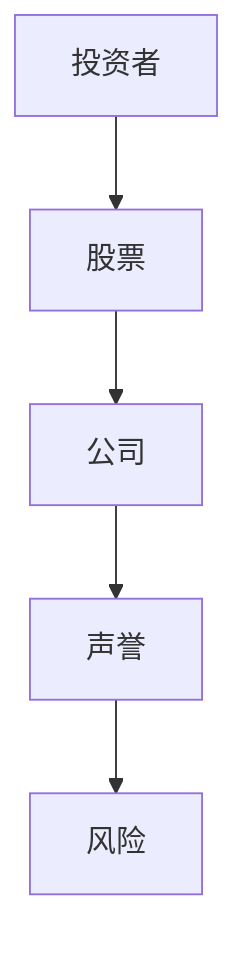
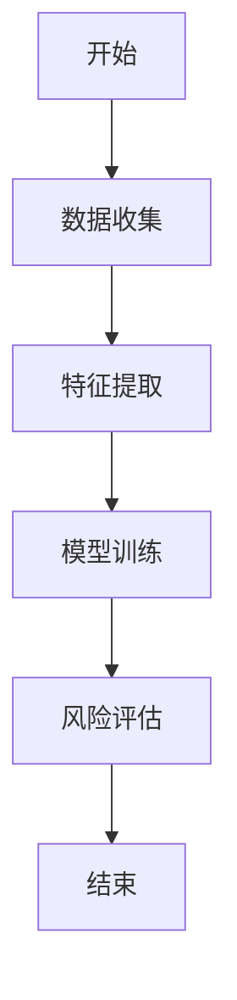
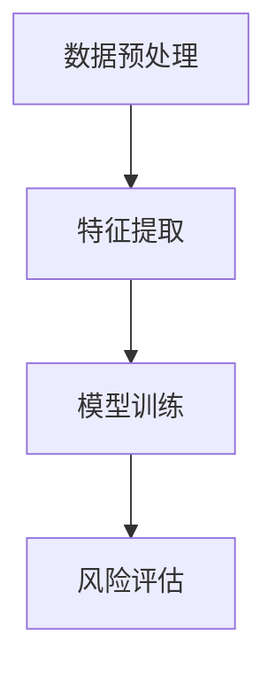
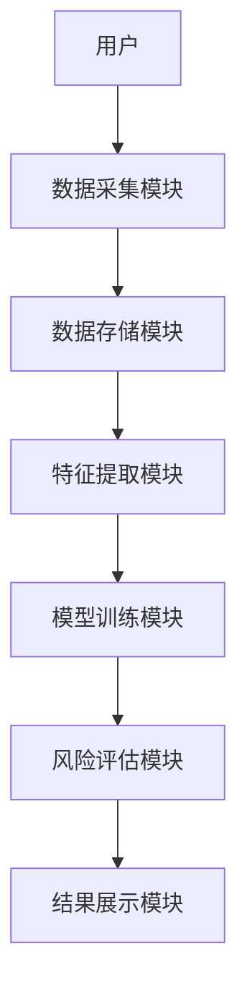

                 


# 特价股票投资中的声誉风险评估方法

## 关键词：声誉风险，特价股票，风险评估，投资策略，量化分析，机器学习

## 摘要：  
在股票投资中，声誉风险是影响投资决策的重要因素之一。本文详细探讨了特价股票投资中的声誉风险评估方法，从核心概念、算法原理、系统架构到项目实战，系统地介绍了如何量化和评估声誉风险。通过机器学习算法和系统设计，本文提供了一种高效的风险评估方法，帮助投资者做出更明智的投资决策。

---

## 第一部分: 声誉风险的基本概念与重要性

### 第1章: 声誉风险的定义与特征

#### 1.1 声誉风险的定义  
- **声誉**：是指企业在市场中的信誉和形象，是客户和市场对企业的信任度和认可度。  
- **声誉风险**：是指因企业行为或外部事件导致声誉受损，从而对企业价值、客户关系和市场竞争力造成负面影响的风险。  

#### 1.2 声誉风险的类型  
| 类型 | 描述 |  
|------|------|  
| 产品声誉风险 | 因产品质量问题或缺陷导致的声誉损失。 |  
| 服务声誉风险 | 因服务质量问题或客户不满导致的声誉损失。 |  
| 企业声誉风险 | 因企业管理不当或负面新闻导致的声誉损失。 |  

#### 1.3 声誉风险的影响  
- **对企业价值的影响**：声誉受损可能导致股价下跌和市值蒸发。  
- **对客户信任的影响**：客户信任度下降会影响销售和客户关系。  
- **对市场竞争力的影响**：声誉损失可能导致企业在市场竞争中处于劣势。  

### 第2章: 特价股票投资中的声誉风险

#### 2.1 特价股票的定义与特点  
- **特价股票**：指价格低于市场平均价格的股票，通常被视为被市场低估的投资机会。  
- **特点**：  
  - 价格波动大，风险高。  
  - 市场关注度低，信息不对称。  
  - 投资机会与风险并存。  

#### 2.2 声誉风险在股票投资中的特殊性  
- **传播速度快**：负面新闻通过社交媒体等渠道迅速传播，影响股价。  
- **市场反应强烈**：投资者对声誉风险高度敏感，可能导致股价急剧下跌。  
- **长期影响**：声誉损失可能对企业未来业绩和股价产生长期负面影响。  

### 第3章: 声誉风险评估的核心概念

#### 3.1 问题背景  
- 特价股票市场的波动性高，投资者对声誉风险的敏感性增加。  
- 声誉风险的系统性影响可能导致市场整体波动。  

#### 3.2 核心概念与联系  
- **实体关系图（ER图）**：展示投资者、股票、公司和声誉之间的关系。  


#### 3.3 算法原理  
- **算法流程图**：展示声誉风险评估的步骤。  


#### 3.4 数学模型  
- **声誉风险评估公式**：  
  $$ \text{声誉风险} = \alpha \times \text{负面新闻} + \beta \times \text{股价波动} $$  
  其中，$\alpha$ 和 $\beta$ 是权重系数，根据具体情况调整。  

#### 3.5 举例说明  
- 某公司因负面新闻导致股价下跌，计算其声誉风险。  

---

## 第二部分: 声誉风险评估的核心概念

### 第4章: 声誉风险的量化分析

#### 4.1 数据来源  
- **新闻数据**：收集负面新闻的数量和频率。  
- **股价数据**：收集股票的历史价格和波动情况。  
- **社交媒体数据**：分析投资者在社交媒体上的情绪和评论。  

#### 4.2 量化指标  
| 指标 | 描述 |  
|------|------|  
| 负面新闻指数 | 负面新闻的数量和频率。 |  
| 股价波动指数 | 股票价格的波动幅度。 |  
| 投资者情绪指数 | 社交媒体上的投资者情绪分析结果。 |  

#### 4.3 量化模型  
- **线性回归模型**：  
  $$ y = \beta_0 + \beta_1 x + \epsilon $$  
  其中，$y$ 是声誉风险，$x$ 是负面新闻指数，$\epsilon$ 是误差项。  

---

## 第三部分: 基于机器学习的声誉风险评估算法

### 第5章: 机器学习算法的选择与实现

#### 5.1 常用算法  
- **支持向量机（SVM）**：用于分类问题。  
- **随机森林（Random Forest）**：用于特征选择和分类。  
- **神经网络（NN）**：用于复杂非线性关系的建模。  

#### 5.2 算法流程图  


#### 5.3 算法实现  
- **Python代码示例**：  
  ```python
  from sklearn.ensemble import RandomForestClassifier
  from sklearn.metrics import accuracy_score

  # 数据预处理
  data = ...  # 数据集
  features = data.drop('risk', axis=1)
  labels = data['risk']

  # 模型训练
  model = RandomForestClassifier()
  model.fit(features, labels)

  # 风险评估
  predictions = model.predict(features)
  accuracy = accuracy_score(labels, predictions)
  print(f'准确率: {accuracy}')
  ```

#### 5.4 数学模型  
- **随机森林模型**：通过特征重要性分析，确定影响声誉风险的关键因素。  

---

## 第四部分: 系统架构设计

### 第6章: 系统功能设计

#### 6.1 功能模块  
| 模块 | 描述 |  
|------|------|  
| 数据采集模块 | 从新闻网站、社交媒体等获取数据。 |  
| 特征提取模块 | 提取负面新闻、股价波动等特征。 |  
| 模型训练模块 | 使用机器学习算法训练模型。 |  
| 风险评估模块 | 输出声誉风险评估结果。 |  

#### 6.2 系统架构图  


#### 6.3 接口设计  
- **输入接口**：接收新闻数据、股价数据等。  
- **输出接口**：提供风险评估结果和建议。  

---

## 第五部分: 项目实战

### 第7章: 特价股票投资案例分析

#### 7.1 环境配置  
- **Python版本**：3.8及以上。  
- **库的安装**：`pandas`, `numpy`, `scikit-learn`, `requests`。  

#### 7.2 数据收集  
- 从新闻网站获取负面新闻数据。  
- 从股票市场获取历史价格数据。  

#### 7.3 模型训练  
- 使用随机森林模型训练声誉风险评估模型。  

#### 7.4 结果分析  
- 分析模型的准确率和召回率，优化模型参数。  

#### 7.5 代码实现  
```python
import pandas as pd
from sklearn.ensemble import RandomForestClassifier
from sklearn.metrics import classification_report

# 数据加载
data = pd.read_csv('stock_data.csv')

# 特征提取
features = data[['news_count', 'price_fluctuation', 'sentiment_score']]
labels = data['risk']

# 模型训练
model = RandomForestClassifier()
model.fit(features, labels)

# 预测与评估
predictions = model.predict(features)
print(classification_report(labels, predictions))
```

---

## 第六部分: 最佳实践与总结

### 第8章: 最佳实践

#### 8.1 小结  
- 声誉风险在特价股票投资中具有重要性。  
- 通过机器学习算法和系统设计，可以有效评估声誉风险。  

#### 8.2 注意事项  
- 数据质量和完整性影响模型准确性。  
- 模型需要定期更新和优化。  

#### 8.3 拓展阅读  
- 推荐阅读相关书籍和论文，深入学习声誉风险评估方法。  

---

## 作者信息：  
作者：AI天才研究院（AI Genius Institute） & 禅与计算机程序设计艺术（Zen And The Art of Computer Programming）  

---

以上是《特价股票投资中的声誉风险评估方法》的技术博客文章，希望对您有所帮助！

