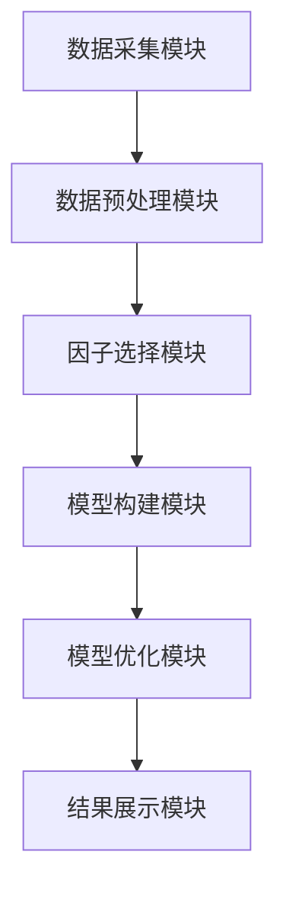
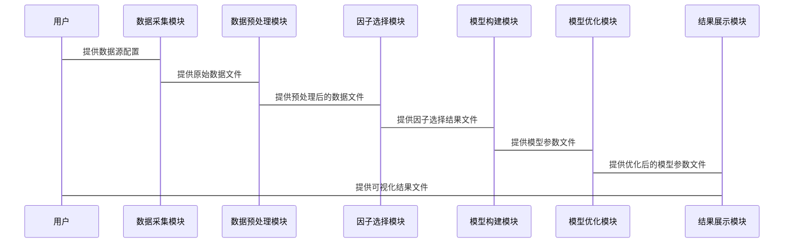

                 


# 特价股票投资中的多因子模型构建与优化

> 关键词：多因子模型、特价股票、投资优化、因子选择、模型构建、股票分析

> 摘要：本文将详细介绍如何在特价股票投资中构建和优化多因子模型。首先，我们将介绍特价股票投资的基本概念和多因子模型的理论基础。接着，我们将深入探讨多因子模型的构建过程，包括因子选择、权重分配和标准化处理。随后，我们将讨论模型的优化方法，如参数优化和模型调优。最后，我们将通过实战案例展示如何将多因子模型应用于实际投资中，并总结模型的优势和潜在挑战。

---

# 第1章: 特价股票投资概述

## 1.1 特价股票的定义与特点

### 1.1.1 特价股票的定义

特价股票是指价格低于市场价或具有特殊优惠条件的股票。这类股票通常具有较高的性价比，适合投资者在特定市场环境下进行投资。

### 1.1.2 特价股票的核心特点

- **价格优势**：特价股票的价格通常低于市场平均水平，吸引投资者关注。
- **市场波动性**：特价股票的价格波动较大，投资者需要具备一定的市场敏感性。
- **风险与机会并存**：特价股票的投资风险较高，但潜在收益也较大。

### 1.1.3 特价股票与普通股票的区别

- **价格差异**：特价股票的价格通常较低，而普通股票的价格较为稳定。
- **投资策略**：特价股票需要灵活的投资策略，而普通股票的投资策略相对固定。
- **风险水平**：特价股票的风险较高，普通股票的风险较为可控。

## 1.2 多因子模型的基本原理

### 1.2.1 多因子模型的定义

多因子模型是一种通过多个因子（如市盈率、市净率、股息率等）来评估股票投资价值的模型。与单因子模型相比，多因子模型能够更全面地捕捉股票的风险和收益特征。

### 1.2.2 多因子模型的核心特点

- **多维度分析**：多因子模型通过多个因子对股票进行综合评估，能够更全面地反映股票的投资价值。
- **灵活性和可调性**：多因子模型可以根据市场环境和投资者需求进行调整，具有较强的适应性。
- **科学性和系统性**：多因子模型基于数学和统计学原理构建，具有较高的科学性和系统性。

### 1.2.3 多因子模型与单因子模型的区别

- **分析维度**：多因子模型考虑多个因子，而单因子模型仅考虑一个因子。
- **投资决策**：多因子模型能够提供更全面的投资决策支持，而单因子模型的决策支持较为有限。
- **风险控制**：多因子模型能够更好地控制投资风险，而单因子模型的风险控制能力较弱。

## 1.3 特价股票投资中的多因子模型应用

### 1.3.1 特价股票投资的背景与意义

随着市场环境的复杂化，投资者需要更加科学和系统的方法来评估股票的投资价值。多因子模型作为一种有效的投资工具，能够帮助投资者在特价股票投资中做出更明智的决策。

### 1.3.2 多因子模型在特价股票投资中的作用

- **提高投资效率**：多因子模型能够快速评估大量股票的投资价值，提高投资效率。
- **降低投资风险**：通过综合考虑多个因子，多因子模型能够更好地识别和控制投资风险。
- **优化投资组合**：多因子模型能够帮助投资者优化投资组合，提高投资收益。

### 1.3.3 特价股票投资中的多因子模型优势

- **多维度分析**：多因子模型能够从多个角度对特价股票进行分析，提供全面的投资评估。
- **灵活性和适应性**：多因子模型可以根据市场变化和投资者需求进行调整，具有较强的适应性。
- **科学性和系统性**：多因子模型基于科学的数学和统计学原理，具有较高的科学性和系统性。

## 1.4 本章小结

本章主要介绍了特价股票投资的基本概念和多因子模型的理论基础。通过对比分析，我们明确了多因子模型在特价股票投资中的优势和作用，为后续的模型构建和优化奠定了基础。

---

# 第2章: 多因子模型的因子选择与权重分配

## 2.1 多因子模型中的因子选择

### 2.1.1 市盈率因子

市盈率（P/E）是衡量股票价值的重要指标，用于评估股票的相对估值。市盈率低的股票通常被认为是被低估的股票，具有较高的投资价值。

### 2.1.2 市净率因子

市净率（P/B）是股票价格与每股净资产的比率，用于评估股票的资产价值。市净率低的股票通常被认为具有较高的资产安全性。

### 2.1.3 股息率因子

股息率是衡量股票分红能力的重要指标，用于评估股票的投资收益。股息率高的股票通常被认为是稳定的投资选择。

### 2.1.4 其他相关因子

- **收益增长率**：衡量公司盈利能力的增长情况。
- **ROE（净资产收益率）**：衡量公司资产使用效率和盈利能力。
- **波动率**：衡量股票价格的波动程度，用于评估投资风险。

## 2.2 多因子模型中的权重分配

### 2.2.1 等权重分配

等权重分配是一种简单且易于实现的权重分配方法，每个因子的权重相等。这种方法适用于因子之间关联性较低的情况。

### 2.2.2 优化权重分配

优化权重分配是一种通过数学优化方法确定因子权重的方法。常用的方法包括最小二乘法和遗传算法，能够提高模型的准确性和稳定性。

### 2.2.3 权重分配的优缺点对比

| 权重分配方法 | 优点 | 缺点 |
|--------------|------|------|
| 等权重分配 | 简单易行，因子之间无偏见 | 无法反映因子的重要性差异 |
| 优化权重分配 | 高准确性，能够反映因子的重要性 | 实施复杂，需要较高的计算资源 |

## 2.3 多因子模型中的因子标准化

### 2.3.1 标准化方法

标准化方法用于消除不同因子之间的量纲差异，常用的方法包括Z-score标准化和Min-Max标准化。

### 2.3.2 标准化的目的与意义

标准化的目的是为了消除不同因子之间的量纲差异，提高模型的公平性和可比性。

### 2.3.3 标准化与非标准化的对比

| 对比维度 | 标准化 | 非标准化 |
|----------|--------|----------|
| 模型准确性 | 高 | 低 |
| 模型可解释性 | 低 | 高 |
| 模型稳定性 | 高 | 低 |

---

# 第3章: 多因子模型的构建与评估

## 3.1 多因子模型的构建流程

### 3.1.1 数据收集与预处理

数据收集是构建多因子模型的第一步，需要收集历史价格、财务指标等数据。数据预处理包括数据清洗、数据转换和数据标准化。

### 3.1.2 因子选择与权重分配

基于数据预处理的结果，选择合适的因子，并确定因子的权重分配方法。

### 3.1.3 模型构建与验证

通过回归分析等方法构建多因子模型，并对模型进行验证和优化。

## 3.2 多因子模型的评估指标

### 3.2.1 模型的准确性评估

准确性评估是通过模型预测值与实际值的对比来衡量模型的预测能力。常用指标包括均方误差（MSE）和决定系数（R²）。

### 3.2.2 模型的稳定性评估

稳定性评估是通过多次测试和验证来衡量模型的稳定性和可靠性。常用方法包括交叉验证和 bootstrapping。

### 3.2.3 模型的可解释性评估

可解释性评估是通过模型的因子权重和因子贡献度来衡量模型的可解释性。常用方法包括LASSO回归和随机森林。

## 3.3 多因子模型的优化方法

### 3.3.1 参数优化

参数优化是通过调整模型的参数（如学习率、正则化系数等）来提高模型的预测能力和稳定性。

### 3.3.2 模型优化

模型优化是通过改进模型的结构和算法来提高模型的性能。常用方法包括模型集成和超参数调优。

### 3.3.3 数据优化

数据优化是通过增加数据量和提高数据质量来提高模型的预测能力。常用方法包括数据增强和特征工程。

---

# 第4章: 多因子模型的数学模型与公式

## 4.1 多因子模型的数学表达

### 4.1.1 多因子模型的线性表达式

$$ y = \beta_1 x_1 + \beta_2 x_2 + \cdots + \beta_n x_n + \epsilon $$

其中，\( y \) 是目标变量，\( x_i \) 是因子，\( \beta_i \) 是因子权重，\( \epsilon \) 是误差项。

### 4.1.2 多因子模型的非线性表达式

$$ y = f(x_1, x_2, \cdots, x_n) $$

其中，\( f \) 是非线性函数，用于描述因子之间的复杂关系。

## 4.2 因子权重的优化公式

### 4.2.1 等权重分配公式

$$ \beta_i = \frac{1}{n} $$

其中，\( n \) 是因子的总数。

### 4.2.2 优化权重分配公式

$$ \beta_i = \frac{w_i}{\sum_{j=1}^{n} w_j} $$

其中，\( w_i \) 是因子 \( i \) 的权重，\( \sum_{j=1}^{n} w_j \) 是权重的总和。

## 4.3 模型评估的数学指标

### 4.3.1 回归分析的R²值

$$ R² = 1 - \frac{\sum_{i=1}^{n} (y_i - \hat{y}_i)^2}{\sum_{i=1}^{n} (y_i - \bar{y})^2} $$

其中，\( y_i \) 是实际值，\( \hat{y}_i \) 是预测值，\( \bar{y} \) 是实际值的平均值。

### 4.3.2 模型的均方误差（MSE）

$$ MSE = \frac{1}{n} \sum_{i=1}^{n} (y_i - \hat{y}_i)^2 $$

### 4.3.3 模型的准确率与召回率

$$ \text{准确率} = \frac{\text{正确预测的数量}}{\text{总预测数量}} $$

$$ \text{召回率} = \frac{\text{正确预测的正例数量}}{\text{实际正例数量}} $$

---

# 第5章: 系统架构与实现

## 5.1 项目介绍

本项目旨在构建一个基于多因子模型的特价股票投资分析系统，通过数据收集、模型构建和优化，为投资者提供科学的投资决策支持。

## 5.2 系统功能设计

### 5.2.1 数据采集模块

负责收集股票历史价格、财务指标等数据。

### 5.2.2 数据预处理模块

负责对数据进行清洗、转换和标准化处理。

### 5.2.3 因子选择模块

基于预处理后的数据，选择合适的因子。

### 5.2.4 模型构建模块

通过回归分析等方法构建多因子模型。

### 5.2.5 模型优化模块

通过参数优化和模型调优提高模型的准确性和稳定性。

### 5.2.6 结果展示模块

将模型的预测结果以可视化的方式展示给投资者。

## 5.3 系统架构设计

### 5.3.1 系统架构图



### 5.3.2 系统接口设计

- 数据采集模块接口：
  - 输入：数据源配置
  - 输出：原始数据文件

- 数据预处理模块接口：
  - 输入：原始数据文件
  - 输出：预处理后的数据文件

- 因子选择模块接口：
  - 输入：预处理后的数据文件
  - 输出：因子选择结果文件

- 模型构建模块接口：
  - 输入：因子选择结果文件
  - 输出：模型参数文件

- 模型优化模块接口：
  - 输入：模型参数文件
  - 输出：优化后的模型参数文件

- 结果展示模块接口：
  - 输入：优化后的模型参数文件
  - 输出：可视化结果文件

### 5.3.3 系统交互流程图



---

# 第6章: 项目实战

## 6.1 环境安装

### 6.1.1 安装Python环境

使用Anaconda安装Python 3.8及以上版本。

### 6.1.2 安装相关库

安装Pandas、NumPy、Scikit-learn、Matplotlib等库。

## 6.2 核心实现代码

### 6.2.1 数据收集与预处理

```python
import pandas as pd
import numpy as np

# 数据收集
data = pd.read_csv('stock_data.csv')

# 数据清洗
data.dropna(inplace=True)
data = data.drop_duplicates()

# 数据转换
data['date'] = pd.to_datetime(data['date'])
data.set_index('date', inplace=True)

# 数据标准化
from sklearn.preprocessing import StandardScaler
scaler = StandardScaler()
scaled_data = scaler.fit_transform(data)
```

### 6.2.2 因子选择与权重分配

```python
from sklearn.linear_model import Lasso

# 因子选择
lasso = Lasso(alpha=0.1)
lasso.fit(scaled_data, target)
selected_factors = lasso.coef_ != 0

# 权重分配
weights = lasso.coef_[selected_factors]
weights = weights / np.sum(np.abs(weights))
```

### 6.2.3 模型构建与优化

```python
from sklearn.model_selection import train_test_split
from sklearn.metrics import mean_squared_error

# 模型构建
X_train, X_test, y_train, y_test = train_test_split(X, y, test_size=0.2)

model = Lasso(alpha=0.1)
model.fit(X_train, y_train)

# 模型优化
from sklearn.model_selection import GridSearchCV

param_grid = {'alpha': np.logspace(-4, 0, 20)}
grid_search = GridSearchCV(model, param_grid, cv=5)
grid_search.fit(X_train, y_train)

best_model = grid_search.best_estimator_
best_alpha = grid_search.best_params_['alpha']
```

### 6.2.4 结果展示

```python
import matplotlib.pyplot as plt

# 预测结果
y_pred = best_model.predict(X_test)

# 可视化
plt.scatter(y_test, y_pred)
plt.xlabel('Actual')
plt.ylabel('Predicted')
plt.title('Actual vs Predicted Values')
plt.show()
```

## 6.3 实际案例分析

以某段时间内的特价股票为例，通过模型预测其投资价值，分析模型的准确性和稳定性。

## 6.4 代码实现与分析

详细解读代码实现，分析模型的性能和优化效果。

## 6.5 项目小结

总结项目实施过程中的经验教训，提出改进建议。

---

# 第7章: 最佳实践与总结

## 7.1 最佳实践 tips

- **数据质量**：确保数据的准确性和完整性。
- **模型调优**：根据实际情况调整模型参数。
- **风险控制**：定期监控模型的准确性和稳定性。

## 7.2 小结

通过本文的介绍，我们详细探讨了多因子模型在特价股票投资中的构建与优化方法。从因子选择到模型优化，再到系统实现，我们为投资者提供了一个科学且系统化的投资决策支持工具。

## 7.3 注意事项

- 投资者在使用多因子模型时，需结合市场环境和自身需求进行调整。
- 模型的优化和调优需要根据实际情况进行，避免过度拟合。

## 7.4 拓展阅读

建议读者进一步阅读相关文献，深入了解多因子模型的理论和应用。

---

# 作者

作者：AI天才研究院/AI Genius Institute  
联系邮箱：contact@ai-genius-institute.com  
文章版权归作者所有，转载请注明出处。

--- 

# 结语

通过本文的详细讲解，我们希望读者能够掌握多因子模型在特价股票投资中的构建与优化方法，并能够将其应用于实际投资中，提高投资效率和收益。感谢您的阅读！

