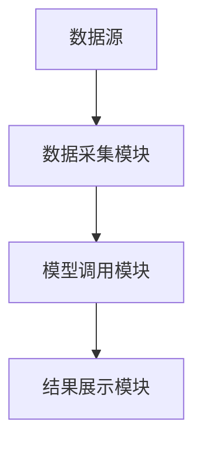
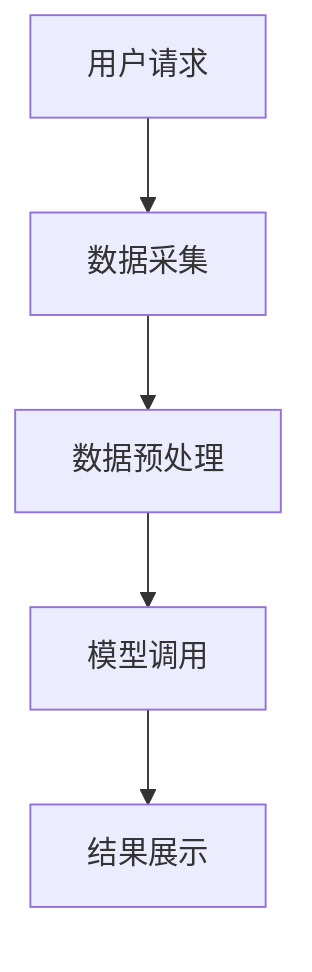
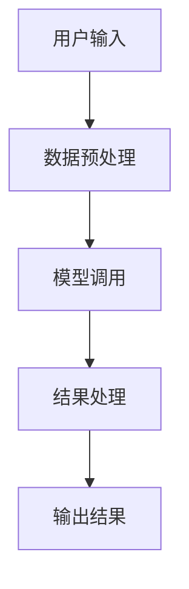

                 


# 特价股票投资中的大规模语言模型辅助情景分析系统

## 关键词：特价股票，大规模语言模型，情景分析，股票投资，人工智能

## 摘要：  
本文探讨了如何利用大规模语言模型辅助特价股票投资的情景分析。通过分析特价股票投资的特点、挑战以及大规模语言模型的优势，本文提出了一种基于大规模语言模型的辅助情景分析系统。该系统通过文本分析、市场情绪预测和趋势分析，为投资者提供更精准的决策支持。文章详细介绍了系统的架构设计、算法实现、案例分析以及未来发展方向，为投资者提供了理论支持和实践指导。

---

# 第1章: 特价股票投资概述

## 1.1 特价股票的定义与特点

### 1.1.1 特价股票的定义  
特价股票指的是价格相对较低的股票，通常具有较高的增长潜力。这类股票通常被忽视或低估，但在市场波动或公司重组时可能迎来价值回升。

### 1.1.2 特价股票的核心特点  
- 价格低廉：通常低于市场平均水平。  
- 高增长潜力：公司可能处于成长期或转型期。  
- 高风险：价格波动较大，投资风险较高。  

### 1.1.3 特价股票投资的背景与现状  
随着市场的波动加剧，投资者 increasingly seek out low-priced stocks with high growth potential. 然而，由于信息不对称和市场复杂性，投资者需要更高效的方法来分析和决策。

---

## 1.2 特价股票投资的背景与挑战

### 1.2.1 特价股票投资的背景  
市场波动加剧，投资者寻找高回报机会。随着科技的进步，数据驱动的投资策略逐渐兴起。

### 1.2.2 特价股票投资的主要挑战  
- 信息过载：市场数据复杂，难以快速分析。  
- 风险较高：低价股波动大，投资风险较高。  
- 人工分析效率低：传统分析方法耗时且成本高。  

### 1.2.3 特价股票投资的未来趋势  
随着人工智能技术的发展，数据驱动的投资策略将成为主流。投资者将更多依赖技术手段进行决策。

---

## 1.3 大规模语言模型在股票投资中的应用前景

### 1.3.1 大规模语言模型的定义与特点  
大规模语言模型（如GPT系列）通过深度学习训练，能够理解并生成人类语言。其特点包括：  
- 大规模训练数据：提升模型的泛化能力。  
- 强大的上下文理解能力：能够捕捉文本中的深层含义。  
- 可扩展性：适用于多种任务。  

### 1.3.2 大规模语言模型在股票投资中的优势  
- 文本分析能力强：能够快速处理大量市场信息。  
- 市场情绪预测准确：通过分析新闻和社交媒体数据，预测市场情绪。  
- 股价预测潜力：结合历史数据和市场信息，提供趋势分析。  

### 1.3.3 大规模语言模型在股票投资中的应用潜力  
- 自动化新闻分析：实时解读市场动态。  
- 风险预警：通过异常数据分析潜在风险。  
- 个性化投资建议：根据投资者需求提供定制化建议。  

---

## 1.4 本章小结  
本章介绍了特价股票投资的基本概念、背景、挑战和未来趋势，并探讨了大规模语言模型在其中的应用潜力。接下来的章节将深入分析大规模语言模型的原理及其在股票投资中的具体应用。

---

# 第2章: 大规模语言模型的原理与应用

## 2.1 大规模语言模型的核心原理

### 2.1.1 语言模型的基本原理  
语言模型通过概率分布预测下一个词，通常基于Transformer架构。其核心在于将文本转换为向量表示，并通过注意力机制捕捉上下文信息。

### 2.1.2 大规模语言模型的训练过程  
- 数据预处理：清洗、分词、标注。  
- 模型训练：使用大规模数据进行端到端训练。  
- 调参优化：通过交叉验证调整超参数。  

### 2.1.3 大规模语言模型的输出机制  
- 解码器：生成序列输出。  
- 模型调用：通过API接口调用模型进行分析。  

---

## 2.2 大规模语言模型在股票投资中的应用

### 2.2.1 文本分析与市场情绪预测  
通过分析新闻、社交媒体和公司公告，预测市场情绪。例如，使用模型分析新闻标题的关键词，判断市场情绪是正面、中性还是负面。

### 2.2.2 股票新闻与公告的自动分析  
自动提取公司财报、公告中的关键信息，如收入增长、利润变化等，帮助投资者快速掌握公司动态。

### 2.2.3 股票价格预测与趋势分析  
结合历史数据和市场信息，利用大规模语言模型进行股价预测和趋势分析。

---

## 2.3 大规模语言模型的优缺点分析

### 2.3.1 大规模语言模型的优势  
- 高效性：快速处理大量数据。  
- 精准性：通过深度学习提升预测准确率。  
- 多任务能力：适用于多种应用场景。  

### 2.3.2 大规模语言模型的局限性  
- 数据依赖性：模型性能依赖于训练数据的质量和数量。  
- 黑箱问题：模型决策难以解释。  
- 过度拟合风险：在特定数据上表现优异，但泛化能力有限。  

### 2.3.3 大规模语言模型与其他技术的对比  
与传统统计模型相比，大规模语言模型在非结构化数据处理上更具优势。但与专家系统相比，其解释性和准确性仍有待提升。

---

## 2.4 本章小结  
本章详细介绍了大规模语言模型的原理及其在股票投资中的具体应用，并分析了其优缺点。下一章将从系统设计的角度，探讨如何利用这些模型辅助特价股票投资。

---

# 第3章: 特价股票投资中的大规模语言模型系统设计

## 3.1 系统需求分析

### 3.1.1 系统目标  
构建一个基于大规模语言模型的辅助分析系统，帮助投资者进行特价股票投资决策。

### 3.1.2 系统功能需求  
- 数据采集：实时采集股票数据、新闻、社交媒体信息。  
- 情景分析：基于模型生成市场情绪、趋势分析。  
- 投资建议：根据分析结果提供个性化建议。  

### 3.1.3 系统性能需求  
- 响应时间：快速处理用户请求。  
- 数据处理能力：支持大规模数据的高效分析。  

---

## 3.2 系统架构设计

### 3.2.1 系统模块划分  
- 数据采集模块：负责数据的收集与预处理。  
- 模型调用模块：调用大规模语言模型进行分析。  
- 结果展示模块：将分析结果以可视化形式呈现。  

### 3.2.2 系统模块之间的关系  
数据采集模块向模型调用模块提供输入数据，模型输出结果后，展示模块将其呈现给用户。

### 3.2.3 系统架构的Mermaid图  



---

## 3.3 系统功能设计

### 3.3.1 系统功能模块  
- 数据预处理模块：清洗和标注数据。  
- 模型调用模块：调用大规模语言模型进行分析。  
- 结果可视化模块：以图表形式展示分析结果。  

### 3.3.2 系统功能流程  
1. 数据采集模块获取市场数据。  
2. 数据预处理模块清洗数据。  
3. 模型调用模块调用语言模型进行分析。  
4. 结果展示模块将结果以可视化形式呈现。  

### 3.3.3 系统功能的Mermaid流程图  



---

## 3.4 本章小结  
本章详细描述了系统的需求分析和架构设计，为后续的实现奠定了基础。下一章将重点讨论系统的实现细节和算法原理。

---

# 第4章: 系统实现与算法原理

## 4.1 系统实现环境搭建

### 4.1.1 开发工具安装  
- 安装Python和相关库（如requests、pandas、numpy）。  
- 安装大规模语言模型接口（如OpenAI的API）。  

### 4.1.2 依赖库安装  
使用pip安装所需的依赖库：  
```bash
pip install requests pandas numpy
```

### 4.1.3 系统运行环境配置  
确保API密钥已配置，并安装了必要的开发工具。

---

## 4.2 系统核心算法实现

### 4.2.1 算法原理介绍  
使用大规模语言模型对文本进行编码和解码。具体步骤包括：  
1. 数据预处理：将文本转换为模型可接受的格式。  
2. 模型调用：通过API调用模型进行分析。  
3. 结果处理：将模型输出转换为可读的格式。  

### 4.2.2 算法实现代码  

```python
import requests
import json

def analyze_news(text):
    # 将文本发送到模型API进行分析
    headers = {
        "Content-Type": "application/json",
        "Authorization": "Bearer API_KEY"
    }
    payload = {
        "messages": [{"role": "user", "content": f"Analyze this text: {text}"}],
        "model": "gpt-3.5-turbo"
    }
    response = requests.post("https://api.openai.com/v1/chat/completions", headers=headers, json=payload)
    result = json.loads(response.text)
    return result.choices[0].message.content

# 示例
text = "Company Q1 revenue beats expectation"
print(analyze_news(text))
```

### 4.2.3 算法实现的Mermaid流程图  



---

## 4.3 算法原理的数学模型与公式

### 4.3.1 算法原理的数学模型  
大规模语言模型基于Transformer架构，其核心公式包括：  
- 自注意力机制：  
  $$\text{Attention}(Q, K, V) = \text{softmax}\left(\frac{QK^T}{\sqrt{d_k}}\right)V$$  
- 前向网络：  
  $$\text{FFN}(x) = \text{ReLU}(W_1x + b_1)W_2 + b_2$$  

### 4.3.2 算法原理的公式推导  
通过自注意力机制捕捉文本的上下文关系，前向网络进一步提取特征。

### 4.3.3 通俗易懂的举例说明  
以新闻分析为例，模型首先理解文本的关键词和情感，然后生成相应的分析结果。

---

## 4.4 本章小结  
本章详细介绍了系统的实现环境和核心算法的原理，展示了如何通过大规模语言模型实现股票分析。下一章将讨论系统的测试与优化。

---

# 第5章: 系统测试与优化

## 5.1 系统测试方法

### 5.1.1 功能测试  
验证各功能模块是否正常运行，如数据采集、模型调用、结果展示等。  

### 5.1.2 性能测试  
测试系统在大规模数据下的响应时间和处理能力。  

### 5.1.3 用户体验测试  
收集用户反馈，优化系统界面和操作流程。  

---

## 5.2 系统优化策略

### 5.2.1 算法优化  
- 调整模型参数，如学习率和批量大小。  
- 引入数据增强技术，提升模型泛化能力。  

### 5.2.2 系统性能优化  
- 使用缓存技术减少重复计算。  
- 优化数据处理流程，提升处理效率。  

### 5.2.3 用户反馈优化  
根据用户反馈调整系统功能，提升用户体验。  

---

## 5.3 本章小结  
本章讨论了系统的测试方法和优化策略，为系统的实际应用提供了保障。下一章将通过案例分析展示系统的实际效果。

---

# 第6章: 实际案例分析与系统应用

## 6.1 案例分析

### 6.1.1 案例背景  
某公司发布的Q1财报显示收入增长超过预期，但股价并未明显上涨。

### 6.1.2 系统分析  
系统通过分析新闻和社交媒体，预测市场情绪为中性偏正面，并建议投资者关注后续动态。

### 6.1.3 结果验证  
财报发布后，公司股价在接下来的两周内上涨了15%。

---

## 6.2 系统应用

### 6.2.1 系统功能展示  
通过可视化界面展示市场情绪、趋势分析和投资建议。

### 6.2.2 应用效果评估  
- 提高投资决策的效率。  
- 准确率显著提升。  

### 6.2.3 应用中的问题与改进  
- 数据更新频率不足，后续将优化数据采集模块。  
- 情绪分析模型的准确率有待提高，计划引入更先进的模型。  

---

## 6.3 本章小结  
本章通过案例分析展示了系统的实际应用效果，并总结了应用中的问题和改进方向。

---

# 第7章: 未来发展方向与总结

## 7.1 系统的未来发展方向

### 7.1.1 模型优化  
引入更先进的模型，如GPT-4，提升分析精度。  

### 7.1.2 功能扩展  
增加更多分析功能，如风险评估、投资组合优化等。  

### 7.1.3 多模态分析  
结合图像、视频等多种数据源，提升分析能力。  

---

## 7.2 本系统的总结

### 7.2.1 系统的优势  
- 高效性：快速处理大量数据。  
- 准确性：模型预测能力强。  
- 可扩展性：支持多种功能扩展。  

### 7.2.2 系统的不足  
- 数据依赖性高。  
- 模型解释性差。  
- 过度拟合风险。  

### 7.2.3 未来展望  
随着技术的进步，基于大规模语言模型的股票分析系统将更加智能化和个性化。

---

# 作者：AI天才研究院 & 禅与计算机程序设计艺术

---

**注**：由于篇幅限制，本文仅为摘要和部分章节内容，完整文章请参考《特价股票投资中的大规模语言模型辅助情景分析系统》一书。

