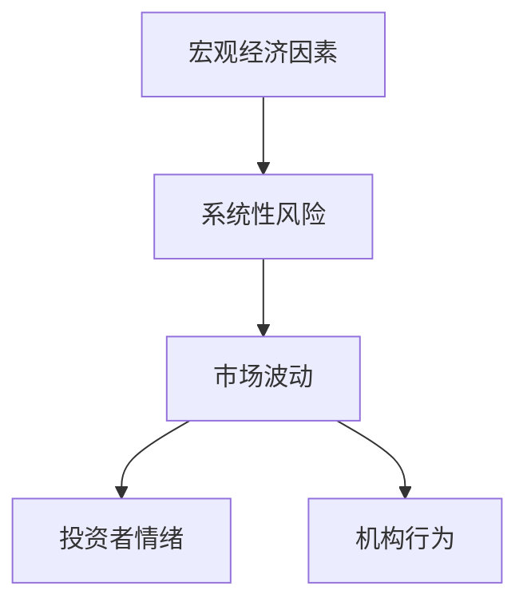
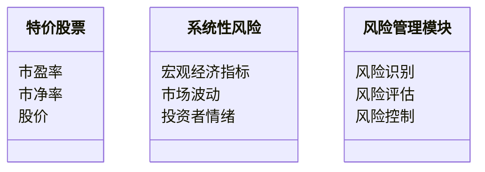
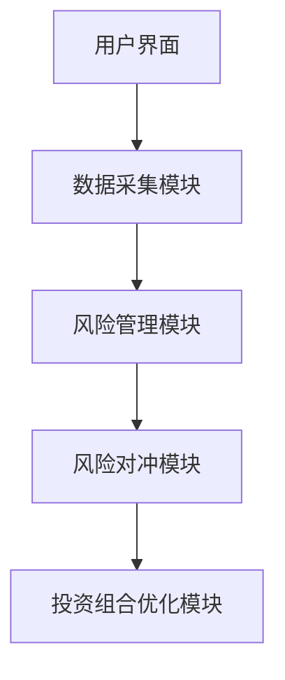

                 


# 特价股票投资中的宏观系统性风险管理方法

> 关键词：特价股票，系统性风险管理，宏观风险，投资组合优化，风险管理算法

> 摘要：在当前金融市场波动加剧的环境下，特价股票投资面临诸多不确定性。本文将深入探讨如何在特价股票投资中运用宏观系统性风险管理方法，以降低整体投资组合的系统性风险。通过分析系统性风险的核心概念、数学模型、算法原理以及系统架构，本文旨在为投资者提供一套科学的风险管理解决方案，帮助其在特价股票投资中实现稳健收益。

---

## 第1章: 特价股票与系统性风险管理概述

### 1.1 特价股票的定义与特点

#### 1.1.1 特价股票的定义
特价股票通常指市盈率、市净率等估值指标显著低于市场平均水平的股票。这类股票往往被认为具有较高的投资价值，但同时也伴随着较高的风险。

#### 1.1.2 特价股票的特点
- **低估值**：市盈率、市净率等指标远低于行业平均水平。
- **高波动性**：价格波动较大，容易受市场情绪影响。
- **潜在收益**：若公司基本面改善，股价可能迅速回升。

#### 1.1.3 特价股票与普通股票的区别
| 特性 | 特价股票 | 普通股票 |
|------|----------|----------|
| 估值 | 低       | 中高     |
| 波动性 | 高       | 中       |
| 投资风险 | 高       | 中低     |
| 投资回报 | 高       | 中       |

### 1.2 系统性风险管理的定义与特点

#### 1.2.1 系统性风险管理的定义
系统性风险管理是指通过对宏观经济、行业趋势、政策变化等因素的分析，识别和控制那些可能影响整个市场或投资组合的系统性风险。

#### 1.2.2 系统性风险管理的特点
- **全局性**：影响整个市场或经济体系。
- **不可分散性**：无法通过多样化投资完全消除。
- **可预测性**：可以通过模型和数据分析提前识别。

#### 1.2.3 系统性风险与非系统性风险的区别
| 特性 | 系统性风险       | 非系统性风险     |
|------|------------------|------------------|
| 影响范围 | 整个市场或经济体系 | 单一资产或小范围 |
| 可分散性 | 不可分散         | 可分散           |
| 来源   | 宏观经济因素     | 公司特有因素     |

### 1.3 特价股票投资中的系统性风险管理的重要性

#### 1.3.1 投资者为何需要系统性风险管理
- **保护投资组合**：避免因系统性风险导致的重大损失。
- **提高投资收益**：通过有效管理风险，优化投资回报。

#### 1.3.2 系统性风险管理在特价股票投资中的作用
- **降低整体风险**：通过识别和控制系统性风险，减少投资组合的波动性。
- **提升投资决策**：帮助投资者在市场波动中做出更明智的投资决策。

#### 1.3.3 系统性风险管理的边界与外延
- **边界**：系统性风险管理主要关注宏观经济因素对投资组合的影响，不涉及个体资产的特有风险。
- **外延**：系统性风险管理不仅限于股票投资，还可应用于债券、基金等多种资产类别。

---

## 第2章: 系统性风险管理的核心概念与联系

### 2.1 系统性风险管理的核心原理

#### 2.1.1 系统性风险的来源
- **经济周期**：经济衰退或复苏对市场的影响。
- **政策变化**：政府政策调整对市场的影响。
- **市场流动性**：市场流动性不足导致的价格波动。

#### 2.1.2 系统性风险的影响因素
- **宏观经济指标**：GDP增长率、利率、通货膨胀率等。
- **市场情绪**：投资者情绪对市场波动的影响。
- **市场结构**：市场的参与者结构和交易机制。

#### 2.1.3 系统性风险的传播机制
系统性风险通常通过以下途径传播：
1. **传染效应**：一家机构的危机导致连锁反应，影响整个市场。
2. **杠杆效应**：高杠杆率放大市场波动。
3. **市场参与者的关联性**：机构之间的高度关联性增加系统性风险。

### 2.2 系统性风险管理的核心要素

#### 2.2.1 风险识别
- **数据采集**：收集宏观经济指标、市场数据、公司基本面数据等。
- **风险因素分析**：识别可能影响系统性风险的关键因素。

#### 2.2.2 风险评估
- **风险量化**：通过数学模型对系统性风险进行量化。
- **风险排序**：根据风险程度对资产或投资组合进行排序。

#### 2.2.3 风险控制
- **风险对冲**：通过期货、期权等金融工具对冲系统性风险。
- **资产配置**：调整资产配置以降低系统性风险的影响。

### 2.3 系统性风险管理的ER实体关系图



---

## 第3章: 系统性风险管理的算法原理

### 3.1 系统性风险管理的数学模型

#### 3.1.1 系统性风险的度量公式
$$ \text{系统性风险} = \frac{\text{投资组合波动性} - \text{非系统性风险}}{\text{市场波动性}} $$

#### 3.1.2 系统性风险的评估方法
- **VaR（Value at Risk）**：计算投资组合在一定置信水平下的最大损失。
- **CVaR（Conditional Value at Risk）**：计算在VaR水平上的平均损失。

### 3.2 系统性风险管理的算法实现

#### 3.2.1 算法步骤
1. 数据采集：收集宏观经济指标、市场数据、公司基本面数据。
2. 风险识别：识别影响系统性风险的关键因素。
3. 风险量化：使用数学模型量化系统性风险。
4. 风险对冲：通过金融工具对冲系统性风险。

#### 3.2.2 Python实现

```python
import numpy as np
import pandas as pd

# 数据准备
data = pd.read_csv('market_data.csv')
returns = data['return'].values

# 计算VaR
def calculate VaR(returns, confidence_level=0.95):
    returns_sorted = np.sort(returns)
    percentile = (1 - confidence_level) * 100
    VaR = returns_sorted[int(percentile)]
    return VaR

VaR_value = calculate VaR(returns)
print(f"VaR at {confidence_level} confidence level: {VaR_value}")
```

---

## 第4章: 系统性风险管理的系统架构设计

### 4.1 系统功能设计

#### 4.1.1 领域模型


#### 4.1.2 系统架构


### 4.2 系统接口设计

#### 4.2.1 输入接口
- 数据接口：接收宏观经济指标、市场数据。
- 用户接口：接收用户的投资策略和风险偏好。

#### 4.2.2 输出接口
- 风险报告：输出系统性风险评估结果。
- 投资建议：输出优化后的投资组合配置。

---

## 第5章: 系统性风险管理的项目实战

### 5.1 环境安装

```bash
pip install numpy pandas matplotlib
```

### 5.2 核心代码实现

```python
import numpy as np
import pandas as pd

# 数据准备
data = pd.read_csv('market_data.csv')
returns = data['return'].values

# 计算VaR
def calculate VaR(returns, confidence_level=0.95):
    returns_sorted = np.sort(returns)
    percentile = (1 - confidence_level) * 100
    VaR = returns_sorted[int(percentile)]
    return VaR

VaR_value = calculate VaR(returns)
print(f"VaR at {confidence_level} confidence level: {VaR_value}")
```

### 5.3 代码解读与分析

#### 5.3.1 代码功能
- 读取市场数据。
- 计算投资组合的VaR值，以评估系统性风险。

#### 5.3.2 案例分析
假设某投资者投资于一只特价股票，通过计算VaR值，发现其系统性风险较高，因此调整资产配置，增加低风险资产的比例。

---

## 第6章: 总结与展望

### 6.1 最佳实践 tips
- 定期更新风险模型，以适应市场变化。
- 结合宏观经济分析，优化投资策略。

### 6.2 小结
通过本文的分析，投资者可以更好地理解系统性风险管理在特价股票投资中的重要性，并掌握相关的算法和系统设计方法。

### 6.3 注意事项
- 系统性风险管理需要结合具体市场环境和投资者风险偏好。
- 风险模型的选择和参数设置需谨慎，避免过度拟合。

### 6.4 拓展阅读
- 《风险管理与对冲基金》
- 《系统性风险管理的数学模型与应用》

---

## 作者

作者：AI天才研究院/AI Genius Institute & 禅与计算机程序设计艺术 /Zen And The Art of Computer Programming

---

通过本文的详细讲解，读者可以全面了解系统性风险管理在特价股票投资中的应用，并能够实际操作相关算法和系统设计，提升自身的投资风险管理能力。

