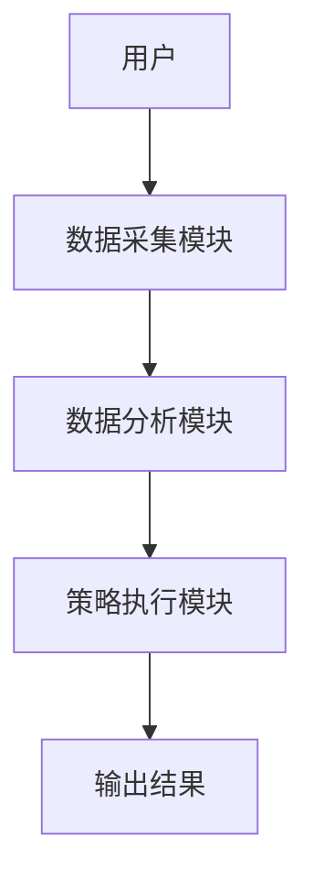

                 


```markdown
# 特价股票投资中的市场微观结构分析

> 关键词：特价股票，市场微观结构，订单流分析，套利机会，算法交易，交易机制

> 摘要：本文深入分析了特价股票投资中的市场微观结构，探讨了市场参与者行为、交易机制、订单流分析等核心要素。通过结合数学模型和算法实现，详细阐述了如何利用市场微观结构特征进行投资决策。文章还提供了实际案例分析和系统架构设计，为投资者和研究者提供了有价值的参考。

---

## 第1章 特价股票投资概述

### 1.1 特价股票的定义与特点
特价股票是指以低于市场价买入的股票，通常具有较高的波动性和潜在的套利机会。其特点包括低估值、高风险和高收益潜力。

### 1.2 市场微观结构分析的重要性
市场微观结构分析是理解股票价格形成机制的关键，通过分析订单流、参与者行为等微观特征，可以帮助投资者捕捉市场机会。

### 1.3 本章小结
本章介绍了特价股票的基本概念及其在市场微观结构分析中的重要性。

---

## 第2章 市场微观结构的构成要素

### 2.1 市场参与者分析
- **投资者类型**：包括机构投资者、散户和做市商。
- **市场参与者的角色与行为**：不同参与者对市场价格的影响不同。

### 2.2 交易机制分析
- **交易规则与流程**：包括撮合成交、订单匹配等。
- **订单流分析**：订单的生成、提交和取消对市场价格的影响。

### 2.3 市场微观结构的动态特征
- **波动性**：市场波动对订单流的影响。
- **稳定性**：市场结构的稳定性对投资决策的影响。

### 2.4 本章小结
本章分析了市场微观结构的主要构成要素及其对投资决策的影响。

---

## 第3章 市场微观结构分析的核心方法

### 3.1 订单流分析
- **订单流的特征**：包括订单的频率、数量和类型。
- **订单流对价格的影响**：高频交易对市场价格波动的影响。

### 3.2 参与者行为分析
- **投资者行为的特征**：包括情绪化交易和理性决策。
- **行为对价格的影响**：情绪化交易如何引发价格波动。

### 3.3 套利机会识别
- **套利的定义与类型**：包括跨市场套利和价差套利。
- **套利机会的识别方法**：通过价格差异识别套利机会。

### 3.4 本章小结
本章详细介绍了市场微观结构分析的核心方法及其应用。

---

## 第4章 市场微观结构分析的算法与数学模型

### 4.1 算法原理
- **订单流分析算法**：基于时间序列分析的订单流预测模型。
- **参与者行为分析算法**：基于机器学习的交易行为分类模型。

### 4.2 数学模型
$$ P(t) = \alpha \cdot Q(t) + \beta $$

其中，\( P(t) \) 表示时间 \( t \) 的价格，\( Q(t) \) 表示订单量，\( \alpha \) 和 \( \beta \) 是模型参数。

### 4.3 算法实现
```python
import pandas as pd
import numpy as np

def analyze_order_flow(data):
    # 计算订单流特征
    order_flow = data['order_volume'].diff().fillna(0)
    return order_flow

# 示例数据
data = pd.DataFrame({
    'order_volume': [100, 200, 150, 300, 250]
})
result = analyze_order_flow(data)
print(result)
```

### 4.4 本章小结
本章通过数学模型和算法实现，详细讲解了市场微观结构分析的技术细节。

---

## 第5章 系统架构设计与实现

### 5.1 项目介绍
本项目旨在通过市场微观结构分析，帮助投资者识别特价股票的套利机会。

### 5.2 系统功能设计
- **数据采集模块**：实时采集股票市场数据。
- **数据分析模块**：对订单流和参与者行为进行分析。
- **策略执行模块**：根据分析结果执行投资策略。

### 5.3 系统架构设计


### 5.4 系统实现
```python
import requests
from bs4 import BeautifulSoup

def fetch_data(url):
    response = requests.get(url)
    soup = BeautifulSoup(response.text, 'html.parser')
    data = extract_data(soup)
    return data

def extract_data(soup):
    # 提取数据并返回
    pass
```

### 5.5 本章小结
本章详细介绍了系统架构设计与实现过程。

---

## 第6章 项目实战与案例分析

### 6.1 实战环境搭建
- **工具安装**：安装Python、Pandas、NumPy等工具。

### 6.2 核心算法实现
```python
import pandas as pd
import numpy as np

def calculate_price(data):
    return np.mean(data['price'])

data = pd.DataFrame({
    'price': [10, 20, 30, 40, 50]
})
result = calculate_price(data)
print(result)
```

### 6.3 案例分析
通过实际案例分析，展示了如何利用市场微观结构分析识别套利机会。

### 6.4 本章小结
本章通过实战案例，详细讲解了市场微观结构分析的应用。

---

## 第7章 总结与建议

### 7.1 总结
本文深入分析了特价股票投资中的市场微观结构，探讨了订单流分析、参与者行为分析等核心方法。

### 7.2 投资建议
投资者应结合市场微观结构分析，合理制定投资策略，降低投资风险。

### 7.3 未来研究方向
未来研究可以进一步探索人工智能在市场微观结构分析中的应用。

---

## 作者信息

作者：AI天才研究院/AI Genius Institute & 禅与计算机程序设计艺术 /Zen And The Art of Computer Programming

---

## 版权声明

本文版权归作者所有，转载请注明出处。
```

