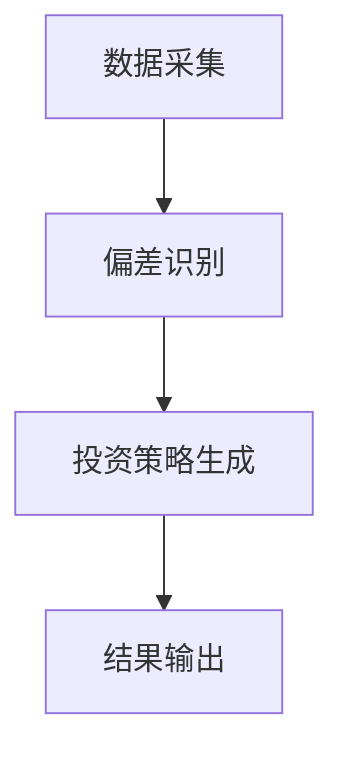

                 


# 特价股票投资中的心理偏差和如何克服

> 关键词：特价股票投资，心理偏差，行为金融学，投资决策，风险管理

> 摘要：本文深入分析了特价股票投资中常见的心理偏差，如贪婪、恐惧、过度自信等，并探讨了这些偏差如何影响投资决策。通过行为金融学的理论和数学模型，本文揭示了心理偏差的内在机制，并提出了克服这些偏差的具体策略，帮助投资者做出更理性的决策。

---

## 第1章: 特价股票投资的背景与概述

### 1.1 特价股票投资的定义与特点

#### 1.1.1 特价股票的定义  
特价股票通常指的是在市场中价格被低估的股票，可能由于市场波动、公司困境或其他外部因素导致其价格低于其内在价值。这些股票往往被视为“便宜货”，吸引了很多投资者的关注。

#### 1.1.2 特价股票投资的特点  
- **低估值**：股票价格远低于其内在价值。
- **高波动性**：市场价格波动较大，可能导致短期价格偏离基本面。
- **高风险**：由于公司基本面可能存在问题，投资风险较高。

#### 1.1.3 特价股票投资与传统股票投资的区别  
- **投资策略**：传统投资注重长期价值，而特价股票投资更关注短期价格波动。
- **风险承受**：特价股票投资通常需要更高的风险承受能力。

### 1.2 特价股票投资的现状与趋势

#### 1.2.1 特价股票市场的现状分析  
当前，特价股票市场在股票市场中占据重要地位，尤其是在市场低迷或经济衰退时期，投资者倾向于寻找低价股票。

#### 1.2.2 特价股票投资的未来发展趋势  
随着市场波动的加剧，特价股票投资可能会成为更多投资者的选择，尤其是在技术分析和行为金融学的推动下，投资者更加关注心理因素对决策的影响。

### 1.3 特价股票投资中的心理偏差

#### 1.3.1 心理偏差的定义与分类  
心理偏差是指个体在决策过程中由于认知局限、情绪影响或经验不足导致的非理性决策。

#### 1.3.2 特价股票投资中常见心理偏差的类型  
- 贪婪
- 恐惧
- 过度自信
- 从众心理
- 锚定效应

#### 1.3.3 心理偏差对投资决策的影响  
心理偏差可能导致投资者做出错误的投资决策，例如在高价时买入，低价时卖出，或者忽视基本面因素。

---

## 第2章: 心理偏差的核心概念与分析

### 2.1 心理偏差的定义与特征

#### 2.1.1 心理偏差的定义  
心理偏差是指个体在决策过程中由于认知局限、情绪影响或经验不足导致的非理性决策。

#### 2.1.2 心理偏差的主要特征  
- **认知性偏差**：由于信息处理方式导致的错误判断。
- **情绪性偏差**：由于情绪波动导致的非理性决策。
- **社会性偏差**：由于社会压力或从众心理导致的决策偏差。

#### 2.1.3 心理偏差的分类与表现  
| 偏差类型 | 定义 | 表现 |
|----------|------|------|
| 贪婪     | 过度追求高收益 | 过度买入高价股票 |
| 恐惧     | 过度担心损失 | 过度卖出低价股票 |
| 过度自信 | 过度相信自己的判断 | 忽略风险因素 |
| 从众心理 | 跟随大多数人的决策 | 跟随市场趋势 |
| 锚定效應 | 过度依赖初始信息 | 忽略后续变化 |

### 2.2 特价股票投资中常见心理偏差的详细分析

#### 2.2.1 贪婪与恐惧  
- **贪婪**：投资者在看到股票价格上涨时，可能会盲目追高，忽视基本面因素。
- **恐惧**：在市场下跌时，投资者可能会恐慌性卖出，锁定亏损。

#### 2.2.2 过度自信  
投资者可能过度相信自己的分析能力，忽视市场的复杂性和不确定性。

#### 2.2.3 从众心理  
投资者可能会跟随市场的主流趋势，忽视自己的独立判断。

#### 2.2.4 损失厌恶  
投资者更倾向于避免损失，而不是追求收益，导致他们在低价股票时犹豫不决。

#### 2.2.5 锚定效应  
投资者过度依赖初始信息，例如初始买入价格，导致在后续决策中无法及时调整。

---

## 第3章: 心理偏差的数学模型与算法原理

### 3.1 心理偏差的数学模型

#### 3.1.1 心理偏差的期望值模型  
$$ E = \sum_{i=1}^{n} p_i v_i $$
其中，E为期望值，p_i为概率，v_i为结果的价值。

#### 3.1.2 心理偏差的概率模型  
通过概率分布来分析心理偏差对投资决策的影响。

### 3.2 心理偏差的算法原理

#### 3.2.1 贪婪与恐惧的算法实现  
```python
import numpy as np

def calculate_emotion_factor(prices, threshold=0.1):
    # 计算价格波动
    volatility = np.std(prices)
    # 判断情绪因素
    if volatility > threshold:
        return "high greed"
    else:
        return "low greed"
```

#### 3.2.2 过度自信的算法实现  
```python
def overconfidence_analysis(portfolio, actual_returns):
    # 计算预期回报与实际回报的差异
    expected_returns = portfolio['expected']
    difference = expected_returns - actual_returns
    return difference.mean()
```

---

## 第4章: 系统分析与架构设计

### 4.1 问题场景介绍  
特价股票投资中的心理偏差导致投资者决策失误，需要构建一个系统来分析和克服这些偏差。

### 4.2 项目介绍  
设计一个心理偏差分析系统，帮助投资者识别和克服心理偏差。

### 4.3 系统功能设计  
- 数据采集模块：收集市场数据和投资者行为数据。
- 偏差识别模块：分析心理偏差类型。
- 投资策略生成模块：基于分析结果生成投资策略。

### 4.4 系统架构设计  


---

## 第5章: 项目实战

### 5.1 环境安装  
安装必要的Python库，如numpy、pandas、matplotlib。

### 5.2 核心代码实现  
```python
import pandas as pd
import matplotlib.pyplot as plt

# 数据加载
data = pd.read_csv('stock_data.csv')
# 数据分析
data['price'].plot()
plt.show()
```

### 5.3 案例分析  
分析一个具体案例，展示心理偏差对投资决策的影响。

### 5.4 项目总结  
总结项目成果，提出改进建议。

---

## 第6章: 最佳实践与总结

### 6.1 最佳实践 tips  
- 定期反思投资决策。
- 建立风险管理机制。

### 6.2 小结  
通过分析心理偏差，投资者可以更好地理解自己的决策过程，从而做出更理性的投资决策。

### 6.3 注意事项  
- 投资需谨慎，避免过度依赖心理分析。
- 结合技术分析和基本面分析。

### 6.4 拓展阅读  
推荐相关书籍和论文，供读者深入学习。

---

## 作者：AI天才研究院 & 禅与计算机程序设计艺术

---

通过以上结构和内容，文章系统地分析了特价股票投资中的心理偏差，并提供了克服这些偏差的具体方法和策略。

