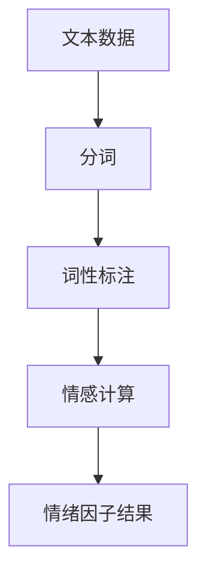
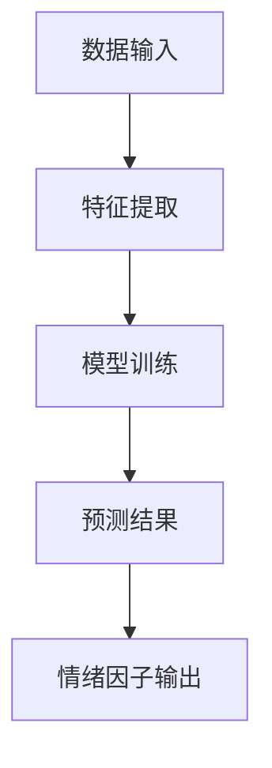

                 

# 特价股票投资中的情绪因子分析与应用

**关键词**：情绪因子、特价股票、投资策略、自然语言处理、机器学习、市场情绪

**摘要**：本文深入探讨了情绪因子在特价股票投资中的应用，分析了投资者情绪对股票价格的影响，提出了基于情绪因子的投资策略，并通过数学模型和算法实现进行了详细阐述。文章从情绪因子的定义、量化分析、系统设计、实战案例等多方面展开，为投资者提供了理论支持和实践指导。

---

# 第一部分: 情绪因子与特价股票投资概述

## 第1章: 情绪因子与特价股票投资概述

### 1.1 情绪因子的定义与背景

#### 1.1.1 情绪因子的定义
情绪因子是指投资者在股票市场中的情绪波动对股票价格的影响。它反映了市场参与者的心理状态，包括贪婪、恐惧、乐观和悲观等情绪。

#### 1.1.2 情绪因子在股票投资中的作用
情绪因子能够影响投资者的决策行为，从而间接或直接地影响股票价格。特别是在特价股票投资中，情绪因子的作用更加显著，因为这些股票通常具有较高的波动性和不确定性。

#### 1.1.3 特价股票的定义与特点
特价股票通常指价格低于市场平均水平的股票，具有高波动性和高风险的特性。这类股票更容易受到市场情绪的影响，因此情绪因子分析在特价股票投资中尤为重要。

### 1.2 情绪因子与股票价格的关系

#### 1.2.1 情绪因子对市场的影响
情绪因子通过投资者的行为影响市场走势。例如，市场情绪高涨时，投资者倾向于追涨，导致股价上涨；市场情绪低落时，投资者倾向于抛售，导致股价下跌。

#### 1.2.2 特价股票中情绪因子的特殊性
特价股票的价格波动较大，投资者情绪更容易被市场情绪影响。因此，在特价股票投资中，情绪因子的分析能够帮助投资者更好地捕捉市场机会。

#### 1.2.3 情绪因子与股票波动性的关联
情绪因子与股票波动性呈正相关关系。投资者情绪波动越大，股票价格波动也越大，尤其是在特价股票中表现得更为明显。

### 1.3 情绪因子分析的必要性

#### 1.3.1 投资者情绪对市场的影响
投资者情绪是市场波动的重要来源之一。情绪因子分析能够帮助投资者理解市场波动的内在逻辑，从而做出更科学的投资决策。

#### 1.3.2 特价股票中情绪因子的应用价值
在特价股票投资中，情绪因子分析能够帮助投资者识别市场情绪拐点，捕捉投资机会，降低投资风险。

#### 1.3.3 情绪因子分析的挑战与机遇
情绪因子分析具有较高的挑战性，主要体现在情绪数据的获取难度、情绪因子的量化以及情绪因子与股票价格的非线性关系等方面。然而，这些挑战也为情绪因子分析提供了巨大的机遇，尤其是在技术进步和数据量增加的背景下。

## 第2章: 情绪因子的核心概念与理论基础

### 2.1 情绪因子的核心概念

#### 2.1.1 情绪因子的构成要素
情绪因子包括投资者情绪、市场情绪、公司情绪等多个维度。其中，投资者情绪是情绪因子的核心组成部分。

#### 2.1.2 情绪因子的分类与特征
情绪因子可以分为个体情绪和集体情绪两类。个体情绪指单个投资者的情绪，集体情绪指市场整体的情绪。情绪因子的特征包括波动性、非线性、滞后性等。

#### 2.1.3 情绪因子与股票市场的互动关系
情绪因子通过影响投资者行为、市场预期和公司决策等方式，间接或直接地影响股票价格。这种互动关系构成了情绪因子分析的基础。

### 2.2 情绪因子的理论基础

#### 2.2.1 行为金融学中的情绪因子
行为金融学认为，投资者情绪是影响市场行为的重要因素。情绪因子分析为行为金融学提供了理论支持。

#### 2.2.2 技术分析与情绪因子的结合
技术分析通过分析股票价格走势预测未来价格。情绪因子分析与技术分析的结合能够提高技术分析的准确性。

#### 2.2.3 市场情绪周期理论
市场情绪周期理论认为，市场情绪会经历周期性变化，从乐观到悲观，再到乐观。情绪因子分析能够帮助投资者识别市场情绪周期，从而做出更科学的投资决策。

### 2.3 情绪因子的量化指标

#### 2.3.1 市场情绪指数的定义与计算
市场情绪指数是衡量市场情绪的重要指标。常用的市场情绪指数包括恐慌指数（VIX）和投资者情绪指数。

#### 2.3.2 特价股票情绪指标的特殊性
特价股票情绪指标是专门用于衡量特价股票市场情绪的指标。它通常结合特价股票的波动性和交易量进行计算。

#### 2.3.3 情绪因子的量化方法与工具
情绪因子的量化方法包括自然语言处理（NLP）、情感分析和机器学习等。常用的工具包括Python的NLP库（如NLTK和spaCy）以及机器学习框架（如Scikit-learn和XGBoost）。

## 第3章: 情绪因子的数学模型与算法原理

### 3.1 情绪因子的数学模型

#### 3.1.1 情绪强度计算公式
情绪强度计算公式如下：
$$ 情绪强度 = \frac{\sum_{i=1}^{n} w_i \cdot s_i}{\sum_{i=1}^{n} w_i} $$
其中，\( w_i \) 是第 \( i \) 个情绪词的权重，\( s_i \) 是情绪词的极性值。

#### 3.1.2 情绪因子的回归模型
情绪因子的回归模型如下：
$$ y = \beta_0 + \beta_1 x_1 + \beta_2 x_2 + \cdots + \beta_k x_k + \epsilon $$
其中，\( y \) 是股票收益，\( x_i \) 是情绪因子变量，\( \beta_i \) 是回归系数。

### 3.2 情绪因子的算法实现

#### 3.2.1 基于NLP的情绪分析算法

#### 3.2.2 情绪因子的机器学习模型

---

# 第二部分: 情绪因子的量化分析与系统设计

## 第4章: 情绪因子的量化分析

### 4.1 情绪因子的量化方法

#### 4.1.1 数据采集
情绪因子的量化分析需要采集投资者情绪数据，包括社交媒体数据、新闻数据和交易数据等。

#### 4.1.2 特征提取
特征提取是情绪因子量化分析的关键步骤。常用的特征包括情感强度、情绪词频和情绪分布等。

#### 4.1.3 模型构建
模型构建是情绪因子量化分析的核心。常用的模型包括情感分析模型和回归模型。

### 4.2 情绪因子的系统设计

#### 4.2.1 系统架构
情绪因子分析系统包括数据预处理、特征提取、模型训练和结果分析四个模块。

#### 4.2.2 系统实现
情绪因子分析系统的实现步骤如下：
1. 数据预处理：清洗和标注数据。
2. 特征提取：提取情绪特征。
3. 模型训练：训练情感分析模型。
4. 结果分析：分析模型输出结果。

### 4.3 情绪因子的实战案例

#### 4.3.1 案例背景
选择一家特价股票作为案例，分析其情绪因子的影响。

#### 4.3.2 数据处理
对案例公司的社交媒体数据和新闻数据进行清洗和标注。

#### 4.3.3 模型训练
使用情感分析模型对情绪数据进行训练，得到情绪因子。

#### 4.3.4 结果分析
分析情绪因子对股票价格的影响，得出投资策略。

## 第5章: 情绪因子的高级分析

### 5.1 情绪因子与跨市场分析

#### 5.1.1 跨市场情绪分析
跨市场情绪分析是情绪因子分析的重要方向，能够帮助投资者更好地理解全球市场情绪。

#### 5.1.2 跨市场情绪因子的构建
跨市场情绪因子的构建需要结合多个市场的数据，进行综合分析。

### 5.2 情绪因子与风险管理

#### 5.2.1 情绪因子与风险控制
情绪因子分析能够帮助投资者识别市场风险，制定有效的风险控制策略。

#### 5.2.2 基于情绪因子的风险管理模型
基于情绪因子的风险管理模型能够帮助投资者在市场情绪波动时，及时调整投资策略。

### 5.3 情绪因子的未来研究方向

#### 5.3.1 情绪因子的深度学习
深度学习在情绪因子分析中的应用是未来研究的重要方向。

#### 5.3.2 情绪因子的实时分析
实时情绪因子分析能够帮助投资者更快地捕捉市场机会。

---

# 第三部分: 情绪因子分析的总结与展望

## 第6章: 总结与展望

### 6.1 本章小结
情绪因子分析是特价股票投资中的重要工具，能够帮助投资者更好地理解市场情绪，制定科学的投资策略。

### 6.2 未来研究方向
未来的研究方向包括情绪因子的深度学习、跨市场情绪分析以及实时情绪因子分析等。

### 6.3 投资者注意事项
情绪因子分析是辅助工具，投资者在使用时需要注意情绪因子的局限性，避免过度依赖模型。

### 6.4 最佳实践 tips
投资者在进行情绪因子分析时，应当结合市场实际情况，灵活调整分析方法，提高分析结果的准确性。

---

# 作者：AI天才研究院/AI Genius Institute & 禅与计算机程序设计艺术 /Zen And The Art of Computer Programming

---

以上是关于《特价股票投资中的情绪因子分析与应用》的详细目录和内容概述。通过以上分析，我们可以看到情绪因子分析在特价股票投资中的重要性，以及如何通过数学模型和算法实现情绪因子的量化分析。

