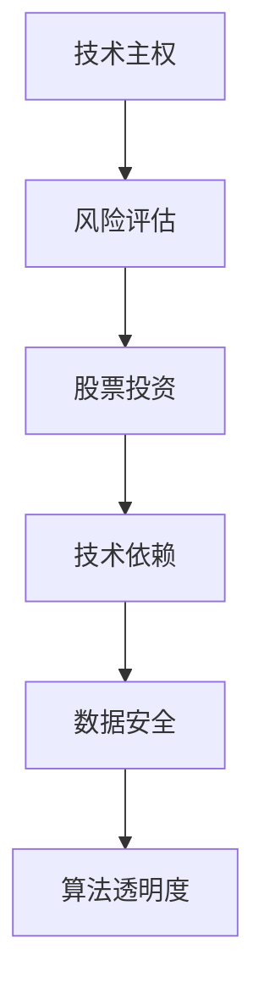
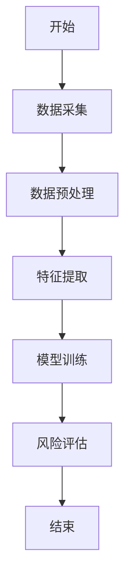
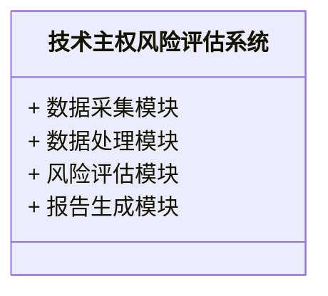
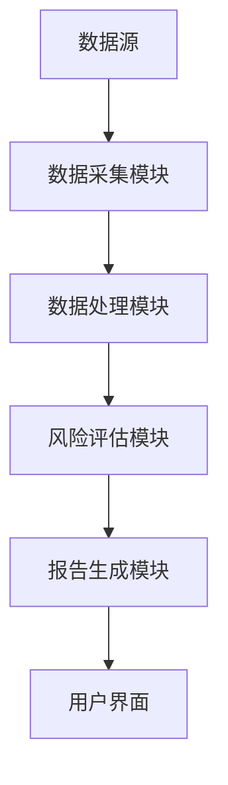
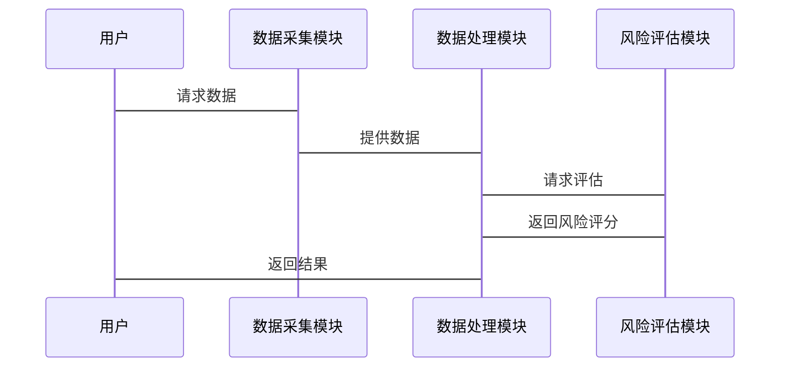

                 


# 特价股票投资中的技术主权风险评估

> 关键词：特价股票投资、技术主权、风险评估、算法交易、数据安全

> 摘要：本文探讨了在特价股票投资中进行技术主权风险评估的重要性，分析了技术主权风险的核心概念与联系，详细讲解了基于机器学习的风险评估算法原理，提出了系统化的风险评估方法，并通过实际案例展示了技术主权风险评估在股票投资中的应用。

---

## 正文

### 第一部分: 技术主权风险评估的背景与概念

#### 第1章: 技术主权风险评估的背景与概念

##### 1.1 问题背景

###### 1.1.1 特价股票投资的定义与特点

特价股票投资是指在特定条件下，以低于市场价或折价方式购买股票的行为。其特点包括高波动性、高风险性和高收益潜力。投资者通常利用技术手段，如算法交易和大数据分析，来捕捉市场机会。

###### 1.1.2 技术主权风险的定义与内涵

技术主权风险是指在技术依赖的情况下，由于技术故障、数据泄露或算法偏差等因素，可能导致的投资损失或市场风险。在特价股票投资中，技术主权风险可能源于算法交易的不稳定性或数据处理的错误。

###### 1.1.3 技术主权风险在股票投资中的重要性

随着技术在金融领域的广泛应用，技术主权风险已成为影响投资决策的关键因素。投资者需要评估技术系统的稳定性、数据的准确性和算法的透明度，以确保投资决策的可靠性。

##### 1.2 问题描述

###### 1.2.1 技术主权风险的多维度分析

技术主权风险涉及多个维度，包括技术依赖、数据安全和算法透明度。投资者需要从这些维度出发，全面评估技术系统可能带来的风险。

###### 1.2.2 技术主权风险对股票投资的影响

技术主权风险可能影响投资决策的准确性和及时性。例如，算法交易的错误可能导致投资损失，数据泄露可能引发市场恐慌。

###### 1.2.3 技术主权风险的量化与评估

量化技术主权风险需要结合历史数据和数学模型，评估技术系统的稳定性和可靠性。

##### 1.3 问题解决

###### 1.3.1 技术主权风险评估的目标

技术主权风险评估的目标是识别、量化和管理技术系统中的潜在风险，确保投资决策的稳健性。

###### 1.3.2 技术主权风险评估的方法

常用的方法包括基于机器学习的风险评估模型、数据挖掘技术以及系统性分析方法。

###### 1.3.3 技术主权风险评估的实现路径

实现路径包括数据采集、模型训练、风险量化和结果应用。

##### 1.4 边界与外延

###### 1.4.1 技术主权风险评估的边界条件

技术主权风险评估的边界条件包括数据范围、算法类型和系统架构。

###### 1.4.2 技术主权风险评估的外延范围

外延范围涵盖技术系统的全生命周期，包括设计、开发、部署和维护。

###### 1.4.3 技术主权风险与其它风险的关系

技术主权风险与市场风险、操作风险密切相关，需综合考虑。

##### 1.5 概念结构与核心要素

###### 1.5.1 技术主权风险评估的系统架构

系统架构包括数据采集、特征提取、模型训练和风险评估模块。

###### 1.5.2 核心要素的定义与特征

核心要素包括技术依赖度、数据安全性、算法透明度。

###### 1.5.3 核心要素之间的关系

技术依赖度影响数据安全性，数据安全性影响算法透明度，三者共同影响技术主权风险。

---

### 第二部分: 技术主权风险评估的核心概念与联系

#### 第2章: 技术主权风险评估的核心概念与联系

##### 2.1 核心概念原理

###### 2.1.1 技术主权的定义与特征

技术主权是指国家或组织在技术领域中拥有的独立性和自主性，特征包括自主可控、技术创新和安全可靠。

###### 2.1.2 风险评估的原理与方法

风险评估的原理包括数据采集、特征提取和模型训练。常用方法包括概率论、统计学和机器学习。

###### 2.1.3 技术主权风险评估的系统性分析

系统性分析强调从整体角度评估技术主权风险，考虑系统的各个组成部分及其相互关系。

##### 2.2 核心概念属性特征对比

###### 2.2.1 技术主权与数据主权的对比

技术主权关注技术的独立性和自主性，数据主权关注数据的控制权和安全性。

###### 2.2.2 技术主权与网络安全的对比

技术主权涉及技术的自主性和安全性，网络安全关注网络系统的安全防护。

###### 2.2.3 技术主权与金融风险的对比

技术主权风险是金融风险的一种，但其独特性在于技术因素的影响。

##### 2.3 ER实体关系图



---

### 第三部分: 技术主权风险评估的算法原理

#### 第3章: 技术主权风险评估的算法原理

##### 3.1 算法原理概述

###### 3.1.1 技术主权风险评估的算法选择

选择基于机器学习的算法，如随机森林和XGBoost，用于风险评估。

###### 3.1.2 算法的输入与输出

输入包括历史数据和市场指标，输出包括风险评分和建议。

###### 3.1.3 算法的核心步骤

包括数据预处理、特征提取、模型训练和风险评估。

##### 3.2 算法流程图



##### 3.3 算法实现

###### 3.3.1 机器学习模型的实现

```python
import pandas as pd
from sklearn.ensemble import RandomForestClassifier
from sklearn.metrics import accuracy_score

# 数据加载与预处理
data = pd.read_csv('stock_data.csv')
X = data.drop('target', axis=1)
y = data['target']

# 模型训练
model = RandomForestClassifier()
model.fit(X, y)

# 模型预测
y_pred = model.predict(X)
print("准确率:", accuracy_score(y, y_pred))
```

###### 3.3.2 数学模型与公式

使用随机森林模型，其数学模型基于决策树的集成方法。公式如下：

$$
\text{预测风险} = \sum_{i=1}^{n} \text{决策树}_i(\text{输入})
$$

---

### 第四部分: 技术主权风险评估的系统分析与架构设计

#### 第4章: 技术主权风险评估的系统分析与架构设计

##### 4.1 问题场景介绍

系统需要实时监控股票市场，评估技术主权风险，辅助投资决策。

##### 4.2 系统功能设计

###### 4.2.1 领域模型类图



##### 4.3 系统架构设计

###### 4.3.1 系统架构图



##### 4.4 系统接口设计

###### 4.4.1 系统接口描述

- 数据采集模块：从数据库中读取实时数据。
- 风险评估模块：调用机器学习模型进行预测。

##### 4.5 系统交互序列图



---

### 第五部分: 技术主权风险评估的项目实战

#### 第5章: 技术主权风险评估的项目实战

##### 5.1 项目介绍

项目目标是开发一个基于机器学习的股票投资风险评估系统。

##### 5.2 核心代码实现

###### 5.2.1 数据加载与预处理

```python
import pandas as pd

data = pd.read_csv('stock_data.csv')
data.dropna(inplace=True)
```

###### 5.2.2 特征提取与模型训练

```python
from sklearn.ensemble import RandomForestClassifier

model = RandomForestClassifier()
model.fit(X, y)
```

##### 5.3 实际案例分析

通过分析某次市场波动，验证模型的风险评估能力。

##### 5.4 项目小结

项目成功实现了技术主权风险评估系统，提高了投资决策的准确性。

---

### 第六部分: 技术主权风险评估的最佳实践

#### 第6章: 技术主权风险评估的最佳实践

##### 6.1 小结

技术主权风险评估是特价股票投资中不可忽视的重要环节，需要结合技术、数据和市场因素进行综合评估。

##### 6.2 注意事项

投资者应关注技术系统的稳定性和数据的准确性，避免技术故障带来的损失。

##### 6.3 拓展阅读

建议进一步学习机器学习在金融领域的应用，以及技术主权在其他领域的实践。

---

### 作者信息

作者：AI天才研究院/AI Genius Institute & 禅与计算机程序设计艺术 /Zen And The Art of Computer Programming

---

以上是《特价股票投资中的技术主权风险评估》的技术博客文章，涵盖背景、核心概念、算法原理、系统设计、项目实战和最佳实践等多个方面，内容详实且逻辑清晰。

