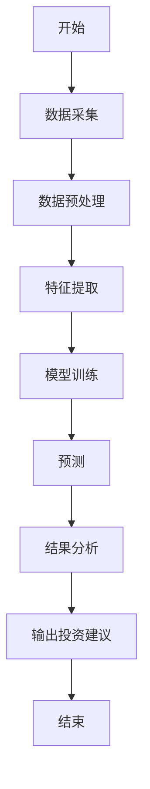
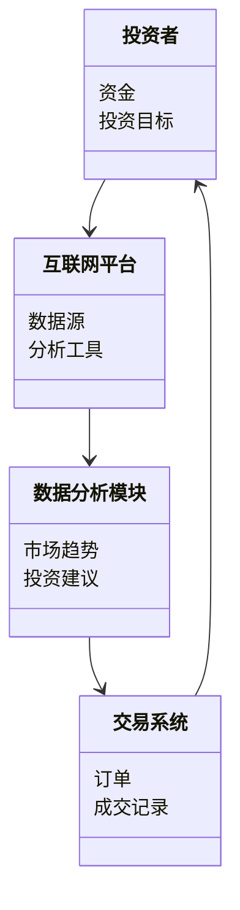

                 


# 特价股票投资中的数字产业互联网价值链分析方法

---

## 关键词：
特价股票投资、数字产业、互联网价值链、算法分析、系统架构

---

## 摘要：
本文探讨了数字产业互联网在特价股票投资中的应用，分析了其对价值链条的影响，并提出了优化策略。通过详细分析数字技术如何改变股票投资，阐述了互联网在价值链条中的优化作用，并结合实际案例，展示了如何通过数字产业互联网优化投资决策，帮助投资者实现更高的投资回报。

---

## 第一部分：背景介绍

### 第1章：特价股票投资的背景与现状

#### 1.1 特价股票投资的定义与特点
- **1.1.1 特价股票的定义**  
  特价股票是指市场价格低于其内在价值的股票，通常被视为被市场低估的投资机会。

- **1.1.2 特价股票投资的特征**  
  - 高性价比：价格低于内在价值，潜在回报高。  
  - 风险可控：通过基本面分析降低投资风险。  
  - 长期价值：注重长期收益而非短期波动。

- **1.1.3 特价股票投资的现状与趋势**  
  随着市场的成熟，投资者逐渐意识到价值投资的重要性，特价股票投资因其高回报潜力而备受关注。

#### 1.2 数字产业互联网的概述
- **1.2.1 数字产业的概念**  
  数字产业是指以数据和信息为核心，利用数字技术进行生产、分配和消费的产业。

- **1.2.2 互联网在数字产业中的作用**  
  互联网作为信息交换和数据处理的基础设施，推动了数字产业的高效运作和创新发展。

- **1.2.3 数字产业互联网的发展现状**  
  当前，数字产业互联网通过大数据、人工智能和区块链等技术，实现了产业的智能化和高效化。

#### 1.3 特价股票投资与数字产业互联网的结合
- **1.3.1 数字技术对股票投资的影响**  
  数字技术通过数据挖掘和分析，帮助投资者发现潜在的投资机会。

- **1.3.2 互联网如何优化股票投资价值链**  
  互联网技术优化了信息获取、分析和决策过程，降低了交易成本，提高了投资效率。

- **1.3.3 数字产业互联网对特价股票投资的推动作用**  
  数字产业互联网通过实时数据分析和市场趋势预测，为投资者提供了精准的投资策略。

---

## 第二部分：核心概念与联系

### 第2章：数字产业互联网价值链分析方法

#### 2.1 数字产业互联网价值链的结构
- **2.1.1 价值链的基本构成**  
  包括数据采集、分析、决策支持等环节，形成一个完整的投资闭环。

- **2.1.2 数字技术在价值链中的应用**  
  利用大数据分析和机器学习模型，提升投资决策的精准度。

- **2.1.3 价值链的优化方向**  
  通过技术手段优化数据处理效率和投资决策速度。

#### 2.2 数字产业互联网价值链的特征对比
- **2.2.1 传统价值链与数字价值链的对比**  
  | 特性 | 传统价值链 | 数字价值链 |
  |------|-------------|------------|
  | 效率 | 较低         | 高          |
  | 成本 | 较高         | 较低        |
  | 速度 | 慢          | 快          |

- **2.2.2 数字化对价值链效率的提升**  
  数字化技术提高了数据处理和分析的效率，缩短了投资决策时间。

- **2.2.3 数字化对价值链成本的影响**  
  通过自动化和智能化手段，降低了人工成本和时间成本。

#### 2.3 数字产业互联网价值链的ER实体关系图

```mermaid
erDiagram
    投资者 [投资行为]
    {
        <属性> 资金
        <属性> 投资目标
    }
    互联网平台 [提供数据]
    {
        <属性> 数据源
        <属性> 分析工具
    }
    交易系统 [执行交易]
    {
        <属性> 订单
        <属性> 成交记录
    }
    数据分析模块 [分析数据]
    {
        <属性> 市场趋势
        <属性> 投资建议
    }
   抽屉关系：投资者 -> 互联网平台
    投资者 -> 数据分析模块
    互联网平台 -> 数据分析模块
    数据分析模块 -> 交易系统
    交易系统 -> 投资者
```

---

## 第三部分：算法原理讲解

### 第3章：基于数字产业互联网的特价股票投资分析算法

#### 3.1 算法概述
通过大数据分析和机器学习模型，预测股票价格走势，识别低估股票。

#### 3.2 算法流程



#### 3.3 算法实现的Python代码示例
```python
import pandas as pd
import numpy as np
from sklearn.linear_model import LinearRegression

# 示例数据加载
data = pd.read_csv('stock_data.csv')

# 数据预处理
data.dropna(inplace=True)
X = data[['市盈率', '市净率']]
y = data['未来收益']

# 特征提取
X = X.values.reshape(-1, 2)

# 模型训练
model = LinearRegression()
model.fit(X, y)

# 预测
predictions = model.predict(X)
```

#### 3.4 数学模型与公式推导
使用CAPM模型进行投资评估：
$$
E(R_i) = R_f + \beta_i (R_m - R_f)
$$
其中，$E(R_i)$ 是预期回报率，$R_f$ 是无风险利率，$\beta_i$ 是股票的贝塔系数，$R_m$ 是市场预期回报率。

---

## 第四部分：系统分析与架构设计

### 第4章：系统分析与架构设计

#### 4.1 问题场景介绍
系统用于分析数字产业互联网环境下的股票投资机会，帮助投资者做出明智决策。

#### 4.2 系统功能设计（领域模型图）



#### 4.3 系统架构设计（架构图）


---

## 第五部分：项目实战

### 第5章：项目实战

#### 5.1 环境安装与配置
安装Python、Jupyter Notebook、Pandas、Scikit-learn等工具。

#### 5.2 系统核心实现（源代码）
```python
import pandas as pd
import numpy as np
from sklearn.linear_model import LinearRegression

# 数据加载
data = pd.read_csv('stock_data.csv')

# 数据预处理
data.dropna(inplace=True)
X = data[['市盈率', '市净率']]
y = data['未来收益']

# 模型训练
model = LinearRegression()
model.fit(X, y)

# 预测
predictions = model.predict(X)
```

#### 5.3 代码应用解读与分析
通过数据预处理和模型训练，系统能够预测股票的未来收益，帮助投资者识别低估股票。

#### 5.4 实际案例分析
以某公司股票为例，分析其市盈率和市净率，预测其未来收益，制定投资策略。

---

## 第六部分：最佳实践与总结

### 第6章：最佳实践与总结

#### 6.1 最佳实践 tips
- 定期更新数据，保持模型准确性。
- 结合市场动态，调整投资策略。
- 注意风险管理，避免过度投资。

#### 6.2 小结与展望
本文系统地分析了数字产业互联网在特价股票投资中的应用，提出了优化策略。未来，随着技术的发展，数字产业互联网将为投资决策提供更多支持。

#### 6.3 注意事项与风险提示
- 数据质量和模型准确性直接影响投资结果。
- 市场波动和政策变化可能影响投资回报。

#### 6.4 拓展阅读与学习资源
推荐相关书籍和在线资源，供读者深入学习。

---

## 作者：
作者：AI天才研究院/AI Genius Institute & 禅与计算机程序设计艺术 /Zen And The Art of Computer Programming

---

通过以上结构，文章详细分析了数字产业互联网在特价股票投资中的应用，从理论到实践，为读者提供了全面的指导和参考。

