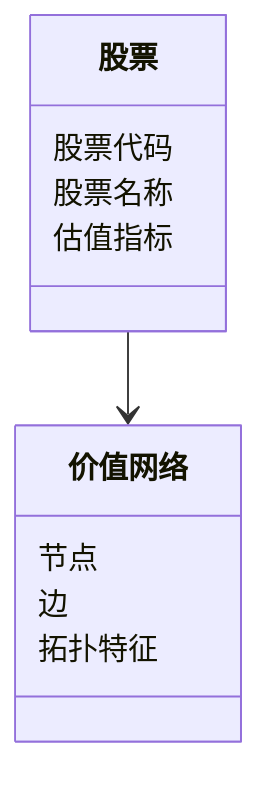

                 


# 特价股票投资中的数字产业价值网络拓扑分析方法

> 关键词：特价股票投资、数字产业、价值网络、拓扑分析、算法实现

> 摘要：本文旨在探讨如何利用数字产业的价值网络拓扑分析方法，为特价股票投资者提供科学的投资决策支持。通过分析数字产业中的价值网络结构，识别关键节点和潜在投资机会，帮助投资者在复杂的市场环境中找到优质投资标的。

---

## 第1章：特价股票投资的背景与价值网络分析的意义

### 1.1 特价股票投资的背景

#### 1.1.1 特价股票的定义与特点
特价股票通常指市盈率、市净率等估值指标显著低于行业平均水平的股票。其特点包括低估值、高分红潜力和较高的安全边际。这类股票通常被视为价值投资的理想标的。

#### 1.1.2 特价股票投资的市场现状
近年来，随着市场波动加剧，投资者对低估值股票的需求增加。数字技术的发展为投资者提供了更精准的分析工具，但同时也带来了新的挑战，如数据量庞大、信息复杂等。

#### 1.1.3 数字技术在股票投资中的应用
数字技术的应用使得投资者能够通过大数据分析、机器学习等方法，更深入地挖掘股票的价值。特别是数字产业的兴起，为价值网络分析提供了丰富的数据来源和工具支持。

---

### 1.2 数字产业的价值网络分析

#### 1.2.1 数字产业的定义与范围
数字产业指依托数字技术（如人工智能、大数据、区块链等）构建的产业，涵盖科技、金融、互联网等多个领域。数字产业的核心特征是数据驱动和网络化。

#### 1.2.2 价值网络的定义与特点
价值网络指产业上下游企业之间通过价值链条形成的网络结构。其特点包括复杂性、动态性和节点间的强关联性。

#### 1.2.3 价值网络拓扑分析的意义
价值网络拓扑分析能够帮助投资者识别关键企业、发现潜在投资机会，并评估市场风险。通过分析网络结构，投资者可以更好地理解产业生态，制定科学的投资策略。

---

## 第2章：数字产业价值网络的拓扑分析方法

### 2.1 拓扑分析的核心概念

#### 2.1.1 节点与边的定义
- **节点**：代表企业、产品或服务。
- **边**：代表节点之间的关联关系，如供应链关系、合作伙伴关系等。

#### 2.1.2 拓扑结构的类型
- **无向图**：节点之间无方向的连接关系。
- **有向图**：节点之间有明确的方向性，如A公司向B公司供应原材料。
- **加权图**：边具有权重，表示关系的强度。

#### 2.1.3 拓扑分析的目标
- 识别关键节点。
- 分析网络的连通性。
- 发现网络中的社区结构。

---

### 2.2 拓扑分析的步骤与流程

#### 2.2.1 数据采集与预处理
- 数据来源：公开财报、新闻报道、供应链数据等。
- 数据清洗：去除重复数据、填补缺失值。
- 数据格式化：将数据转换为适合网络分析的格式。

#### 2.2.2 网络构建与建模
- 使用图论方法构建网络模型。
- 确定节点和边的属性。

#### 2.2.3 拓扑特征提取与分析
- 计算度数分布。
- 分析网络密度和聚类系数。

---

### 2.3 拓扑分析的数学模型

#### 2.3.1 网络度数分布模型
度数分布描述了网络中节点度数的分布情况。公式为：
$$
degree(d) = \text{节点度数为}d\text{的数量}
$$

#### 2.3.2 网络聚类分析模型
聚类系数衡量网络中节点的聚集程度。公式为：
$$
C = \frac{\text{三角形数量}}{\text{可能的三角形数量}}
$$

#### 2.3.3 网络路径分析模型
路径分析用于寻找网络中的最短路径。使用Dijkstra算法，公式为：
$$
\text{距离}(u, v) = \min_{w} (\text{距离}(u, w) + \text{距离}(w, v))
$$

---

## 第3章：数字产业价值网络的拓扑特征分析

### 3.1 拓扑特征的分类与对比

#### 3.1.1 度数中心性
度数中心性表示节点在网络中的连接程度。公式为：
$$
C_d(i) = \sum_{j} A_{ij}
$$

#### 3.1.2 聚类系数
聚类系数表示节点邻居之间的连接程度。公式为：
$$
C_i = \frac{\text{三角形数量}}{\binom{d_i}{2}}
$$

#### 3.1.3 PageRank算法
PageRank算法用于评估节点的重要性。公式为：
$$
PR(i) = \alpha PR(i) + (1-\alpha) \sum_{j} \frac{PR(j)}{OutDegree(j)}
$$

---

### 3.2 拓扑特征的对比分析

#### 3.2.1 特价股票的度数中心性分析
通过分析度数中心性，可以识别出在价值网络中具有重要地位的公司。

#### 3.2.2 特价股票的聚类系数分析
聚类系数高的节点表明其邻居之间具有较强的关联性，可能是优质投资标的。

#### 3.2.3 特价股票的PageRank分析
PageRank算法可以帮助识别网络中最重要的节点，从而为投资决策提供支持。

---

### 3.3 拓扑特征的可视化

#### 3.3.1 网络可视化工具介绍
常用的网络可视化工具包括Gephi、NetworkX等。

#### 3.3.2 特价股票网络的可视化案例
以某行业为例，展示网络中节点的连接关系和度数分布。

#### 3.3.3 可视化结果的解读
通过可视化结果，可以更直观地识别关键节点和潜在投资机会。

---

## 第4章：数字产业价值网络的算法实现

### 4.1 算法原理概述

#### 4.1.1 算法选择的依据
根据分析目标选择合适的算法，如度数中心性用于识别关键节点。

#### 4.1.2 算法实现的步骤
1. 数据采集与预处理。
2. 网络构建与建模。
3. 算法实现与结果输出。

#### 4.1.3 算法实现的优缺点
- 优点：算法简单易懂，计算效率高。
- 缺点：可能忽略网络的复杂性。

---

### 4.2 算法实现的数学模型

#### 4.2.1 度数中心性的数学公式
$$
C_d(i) = \sum_{j} A_{ij}
$$

#### 4.2.2 聚类系数的数学公式
$$
C_i = \frac{\text{三角形数量}}{\binom{d_i}{2}}
$$

#### 4.2.3 PageRank算法的数学公式
$$
PR(i) = \alpha PR(i) + (1-\alpha) \sum_{j} \frac{PR(j)}{OutDegree(j)}
$$

---

### 4.3 算法实现的Python代码

#### 4.3.1 数据处理与网络构建
```python
import networkx as nx

G = nx.Graph()
G.add_edges_from([("A", "B"), ("B", "C"), ("C", "D")])
```

#### 4.3.2 算法实现与结果输出
```python
degrees = nx.degree(G)
pagerank = nx.pagerank(G)
```

#### 4.3.3 代码实现的详细注释
```python
# 导入网络分析库
import networkx as nx
from collections import defaultdict

# 定义图结构
G = nx.DiGraph()

# 添加节点
G.add_nodes_from(["A", "B", "C", "D"])

# 添加边
G.add_edges_from([("A", "B"), ("B", "C"), ("C", "D")])

# 计算度数中心性
degrees = dict(nx.degree(G))

# 计算PageRank
pagerank = nx.pagerank(G)

# 输出结果
print(degrees)
print(pagerank)
```

---

## 第5章：系统分析与架构设计方案

### 5.1 问题场景介绍

#### 5.1.1 问题背景
数字产业中的价值网络复杂，投资者需要借助工具进行分析。

#### 5.1.2 项目介绍
本项目旨在构建一个基于价值网络拓扑分析的特价股票投资支持系统。

---

### 5.2 系统功能设计

#### 5.2.1 领域模型


#### 5.2.2 系统架构设计


---

## 第6章：项目实战与案例分析

### 6.1 环境安装

#### 6.1.1 安装必要的库
```bash
pip install networkx matplotlib
```

---

### 6.2 核心代码实现

#### 6.2.1 核心代码
```python
import networkx as nx
import matplotlib.pyplot as plt

G = nx.Graph()

# 添加节点
G.add_nodes_from(["A", "B", "C", "D"])

# 添加边
G.add_edges_from([("A", "B"), ("B", "C"), ("C", "D")])

# 可视化
nx.draw(G, with_labels=True)
plt.show()
```

---

### 6.3 案例分析

#### 6.3.1 案例背景
以某行业为例，分析其价值网络结构。

#### 6.3.2 分析结果
识别出关键节点和潜在投资机会。

---

## 第7章：最佳实践与总结

### 7.1 投资策略建议

#### 7.1.1 网络分析结果的应用
根据网络分析结果，优先选择度数中心性和PageRank值高的公司。

#### 7.1.2 数据质量的注意事项
确保数据的准确性和完整性。

#### 7.1.3 模型局限性
网络分析模型可能无法完全捕捉市场的动态变化。

---

### 7.2 本章小结

通过数字产业价值网络拓扑分析，投资者可以更科学地进行特价股票投资决策。但需要注意数据质量和模型的局限性。

---

## 作者

作者：AI天才研究院/AI Genius Institute & 禅与计算机程序设计艺术 /Zen And The Art of Computer Programming

---

# END

