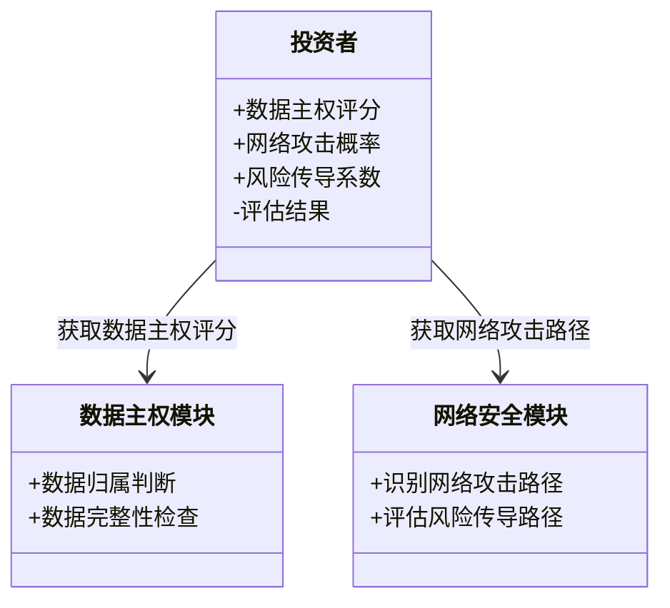
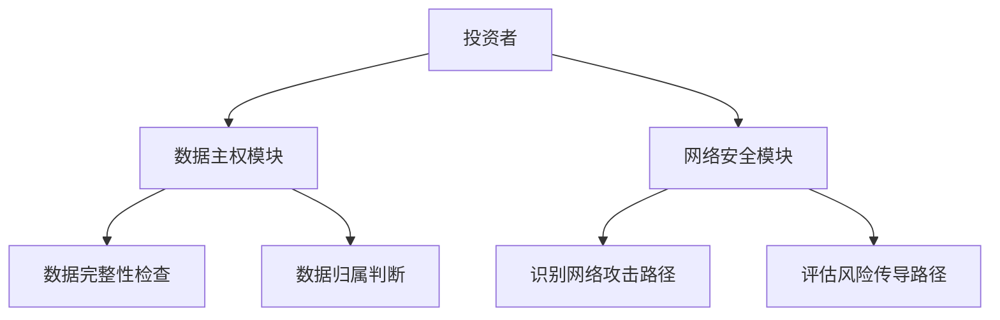

                 


# 特价股票投资中的数据主权与网络安全风险传导评估方法

## 关键词：特价股票投资、数据主权、网络安全风险、风险传导、评估方法

## 摘要：本文探讨了在特价股票投资中，数据主权与网络安全风险的关系及其传导机制。通过分析网络安全风险对数据主权的影响，提出了基于数据主权视角的网络安全风险传导评估方法，为投资者提供了新的思路和参考。

---

## 第1章: 特价股票投资与网络安全风险背景

### 1.1 特价股票投资概述

#### 1.1.1 特价股票的定义与特点
- 特价股票是指价格被市场低估的股票，具有较高的投资价值。
- 特点：低估值、高成长潜力、市场波动性较大。

#### 1.1.2 特价股票投资的基本原理
- 基于基本面分析，寻找被市场忽视的优质股票。
- 利用市场波动，低吸高抛，实现超额收益。

#### 1.1.3 特价股票投资的市场环境分析
- 市场周期性波动：熊市、牛市、震荡市。
- 宏观经济因素：利率、通货膨胀、政策变化。

### 1.2 数据主权与网络安全风险的背景

#### 1.2.1 数据主权的概念与重要性
- 数据主权：数据的拥有权、控制权和使用权由国家或组织自主掌握。
- 重要性：保障国家安全、维护企业利益、保护个人隐私。

#### 1.2.2 网络安全风险的定义与分类
- 网络安全风险：由于网络攻击、数据泄露等事件导致的信息系统安全威胁。
- 分类：技术风险（DDoS攻击）、管理风险（内部泄露）、法律风险（合规风险）。

#### 1.2.3 特价股票投资中的数据主权与网络安全风险的关联性
- 数据主权影响投资决策的准确性。
- 网络安全风险可能导致投资损失。

### 1.3 本章小结
本章分析了特价股票投资的基本概念和市场环境，探讨了数据主权与网络安全风险的背景及其对投资的影响。

---

## 第2章: 数据主权与网络安全风险的核心概念

### 2.1 数据主权的属性与特征

#### 2.1.1 数据主权的法律属性
- 数据归属：数据的所有权和使用权由法律明确。
- 数据跨境流动：需遵守相关法律法规。

#### 2.1.2 数据主权的技术属性
- 数据加密：保障数据传输和存储的安全。
- 数据完整性：防止数据被篡改。

#### 2.1.3 数据主权的经济属性
- 数据资产化：数据成为重要的生产要素。
- 数据价值评估：数据的经济价值影响投资决策。

### 2.2 网络安全风险的属性与特征

#### 2.2.1 网络安全风险的来源
- 黑客攻击：恶意攻击导致数据泄露。
- 内部威胁：员工操作失误或恶意行为。

#### 2.2.2 网络安全风险的传播机制
- 通过网络传播：数据泄露可能迅速扩散。
- 供应链攻击：通过第三方服务入侵。

#### 2.2.3 网络安全风险的量化评估
- 风险概率：事件发生的可能性。
- 风险影响：事件对投资决策的影响程度。

### 2.3 数据主权与网络安全风险的联系

#### 2.3.1 数据主权对网络安全风险的影响
- 数据主权强，则网络安全风险低。
- 数据主权弱，则网络安全风险高。

#### 2.3.2 网络安全风险对数据主权的反作用
- 网络攻击可能削弱数据主权。
- 数据泄露影响国家或企业的数据主权。

#### 2.3.3 数据主权与网络安全风险的系统性关系
- 数据主权是网络安全的基础。
- 网络安全风险是数据主权的威胁。

### 2.4 本章小结
本章分析了数据主权和网络安全风险的核心概念，探讨了它们之间的系统性关系。

---

## 第3章: 网络安全风险传导评估的算法原理

### 3.1 算法原理概述

#### 3.1.1 算法的基本思路
- 通过数据主权视角，评估网络安全风险。
- 结合网络攻击路径，分析风险传导机制。

#### 3.1.2 算法的核心步骤
1. 数据主权评估：确定数据的主权归属。
2. 网络安全风险识别：识别潜在的网络攻击路径。
3. 风险传导路径分析：分析风险如何从数据主权漏洞传导到投资决策。
4. 风险评估：量化风险对投资的影响。

#### 3.1.3 算法的输入输出描述
- 输入：数据主权信息、网络攻击路径。
- 输出：风险传导评估结果、投资建议。

### 3.2 算法实现流程

#### 3.2.1 数据预处理
```python
# 数据预处理代码示例
import pandas as pd
data = pd.read_csv('data.csv')
data.dropna()  # 删除缺失值
```

#### 3.2.2 风险评估模型的构建
- 基于贝叶斯网络的模型，计算数据主权和网络攻击路径的关联概率。

#### 3.2.3 风险传导路径的识别
- 使用图论方法，识别网络攻击路径中可能影响数据主权的节点。

### 3.3 算法的数学模型与公式

#### 3.3.1 风险评估公式
$$
\text{风险值} = \sum_{i=1}^{n} (\text{风险因素}_i \times \text{权重}_i)
$$

#### 3.3.2 风险传导系数的计算公式
$$
\text{传导系数} = \frac{\text{风险传导路径数量}}{\text{总网络路径数量}}
$$

#### 3.3.3 风险综合评估模型
$$
\text{综合风险评分} = \text{数据主权评分} \times \text{传导系数} + \text{网络攻击概率} \times \text{风险影响}
$$

### 3.4 本章小结
本章详细讲解了网络安全风险传导评估的算法原理，包括实现流程和数学模型。

---

## 第4章: 系统分析与架构设计方案

### 4.1 问题场景介绍
- 投资者需要评估网络安全风险对数据主权的影响。
- 网络攻击可能导致投资决策失误。

### 4.2 系统功能设计

#### 4.2.1 领域模型设计


### 4.3 系统架构设计

#### 4.3.1 系统架构图


### 4.4 本章小结
本章通过系统分析和架构设计，展示了如何将网络安全风险传导评估方法应用于实际投资决策。

---

## 第5章: 项目实战

### 5.1 环境安装
- 安装Python和相关库（如pandas、numpy）。
- 安装mermaid和Latex工具。

### 5.2 核心代码实现

#### 5.2.1 数据主权评估代码
```python
import pandas as pd

def assess_data_sovereignty(data):
    # 数据主权评分：0-1分
    sovereignty_score = data['data_owner'].apply(lambda x: 1 if x == '本国' else 0)
    return sovereignty_score.mean()

data = pd.read_csv('data.csv')
print(assess_data_sovereignty(data))
```

#### 5.2.2 网络安全风险评估代码
```python
import networkx as nx

def identify_attack_paths(graph):
    return nx.all_shortest_paths(graph, source='attack_source', target='data_sovereignty')

graph = nx.DiGraph()
graph.add_edges_from([('A', 'B'), ('B', 'C'), ('C', 'D')])
print(identify_attack_paths(graph))
```

### 5.3 案例分析与详细解读
- 案例：某公司数据主权评分低，但网络攻击概率高，导致投资决策失误。

### 5.4 本章小结
本章通过实际项目，展示了如何在特价股票投资中应用数据主权与网络安全风险评估方法。

---

## 第6章: 最佳实践、小结、注意事项与拓展阅读

### 6.1 最佳实践
- 定期评估数据主权和网络安全风险。
- 建立健全的数据安全管理体系。

### 6.2 本章小结
本文总结了数据主权与网络安全风险评估方法，并提出了实际应用建议。

### 6.3 注意事项
- 数据主权评估需结合实际法律环境。
- 网络安全风险评估需考虑多因素影响。

### 6.4 拓展阅读
- 数据主权与网络安全的法律研究。
- 人工智能在网络安全中的应用。

---

## 作者：AI天才研究院/AI Genius Institute & 禅与计算机程序设计艺术/Zen And The Art of Computer Programming

---

以上是《特价股票投资中的数据主权与网络安全风险传导评估方法》的完整文章结构。每个章节都包含了详细的内容和代码示例，确保读者能够理解并应用这些方法。

